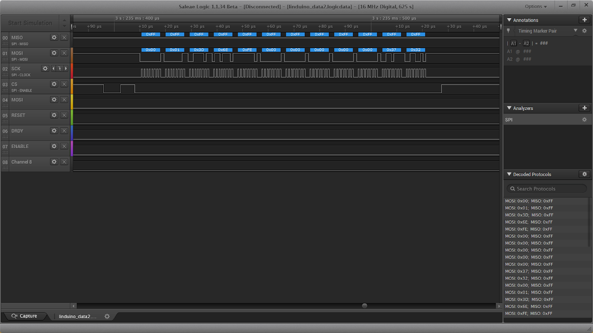
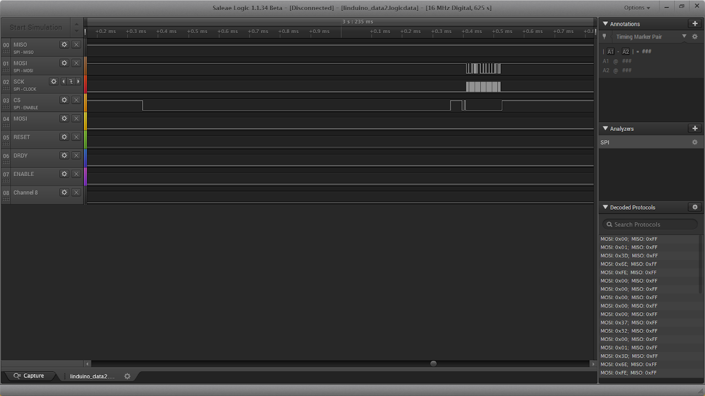

# SSCP - BMS Code

# BMS Code

For details about the electronics of Arctan's Battery Management System, look here.

[look here](/home/sscp-2014-2015/electrical-2014-2015/electrical-systems/battery-management-system)

Bench testing

See this bench testing checklist from the Arctan cycle.

[ bench testing checklist](https://docs.google.com/document/d/1EEOJ7IxkHQTvJY7_j1sleBIgUgakBDCaz2qeHwBmjvc/edit?usp=sharing)

Behavior

The behavior of the bms code matches the behavior described in the state diagram, attached.  We tested the BMS on the bench a lot to ensure that the code behavior does, indeed, match the behavior specified in the diagram.

On Arctan, there is a minor unresolved issue that occurs when the car activates regenerative braking when the pack is fully charged.  The combination of these two events causes the car to hard fault, it may have something to do with exceeding the battery cell voltage limits that are specified in the code.

Some details on ltc6804 voltage measuring chip

(A brief guide for bms_ltc6804.c/h to help embedded code newbies)

Daisy Chain

The STM32 is only directly connected to the first of the three LTC6804 chips, which relays messages to the next chip in the sequence, which relays to the last chip.  To read voltages from 3 daisy-chained chips, one "read voltage" command + PEC is sent along to the first chip, and voltage readings from the first, second, then third chips are returned sequentially.   (This differs from last cycle's BMS, in which the STM32 communicated with all monitoring chips directly.)

Reading Voltages

Each 6804 stores the voltages that it reads in 4 configuration registers.  Cells 0-2 in reg1, 3-5 in reg2, 6-8 in reg3, 9-11 in reg4.  The STM32 reads these register values in sequence, register 1 from all chips, register 2 from all chips, register 3 from all chips, etc.

In the current voltage read implementation, cells per chip must be a multiple of 3, the number of chips stored in a single voltage register. 

SPI

The stm32 uses a protocol called SPI to communicate with the ltc6804s.  Here are some screenshots of a chip writing a configuration message to the LTC6804.  These chips need to be woken up by enabling the CS line, or even sending a dummy byte (over MOSI).

Below are screenshots taken using the Salae Logic Analyzer -- you can use this to see data being sent between the stm32 and other hardware, then apply a filter to the captured signal to decode individual bytes.

     

Notes

We spent a lot of time on this project diagnosing connection issues.  Always be sure to solder/hot-glue together all electrical connections when you begin a project.  Your efforts will pay off greatly down the road.

### Embedded Google Drive File

Google Drive File: [Embedded Content](https://drive.google.com/embeddedfolderview?id=1HR9mloEnAwuRQPnVYcGRzuxIMcqwAfDH#list)

<iframe width="100%" height="400" src="https://drive.google.com/embeddedfolderview?id=1HR9mloEnAwuRQPnVYcGRzuxIMcqwAfDH#list" frameborder="0"></iframe>

