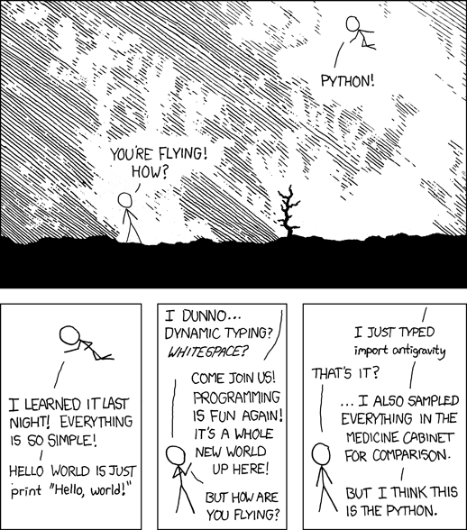

# SSCP - Telemetry

# Telemetry

Any engineer should be able to get data from the car by themselves.

See here for the problems with Luminos telemetry.

[here](/home/sscp-2012-2013/telemetry-2012-2013/sunbad-telemetry_1/dandelion-post-mortem)

See https://sites.google.com/a/stanfordsolarcar.com/sscp/home/sscp-2012-2013/telemetry for an idea of how Luminos telemetry worked.

[https://sites.google.com/a/stanfordsolarcar.com/sscp/home/sscp-2012-2013/telemetry](/home/sscp-2012-2013/telemetry-2012-2013)

New Daisy telemetry for Arctan: http://github.com/sscp/Daisy

[http://github.com/sscp/Daisy](http://github.com/sscp/Daisy)

Sunbad telemetry real-time dashboard (2012-2013):

## Dandelion (2012-2013):

