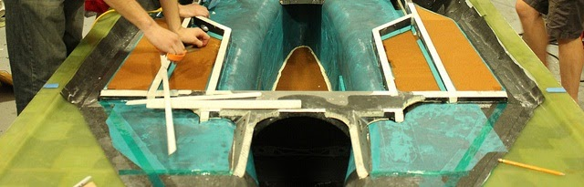

# composites-2014-2015

## SSCP - Composites 2014-2015

## Composites 2014-2015

Detailed Composites Timeline

#### Embedded Content

Embedded content: [Embedded Content](./)

Overview

The body of Xenith is a carbon fiber monocoque using Nomex core throughout the exterior shell and aluminum core in the chassis panels. Aluminum cored panels were picked over Nomex core as it was what the company could sell us for cheap. As for carbon, we used what was in the freezer at the time. We primarily utilized preimpregnated weave, yet some unidirectional prepreg was used. The materials were old, yet checked to make sure they seemed properly cured. We placed material in completely ignorant manners based on nonexistent intuition, using the carbon simply as “black aluminum”. This is no fault of any one team member - its simply a byproduct of the overall lack of detailed knowledge by everyone about the material.&#x20;

The one thing we were capable of doing was the large scale fabrication of a complicated composite structure. Our entire team rallied and from start to finish – a continuous 46 hour process – did a successful layup on the bottom half of the car. The top half was thankfully shorter in duration. Fabrication is the one thing our team knows how to do well with regards to composites.&#x20;

These layups resulted in solid structures that required excessive hours of manual labor to develop into the final product. This labor included sanding as the main subtractive process, and many additive processes, including bondo, micro-bubble epoxy, and additional carbon. We then had the body sent to a professional auto body painter.&#x20;

The final design was reviewed after the fact by a composites engineer from Boeing – who also is a Stanford Solar Car Alumni. She was the only one to do any sort of composites modeling or analysis on Xenith. Thankfully, nothing with regards to composites has failed during our testing or the race. Most likely, this shows that Xenith is substantially over built, yet we may have simply been lucky and come close to the optimum design.

As composites lead, I plan to learn as much as possible before the start of the design stage. I hope to seek out engineering assistance in the form of technical training and education from companies within the US. I am currently taking one of the only courses regarding the design and mechanics of composites - AA256. In this class, I have been introduced to Professors Fu-Kuo Chang and Stephen W. Tsai. They have agreed to assist the efforts of our team. Aspects I now know need consideration include: mold design, oven design and accurate temperature control, residual thermal stresses from cure cycle, crash scenarios, manufacturability, and all expected and applied loads. This list will likely grow over the coming months.&#x20;

For background reference, here's how carbon fiber and prepreg are made:&#x20;

#### Embedded YouTube Video

YouTube Video: [Embedded Content](https://www.youtube.com/watch?v=XVT8GNYIeUc)

### Analysis

&#x20;   I have procured sponsorship of software that should aid in the design of the next car. These include the Altair's Hyperwork Suite and Vistagy’s Fibersim. The two can work in concert and are capable of more than I will know how utilize. My lofty goal is to fully model, simulate, and analyze the composite structures that will combine to make the car.&#x20;

&#x20;   We need to run the chassis of the car through a specialized composite nonisotropic solver during the design process. We could get our car 20% lighter by analyzing the composites and reducing weight where strength and stiffness are not needed.&#x20;

Here's the Michigan analysis, which used Altair's Optistruct Solver: http://solarcar.engin.umich.edu/wp-content/uploads/2011/09/Quantum\_chassis\_optistruct.pdf&#x20;

[http://solarcar.engin.umich.edu/wp-content/uploads/2011/09/Quantum\_chassis\_optistruct.pdf](http://solarcar.engin.umich.edu/wp-content/uploads/2011/09/Quantum_chassis_optistruct.pdf)

Umicore did analysis also with Altair Optistruct: http://www.fisita.com/education/congress/sc10/fisita2010sco08.pdf

[http://www.fisita.com/education/congress/sc10/fisita2010sco08.pdf](http://www.fisita.com/education/congress/sc10/fisita2010sco08.pdf)

Last but not least, the analysis of Xenith, titled Xenith Impact Report. Old Mechanical Reports

[Old Mechanical Reports](../../../../../stanford.edu/testduplicationsscp/home/sscp-2012-2013/mechanical-2012-2013/mechanical-fundamentals/old-mechanical-reports/)

### Fiber/Fabric Choice

&#x20;   The professors of AA256 - The mechanics of Composites, said unidirectional non-crimp (stitched) preimpregnated fabrics are our best bet. They offer the best performance and better draping than normal uni, but not as good as weave. They said to simply avoid weave, as the mechanical properties of the fibers are severely degraded when placed in the orientations of a weave. My goal is to acquire fabrics that are used extensively in the aerospace industry, as they have been rigorously experimentally tested for their mechanical and thermal properties. Their properties are vital for completing proper modeling and analysis.&#x20;

Other options include:

Oxeon TeXtreme fiber was used by Nuon and Michigan&#x20;

&#x20;   http://www.compositesworld.com/news/oxeons-textreme-carbon-fiber-on-solar-racers

[    http://www.compositesworld.com/news/oxeons-textreme-carbon-fiber-on-solar-racers](http://www.compositesworld.com/news/oxeons-textreme-carbon-fiber-on-solar-racers)

### Composites Lessons of Xenith

Lack of draft angle on all fairings made fabrication difficult thus time consuming

Sharp fairing edges impossible to make in mold – redesign molds to make this possible. Consider designing multiple molds for individual components like bubble or fairings. The goal would be to maximize the ease of manufacturability.

&#x20;           Improper loading of aluminum cored panel during bagging and baking resulted in unwanted permanent deflections.

&#x20;           Use Strachlon 800 vacuum bag instead of rigid bagging to avoid bagging voids.

&#x20;           Buy an ultrasonic leak detector and lots of vacuum hose. This will allow the vacuum pump to be place far away making it easier to hear leaks. The leak detector will help find the really pesky ones.

&#x20;           Need to acquire specific prepreg with well documented properties. These included the specifics of the cure cycle and all laminate constants. If we actually follow the cure cycle, we should be able to end up with a nice consolidated laminate with low porosity – internally and on the mold surface - and most importantly, lower weight. &#x20;

&#x20;           Design more placement accurate and trustworthy hard-point design.

&#x20;           Neat thing could be to build the molds in such a way that they function as a portion of the oven.

&#x20;           Don't use bolts as a method of clamping force when gluing things such as inserts. The bolt, and the nut, usually get epoxied in place, then it takes much effort and ingenuity to remove them.&#x20;

&#x20;          &#x20;

#### Embedded Google Drive File

Google Drive File: [Embedded Content](https://drive.google.com/embeddedfolderview?id=1tLnrZ8RQeBPQTYhLsMfE8MVLU-4vRj8I#list)
