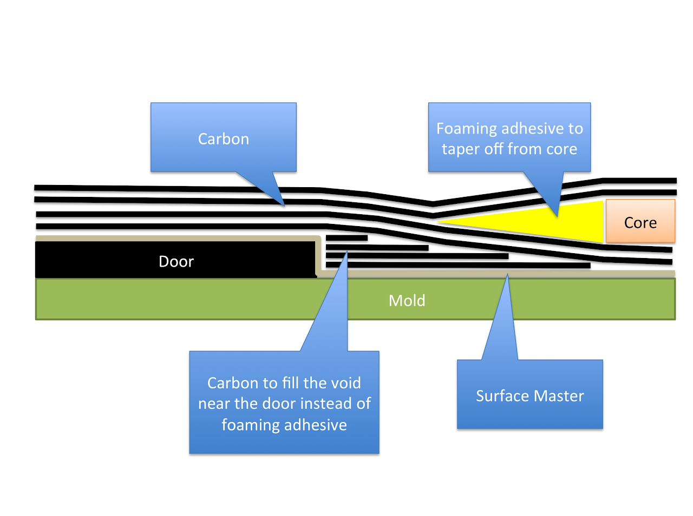

# SSCP - Door/ Access Panel Seam Considerations

# Door/ Access Panel Seam Considerations

Carbon weave doesn't do a great job conforming to sharp corners and pockets, so in 2013 we tried using foaming adhesive to fill the voids that would form along the fairings, array wiring channels, and the door. The foaming adhesive leaves pockets/pores underneath the surface master, and if the surface master collapses above those pockets you end up with a bunch of small holds. This technique worked well for places like the array wiring channels where we didn't care about the holes, but we ended up spending a lot of time Bondoing over the holds on the exterior surfaces of the car that we would vinyl wrap.

I think you all could fill the gap that would form along the door and access panels with narrow strips of carbon instead of foaming adhesive. Your door and access panels mostly have straight edges, so it would be pretty easy to pack the void with prepreg without having to cut carbon weave into curved shapes. I'll attach an cross section image showing what I have in mind. If you use carbon you might be able to avoid having to Bondo the pockets that form in the foaming adhesive.

Make sure you wrap the edges your door in non-perforated release film and put film adhesive on your core unlike the image below.

