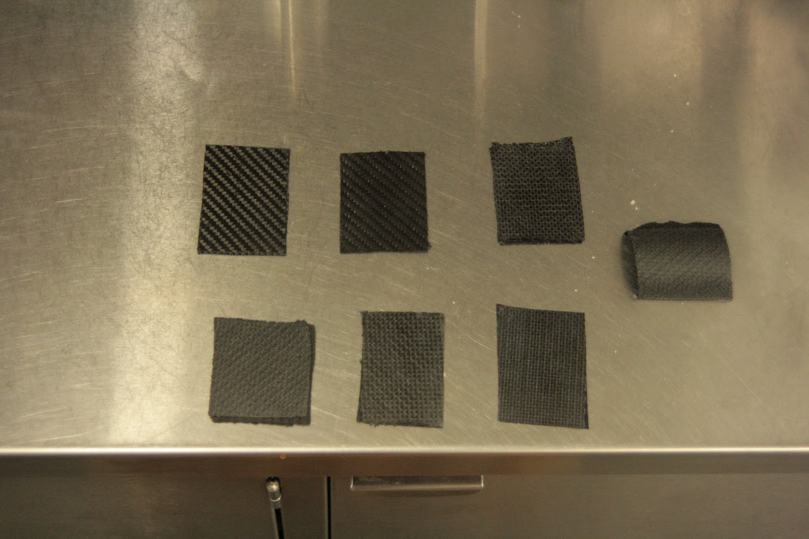
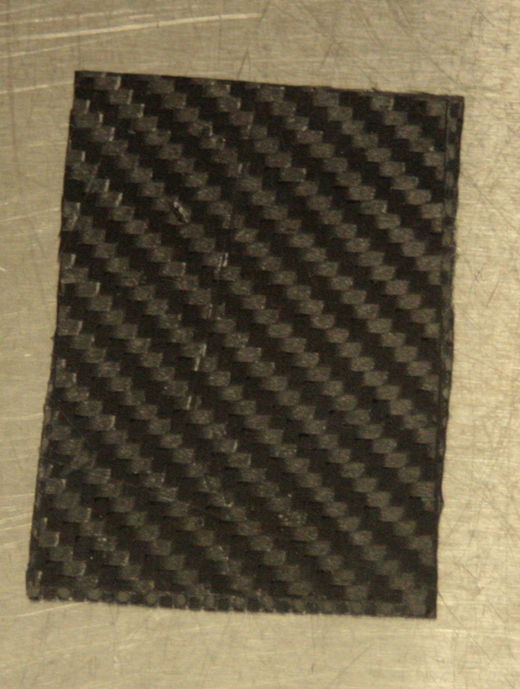
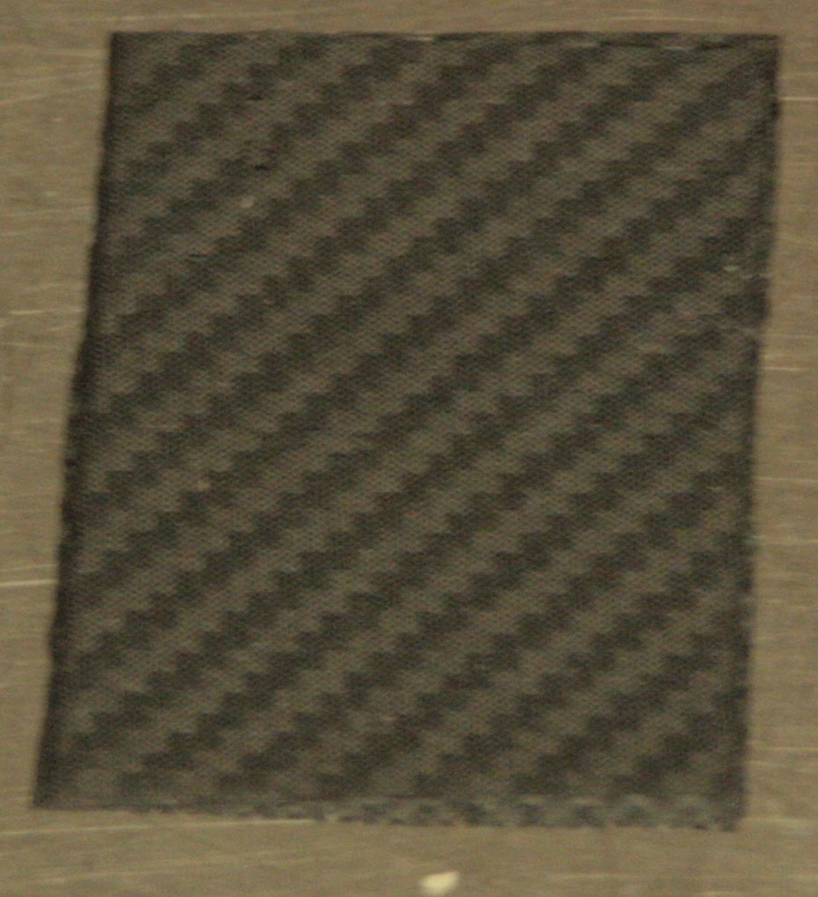
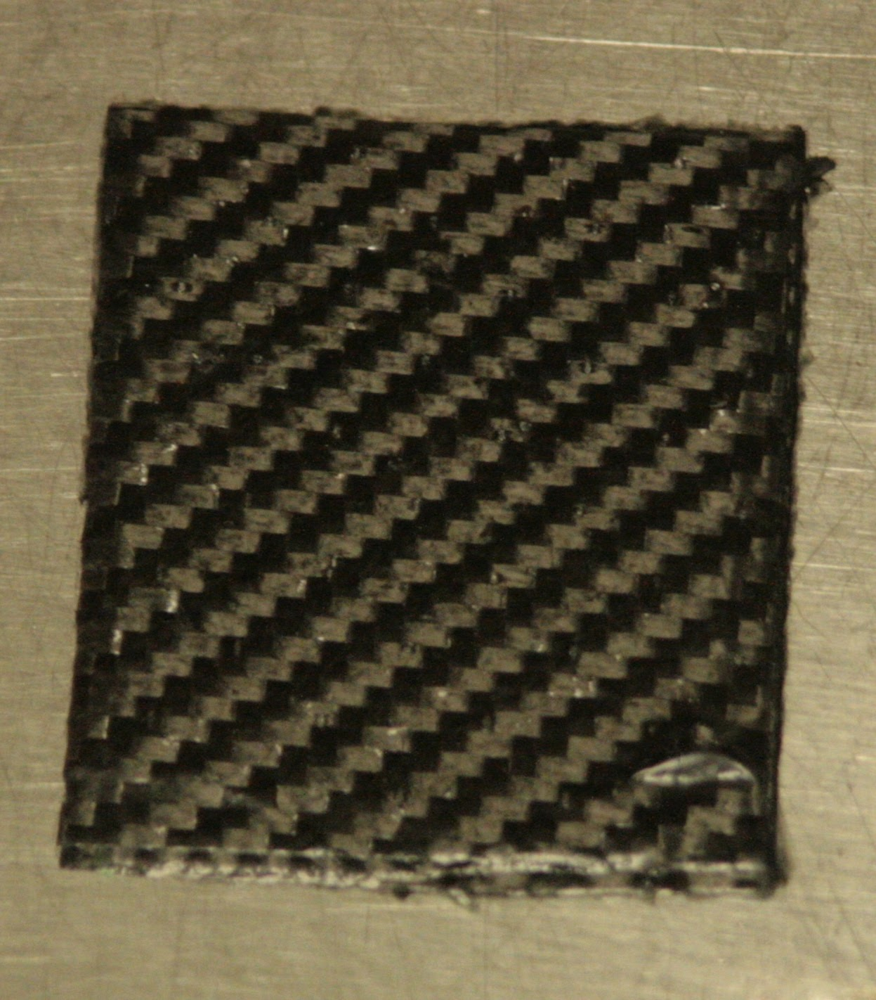
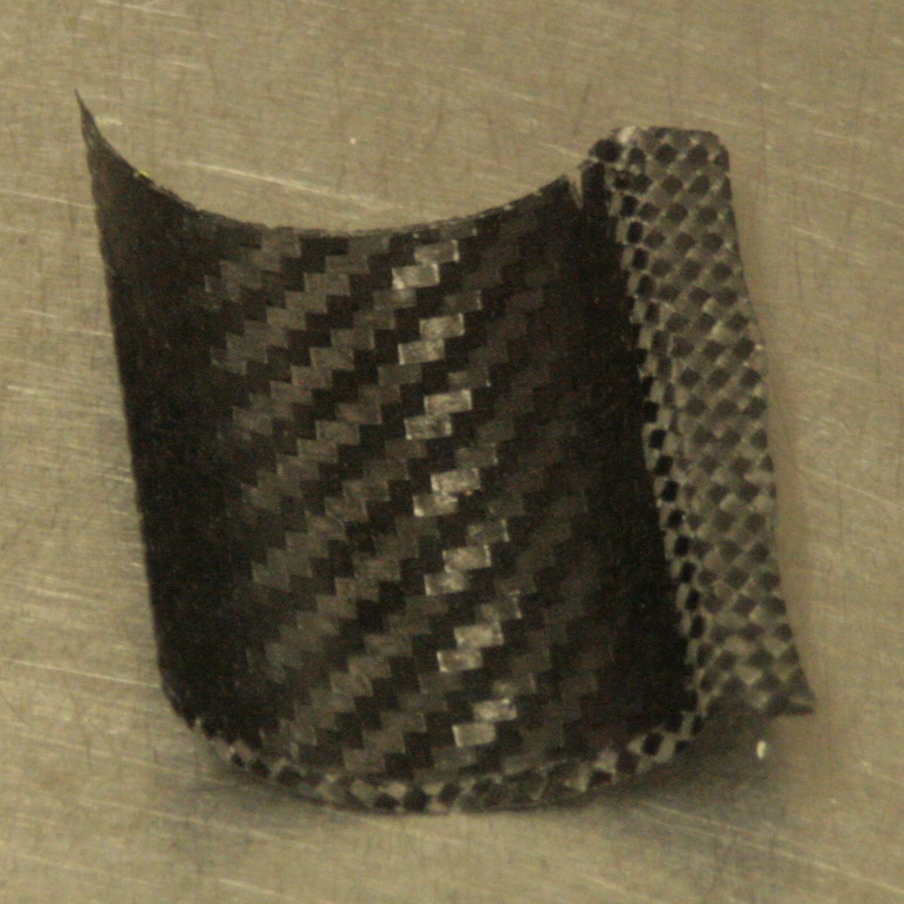
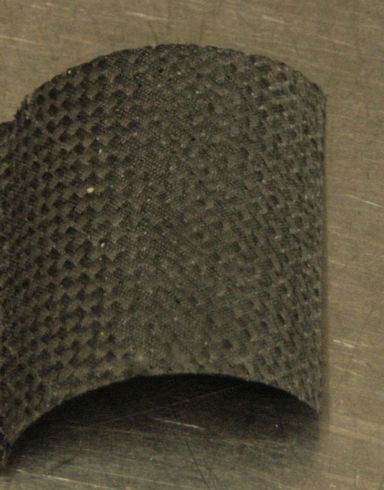

# SSCP - Cytec/Amber Prepreg Weave Compatibility Testing

# Cytec/Amber Prepreg Weave Compatibility Testing

In our composites freezers, we have large, virtually untouched rolls of both Cytec and Amber Composites prepreg weave that could be used to make the next car. Both materials have a nominal 90 minute cure time at 250 F, but we want to verify that their resin systems are compatible enough to co-cure without any adhesive film to bind them. It would be useful to use both materials in our next car if that would be feasible; the Amber is a twill weave and the Cytec is a plain weave.

 

To test the effects of varying layup properties, we made several layups (each about 2 by 2 inches) with the following stackups (layers referenced from the mold surface):

·         Amber twill, Cytec plain, Cytec plain, Amber twill (TPPT) with peel ply

·         TPPT without peel ply (to observe the effects of increased resin content with the two resin systems)

·         PTTP with peel ply

·         PTTP without peel ply

·         PT with peel ply

·         PTPT with peel ply

·         TPPT with peel ply on a curved surface (radius about 1.5 in)

·         TP with peel ply on the same curved surface

Layups were done on polished pieces of aluminum scrap metal, treated with Frekote mold release. We used perforated release film, and pulling vacuum on each of the layups, they were put in the Sir Eddie oven cold and then the oven was programmed to 121 degrees Celsius. The oven naturally ramps at 1.5-2 degrees Celsius per minute, which is close to the spec of 1 degree/minute recommended for both materials used. After reaching the cure temperature, the layups were left in the oven for 90 minutes, after which the oven was turned off and the door opened slightly to allow the layups to cool.

 

Unfortunately, the curved TPPT layup was ruined because the backing was left on one of the prepreg sheets, but other than that the layups appeared to turn out fine, with a good bond between plies and no hint of delamination.

Pictures from the test appear below.

 

Mold side up except for curved layup

Top Row: TPPT with Peel Ply, TPPT without peel ply, PTTP with peel ply, curved TP with peel ply

Bottom Row: PTTP without peel ply, PT with peel ply, PTPT with peel ply

 

 

TPPT with peel ply, mold side up on left

 

TPPT without peel ply, non-mold side (note large blob of epoxy in the bottom-right corner; this is why peel ply is used

Curved TP layup, mold side on left

    

