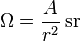

# SSCP - Radio Box Angle Verification

# Radio Box Angle Verification

I was playing with the car assembly to see how the required "view of the sky" of the radio box would intersect the body (to verify that we don't need to make any of the door out of fiberglass, which would be a pain). 

I wanted to verify that the cone projected in the Solidworks part was correct, so I opened up the sketch, and it looked like this:

According to the Wikipedia page, if a cone has a radius r and a circular cap area A, the solid angle omega in steradians is equal to

[ Wikipedia page](http://en.wikipedia.org/wiki/Steradian)

If the circular cap area is 2*pi*r*h, then

Omega = 2*pi*h/r

Distances are described here:

That means that h = omega*r/(2*pi). If we want an omega of 1.6*pi, with an R of 0.5 m as shown in Solidworks, then h = 0.4 m. This produces the sketch below:

Which has the same inner angle measure of 78.47 degrees as the previous one.

