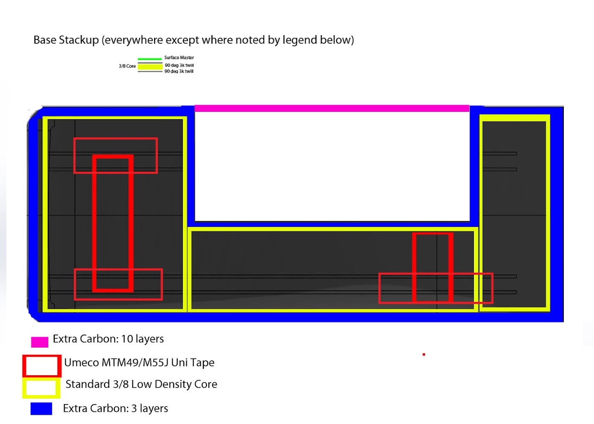
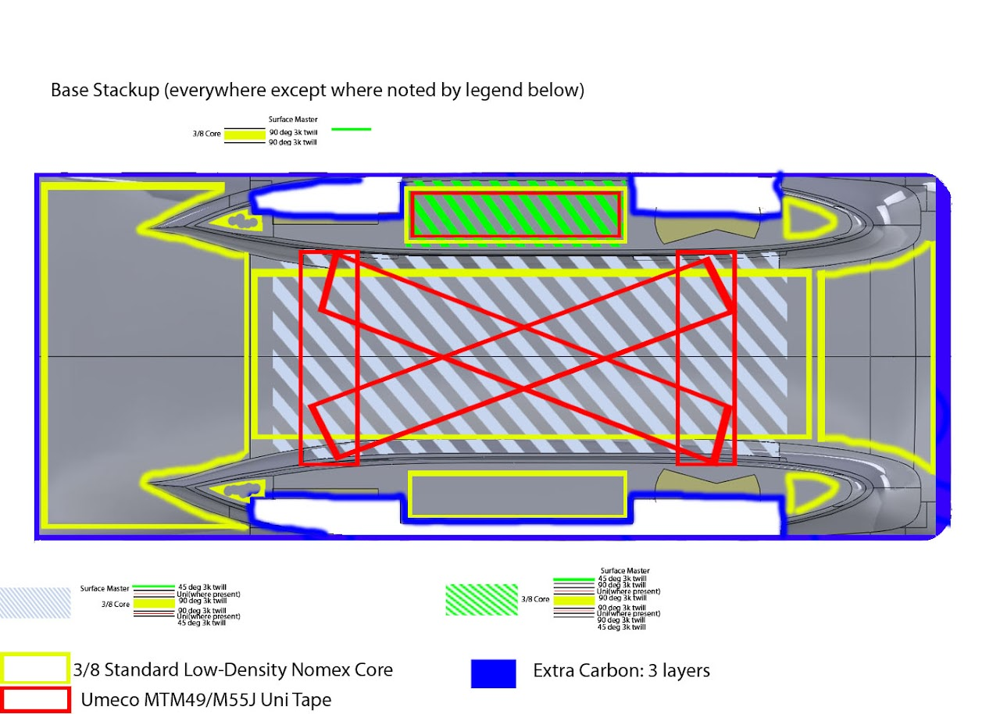

# SSCP - Sunwhale Ply Map Rev. 2

# Sunwhale Ply Map Rev. 2

These are the ply maps for Sunwhale that were developed from initial designs and feedb ack from the February 14 design review.  The Photoshop documents used to create these images are attached in case anyone wants to move, modify, or add layers.

EDIT: Extra uni pies added to the topshell to absorb extra beam loads from the middle shock mount attached to the topshell contacting the suspension.

### Embedded Google Drive File

Google Drive File: [Embedded Content](https://drive.google.com/embeddedfolderview?id=1L2B6tbOLnpish_dPwIcqSBpQin3H3BAw#list)

<iframe width="100%" height="400" src="https://drive.google.com/embeddedfolderview?id=1L2B6tbOLnpish_dPwIcqSBpQin3H3BAw#list" frameborder="0"></iframe>

