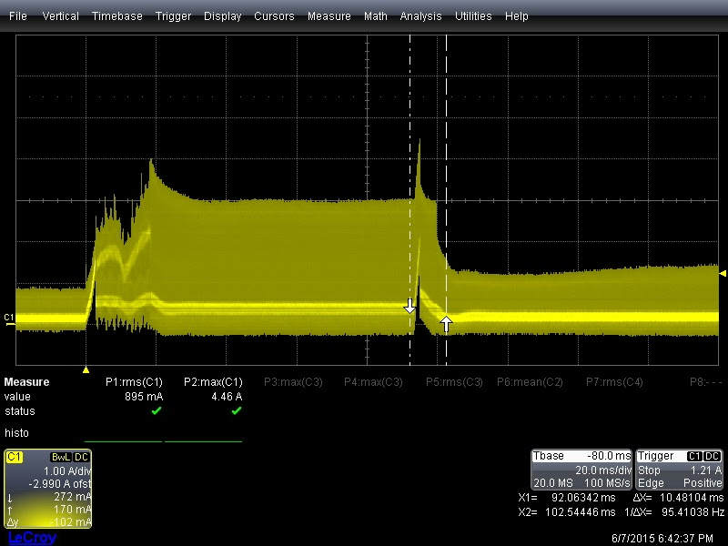

# SSCP - Car 24V Turn On Problem

# Car 24V Turn On Problem

BMS 8 uses the same turn on circuit as BMS 7. However, the BMS 8 won't turn on the 24V bus to the rest of the car as of 12 June 2015.

Observations to date:

Pack -> Maxkor -> BMS8.1.0 -> Luminos fails

Bench power supply (100V) -> Maxkor -> BMS8.1.0 -> Luminos fails

Bench power supply (100V) -> Maxkor -> BMS8.1.0 -> fake pack fails

Pack -> Vicor -> BMS8.1.0 -> Luminos succeeds

Bench power supply (100V) -> Vicor -> BMS8.1.0 -> Luminos succeeds

Bench power supply (24V) -> BMS8.1.0 -> Luminos succeeds

This was hacked around in BMS8.0.0 by carefully shorting the MOSFET source pin the the middle stubby pin. The function of this middle pin is not described in the datasheet.

The usual failure mechanism in BMS8.1.0 results in the microcontroller commanded "off" state producing ~1V on the 24_VOUT net and the microcontroller commanded "on" state producing ~3V on the 24_VOUT net.

Below is an oscilloscope plot of this behavior:

Yellow trace is Maxkor input voltage (from pack)

Red is Maxkor output voltage

Green is 24V_OUT voltage

Blue is 24V_OUT current

Note that the max 24V_OUT voltage and max 24V_OUT current are displayed

The same behavior appears when 24V_OUT is turned on several seconds after the 24V_IN bus comes up.

Vicor vs Maxkor turn on voltage waveforms while powering only BMS8.1.0. Note the difference in time scale.

Vicor voltage during turn on powering only BMS8.1.0.

Maxkor voltage during turn on powering only BMS8.1.0

Vicor turn-on is faster and increases monotonically. Makcor turn-on is slower and increases non-monotonically.

Vicor vs Maxkor current during turn on powering BMS8.1.0, then the car, then the high-side contactor. The contactor closes between the cursors.

Note RMS and peak current values are displayed below the trace.

Neither of these waveforms violate the overcurrent limit (5A) for more than 56ms.

The OVLO/UVLO functionality of the LT4218 uses a voltage divider and comparator. It was hypothesized that a transient at start up was triggering an OVLO/UVLO condition. To eliminate this possiblity, R99 was removed. This pulls the OVLO sense up to 24V and the UVLO sense down to GND while still allowing the STM32F4 to short the UVLO pin to ground. Result:

While powering only BMS8.1.0, the "off" state produced ~23V on the 24V_OUT net and the "on" state.

Key question: What conditions cause permanent latch-off? Could a start-up timing issue cause the STM32F4 to release the UVLO short too slowly and cause the LT4218 to latch off?

TODO:

Specify calculated UVLO/OVLO thresholds on this page

Add datasheet links to this page

Specify latching behavior on this page

Replace R99

Probe IMON pin - output current is proportional in sensed current

Probe MOSFET Vgs voltage

