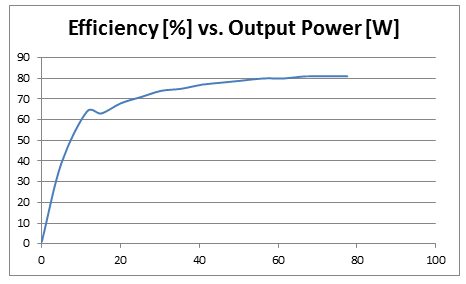

# dc-dc

## SSCP - DC-DC

## DC-DC

(Max Praglin: mpraglin@stanford.edu)

Overview

Design files can be found in (sunwhale svn)/electrical/projects/dc-dc\_x.

DC-DC\_1 bring-up log

[DC-DC\_1 bring-up log](https://docs.google.com/document/d/1JzYFPAyFxzEUF3GSdQVnVIhtUW3Pqii_L2TCpra33eI/edit?usp=sharing)

DC-DC\_2 bring-up log

[DC-DC\_2 bring-up log](https://docs.google.com/document/d/1V8DjJ0TnkPQL6XQWZO-oIP3KPp9fgHDdUKXvq58_cnc/edit?usp=sharing)

DC-DC\_3-0 bring-up log

[DC-DC\_3-0 bring-up log](https://docs.google.com/document/d/1I_0Hdit5gT7k0ywGH2wZ8J2YVg9sqEyehOvm8su4eak/edit?usp=sharing)

DC-DC\_3-1 bring-up log

[DC-DC\_3-1 bring-up log](https://docs.google.com/document/d/1JxHDIyicN9uhjK_t0efrkSjOabX8IWDNL0YWcZHF_PM/edit?usp=sharing)

DC-DC\_3-1 design review

[DC-DC\_3-1 design review](https://docs.google.com/document/d/1-2Go_IzSQzZtdWPs8voDWf1JcvxhgTXBMz6AYnO445M/edit?usp=sharing)

DC-DC\_3-2 bring-up log

[DC-DC\_3-2 bring-up log](https://docs.google.com/document/d/1ehroxbM0uDv-aGOEP0dZwsX3ak_MpE5R59psXrfwmdE/edit)

DC-DC\_3-3 bring-up log

[DC-DC\_3-3 bring-up log](https://docs.google.com/document/d/16kgBIoBRIgq3B-QFrf3iDJSBrfRlpJCLYDpvdl_Ez3o/edit)

DC-DC\_3-4 bring-up log

[DC-DC\_3-4 bring-up log](https://docs.google.com/document/d/126fwBNdX9PfBzAO8yS2HJ3xFPR8oTATilok0d9ocLs0/edit?usp=sharing)

DC-DC\_3-5 bring-up log (includes link to final test data)

[DC-DC\_3-5 bring-up log](https://docs.google.com/document/d/11IzXYLsul_j9DUqr4h_xSQ68CjD6MeG_i6SnkUImQGI/edit?usp=sharing)

Update after debugging in May, 2015

Instability at low input voltages and very low power was discovered and fixed through a change in compensation.&#x20;

Both PCB1 and PCB2 have been deemed functional.

Specifications:

Input voltage range: 60-120V

Output current: 0-4A (0.01-3.75A guaranteed over full input voltage range

Switching frequency: 50kHz

Turn-on time: \~50ms

Output voltage accuracy: TBD

Output voltage ripple: TBD

Design cross-over frequency: 8kHz (lacking equipment to measure)

An efficiency map of version 3-4 is shown below.

Update after design review, August 2014, on DC-DC\_3-1

The design nearly meets the 90% efficiency goal and could be compacted into the space on BMS7. Since we don't need to be space constrained, I will continue work on the design trying to improve efficiency and not worrying so much about space. Also will think about redundancy to eliminate the DC-DC as a single point of failure in switching power supplies

DC-DC\_3-2 Summary

This design attempted synchronous rectification and a two-switch forward configuration. The gate drive for the high-side switch showed a strange clamping behavior at high input voltages, suspected due to bad layout (large areas of ground plane under the switched-nodes)? This was the only significant change between DC-DC\_3-3 and it worked after new layout and independent gate drive circuits.

DC-DC\_3-3 Summary

Found that the reverse recovery of the body diodes in the FETs was overwhelming the losses; perhaps with careful selection of FETs and diodes, I could find a "bad" enough FET which would never conduct in reverse because the schottky was in parallel. For simplicity's sake, I'm sticking with diode rectification and the two-switch topology.&#x20;

EE390 Independent study write-up: DC-DC\_1, DC-DC\_2, DC-DC\_3-0

EE 390

Professor Dally

Spring Quarter 2014

Building a Better Power Conveter:

Designing, Building, and Testing an Isolated 100W Power Converter

Max Praglin

&#x20;

Overview

Many generations of the Stanford Solar Car have relied upon an off-the-shelf 100W DC-DC converter (VI-J00, datasheet in the “Documents” folder) to power a 24V bus from the higher voltage batteries.  The 24V bus powers the car’s motor controllers, maximum power point trackers, battery management system, driver interface electronics, telemetry system, and an array of lights (2013 solar car shown in Figure 1).

Figure 1. Luminos, Stanford’s entry to the 2013 World Solar Challenge, placed 4th in the 3,000km race across Australia. The car drove an average speed of 75kph across the continent.

This power converter represents the “low-hanging fruit” of improving the car’s power consumption – it consumes a constant 2W and exhibits the efficiency curve at 110V input shown in Figure 2. Due to the solar car’s low rolling resistance tires, at 55mph, 1W is lost for every 2.75kg added to the car. This means that even removing the 2W quiescent of the DC-DC would yield the same performance improvement as the team’s mechanical engineers eliminating 5.5kg from the car!

&#x20;

&#x20;

Figure 2. Measured Efficiency vs. Output Power for the VI-J00 DC-DC power converter.

&#x20;

Three iterations of the design were completed during the quarter of work, and improvements will be made until the next solar car races in the 2015 Australian race.

The specifications for the replacement power converter were chosen with the input of the solar car’s electrical sub-team. The new power converter would need to occupy approximately the same board area as the VI-J00, and have the following specifications:

·         60-160V input

·         24V output

·         100W output capability (normally the car should only draw 30W, but the full 100W are used when the lights are turned on).

·         500V isolation

·         >90% efficiency

&#x20;

&#x20;

Version 1 (“DC-DC\_1”)

&#x20;Control Scheme & Topology Implications

A flyback topology was chosen for the first iteration of this power converter. Linear Technology’s LT3825 controller was selected for its appropriate frequency range, no-opto feedback scheme, synchronous gate output, differential measurement of the current sense resistor, undervoltage lockout, and configurability of timing parameters.

The LT3825 controls the output voltage by measuring the switch node voltage as the transformer’s stored energy is released to the output. The output voltage is reflected to the transformer’s primary side, and thus the voltage of the switch node is the input voltage plus the output voltage scaled by the transformer’s turns ratio. This sensing scheme requires that no switching cycles be skipped, mandating synchronous rectification or a minimum load requirement with an output diode.

Use of synchronous rectification causes forced continuous conduction mode (FCCM); while operation iN DCM requires less complexity, it likely has a lower peak efficiency because in general, the &#x49;_&#x56; loss in a diode is higher than the I^&#x32;_&#x52; loss in a FET.

Because the output voltage of a converter using the LT3825 is separated from the sensed flyback voltage by the output rectification element, there is the potential for the output voltage to be poorly regulated as the load changes. The LT3825 has an output compensation circuit that adjusts the output voltage setpoint – this circuit is configurable with a RC network.

&#x20;

Transformer Selection

The Coilcraft Hexapath series was chosen for its flexibility. In the interest of time, off-the-shelf magnetics components were selected.

&#x20;

Capacitors

Ceramic input capacitors were chosen for their low ESL/ESR. Automotive-grade Murata X7R ceramic capacitors were chosen for their reliability in high temperature and high vibration environments. A consideration for selection of ceramic capacitors was the voltage vs. capacity derating curve of the components. A derating curve, provided by Murata, for a 10uF, 63V ceramic capacitor is illustrated in Figure 3.

&#x20;

Figure 3. Murata 10uF, 63V ceramic capacitor derating curve. Specs provided by the manufacturer.

&#x20;

Performance

A small number of schematic and footprint errors were discovered. The design was approximately 80% efficient at 30W output with the initially-specified components. Re-evaluating the component choices,such as FETs with a more optimal balance of Rds\_on and capacitances, efficiency was improved to approximately 85%.

The waveforms of Version 1 are illustrated in Figure 4. The waveforms were captured when an output diode was used (as opposed to synchronous rectification); the oscillations observed in the primary and secondary winding voltages are characteristic of discontinuous mode operation.

Figure 4. Primary-side gate voltage, primary winding voltage, secondary winding voltage, voltage across 20m current sense resistor.

&#x20;

&#x20;

Version 2 (“DC-DC\_2”)

Topology Change

Part of the difficulty in scaling a flyback converter to high power is the energy stored in the leakage inductance of the transformer. The leakage inductance spike can be eliminated by recycling this energy through a pair of diodes. There is increased loss from driving the extra gate, but the primary-side FETs have lower Vds requirements (meaning a possibly lower Rds\_on for the FETs). This could lead to decreased efficiency at low load and increased efficiency at high load. The DC-DC\_2 design was based around the so-called “diagonal flyback” topology, which uses a pair of diodes to recycle the leakage inductance back to the input capacitors.

&#x20;

Isolated Gate Drive

A standard low-side gate drive IC with capacitive coupling into a transformer and a diode from source to gate on the FET (to prevent the gate-source voltage from ‘wandering’ or being negative) was chosen (see Figure 5). This method did not require a voltage rail on the secondary side to run a gate drive chip.

&#x20;

Figure 5. Isolated gate drive with a standard low-side gate drive IC.

&#x20;

High-Side Gate Drive

A conventional high/low side gate drive was used on the primary side of the flyback converter to drive both the high and low MOSFETs (see Figure 6). The bootstrap power supply required that the high-side MOSFET would stay near ground long enough for the capacitance to charge fully. This required attention to the sizing of the bootstrap power supply capacitor, the size of the transformer’s leakage inductance, and the speed of diodes.

Figure 6. High/low side gate drive.

The difference in propagation delay of the primary and secondary side gate drive IC’s was not taken into account in the initial design. The high/low side gate drive had nearly 10x longer delay than the ultra-fast low side gate drive IC, causing the synchronous FET to conduct before the primary side FETs had turned off. An RC circuit was added to the input of the synchronous gate drive to delay the synchronous FET’s turn-on.

Performance

The leakage inductance recycling in Version 2 allowed lower voltage FETs than in Version 1, allowing a greater selection of low Rds\_on FETs. An approximately 90% efficiency (at 30W output) was ultimately achieved by lowering the switching frequency; however, lowering the switching frequency meant that the maximum output power was reduced. A 100W capable, 90% efficient design using this topology would be too physically large for this application.

Fringing Losses

Calculations of expected power loss in the transformer windings indicated that markedly more power was dissipated in reality than theory. A thermal camera revealed a high temperature band in the center of the transformer parallel to the windings. It is strongly believed that the proximity of the core’s gap to the windings was causing eddy losses in the copper.

Nearly a dozen custom transformers of different geometries were wound with spacer material around the core gap in an effort to reduce fringing losses. Transformers with different wire gauges were also tested. Transformers that demonstrated better performance were impractically large.

&#x20;

Version 3 (“DC-DC\_3”)

Topology Change

A flyback converter is sometimes referred to as an “indirect” converter because energy is not constantly being delivered to the output. All energy delivered to the output must be stored in the gap of the transformer. Buck-derived converters, such as the forward converter, have an output inductor which can deliver power to the output at all times (earning the classification of “direct” converter). Thus, the energy storage requirement for the magnetics of a flyback are higher per watt than that of a forward converter. A forward topology was chosen for DC-DC\_3.

Core Reset

The forward converter (like the flyback converter) uses only one quadrant of the transformer’s B-H curve. To avoid core saturation, there must be a volt-second balance applied to the transformer. This can be accomplished by multiple means; however, the classic technique is the use of a third “reset” winding of opposite polarity, allowing the magnetizing energy to flow back to the input capacitance through a diode. With the same number of primary and reset windings, a 50% maximum duty cycle must be imposed.

Magnetics Choice & Switching Frequency

For convenience and packaging constraints, the HPH6 transformer was chosen. The switching frequency was chosen at a high enough value to avoid saturation of the transformer.

Low inductor core loss is achieved with a small B-H loop area – thus, a small inductor ripple ratio was chosen: 10% ripple on 4A led to a choice of a 33uH inductor at 200kHz switching frequency.

Component Choices

By limiting the duty cycle to 50%, a 1:1 primary to reset winding ratio was chosen. For simplicity’s sake, the secondary winding was chosen to have the same number of turns, yielding a 1:1:1 transformer.

The STB23NM50N MOSFET was chosen as the primary-side switch because of its good combination of Rds\_on, capacitances, gate charge, and package choice. Its 500V rating was satisfactory.

The STPS20200C was chosen for the output rectifier and flywheel diodes. This part is a dual 200V co-packaged Schottky diode and exhibits excellent Vf in the application’s output current range. Synchronous rectification was deemed unnecessary because of these diodes’ low power dissipation and the added overhead of implementing the isolated gate drives and their timing.

The FAN3122 gate drive IC was selected for its high 11.4A peak output current. An inline resistor on the gate was included to limit the gate drive current. A higher current gate drive reduces switching losses, but requires more current from the auxiliary power supply – thus, there is an optimum gate drive resistor that maximizes efficiency.

Isolation

This revision joined the input and output ground nets so isolated feedback was not necessary. Future revisions will use an ADuM3190, a no-opto feedback IC (which has successfully worked on past designs).

Performance

The forward converter of Version 3 exhibited approximately 91% efficiency with an input voltage of 100W, output current of 1.25A, a switching frequency of 200kHz, and using the STB23NM50N MOSFET as the primary-side switch. The C2M0080120D Silicon Carbide (SiC) MOSFET was evaluated and improved the design’s efficiency by approximately 0.5%. However, at $16.67 in qty. 1 on Digi-Key, the C2M0080120D is nearly 4 times more expensive than the STB23NM50N. Cost is a somewhat unimportant parameter for solar car electronics, but a $16 MOSFET seemed unreasonable for such small improvement in efficiency.

&#x20;

Summary

A >90% efficient forward converter meeting the application requirements was successfully demonstrated. The forward topology proved most successful in this power range because of its suitable balance between power stage efficiency and control circuitry size.

Further work will include: implementing isolation, evaluating physically small methods of providing power to the control circuitry, accelerated life testing at high temperatures, vibration testing, and in-situ testing. Designing custom magnetics for higher efficiency would be worthwhile, but the efficiency target proved reachable without this extra effort.

TODO: insert side-by-side photo of designs here.

&#x20;

Other Topologies

The half and full bridge topologies more fully utilize the transformer core, but they have increased overhead in high/low side gate drives and tuning dead time in the circuit. This overhead was deemed too high for this power level. The push-pull topology is more promising than either of the bridge topologies because there is only one more FET required than in the forward converter. The push-pull converter uses the transformer core twice as well as the forward, but utilizes the copper half as well. However, because efficiency at 30% of maximum output power is most important, the I^2\*R losses may be less important here than the constant core loss incurred.

&#x20;

#### Embedded Google Drive File

Google Drive File: [Embedded Content](https://drive.google.com/embeddedfolderview?id=1G2HNt9BNB-7RRlImAwamyC5ay48ASW5o#list)
