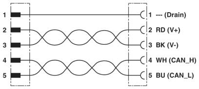
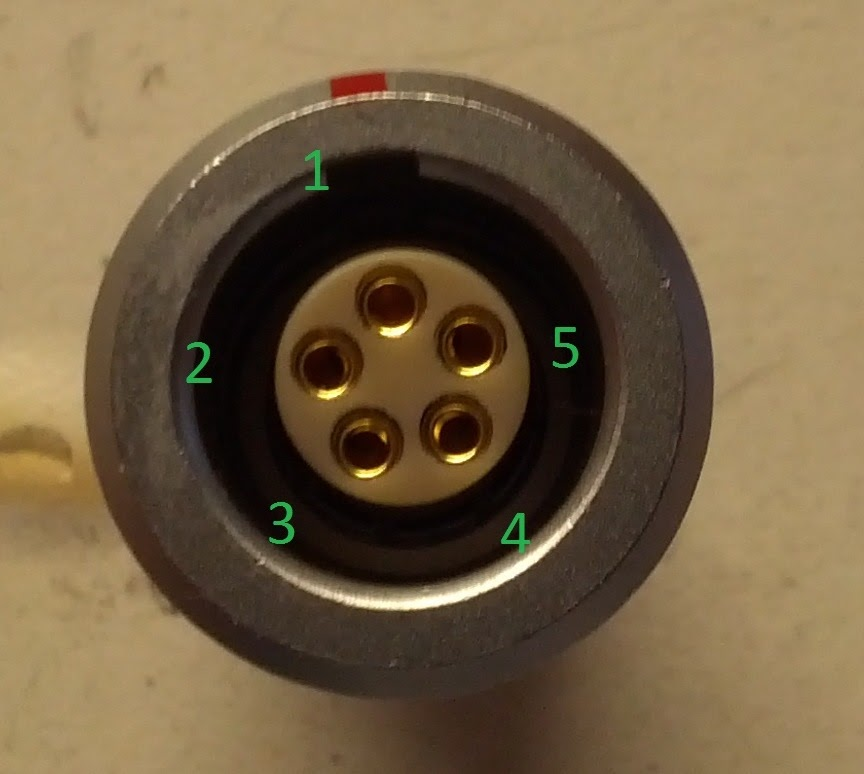
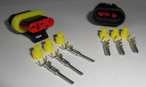
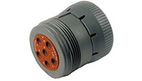
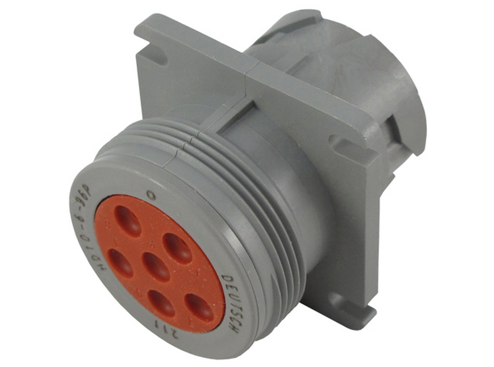
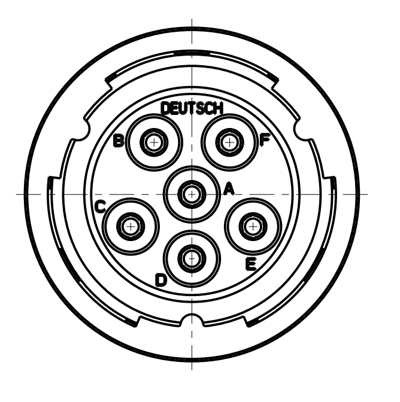
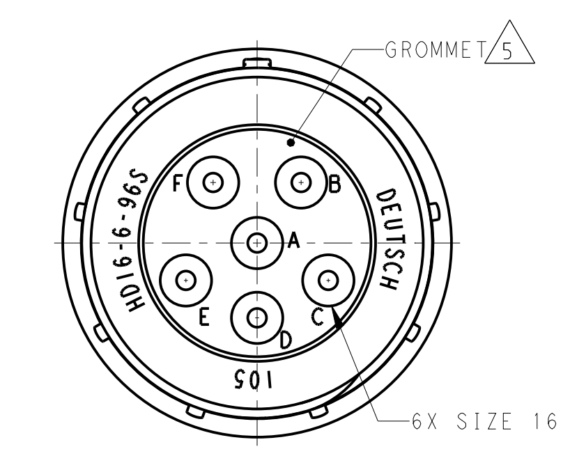

# sunwhale-connectors-pinouts-and-part-numbers

## SSCP - Sunwhale Connectors, Pinouts, and Part Numbers

## Sunwhale Connectors, Pinouts, and Part Numbers

#### (CAN) Phoenix M12 A Code

CAN Pinout

#### Embedded Content

Embedded content: [Custom embed](sunwhale-connectors-pinouts-and-part-numbers.md)

Male M12 Pinout:

Phoenix Part Numbers:

Phoenix Part Numbers:

&#x20;   Male PCB Mount 5 Pos Outside Nut: 1694224, used extensively

&#x20;   Male PCB Inside Nut: 1436602 (not used)

&#x20;   Male Panel Mount Square Flange: 1440973, used on Luminos battery and MPPT box

&#x20;   Male Panel Mount Round Flange: 1671111, not used due to the superiority of 1440973 on thin fiberglass panel

&#x20;  &#x20;

Tees (1 Male 2 Female)

&#x20;  &#x20;

&#x20;   Simple Tee: Phoenix 1541186, used extensively

&#x20;   Bolt mount Tee: Phoenix 1507793, heavy, do not use

Phoenix Cabling:

&#x20;   0.3M: 1419049

&#x20;   0.5M: 1419050

&#x20;   1.0M: 1419051

&#x20;   2.0M: 1419052

&#x20;   5.0M: 1419053

&#x20;   The cables used on Luminos were the correct series of coding, but did not possess the dual-twisted-pair wiring for CAN and PWR. I don't actually know how we got away with that. These cables are the correct models.&#x20;

#### Steering Wheel Connection

#### Embedded Content

Embedded content: [Custom embed](sunwhale-connectors-pinouts-and-part-numbers.md)

#### (Many) Deutsch DTM-12

Part Numbers (from wirecare.com):

&#x20;   Female Connector, key A, for heat shrink: DTM06-12SA-E007

&#x20;   Female Connector, key B, for heat shrink: DTM06-12SB-E007

&#x20;   Wedgelock (needed for female connector): WM-12S

&#x20;   Pins: 0462-201-20141 (nickel, 20ga)

&#x20;    Pins: 0462-201-2031 (gold, 20ga)

&#x20;    Pins: 0462-005-20141(gold 16-18ga)

&#x20;   Sealing Plugs (for sealing unused pins): 0413-204-2005

&#x20;   Protective Boot: DTM12S-BT (this sucks, don't buy it)

LED boards (Black Keying):

Driver Controls (Grey Keying):

#### Embedded Content

Embedded content: [Custom embed](sunwhale-connectors-pinouts-and-part-numbers.md)

#### Embedded Content

Embedded content: [Custom embed](sunwhale-connectors-pinouts-and-part-numbers.md)

(Pedals) TE Superseal 1.5 Pedal Sensor Connectors (North America Version)

Used for Pedal Sensors (http://www.mouser.com/ProductDetail/Honeywell/RTY060LVNAX/?qs=F9TaENl%252b8CBk8p5RBbW/zw==)

[http://www.mouser.com/ProductDetail/Honeywell/RTY060LVNAX/?qs=F9TaENl%252b8CBk8p5RBbW/zw==](http://www.mouser.com/ProductDetail/Honeywell/RTY060LVNAX/?qs=F9TaENl%252b8CBk8p5RBbW/zw==)

TE Part Numbers:

Boot: 880811-2

Wire Seal: 281934-2

Connector: 282087-1

Pins: 282403-1 (Correct, Mouser shipped the incorrect part)

### Battery Pack HV (External)

HVA-280 series from TE

Used for Pack->array and Pack->Motor controllers

#### Embedded Content

Embedded content: [Custom embed](sunwhale-connectors-pinouts-and-part-numbers.md)

&#x20;1

&#x20;2

&#x20;HV+

&#x20;HV-

#### Embedded Content

Embedded content: [Custom embed](sunwhale-connectors-pinouts-and-part-numbers.md)

Cabling: we use "Huber and Suhner 12 582 674" (I kid you not, they don't have any dashes or anything in their part number). &#x20;

#### (Battery Pack HV) Ring Terminals

#### Molex 10ga Crimps with M5 Stud

#### (Battery Pack HV Sense) Ring Terminals

Molex 22ga crimps

#### Motor HV

#### Embedded Content

Embedded content: [Custom embed](sunwhale-connectors-pinouts-and-part-numbers.md)

#### Motor Resolver

#### Embedded Content

Embedded content: [Custom embed](sunwhale-connectors-pinouts-and-part-numbers.md)

#### High Voltage Lights Connector

HD 16-6-96S                            HD 16-6-96P

Pinout

HD 16-6-96S                            HD 16-6-96P

#### Embedded Content

Embedded content: [Custom embed](sunwhale-connectors-pinouts-and-part-numbers.md)

Crimping Instructions:

http://www.deutschconnector.com/downloads/HDT-48-00%20Instructions.pdf

[http://www.deutschconnector.com/downloads/HDT-48-00%20Instructions.pdf](http://www.deutschconnector.com/downloads/HDT-48-00%20Instructions.pdf)

HD10 Part Numbers

#### Embedded Content

Embedded content: [Custom embed](sunwhale-connectors-pinouts-and-part-numbers.md)
