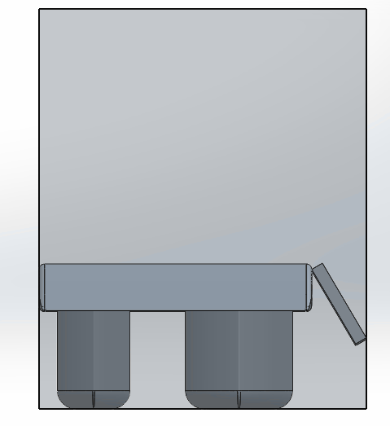

# SSCP - High-Level Design Decisions 2014-2015

# High-Level Design Decisions 2014-2015

This page, based on Max's analysis of Luminos' design trade offs, informed many decisions here.

[This](/home/general-design-principles/design-metrics)

Power To Drive

As of 2/7/15, this my prediction for Sunwhale's power-to-drive curve. It uses the Luminos power-to-drive model, but factors in the improved aerodynamics of Sunwhale-040 while assuming the car is 40kg heavier, and we experience a 1m/s average tailwind over the course of the race.

fit =

    0.1719   -4.9556   77.2248  -64.1383

Example usage: polyval(fit, 22)

Car Length & Width

On 8/6/14, we decided that the car would be 1.8m wide, 4.5m long. the overall car model predictor (svn://sunwhale/analysis/concentrator_analysis/overallCarPerformance.m) showed a 7kph difference between a 1.5m wide car with 6 concentrators on the side (concept5) and the no concentrator version (concept6). If the concentrators provided no power (concept5a), then there would be a 4kph loss from the no concentrator version (concept6) We deemed the 7kph possible advantage not worth the 4kph loss - a car depending on concentrators could be easily crippled by bad sun.

A configuration like 'car3' in the 'performance of different charging strategies' is, as of 8/6, the only way we would use concentrators for WSC2015.

As of 8/06/2014, the team has decided that its official internal goal for improvement will be a 15% increase in average vehicle speed. This number is based on what we perceive to as achievable given initial aerodynamic gains in simulation, proposed improvements in array performance and curvature, novel battery models or form factors, and potential use of concentrators. 

Concentrators? How many?

Modifications of Luminos' strategy models (see svn://sunwhale/analysis/concentrator_analysis/overallCarPerformance.m) showed that concentrators in WSC2013 were a great idea. The below results were achieved with this script under the assumption that you could fully charge a battery pack with the extra energy from concentrators:

    -Sacrifice 20% of array for getting a full charge overnight: 7kph faster, or if concentrators fully fail, 7kph loss.

    -Sacrifice 7% of array for getting a full charge overnight: 9kph faster, or if concentrators fully fail, 2kph loss.

However, the WSC2015 rules impose a bounding box during charging. With this constraint, the optimal breakdown of silicon and GaAs is very near 100% silicon; thus, it would be beneficial to have concentrators that shade the silicon, because Semprius modules (which we would likely use) are 300 W/m^2, versus ~200W/m^2 for sunpower cells. Note that the surface area given by the diagonal of the bounding box is not enough to yield the full battery pack mentioned in the above paragraph (even if filled with concentrators). Multiple possible configurations are explored in the below subsections.

Analysis of WSC2013 data showed that array standing energy (summed from both evening and morning) is approximately equivalent to 1.5 hours at peak array performance. This equivalency is used in the below configurations of cars.

See svn://sunwhale/analysis/concentrator_analysis/carLength.m for a script used in calculating how big the topshell should be, given some breakdown of solar parameters.

See the Aero design meeting logs for related discussions.

[ Aero design meeting logs](/home/sscp-2014-2015/aero-2014-2015/sunwhale-design-meeting-notes)

Performance of Different Charging Strategies

Methodology: my analysis references a model's drag to the "baseline" car (4.5m x 1.8m, full array, no concentrators, Luminos mass) - this way, we can look at differences rather than absolute numbers to isolate the benefits of a charging strategy. I modify expected peak array power given # concentrators, power from array standing, and weight.

Car 1: baseline + 1kph

-3.75m long, 1.8m wide, 4x concentrators placed behind the car while array standing. 

-Assuming 20% less drag than a full-length car. This is based on the drag difference between sunwhale-001 and sunwhale-001-short.

-Sacrificing 25% of the car's silicon array to make the car this small

Car 2: baseline - 1kph

-4.5m long, 1.5m wide, 6x concentrators placed alongside the car while array standing. 

-Assuming 5% less drag than a full-width car. This is based on the drag difference between 001-45150 and 001-45180.

-Sacrificing 15% of the car's silicon array to make the car this narrow

-The topshell cannot rotate to 90deg and stay within the bounding box, but concentrators can always point. Some hack math shows that minimum flat-plate power is cos(60deg), so let's say that we average 75% of peak power while array standing.

Illustration: 

Car 3: baseline + 2kph

-4.5m long, 1.8m wide, 6x concentrators are placed over our silicon array while charging

-Assuming this is the baseline aero performance.

-Sacrificing 1% of the car's silicon array to use concentrators (note: I need to go through the math to verify this is a reasonable amount)

-25% of the main array would be covered by 6x concentrators. Thus, during array standing, there is 75% of the car's Si array, plus 6x concentrators @ 90W each.

Config 3 looks best because it's fastest and seems the least risky, because you don't need to sacrifice much main array area.

Weight Balance

TODO: point to weight balance spreadsheet in SVN. Include Ben's email about the instability of a car that is not 50/50 left/right. Link to Aravind's further modeling on this.

HV Bus Voltage

See here for mechanical considerations. TODO: have an electrical discussion of this decision.

[See here](/home/sscp-2014-2015/mechanical-2014-2015/mechanical-team-projects/2014-2015-battery-pack-design)

Buy or Make Array?

Suspicions about Nuon's array, as well as Chuzel's (Suncat) claims about his array over Gocherman's array, make us think that Suncat's arrays are up 10% more efficient than ours (i.e. 20.5%->22.5% efficient). For a 1200W peak array, this is 120W improvement. If his encapsulation costs $73/cell, this would be $30,000 (with some extras). This is $250/W.

