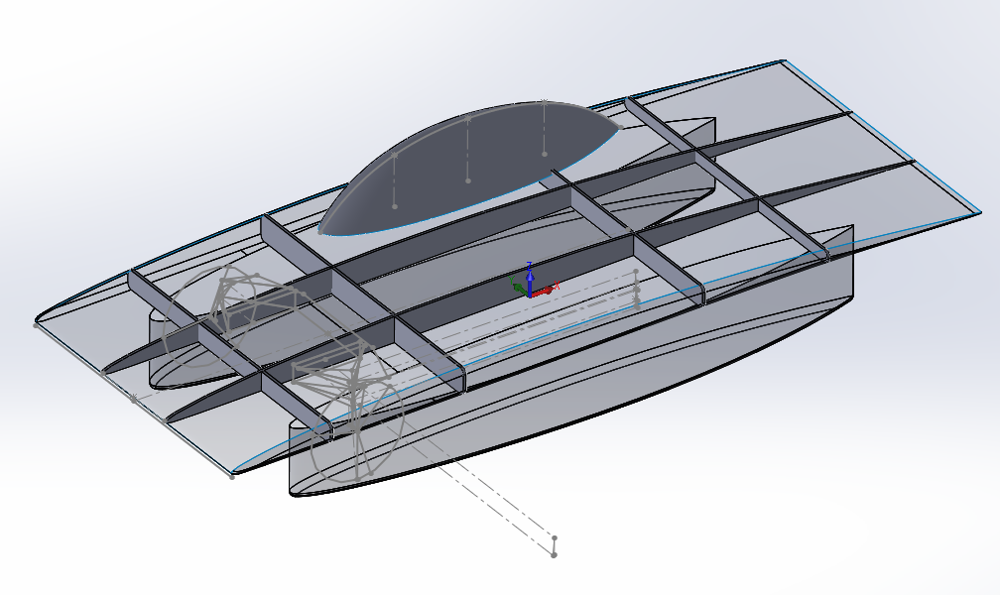
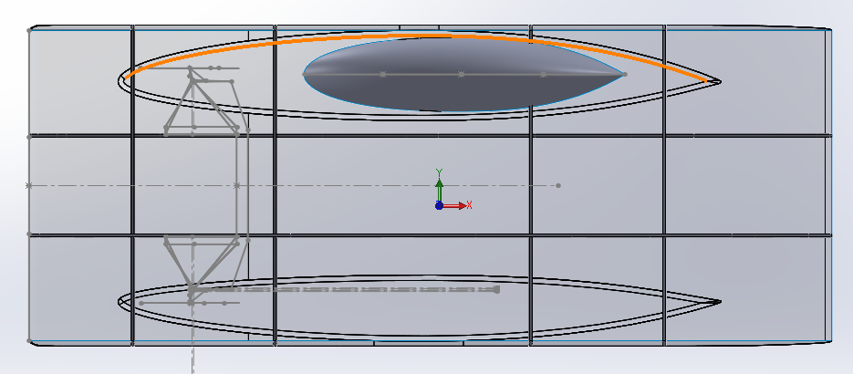
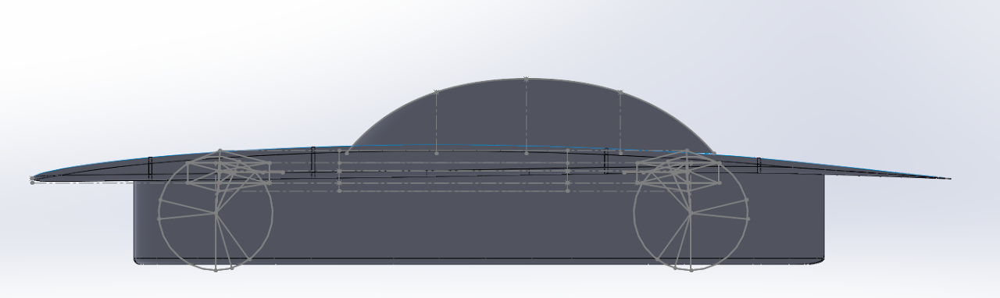
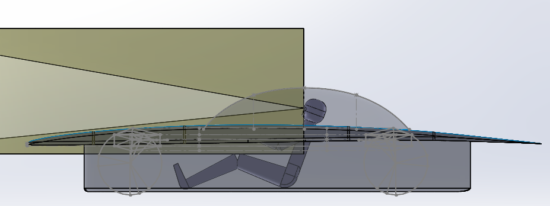
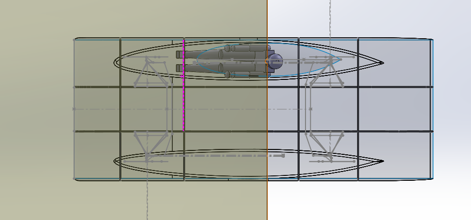
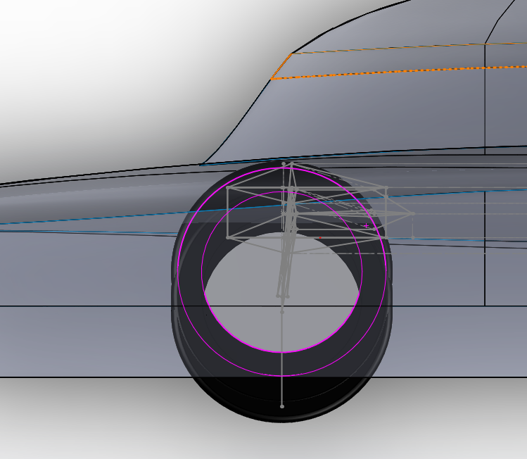
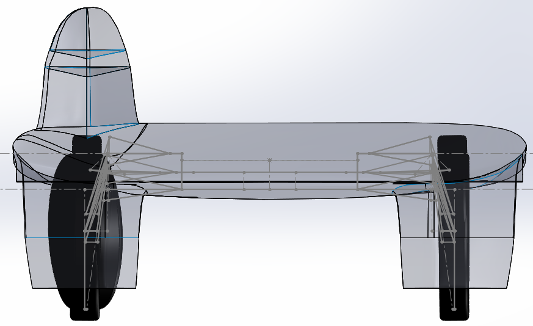

# SSCP - 2014-2015 Chassis

# 2014-2015 Chassis

The first chassis fit was done on: Sunwhale-002-45180-camber3-thick3-16series-patched-chassis

The fit was done to this concept due to it having the lowest drag out of the early Solidworks FlowSim runs (29N). However, the main foil thickness of 3 means that there is only .153m (6 inches) of vertical spacing where the suspension would mount to the chassis members. 

The longitudinal panel spacing in the Y direction is governed by the suspension spacing, which is .575m for our double wishbone concept. The latitudinal panel spacing is centered around where the suspensions would be. 

The length of the fairing in our early models was .54m, but it will be shortened to at least .44m (.44m is the value currently being run in the new flowsim models) because .54m leages a .1m gap between the bottom of the wheel and fairing. The driver height is also more reasonable with .44m height fairings.  

In this model, the fairings are .42m tall such that the bottom of the wheel protrudes 4cm. This was based on the assumption that the ride height of the car above the ground is 4cm, but the value measured on 8/9/2014 from physical Luminos is 8cm, so the ride height may have to increase a bit. This would imply further shortening the fairings by 4cm. 

It has been recommended by alumni that 6 inches of thickness in the main foil is too thin. We will therefore pursue at least 10 inches of airfoil thickness where the suspension mounts to the chassis. This consideration will push us away from the thickness 3 foils that this model is based on, and towards thickness 6 foils. 

Finally, a quick driver fit sanity check indicates that the driver appears to have enough space in the center of the car and vision requirements can be met. It is important to note that the shoulders of the driver are at main foil height, so the fairings are more constrained by driver hip width than shoulder width. 

Sunwhale-011

Side view of sunwhale rear suspension. In bump, the suspension gets too close to the top shell. Anna will shift to a NACA 66 instead of 65, but we might also have to reduce the bump. Is it ok to reduce bump?

Rear view of sunwhale rear suspension. Both front and rear suspension will hit the junction between fairing and main body in rebound right now. Anna will blend the fairing to the main body to allow more room in this area. 

### Embedded Google Drive File

Google Drive File: [Embedded Content](https://drive.google.com/embeddedfolderview?id=1lNC7FQqxJh-uaDvm51pRLWiRyFDFo4Zr#list)

<iframe width="100%" height="400" src="https://drive.google.com/embeddedfolderview?id=1lNC7FQqxJh-uaDvm51pRLWiRyFDFo4Zr#list" frameborder="0"></iframe>

