# SSCP - Charging Configuration 2014-2015

# Charging Configuration 2014-2015

Description: 

* Formerly called "Sunwhale array & concentrator integration)

(2015 car)

The entire car and charging apparatus must fit inside a 1.8W x 4.5L x 2.2H m imaginary box while charging and driving, and everything must be carried within the car.

The task: Design a way to deploy array and concentrators during morning/nighttime charging such that the car fits entirely within the regulation bounding box and maximizes power collected.

Updates

10-23-2014 (Charlie):

Analysis of performance hit vs concentrator set up time: I plotted the energy per m^2 of morning+nighttime charging (combined) vs. minutes of setup time before 8am and after 5pm. E.g. if Setup Time is 20 min, we can charge from sunrise - 7:40am and 5:20pm - sunset.

Plot of normalized energy from direct normal radiation (in kW-h per m^2) for sunrise to 8am-setuptime and 5pm+setuptime to sunset.

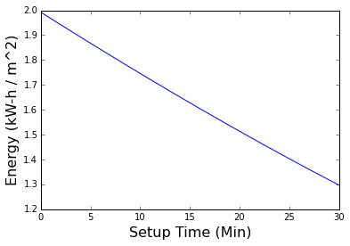

* The approximately linear relation has a slope of -23 W-h/m^2 per minute of setup time, from a max of 2000 W-h/m^2.

* For reference, this is what solar irradiation looks like during a typical race day (direct normal, i.e. measuring for a panel oriented directly facing the sun; so the variation is due to atmospheric effects):

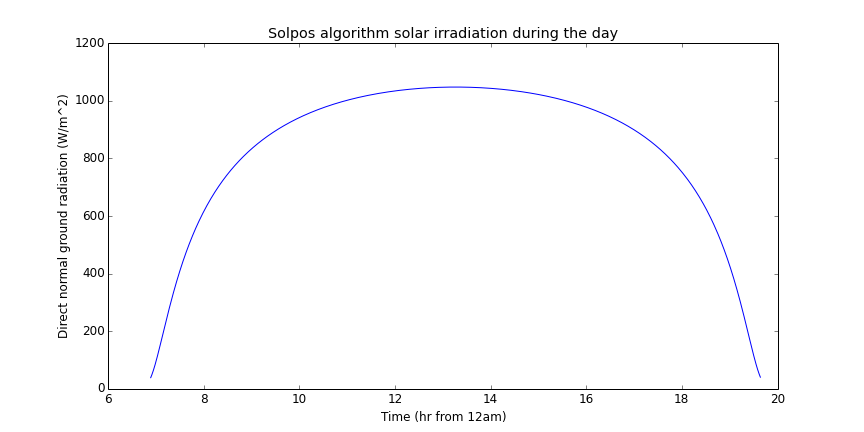

10-11-2014 (Charlie):

Analyzed fit and performance for various charging configs.

Check out the PDF attached.

And Python analysis here: http://nbviewer.ipython.org/github/cjiang1/sunwhale-cjiang1-git/blob/master/charging_configs/charging_config_plotmaking.ipynb

[http://nbviewer.ipython.org/github/cjiang1/sunwhale-cjiang1-git/blob/master/charging_configs/charging_config_plotmaking.ipynb](http://nbviewer.ipython.org/github/cjiang1/sunwhale-cjiang1-git/blob/master/charging_configs/charging_config_plotmaking.ipynb)

Linear space for concentrators (i.e. along long direction of lenses when facing sun). Suppose the topshell is 0.2m tall.

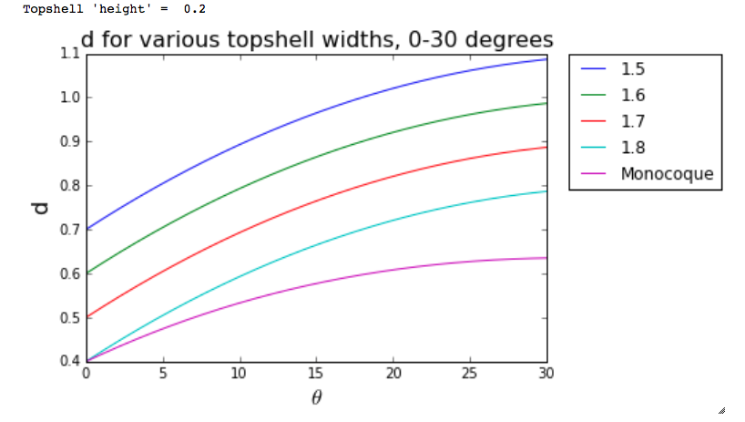

Number of rows of concentrators that can fit in this space (assume 7 in per concentrator):

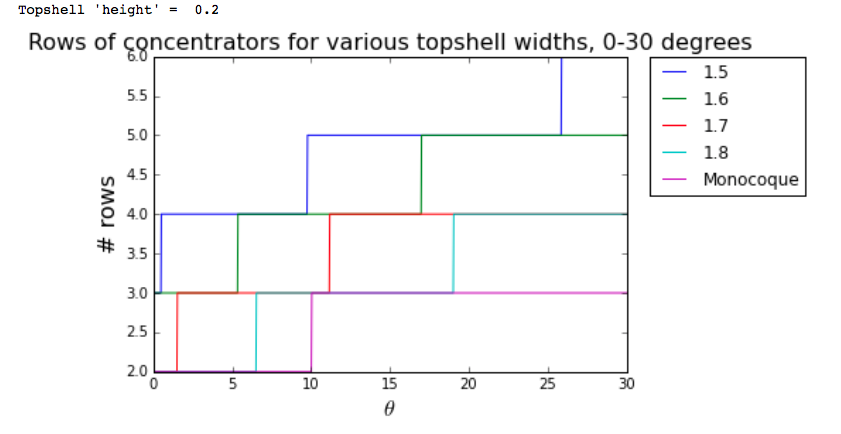

Performance gain for various charging configurations:

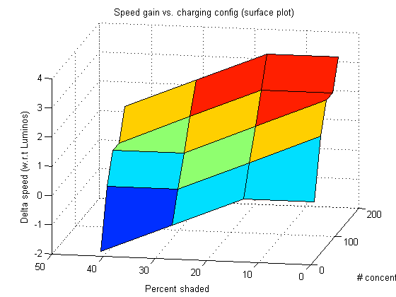

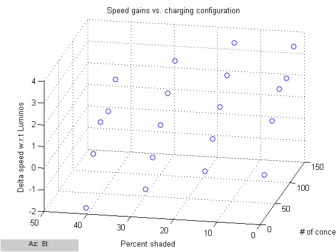

Fitting small and large concentrator elements in car (uncollapsed):

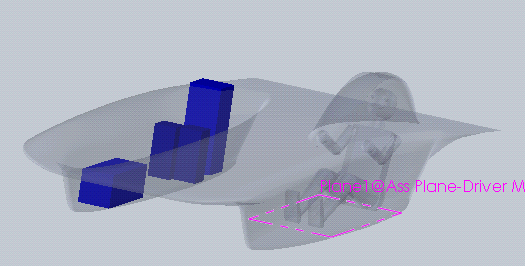

Topshell configuration examples:

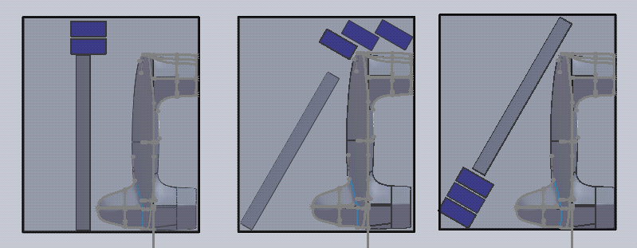

10-6-2014 (Charlie):

The question: can concentrators fit in the bounding box if the car is a monocoque?

    - Using Arzon's "Small Element" concentrators (nominal 6.1"x6.1" lens element, 10.1" focal length)

    - Tolerance for enclosure: overall size 7x7x12 inches

    - Using Sunwhale 025

Front view.

(Left) 2 rows of concentrators (50 total) with car at 30° tilt from vertical.

(Right) 2 rows of concentrators, vertical. Also 15 concentrators (3 rows of 5) in front of where the bubble would be - i.e. not blocking the array, to a first approximation.

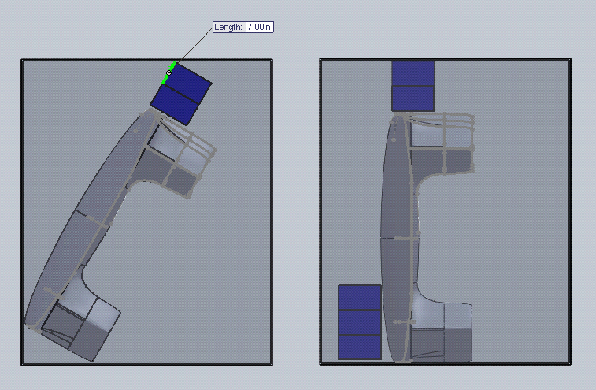

Some quick math:

    - If the car is tightly enclosed by a rectangle in front view, then assume the dimensions are 1.8m x 0.55m (a little more than the current fairing + lower body height).

    - Lengthen this rectangle to allow for concentrators inline with the car.

    - With this large rectangle, the longest dimension is its diagonal. This can be at most 2.2 m if we want the rectangle to be able to stay completely within the bounding box.

    - Then the other side of the rectangle can be at most sqrt(2.2^2 - 0.55^2) = 2.13 m. This leaves 0.33 m = 13 in for concentrators, if they are placed in line with the car.

Note: we can offset the concentrators to get around this restriction, e.g.:

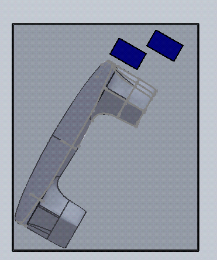

9-20-14 (Charlie):

Potential projects:

    - Layout of components in bounding box during charging

    - Latching mechanism for top shell/door (see this page)

[ this](/stanford.edu/testduplicationsscp/home/sscp-2014-2015/mechanical-2014-2015/mechanical-team-projects/topshell-latching-and-alignment)

    - Collapsible concentrator design & manufacturing

    - Supporting array/top shell during charging

    - Supporting car vertically during charging

    - Supporting concentrators during charging

    - Concentrator storage in aero body

Two rules clarifications:

    - "Permanently attached": as long as component travels in car it's fine. Doesn't have to be mounted in any way, necessarily

    - For Arzon concentrator cells, 2:1 ratio of Si:Concentrator cell area.

8-23-14, Charlie & Susan:

* With current car height of around .55 m from ground to where the bottom/top shell seam would approximately be (i.e. where we could pivot the top shell; see screenshot below), we can achieve a top shell pivot of at most ~65-70° from horizontal. This is not ideal for night/morning charging, as we won't be able to achieve a fully vertical array...

* So conclusion: in order to get a vertical array for night/morning charging, we would likely need to tilt the entire car relative to the ground to be able to meet the bounding box constraints. (See second picture below).

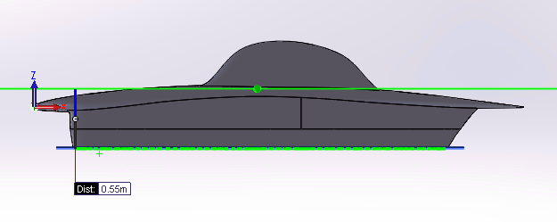

0.55 m to pivot point.

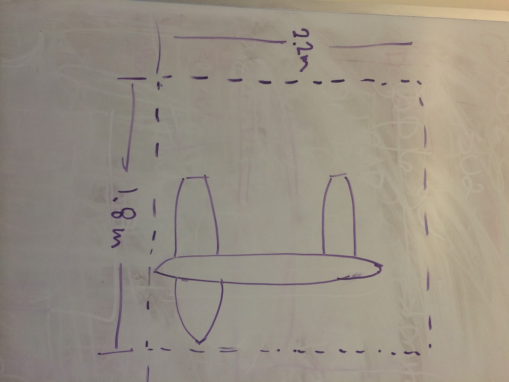

Tilting car relative to ground/bounding box (sorry, image is sideways. Will fix later. But ground is vertical on the left side).

TO DOs:

* Concentrators - Charlie

    - Can we actually get them?

    - What will the dimensions be? (If we don't use Semprius)

* Detachable array - Susan

    - Feasible?

    - How to do that within 15sec driver egress rule

    - What it will look like (in terms of composites and mech)

* Making the car vertical (for night/morning charging)

    - Built-in car stand: e.g. fold-out carbon rods, like an easel - Susan

    - Cushioning between side of car and ground - Charlie

    - Will the car be strong and stable when sideways? - Charlie

    - How car, array, concentrators, etc. will be positioned relative to bounding box + mechanics of doing so

            * To achieve array angle, tilt the entire car or try to tilt only the array? - All

* The bubble

    - Where would it go during charging? How is it attached to the car/array?

Links

Python analysis of charging configuration geometry: http://nbviewer.ipython.org/github/cjiang1/sunwhale-cjiang1-git/blob/master/charging_configs/charging_config_plotmaking.ipynb

[http://nbviewer.ipython.org/github/cjiang1/sunwhale-cjiang1-git/blob/master/charging_configs/charging_config_plotmaking.ipynb](http://nbviewer.ipython.org/github/cjiang1/sunwhale-cjiang1-git/blob/master/charging_configs/charging_config_plotmaking.ipynb)

Applicable Race Regulations

* (As of June 4, 2014)2.2.1 Challenger Class and Cruiser Class Solar EV's must be no more than 4500 mm in length, no more than 1800 mm in width, and no more than 2200 mm in height (above the ground) at any time while charging or driving.2.2.2 Wheels and wheel spats may exceed this envelope while turning. Doors may exceed this envelope while occupants are getting in and out. The solar collector may exceed this envelope when being reconfigured for charging or driving (but not when charging or driving. See Regulation 2.2.1).2.20.2 All conductors emerging from the solar array must be isolated from all circuitry in the rest of the car by one or more a mechanical switches or contactors. (If the solar control electronics (such as MPPTs) are physically close to the solar cells, teams may request permission from the Chief Scrutineer to deem these components to be part of the solar collector.)2.21.4 With the exception of a power cord required to connect a Cruiser Class Solar EV to an external power source, any items or equipment required for charging must either be part of, or carried by, the solar EV.2.21.6 For Challenger Class and Cruiser Class Solar EVs, if the solar collector uses photovoltaic cells then the allowable area of photovoltaic cells is: (1) not more than 6.000 square metres for Solar EVs using only silicon photovoltaic cells; (2) not more than 3.000 square metres for Solar EVs using only GaAs photovoltaic cells. (Challenger Class and Cruiser Class Teams wishing to use other types of photovoltaic cells, a mix of photovoltaic cell types, or other types of solar collector, must contact the Organiser.)
* (As of June 4, 2014)
* 2.2.1 Challenger Class and Cruiser Class Solar EV's must be no more than 4500 mm in length, no more than 1800 mm in width, and no more than 2200 mm in height (above the ground) at any time while charging or driving.
* 2.2.2 Wheels and wheel spats may exceed this envelope while turning. Doors may exceed this envelope while occupants are getting in and out. The solar collector may exceed this envelope when being reconfigured for charging or driving (but not when charging or driving. See Regulation 2.2.1).
* 2.20.2 All conductors emerging from the solar array must be isolated from all circuitry in the rest of the car by one or more a mechanical switches or contactors. (If the solar control electronics (such as MPPTs) are physically close to the solar cells, teams may request permission from the Chief Scrutineer to deem these components to be part of the solar collector.)
* 2.21.4 With the exception of a power cord required to connect a Cruiser Class Solar EV to an external power source, any items or equipment required for charging must either be part of, or carried by, the solar EV.
* 2.21.6 For Challenger Class and Cruiser Class Solar EVs, if the solar collector uses photovoltaic cells then the allowable area of photovoltaic cells is: (1) not more than 6.000 square metres for Solar EVs using only silicon photovoltaic cells; (2) not more than 3.000 square metres for Solar EVs using only GaAs photovoltaic cells. (Challenger Class and Cruiser Class Teams wishing to use other types of photovoltaic cells, a mix of photovoltaic cell types, or other types of solar collector, must contact the Organiser.)

* (As of June 4, 2014)
* 2.2.1 Challenger Class and Cruiser Class Solar EV's must be no more than 4500 mm in length, no more than 1800 mm in width, and no more than 2200 mm in height (above the ground) at any time while charging or driving.
* 2.2.2 Wheels and wheel spats may exceed this envelope while turning. Doors may exceed this envelope while occupants are getting in and out. The solar collector may exceed this envelope when being reconfigured for charging or driving (but not when charging or driving. See Regulation 2.2.1).
* 2.20.2 All conductors emerging from the solar array must be isolated from all circuitry in the rest of the car by one or more a mechanical switches or contactors. (If the solar control electronics (such as MPPTs) are physically close to the solar cells, teams may request permission from the Chief Scrutineer to deem these components to be part of the solar collector.)
* 2.21.4 With the exception of a power cord required to connect a Cruiser Class Solar EV to an external power source, any items or equipment required for charging must either be part of, or carried by, the solar EV.
* 2.21.6 For Challenger Class and Cruiser Class Solar EVs, if the solar collector uses photovoltaic cells then the allowable area of photovoltaic cells is: (1) not more than 6.000 square metres for Solar EVs using only silicon photovoltaic cells; (2) not more than 3.000 square metres for Solar EVs using only GaAs photovoltaic cells. (Challenger Class and Cruiser Class Teams wishing to use other types of photovoltaic cells, a mix of photovoltaic cell types, or other types of solar collector, must contact the Organiser.)

(As of June 4, 2014)

2.2.1 Challenger Class and Cruiser Class Solar EV's must be no more than 4500 mm in length, no more than 1800 mm in width, and no more than 2200 mm in height (above the ground) at any time while charging or driving.

2.2.2 Wheels and wheel spats may exceed this envelope while turning. Doors may exceed this envelope while occupants are getting in and out. The solar collector may exceed this envelope when being reconfigured for charging or driving (but not when charging or driving. See Regulation 2.2.1).

2.20.2 All conductors emerging from the solar array must be isolated from all circuitry in the rest of the car by one or more a mechanical switches or contactors. (If the solar control electronics (such as MPPTs) are physically close to the solar cells, teams may request permission from the Chief Scrutineer to deem these components to be part of the solar collector.)

2.21.4 With the exception of a power cord required to connect a Cruiser Class Solar EV to an external power source, any items or equipment required for charging must either be part of, or carried by, the solar EV.

2.21.6 For Challenger Class and Cruiser Class Solar EVs, if the solar collector uses photovoltaic cells then the allowable area of photovoltaic cells is: (1) not more than 6.000 square metres for Solar EVs using only silicon photovoltaic cells; (2) not more than 3.000 square metres for Solar EVs using only GaAs photovoltaic cells. (Challenger Class and Cruiser Class Teams wishing to use other types of photovoltaic cells, a mix of photovoltaic cell types, or other types of solar collector, must contact the Organiser.)

* 3.19.3 The Official Start Time each day after Day 1 is 08:00. 3.19.4 The Official Finish Time each day is 17:00.3.27.3 Teams must obey all directions of the Control Stop Manager. When at a Control Stop, the Solar EV must at all times be able to be moved immediately if directed to do so by the Control Stop Manager. 
* 3.19.4 The Official Finish Time each day is 17:00.
* 3.27.3 Teams must obey all directions of the Control Stop Manager. When at a Control Stop, the Solar EV must at all times be able to be moved immediately if directed to do so by the Control Stop Manager. 
* 3.27.4 When at a Control Stop no repair or maintenance tasks of any kind are permitted.
* 3.27.5 Solar EVs may not be reconfigured such that the allowable dimensions are exceeded. 3.27.6 Solar collectors may be cooled, but only by use of a hand operated spray containing ambient temperature water
* 3.27.6 Solar collectors may be cooled, but only by use of a hand operated spray containing ambient temperature water

3.19.3 The Official Start Time each day after Day 1 is 08:00. 

* 3.19.4 The Official Finish Time each day is 17:00.
* 3.27.3 Teams must obey all directions of the Control Stop Manager. When at a Control Stop, the Solar EV must at all times be able to be moved immediately if directed to do so by the Control Stop Manager. 

3.19.4 The Official Finish Time each day is 17:00.

3.27.3 Teams must obey all directions of the Control Stop Manager. When at a Control Stop, the Solar EV must at all times be able to be moved immediately if directed to do so by the Control Stop Manager. 

3.27.4 When at a Control Stop no repair or maintenance tasks of any kind are permitted.

3.27.5 Solar EVs may not be reconfigured such that the allowable dimensions are exceeded. 

* 3.27.6 Solar collectors may be cooled, but only by use of a hand operated spray containing ambient temperature water

3.27.6 Solar collectors may be cooled, but only by use of a hand operated spray containing ambient temperature water

Attachments (0)

Attach a file: 

### Comments

 

Add comment

Recent Site Activity  |  Revision History  |  Terms  |  Report Abuse  |  Print page  |  Remove Access  |  Powered by Google Sites

[Recent Site Activity](https://sites.google.com/site/susolarcar/system/app/pages/recentChanges)

[Revision History](https://sites.google.com/site/susolarcar/system/app/pages/admin/revisions?wuid=wuid:gx:b9f17ea90edc74a)

[Report Abuse](https://sites.google.com/site/susolarcar/system/app/pages/reportAbuse?src=/home/mechanical/suspension)

[Remove Access](https://sites.google.com/site/susolarcar/system/app/pages/removeAccess)

[Google Sites](http://sites.google.com/)

Suspension

draft saved at 13:46

### Embedded Google Drive File

Google Drive File: [Embedded Content](https://drive.google.com/embeddedfolderview?id=1hhuDBujckOzIKwGtyb12UJGEJddJMuMe#list)

<iframe width="100%" height="400" src="https://drive.google.com/embeddedfolderview?id=1hhuDBujckOzIKwGtyb12UJGEJddJMuMe#list" frameborder="0"></iframe>

