# SSCP - Hardpoint Design

# Hardpoint Design

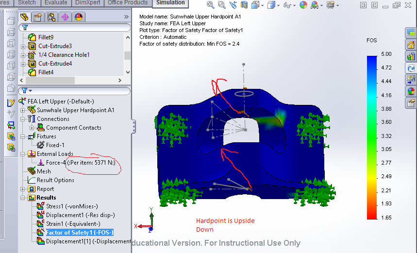

We need to make sure our new hardpoints can take approximately twice the loads seen on the Luminos hardpoints. 

Loading Conditions

See attached doc and photo of hardpoint numbering.

Upper Hardpoint

upper front hardpoint (hardpoint 4)

-6328N FX

-8277 FY

-2610FZ

Loads were applied by taking the magnitude of this maximum force and drawing it along a unit direction vector. Loads were applied to the inside of the bolt holes, and the maximum load was divided by two to give a conservative estimate of the double-shear loading condition, even though the force wouldn't be split exactly in two given that the inner hole surfaces do not have the same area. This methodology is WRONG, and the bolt loading conditions should be used instead. 

Luminos hardpoints shown below with new loading. These still pass FEA as of Jan 17 2014. Hardpoint checked into PDM/Sunwhale Repository/Sunwhale Suspension/Sunwhale Upper Hardpoint A1. The hardpoint shown is the front upper hardpoint on the left side. 

HARDPOINT SIMULATION SHOWN ABOVE is WRONG. 

FEA Analysis with Load Direction Reversed

This simulation is RIGHT. 

Lower Hardpoint

lower front hardpoint (hardpoint 1)

14,080N FX longitudinal direction towards back of the car 

13,631N FY lateral outboard

3,630N   FZ upwards

Magnitude of force is 19,931N split in two because of the two inner bolt hole surfaces (bolt in double-shear). 

Luminos lower hardpoint shown below with new loading. These do not pass FEA, unmodified, as of Jan 17 2014. 

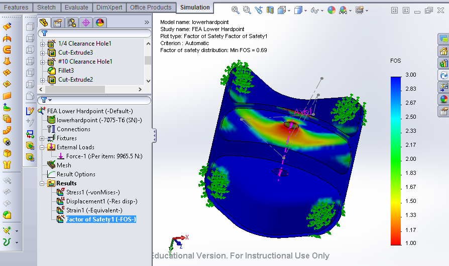

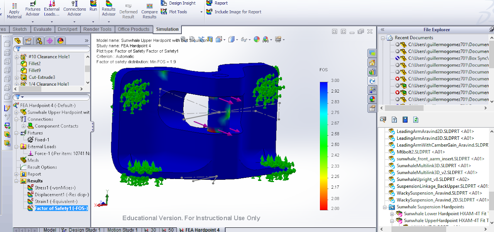

Thickening the main folded body and centering the rodend cutout so that it still measures 0.60" but the thin hinge has greater thickness. 

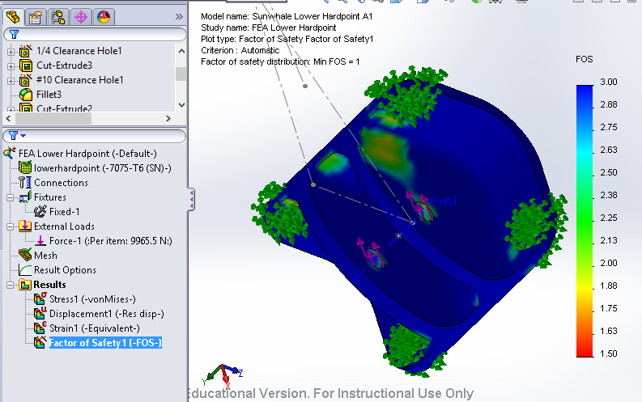

Rear end. The reddest sections of the FEA are the rear faces of the insert. I don't know why this is the case but the piece will not fail there. 

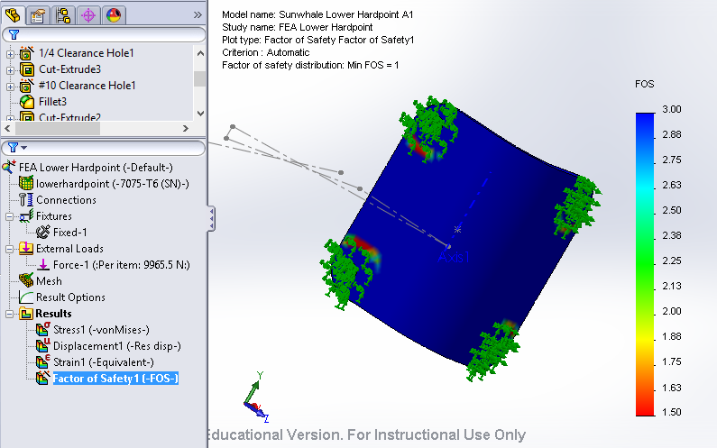

With corrected loading orientation, the new FEA for the lower hardpoint looks like this. Minimum factor of safety is 1.7, and 1.6 at the minimum if I reduce the thickness of the part. 

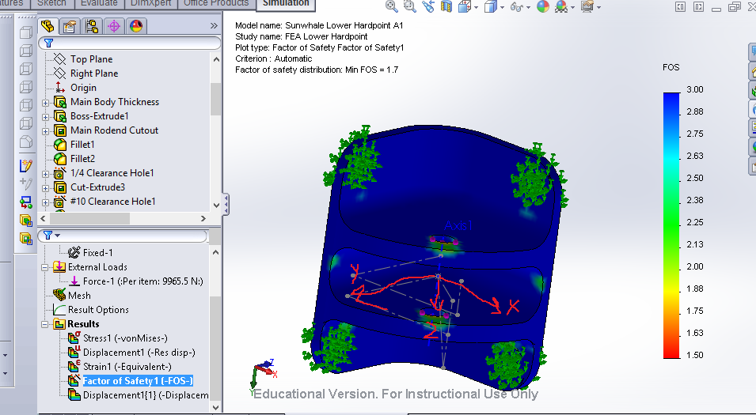

Lower Hardpoint Sunwhale

New lower hardpoint design for Sunwhale accounts for tight tolerance below rodends. There are two versions of the loewr hardpoint, with the rodend hole placed in slightly different positions. See FEA images below and placement chart for Lower Hardpoints 1 and 2. 

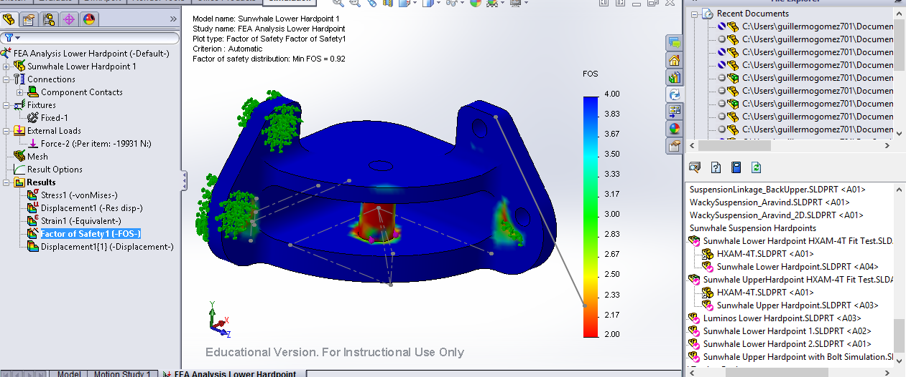

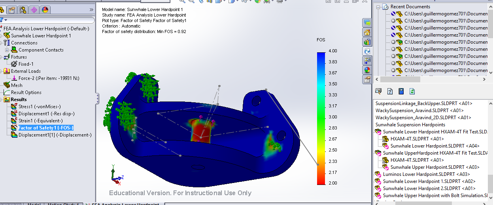

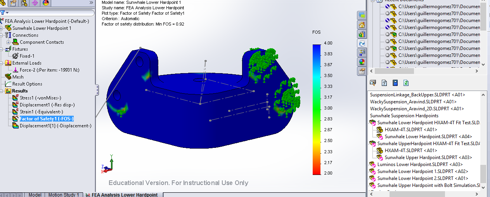

FEA Analysis with Loading Reversed (Passes minimum 2.2 FOS, ignoring global contact condition red zones)

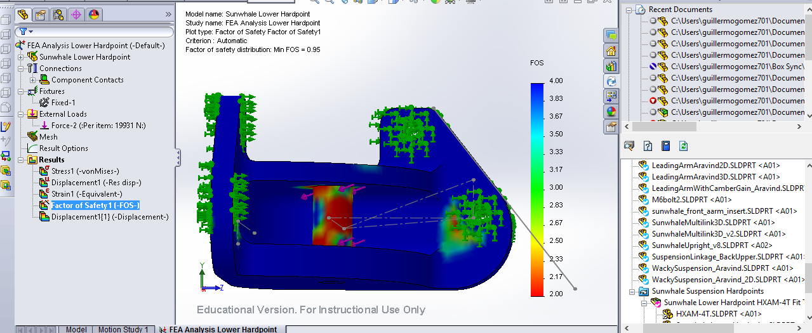

Lower Hardpoint Placement

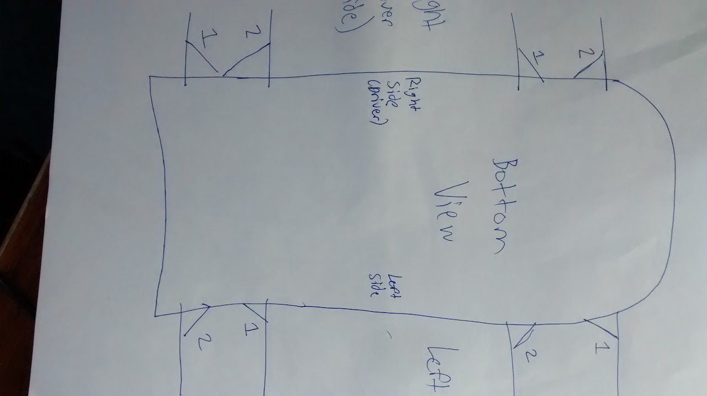

Hardpoints can be Found in PDM

Sunwhale Repository/Sunwhale Suspension/Sunwhale Suspension Hardpoints

 

### Embedded Google Drive File

Google Drive File: [Embedded Content](https://drive.google.com/embeddedfolderview?id=1FsfRWZbqTORuheoErAHm1YBUne3OqW5F#list)

<iframe width="100%" height="400" src="https://drive.google.com/embeddedfolderview?id=1FsfRWZbqTORuheoErAHm1YBUne3OqW5F#list" frameborder="0"></iframe>

