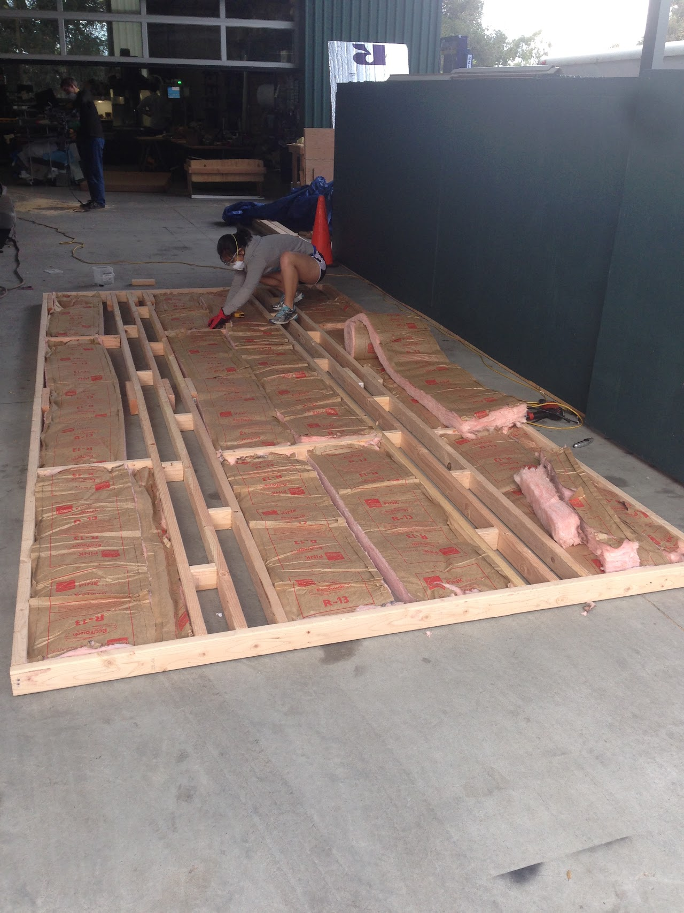

# oven-design

## SSCP - Oven Design

## Oven Design

The people working on the oven for the 2015 car are:

* Jamie Goldfield
* Reed Kraus
* Jack Swiggett
* Hayden Hall

Jamie Goldfield

Reed Kraus

Jack Swiggett

Hayden Hall

Our proposed timeline for the construction of the oven:

* December 1: Finalize design and material choices
* February 7: Begin construction of oven
* Late February/Early March: Finish oven construction
* Early March: Aero body molds arrive
* Week of March 1: Begin running oven tests to practice getting the oven to temperature
* Week of March 21 (Spring Break): Composite layups for aero body, fairings, door, etc
* April 13-20: Oven disassembly and disposal

December 1: Finalize design and material choices

February 7: Begin construction of oven

Late February/Early March: Finish oven construction

Early March: Aero body molds arrive

Week of March 1: Begin running oven tests to practice getting the oven to temperature

Week of March 21 (Spring Break): Composite layups for aero body, fairings, door, etc

April 13-20: Oven disassembly and disposal

Required Specifications:

* Minimum interior dimensions: 2.5 m by 5.5 m by 2 mAll structural materials and insulation must be able to withstand 250 F curing temperature, plus elevated temperatures near the propane heaters
* Minimum interior dimensions: 2.5 m by 5.5 m by 2 m
* All structural materials and insulation must be able to withstand 250 F curing temperature, plus elevated temperatures near the propane heaters
* Minimum interior dimensions: 2.5 m by 5.5 m by 2 m
* All structural materials and insulation must be able to withstand 250 F curing temperature, plus elevated temperatures near the propane heaters

Minimum interior dimensions: 2.5 m by 5.5 m by 2 m

All structural materials and insulation must be able to withstand 250 F curing temperature, plus elevated temperatures near the propane heaters

The oven for this cycle will likely be very similar to the oven use for Luminos. Areas of possible improvement:

* Finding new insulation material that can withstand elevated temperatures near the heatersDesign a floor to reduce heat loss through the concrete heat sinkThe 2015 oven has a floor made of 3/4" plywood and 2x4s on their side running underneath where the wheels of the mold will apply lots of pressure.  We put fiberglass batting underneath the plywood in the air-gap (we also put some in the door frames). Changing door design to a single side-hinge door to reduce the number of gapsTo fix this, we kept the barn-style doors and used weatherstripping tape to create an air-tight seal in the door jams. Tip for mounting doors: place two 3/4" plywood sheets underneath the doors when mounting hinges so that you have plenty of ground clearance. &#x20;
* Finding new insulation material that can withstand elevated temperatures near the heaters
* Design a floor to reduce heat loss through the concrete heat sinkThe 2015 oven has a floor made of 3/4" plywood and 2x4s on their side running underneath where the wheels of the mold will apply lots of pressure.  We put fiberglass batting underneath the plywood in the air-gap (we also put some in the door frames).&#x20;
* The 2015 oven has a floor made of 3/4" plywood and 2x4s on their side running underneath where the wheels of the mold will apply lots of pressure.  We put fiberglass batting underneath the plywood in the air-gap (we also put some in the door frames).&#x20;
* Changing door design to a single side-hinge door to reduce the number of gapsTo fix this, we kept the barn-style doors and used weatherstripping tape to create an air-tight seal in the door jams. Tip for mounting doors: place two 3/4" plywood sheets underneath the doors when mounting hinges so that you have plenty of ground clearance. &#x20;
* To fix this, we kept the barn-style doors and used weatherstripping tape to create an air-tight seal in the door jams.&#x20;
* Tip for mounting doors: place two 3/4" plywood sheets underneath the doors when mounting hinges so that you have plenty of ground clearance. &#x20;
* Finding new insulation material that can withstand elevated temperatures near the heaters
* Design a floor to reduce heat loss through the concrete heat sinkThe 2015 oven has a floor made of 3/4" plywood and 2x4s on their side running underneath where the wheels of the mold will apply lots of pressure.  We put fiberglass batting underneath the plywood in the air-gap (we also put some in the door frames).&#x20;
* The 2015 oven has a floor made of 3/4" plywood and 2x4s on their side running underneath where the wheels of the mold will apply lots of pressure.  We put fiberglass batting underneath the plywood in the air-gap (we also put some in the door frames).&#x20;
* Changing door design to a single side-hinge door to reduce the number of gapsTo fix this, we kept the barn-style doors and used weatherstripping tape to create an air-tight seal in the door jams. Tip for mounting doors: place two 3/4" plywood sheets underneath the doors when mounting hinges so that you have plenty of ground clearance. &#x20;
* To fix this, we kept the barn-style doors and used weatherstripping tape to create an air-tight seal in the door jams.&#x20;
* Tip for mounting doors: place two 3/4" plywood sheets underneath the doors when mounting hinges so that you have plenty of ground clearance. &#x20;

Finding new insulation material that can withstand elevated temperatures near the heaters

Design a floor to reduce heat loss through the concrete heat sink

* The 2015 oven has a floor made of 3/4" plywood and 2x4s on their side running underneath where the wheels of the mold will apply lots of pressure.  We put fiberglass batting underneath the plywood in the air-gap (we also put some in the door frames).&#x20;

The 2015 oven has a floor made of 3/4" plywood and 2x4s on their side running underneath where the wheels of the mold will apply lots of pressure.  We put fiberglass batting underneath the plywood in the air-gap (we also put some in the door frames).&#x20;

Changing door design to a single side-hinge door to reduce the number of gaps

* To fix this, we kept the barn-style doors and used weatherstripping tape to create an air-tight seal in the door jams.&#x20;
* Tip for mounting doors: place two 3/4" plywood sheets underneath the doors when mounting hinges so that you have plenty of ground clearance. &#x20;

To fix this, we kept the barn-style doors and used weatherstripping tape to create an air-tight seal in the door jams.&#x20;

[weatherstripping tape](http://www.homedepot.com/p/Frost-King-E-O-3-4-in-x-7-16-in-x-10-ft-Black-High-Density-Rubber-Foam-Weatherstrip-Tape-R734H/100047977?N=5yc1vZc3e3)

Tip for mounting doors: place two 3/4" plywood sheets underneath the doors when mounting hinges so that you have plenty of ground clearance. &#x20;

Final Inner Dimensions for 2015 Oven: 17 ft long x 8 ft wide x 5 ft tall

Temperature sensing: information can be found here

[ere](../../../../../../stanford.edu/testduplicationsscp/home/sscp-2012-2013/composites-2012-2013/temperature-sensing/)

Oven Proposal

#### Embedded Content

Embedded content: [Embedded Content](oven-design.md)

Risk Management Document (for Health and Safety)

#### Embedded Content

Embedded content: [Embedded Content](oven-design.md)

Pictures of 2015 oven:

Method for securing vacuum bag to walls:

Method for cutting circles:

Pictures of the oven used for Luminos:

#### Embedded Google Drive File

Google Drive File: [Embedded Content](https://drive.google.com/embeddedfolderview?id=1BrpE3jFS-5BR7rgx2KApkpQJGM3et-KO#list)
