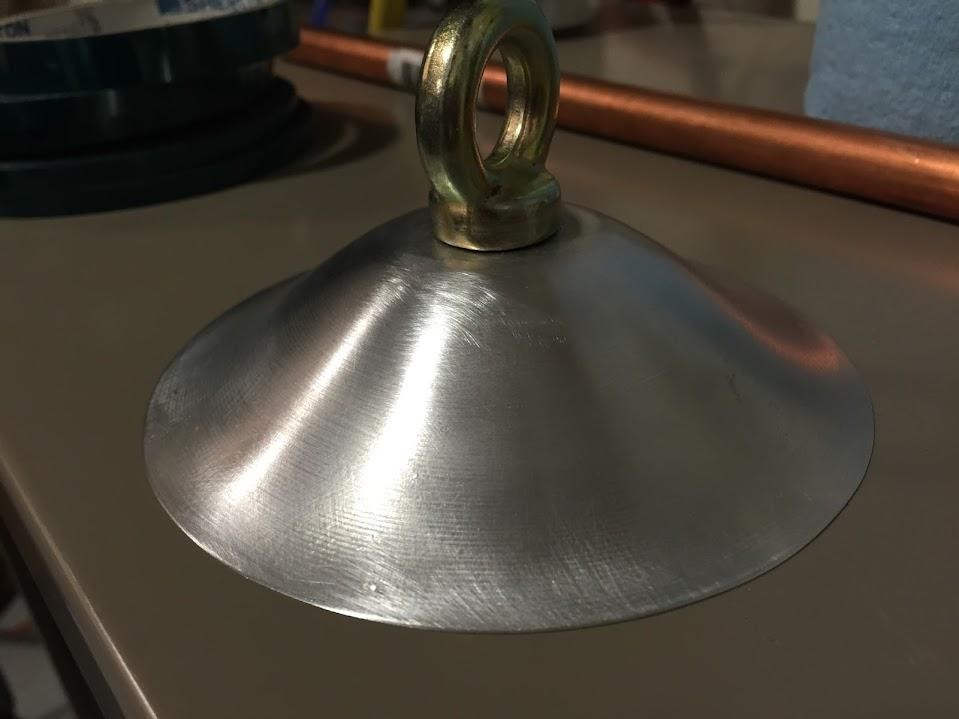
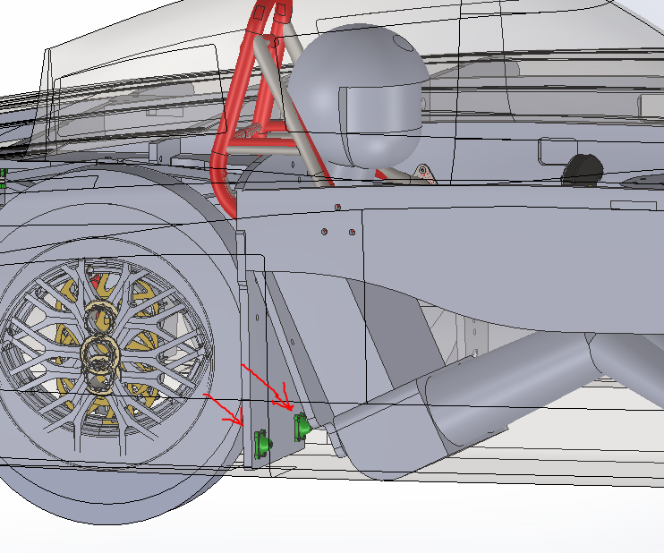

# seat-belt

## SSCP - Seat Belt

## Seat Belt

Overview

Sunwhale Seat Belt configuration is tethered at 5 locations - one between the driver's crotch, two behind the driver on the lateral suspension bulkhead, and two looped on the rollcage at driver shoulder level.&#x20;

Crotch seat belt mount&#x20;

The crotch seat belt mount is a further refinement of Luminos crotch seat belt mount. Luminos seat belt mount was added to the car as a separate wet layup after the main layups were complete. Sunwhale crotch seat belt mount is laid into the carbon during the bottom shell layups. The stack up from bottom to top is 2 layers carbon fiber, 3/8in core, 1 layer carbon fiber, seat belt mount, 1 layer carbon fiber, additional layers of carbon fiber.&#x20;

The key to mounting an aluminum hardpoint inside of the carbon layup is to maximize adhesion surface area and eliminate sharp drop offs. As seen in the picture, the edges of the part are very gradually tapered to meet the carbon. Research done by Greg in the Luminos cycle found that sharp drop offs are prone to breaking through the carbon locally. The maximum diameter of this part is just below 5 inches. After machining, the part is threaded with 7/16 - 20 NF for the seat belt eye bolt, sandblasted, surface prepped with AC-130, then wrapped in film adhesive and laid into the carbon.&#x20;

Mounting the lower seat belt hardpoints in pull

Mounting to a panel is pull is weaker than mounting to a panel in shear, but for Sunwhale we decided the lower seat belt mounts are sufficiently strong in pull. The reasoning is as follows:

Force on seatbelt in maximum deceleration:

80kg \* 9.8 m/s^2 \* 46G (Driver mass decelerating at 46G) = 36064N

46G deceleration is the record acceleration a human has been tested for, undergone by John Stapp during the Sonic Wind 1 rocket sled tests of the US Air Force in 1954. He suffered lifelong vision damage from this test. General sources advise internal injury / death around 25G.&#x20;

36064N force is distributed between the top shoulder harness and bottom seatbelt hardpoints: 36064N / 2 = 18032N

There are 4 clickbond inserts per bottom hardpoint (two bottom hardpoints total), so the 18032N is divided between 8 clickbond inserts.&#x20;

Each clickbond insert is subjected to 18032N/8 = 2254N

Testing done in the Xenith cycle by NHS and Greg resulted in a failure force of 4448N (1 Kilo Pound Force) per insert. (Anna T and Jamie we will verify this test with current panel and clickbond insert in the geology lab).

4448N/ 2254N gives a safety factor of 1.973.&#x20;

It is also necessary to consider where the pull force is being applied on the panel. A force in the middle of a large panel subjects it to a beam bending loading condition. In our mounting configuration, the hardpoints are within one inch of the edge of the panel subjected in pull, and the panel subjected to pull is glued along all its edges to the bottom shell of the car.&#x20;

&#x20;

