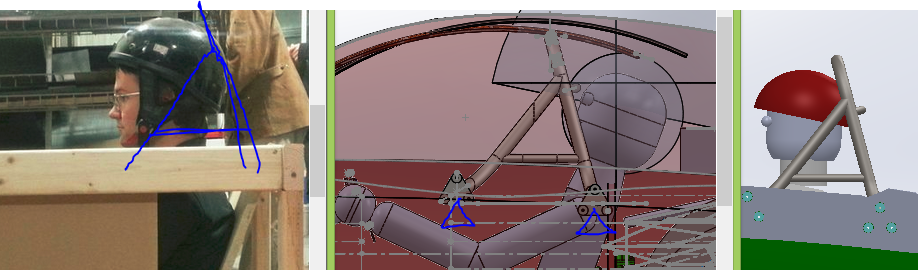
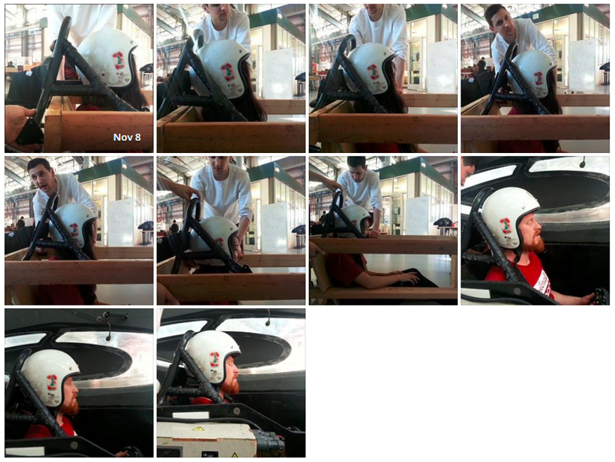

# sunwhale-2014-2015-roll-cage

## SSCP - Sunwhale 2014-2015 Roll Cage

## Sunwhale 2014-2015 Roll Cage

Update on Roll Cage: 12/31/14

Rotate back mounts 60 degrees. Shown in Sunwhale-033.

Weld jig started (in PDM). Waiting to get FEA results to confirm.

&#x20;

Jason Law on roll cage design.&#x20;

Put something together to just show where current crossmember is in relation to driver with Roll Bar attachment points. Noted a few issues and options with current location of crossmembers. Also noted driver safety and potential plans to make it better.

I know that the current chassis can be changed, just wanted to bring it up a few points as is.

See attached Powerpoint.&#x20;

Hey Jason,&#x20;

Thanks for working on the cage so far! Recently we've gotten more information that makes the problem much better defined for you. Can you start working on this new rollcage? Let's make it luminos style with 2 mounts on each left/right side of the driver. Luminos cage top half will basically work, but it needs some edits to the mount points.

Pictures explained: Rightmost is cage in luminos and how it relates to driver head. Middle picture shows how we would mount this in our car- note that all of the hardpoints are in the main driver bucket and nothing needs to be behind that latitudinal wheel bulkhead. This will make things much easier for you- you don't have to worry about suspension interference. You can also now mount to the outboard side of the car, as we will put a chassis panel there on the outside of the driver.

The picture in the middle makes it look like the rollcage mounted completely in the driver bucket is too far forward, but it's actually in the correct position. Natural seating position has the driver's head vertical, not slanted, so reference the leftmost picture for how a driver would actually sit. The driver model is off, so disregard it and only use it to center the rollcage in the front-on view.&#x20;

What you need to do:

* Cut off and isolate the luminos rollcage CAD above the hardpoints (or emulate the cad if you want) because it's been FEA tested and is known to fit a head well. Extend the tubes going to the hardpoints so they go lower into the car. (shown in blue triangles)Adjust the tube mount spacings laterally so that the rollcage accomodates a centered driver (explained in next picture)
* Cut off and isolate the luminos rollcage CAD above the hardpoints (or emulate the cad if you want) because it's been FEA tested and is known to fit a head well.&#x20;
* Extend the tubes going to the hardpoints so they go lower into the car. (shown in blue triangles)
* Adjust the tube mount spacings laterally so that the rollcage accomodates a centered driver (explained in next picture)
* Cut off and isolate the luminos rollcage CAD above the hardpoints (or emulate the cad if you want) because it's been FEA tested and is known to fit a head well.&#x20;
* Extend the tubes going to the hardpoints so they go lower into the car. (shown in blue triangles)
* Adjust the tube mount spacings laterally so that the rollcage accomodates a centered driver (explained in next picture)

Cut off and isolate the luminos rollcage CAD above the hardpoints (or emulate the cad if you want) because it's been FEA tested and is known to fit a head well.&#x20;

Extend the tubes going to the hardpoints so they go lower into the car. (shown in blue triangles)

Adjust the tube mount spacings laterally so that the rollcage accomodates a centered driver (explained in next picture)

Let me know if you have any questions and I'd be happy to chat about this on Monday.&#x20;

Roll Cage fit issues after delivery

#### Embedded Google Drive File

Google Drive File: [Embedded Content](https://drive.google.com/embeddedfolderview?id=1zW2_SCRCRwMa0J6inSfIsCE_djUsASJ6#list)
