# sunwhale-door

## SSCP - Sunwhale Door

## Sunwhale Door

Description

* what are the dimensions of the door, i.e. placement and size
* how does the door open/close (linkage/hinge design)
* mounting hardware
* other hardware considerations, e.g. gas springs
* manufacturing&#x20;

Files on PDM

Main Part Files

* Sunwhale-040-witharray-withscribes-SunwhaleDoor (door with both door and body axes defined, partial model of the thickness of inner door to body seam)
* real\_link (link, named as such because I had a dummy link before)
* luminos-door-hardpoint (hardpoint taken off of the Luminos door assembly, for reference)
* Sunwhale-040-doorless-thickseam (doorless surface with roughly modeled seam based on Luminos for inner door/body interface)

Assembly Files

* Sunwhale-040-doorassy (door + linkage)
* Sunwhale-040-seamcheck-assy (just has door/surface to quickly check seam interference, esp because I started breaking assemblies every other day...)
* Sunwhale-040-full\_assy-withdoor (Sunwhale-040-full\_assy with doorassy, added Luminos hardpoints as placeholders)

Notes

2/1/2015

Spent a while over the last few days moving everything over to the correct CAD files and coming up with a better system to iterate over different geometries. My current test assemblies are on PDM and described above. A lot of these changes are purely organizational but has honestly saved me a few hours because there are fewer opportunities to break mates left right and center every time I do things. (Thanks for the advice, Darren!)

In any case, once I got that, playing with the geometry got a little less arbitrary. I started with the geometry I came to at the end of 1/27, which was a much smaller linkage than the one on 1/24. Aside from the fundamental goals of clearing the rollcage and door/body seam, my main goals for this round were to model the seam more accurately and clear that, minimize the distance between the door and the body at ending position, and to make the linkage smaller and manufacturable (e.g. minimize number of bends).&#x20;

I know these screenshots aren't very clear since they're zoomed in to get the dimensions, but the grey is the door, and the turquoise is the body. This is looking along the right plane with the car on its side like this:

This is the distance above the car at the highest point of the car (i.e. at the worst section)

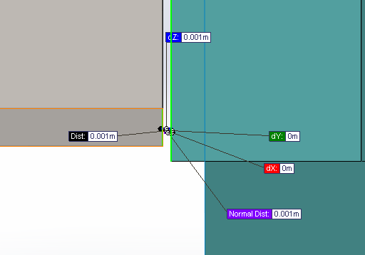

&#x20;

This is how much interference there is at the seam...which could be bondo/sandable?&#x20;

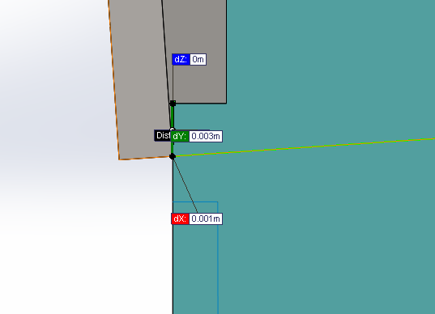

I was also able to move the door connection point closer to the rotation axis, which resulted in a linkage that looks like this, pictured in the car for scale.&#x20;

&#x20;&#x20;

Geometry looks more okay now, or at least is better understood. Here are some other things I was looking into/working on/should discuss:

* How to construct link (waterjet carbon that gets sent out with chassis panels? carbon rods with aluminum brackets?)
* How to mount link to door (glue?) and to chassis panels (use cam follower?)
* Are mounts/link going to be strong enough? do I need to design more robust inserts? (right now I have the hardpoints from Luminos in the main assembly as placeholders, which use the clickbond inserts)
* Gas spring integration

1/27/2015

Finally updated to the full Sunwhale-040 CAD with rollcage and checked clearances with a 0.01m surface offset on the bubble. Looks something like

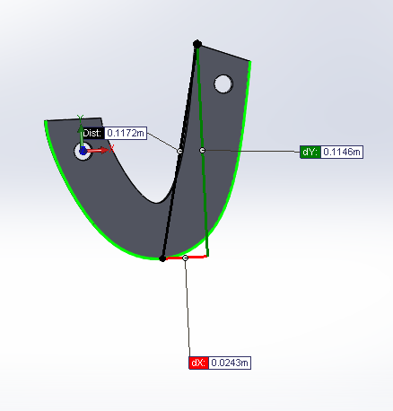

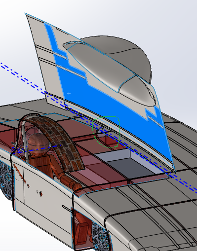

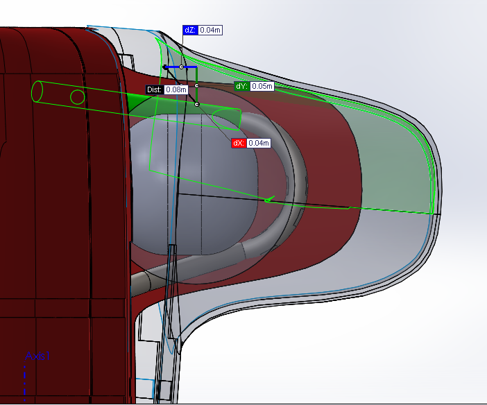

1/24/2015

Made a more 'realistic' link with the last geometry I had. The link footprint is 0.340mx0.190m, which takes up a ton of space. Working on making it work with a smaller footprint.

\*\* note to self: need to check whether it's mountable to chassis panels too

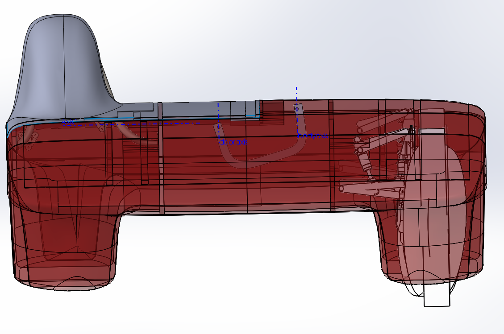

1/23/2015

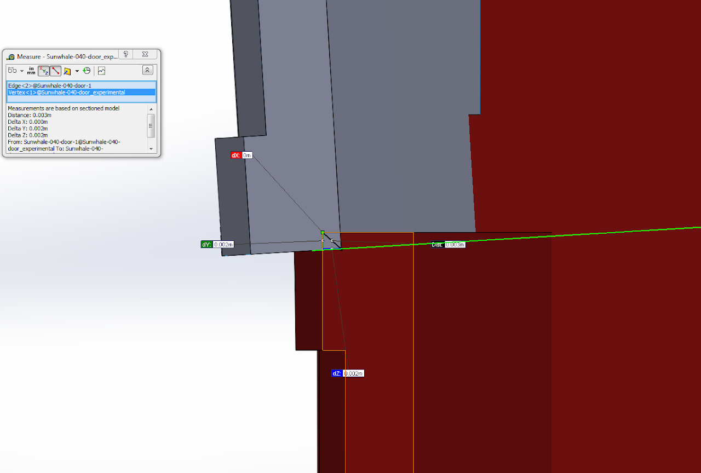

Was worried about overlap here, but this is within sandable range.&#x20;

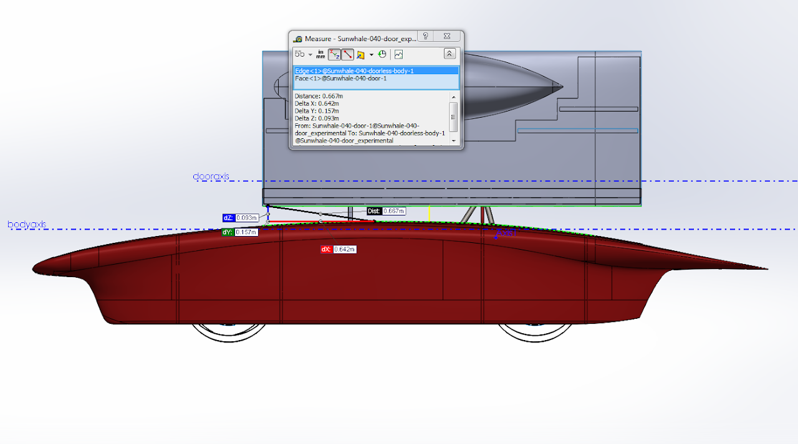

The door ends up \~0.095m above the car, which is still kind of far. Now focusing on finding a hinge configuration that minimizes this, and has an actual linkage design.&#x20;

Determined a while ago that door axis should be lower than body axis to allow for initial away-from-body movement, but the ratio of how much lower to move the axis to how much away motion there is like 9:1. Thus debating how worth it having such a configuration would be.&#x20;

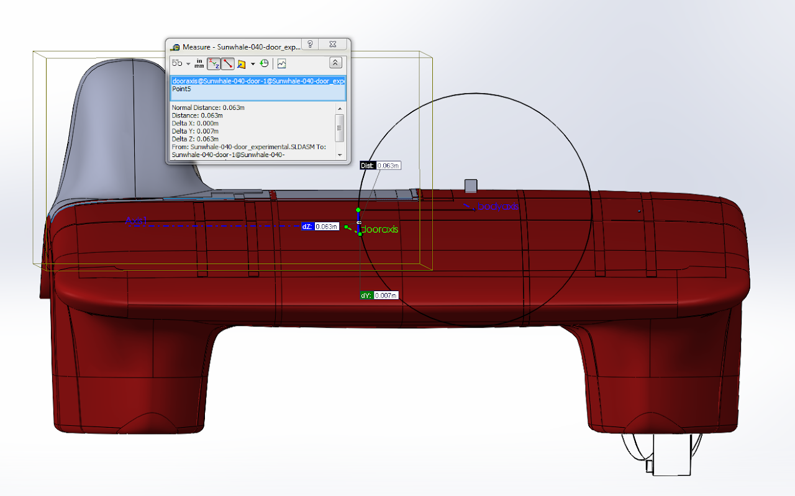

1/17/2015

Progress over the last month: updated files to Sunwhale-040, and am currently (more systematically) acquainting myself with the geometric constraints in the system to get an intuition on where axes of rotation should be. Files are currently on FTP (Sunwhale/testing/door/40) because I haven't figured out PDM. Also noting here that rollcage currently juts out of the bubble...

12/10/2014

Door cutout clears roll cage and side of car for sunwhale-036 with a simple hinge, i.e. an L-bracket as shown below. also took rough dimensions of luminos's gas springs and put them in sunwhale-034 to see how they fit with chassis and it seems doable.&#x20;

12/3/2014

Checking to see if a simple hinge is feasible using model for Sunwhale-034. Got pretty close but the corner still catches (first image) but the door clears array at stopped position.&#x20;

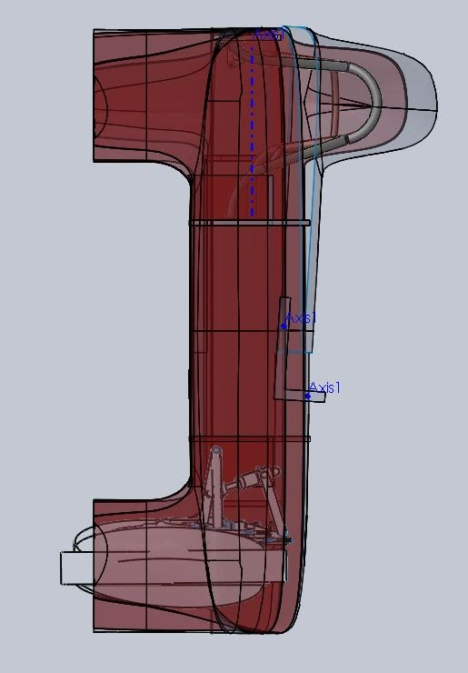

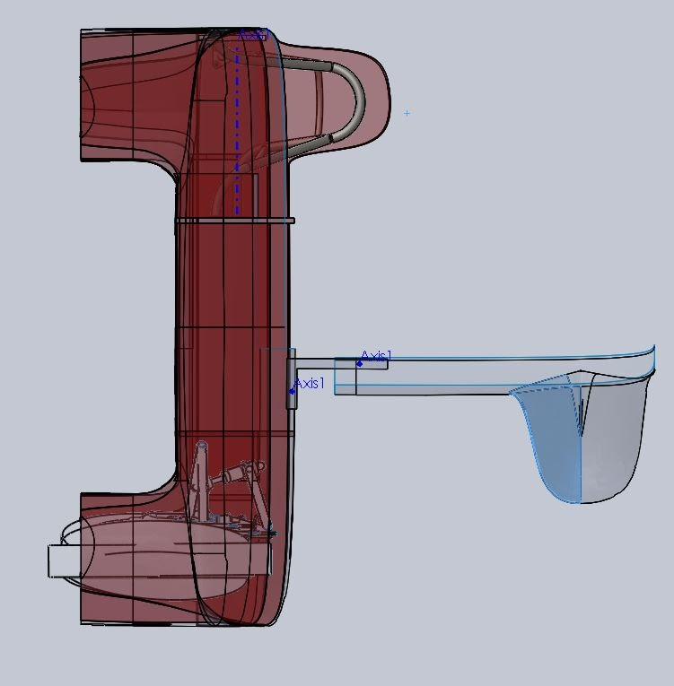

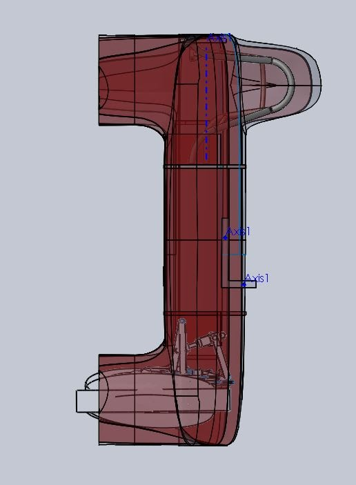

Needs to be updated for actual array dimensions.&#x20;

11/24/2014&#x20;

Current proposal for door cutout location -- pretty much just defined by location of array modules.&#x20;

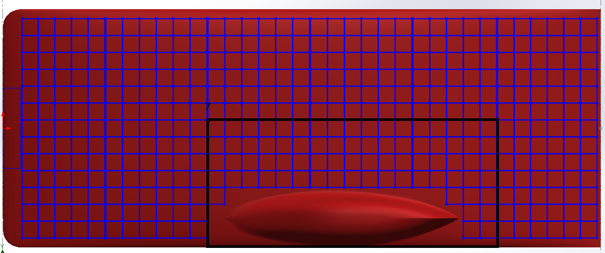

Cutout based on dimensions from the array layout sketch on Sunwhale-031, pictured above, is up on PDM under car assembly folder. The outer edge is tangent to the bubble for now, and the other long edge was approximated since it seems that not all the modules were dimensioned out in the sketch. I will see how this fits around the roll cage and if electronics are accessible when another full assembly comes out or I'll just use sunwhale-031 assembly tomorrow.&#x20;

11/5/2014

Things to pay attention to

* door movement such that it clears roll cage and back edge sits above rest of car in end position
* account for overlap lip for scribe lines on aerobody
* how to mount linkages/hinges
