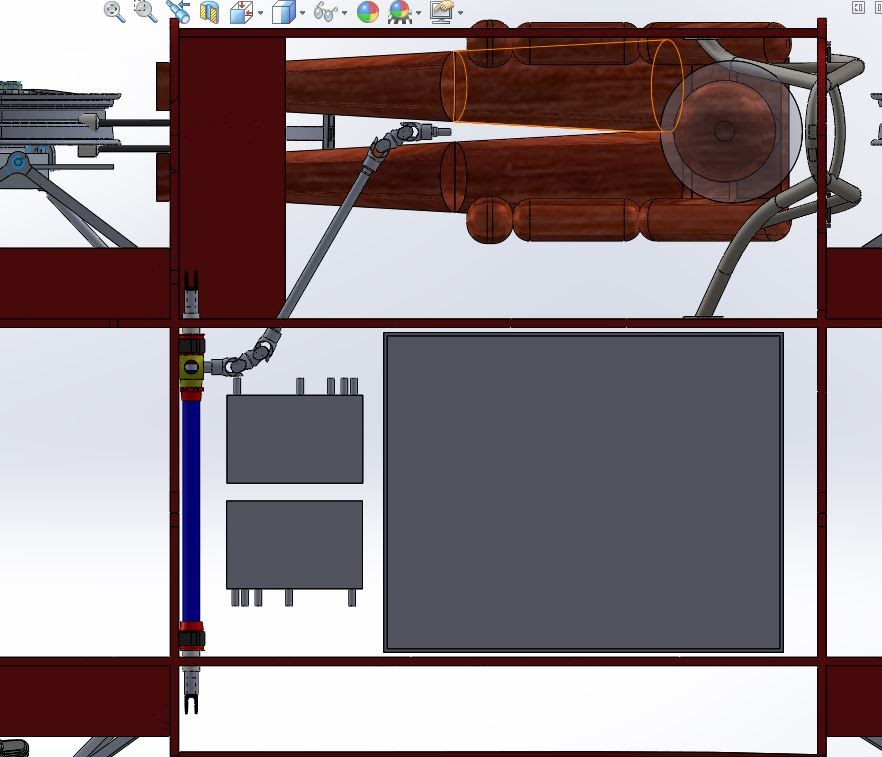
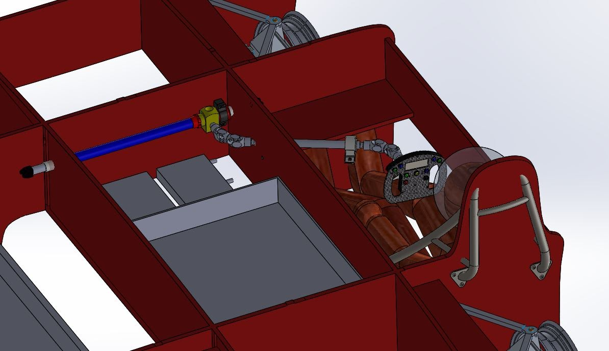
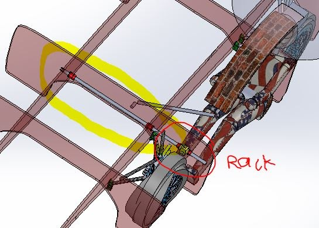
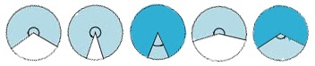
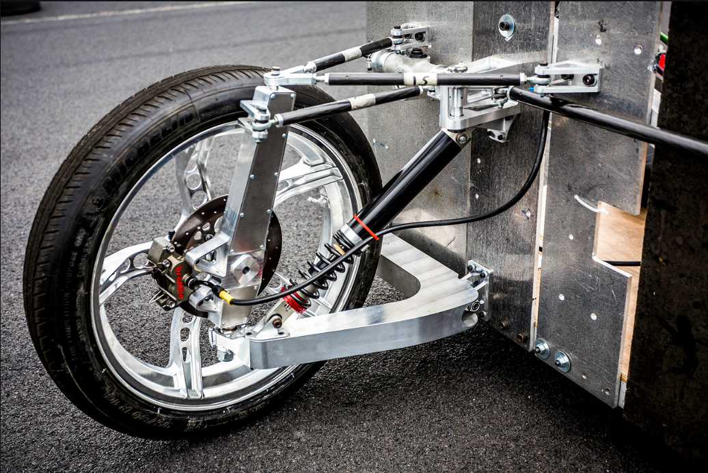

# SSCP - Sunwhale Steering Rack

# Sunwhale Steering Rack

### Embedded Content

Embedded content: [Embedded Content]()

<iframe width="100%" height="400" src="" frameborder="0"></iframe>

CURRENT STUFF:

Woodward FSAE Rack (See attached: MA101-9-SU4.JPG)

Maximum Rack Travel (lock-to-lock): 133.6 mm

Luminos Rack Travel (lock-to-lock): 88.06 mm

Asymmetric Steering Configuration (double u-joints, let's call them DUJTs for fun)

For one configuration (for our purposes):

* Woodward double u-joints (Double UJT, 2.18" CTRS): Part# UAD1-20201 -- 2 items
* Weld-on stubs (Splined Inserts, .120 wall): Part# ST201A -- 3 itemsSpline diam: 0.75 in (measured 0.748 in)Stub diam: 0.50 in (measured 0.51 in)
* Spline diam: 0.75 in (measured 0.748 in)Stub diam: 0.50 in (measured 0.51 in)
* Spline diam: 0.75 in (measured 0.748 in)
* Stub diam: 0.50 in (measured 0.51 in)

Woodward double u-joints (Double UJT, 2.18" CTRS): Part# UAD1-20201 -- 2 items

Weld-on stubs (Splined Inserts, .120 wall): Part# ST201A -- 3 items

* Spline diam: 0.75 in (measured 0.748 in)Stub diam: 0.50 in (measured 0.51 in)
* Spline diam: 0.75 in (measured 0.748 in)
* Stub diam: 0.50 in (measured 0.51 in)

* Spline diam: 0.75 in (measured 0.748 in)
* Stub diam: 0.50 in (measured 0.51 in)

Spline diam: 0.75 in (measured 0.748 in)

Stub diam: 0.50 in (measured 0.51 in)

How2doubleU:

1. Support: Unlike regular u-joints, which only need to be secured at the rack and at the steering/driver shaft (NOT the intermediate shaft), DUJTs need to be secured at two points along the intermediate shaft, along with at the rack and steering/driver shaft. This is because DUJTs like to floppy floppy around.Pillow Block BearingsFlange Mounted Bearings
2. Pillow Block Bearings
3. Flange Mounted Bearings
4. Phase: When installing two u-joints, you need to make sure that they are in phase with one another. DUJTs are always manufactured to be in phase, though. (See what "in phase" means -- watch the whole 

Support: Unlike regular u-joints, which only need to be secured at the rack and at the steering/driver shaft (NOT the intermediate shaft), DUJTs need to be secured at two points along the intermediate shaft, along with at the rack and steering/driver shaft. This is because DUJTs like to floppy floppy around.

1. Pillow Block Bearings
2. Flange Mounted Bearings

Pillow Block Bearings

Flange Mounted Bearings

Phase: When installing two u-joints, you need to make sure that they are in phase with one another. DUJTs are always manufactured to be in phase, though. (See what "in phase" means -- watch the whole 

* "Study of double Cardan universal joint" series: https://www.youtube.com/watch?v=gBoJT_Pl-RA)Angles: The "Study of double Cardan universal joint" series also talks about how you can and can't angle a DUJT. The series says for some reason that you can angle a DUJT at 90 degrees, but this is WRONG. DUJTs have a maximum total angle of 70 degrees, at which angle the DUJT will not operate and will intersect with itself. There are TWO angles in a DUJT, since there are three pieces that angle with respect to one another. This equates to two angles of 35 degrees each. Safe operating angles are cited at ~33 degrees each, for a total of ~66 degrees. Our configuration is at 60 degrees per DUJT.
* "Study of double Cardan universal joint" series: https://www.youtube.com/watch?v=gBoJT_Pl-RA)
* Angles: The "Study of double Cardan universal joint" series also talks about how you can and can't angle a DUJT. The series says for some reason that you can angle a DUJT at 90 degrees, but this is WRONG. DUJTs have a maximum total angle of 70 degrees, at which angle the DUJT will not operate and will intersect with itself. There are TWO angles in a DUJT, since there are three pieces that angle with respect to one another. This equates to two angles of 35 degrees each. Safe operating angles are cited at ~33 degrees each, for a total of ~66 degrees. Our configuration is at 60 degrees per DUJT.

1. "Study of double Cardan universal joint" series: https://www.youtube.com/watch?v=gBoJT_Pl-RA)
2. Angles: The "Study of double Cardan universal joint" series also talks about how you can and can't angle a DUJT. The series says for some reason that you can angle a DUJT at 90 degrees, but this is WRONG. DUJTs have a maximum total angle of 70 degrees, at which angle the DUJT will not operate and will intersect with itself. There are TWO angles in a DUJT, since there are three pieces that angle with respect to one another. This equates to two angles of 35 degrees each. Safe operating angles are cited at ~33 degrees each, for a total of ~66 degrees. Our configuration is at 60 degrees per DUJT.

"Study of double Cardan universal joint" series: https://www.youtube.com/watch?v=gBoJT_Pl-RA)

Angles: The "Study of double Cardan universal joint" series also talks about how you can and can't angle a DUJT. The series says for some reason that you can angle a DUJT at 90 degrees, but this is WRONG. DUJTs have a maximum total angle of 70 degrees, at which angle the DUJT will not operate and will intersect with itself. There are TWO angles in a DUJT, since there are three pieces that angle with respect to one another. This equates to two angles of 35 degrees each. Safe operating angles are cited at ~33 degrees each, for a total of ~66 degrees. Our configuration is at 60 degrees per DUJT.

How2config:

The rack comes with a spline extending from the rack (see CAD). The order goes: Rack --> Spline --> DUJT #1 --> Spline --> (weld) --> Intermediate Shaft (steel tube) --> (weld) --> Spline --> DUJT #2 --> Spline --> Steering/Driver Shaft --> Steering Wheel

OLD STUFF:

Steering Shaft Configuration Options

An asymmetrical steering shaft configuration usually uses u-joints to transfer rotation from the steering wheel to the pinion. U-joints have a maximum angle of 32-35 degrees.

Our steering rack must be placed behind the front wheels of the car in order for the suspension to work. This puts the rack quite close to the driver and leaves little room for the asymmetrical configuration. With only 32 degrees of rotation, u-joints do not provide a compact enough solution. Double u-joints could have potential since they have a maximum angle of 70 degrees.

Thinking Outside the Box

Another option is to have a very tiny rack (with its length equal to the amount of rack travel plus length of essential components) and position it above the driver's feet. The side of the rack closest to the side of the car would be attached to nothing. The other side would be attached to a rod with tabs. The tie rods would attach to these tabs so, from the perspective of the suspension, the rod would be the rack.

The rod would be threaded into the end of the rack and would need a pin inserted to keep it from rotating.

The rod could also be welded to the steering rack -- we would need to assemble and disassemble the rack for this.

Sunwhale-030 in the Assembled Cars folder in PDM includes a model of this configuration.

The rack will likely have to be positioned behind the bulkhead rather than in front of it (as shown above) due to the suspension's rack location requirement. This means cutting holes in the chassis so that the tie rods can reach the rack and also have room for movement. Probably messy, driver could get rained on, etc.

U-joints: 32-35 degrees (70 degrees for double u-joints)

http://www.speedwaymotors.com/Shop/Street-Rod-Steering-Shaft-U-Joints-and-Couplers/16-15.html

Bevel Gearboxes: 90 degree rotation (77 degrees in some cases)

Bevel gearboxes (or miter boxes) provide 90 degrees of rotation, which is very compact. We'd need two gearboxes (similar to u-joint configuration) and they would have to be mounted to the chassis. This is a gear driven intermediate and could introduce lash, however.

The Formula Seven bevel gears are the most expensive option but are probably the best (under this category) since they are small and lightweight and built for our type of application. The other options are either not but into a box or made for heavy duty applications. Buying bevel gears and assembling them ourselves is NOT a good option, and it's better to just turn money into steering (see: F7).

Turning money into steering:

Formula Seven: http://www.formula-seven.com/shop-products/bevel-gears-steering-system/

There aren't many bevel gearboxes available that are made for steering, and much less for our specific application. Just to prove how terrible the other choices are (and that we did do a search), here they are:

TEA: https://www.tea.net.au/ProductCategoryModules/Products.aspx?cid=80&cat=Gears%20&%20Racks

ZF Lenksysteme: http://www.zf-lenksysteme.com/en/products/cv-steering-accessories/bevel-gearboxes.html

HEMA ENDÜSTRI: http://www.hemaendustri.com/ProductDetail.aspx?ID=7&ProductId=42

SDP: http://www.sdp-si.com/estore/coverpg/right_angle_drives.htm

Constant-Velocity Joint: 68 degree rotation

Cool but too heavy-duty for our application.

http://www.nexteer.com/technology/steering/steering-columns/intermediate-shafts/

Steer Clear Joint: 90 degree rotation

Probably heavy, seems to use some sort of belt.

http://www.wizardsteerclear.com/

Forum Help:

http://www.fsae.com/forums/archive/index.php/t-3969.html?s=2f4ac3793225a1cc9fb6f05198249449

Steering Rack Options

Note that all of the steering racks listed in the following table are used in FSAE.

### Embedded Content

Embedded content: [Custom embed]()

<iframe width="100%" height="400" src="" frameborder="0"></iframe>

Disclaimer: Susan wrote down things from data sheets and specs that seemed vaguely relevant, so input on what to look for, inquire about, compare, etc. is appreciated.

Update -- Monday, August 25, 2014

Since Aravind has decided on a double A-arm suspension, we are going with the Woodward FSAE rack (highlighted). Darren gave an estimated value of 23 inches from mount to mount. Rachel Abril has inquired about rack parameters:

1. Mounting center distance - about 23 inches, but this value may vary slightly and can also be adjusted if necessary.
2. Total rack travel required L to R - similar to the rack travel in the Luminos drawing.
3. Ratio (rack travel per revolution) - similar to the ratio in the Luminos drawing.
4. Pinion location relative to center - while we have not decided which side of the car we will be driving from, we want the pinion location to be as far to one side as is reasonable.
5. Front or rear steer (i.e. whether the rack is to be located ahead of or behind the front wheels) - rear steer

Mounting center distance - about 23 inches, but this value may vary slightly and can also be adjusted if necessary.

Total rack travel required L to R - similar to the rack travel in the Luminos drawing.

Ratio (rack travel per revolution) - similar to the ratio in the Luminos drawing.

Pinion location relative to center - while we have not decided which side of the car we will be driving from, we want the pinion location to be as far to one side as is reasonable.

Front or rear steer (i.e. whether the rack is to be located ahead of or behind the front wheels) - rear steer

Update -- Monday, July 21, 2014

* Current ContendersKaz TechnologiesPRO: lightweight, quality steering rack under a name we trust; has easy mounting option; generous rack travel.CON: This is a race rack and is built to be jumpy - keeping in mind that Luminos' Woodward rack had ~480 degrees of pinion rotation and ~2.5 inches of rack travel, the Kaz rack has only 246 degrees of pinion rotation with 3.25 inches of rack travel. This means that, for a certain amount of steering wheel rotation, the amount of travel will increase significantly, decreasing the amount of fine control the driver will have on the car.Formula SevenPRO: very lightweight, quality steering rack; option of high amount of pinion rotation.CON: Unsure about mounting options.MilteraPRO: ultra lightweight, quality steering rack; mounting option.CON: Similar to the Kaz rack, this is also a race rack and has even lower pinion rotation; this rack is extremely expensive and we may be paying for its unnecessarily light weight (for our application).Woodward FSAEPRO: quality, reliable steering rack used on both Luminos and Xenith; can customize many characteristics, including rack travel, length, and pinion rotation.CON: Heaviest rack of these four (~5-6 lbs); may be overkill if we go with a leading arm suspension design instead of the classic A arm design (see explanation below).
* Kaz TechnologiesPRO: lightweight, quality steering rack under a name we trust; has easy mounting option; generous rack travel.CON: This is a race rack and is built to be jumpy - keeping in mind that Luminos' Woodward rack had ~480 degrees of pinion rotation and ~2.5 inches of rack travel, the Kaz rack has only 246 degrees of pinion rotation with 3.25 inches of rack travel. This means that, for a certain amount of steering wheel rotation, the amount of travel will increase significantly, decreasing the amount of fine control the driver will have on the car.
* PRO: lightweight, quality steering rack under a name we trust; has easy mounting option; generous rack travel.
* CON: This is a race rack and is built to be jumpy - keeping in mind that Luminos' Woodward rack had ~480 degrees of pinion rotation and ~2.5 inches of rack travel, the Kaz rack has only 246 degrees of pinion rotation with 3.25 inches of rack travel. This means that, for a certain amount of steering wheel rotation, the amount of travel will increase significantly, decreasing the amount of fine control the driver will have on the car.
* Formula SevenPRO: very lightweight, quality steering rack; option of high amount of pinion rotation.CON: Unsure about mounting options.
* PRO: very lightweight, quality steering rack; option of high amount of pinion rotation.
* CON: Unsure about mounting options.
* MilteraPRO: ultra lightweight, quality steering rack; mounting option.CON: Similar to the Kaz rack, this is also a race rack and has even lower pinion rotation; this rack is extremely expensive and we may be paying for its unnecessarily light weight (for our application).
* PRO: ultra lightweight, quality steering rack; mounting option.
* CON: Similar to the Kaz rack, this is also a race rack and has even lower pinion rotation; this rack is extremely expensive and we may be paying for its unnecessarily light weight (for our application).
* Woodward FSAEPRO: quality, reliable steering rack used on both Luminos and Xenith; can customize many characteristics, including rack travel, length, and pinion rotation.CON: Heaviest rack of these four (~5-6 lbs); may be overkill if we go with a leading arm suspension design instead of the classic A arm design (see explanation below).
* PRO: quality, reliable steering rack used on both Luminos and Xenith; can customize many characteristics, including rack travel, length, and pinion rotation.
* CON: Heaviest rack of these four (~5-6 lbs); may be overkill if we go with a leading arm suspension design instead of the classic A arm design (see explanation below).

Current Contenders

* Kaz TechnologiesPRO: lightweight, quality steering rack under a name we trust; has easy mounting option; generous rack travel.CON: This is a race rack and is built to be jumpy - keeping in mind that Luminos' Woodward rack had ~480 degrees of pinion rotation and ~2.5 inches of rack travel, the Kaz rack has only 246 degrees of pinion rotation with 3.25 inches of rack travel. This means that, for a certain amount of steering wheel rotation, the amount of travel will increase significantly, decreasing the amount of fine control the driver will have on the car.
* PRO: lightweight, quality steering rack under a name we trust; has easy mounting option; generous rack travel.
* CON: This is a race rack and is built to be jumpy - keeping in mind that Luminos' Woodward rack had ~480 degrees of pinion rotation and ~2.5 inches of rack travel, the Kaz rack has only 246 degrees of pinion rotation with 3.25 inches of rack travel. This means that, for a certain amount of steering wheel rotation, the amount of travel will increase significantly, decreasing the amount of fine control the driver will have on the car.
* Formula SevenPRO: very lightweight, quality steering rack; option of high amount of pinion rotation.CON: Unsure about mounting options.
* PRO: very lightweight, quality steering rack; option of high amount of pinion rotation.
* CON: Unsure about mounting options.
* MilteraPRO: ultra lightweight, quality steering rack; mounting option.CON: Similar to the Kaz rack, this is also a race rack and has even lower pinion rotation; this rack is extremely expensive and we may be paying for its unnecessarily light weight (for our application).
* PRO: ultra lightweight, quality steering rack; mounting option.
* CON: Similar to the Kaz rack, this is also a race rack and has even lower pinion rotation; this rack is extremely expensive and we may be paying for its unnecessarily light weight (for our application).
* Woodward FSAEPRO: quality, reliable steering rack used on both Luminos and Xenith; can customize many characteristics, including rack travel, length, and pinion rotation.CON: Heaviest rack of these four (~5-6 lbs); may be overkill if we go with a leading arm suspension design instead of the classic A arm design (see explanation below).
* PRO: quality, reliable steering rack used on both Luminos and Xenith; can customize many characteristics, including rack travel, length, and pinion rotation.
* CON: Heaviest rack of these four (~5-6 lbs); may be overkill if we go with a leading arm suspension design instead of the classic A arm design (see explanation below).

Kaz Technologies

* PRO: lightweight, quality steering rack under a name we trust; has easy mounting option; generous rack travel.
* CON: This is a race rack and is built to be jumpy - keeping in mind that Luminos' Woodward rack had ~480 degrees of pinion rotation and ~2.5 inches of rack travel, the Kaz rack has only 246 degrees of pinion rotation with 3.25 inches of rack travel. This means that, for a certain amount of steering wheel rotation, the amount of travel will increase significantly, decreasing the amount of fine control the driver will have on the car.

PRO: lightweight, quality steering rack under a name we trust; has easy mounting option; generous rack travel.

CON: This is a race rack and is built to be jumpy - keeping in mind that Luminos' Woodward rack had ~480 degrees of pinion rotation and ~2.5 inches of rack travel, the Kaz rack has only 246 degrees of pinion rotation with 3.25 inches of rack travel. This means that, for a certain amount of steering wheel rotation, the amount of travel will increase significantly, decreasing the amount of fine control the driver will have on the car.

Formula Seven

* PRO: very lightweight, quality steering rack; option of high amount of pinion rotation.
* CON: Unsure about mounting options.

PRO: very lightweight, quality steering rack; option of high amount of pinion rotation.

CON: Unsure about mounting options.

Miltera

* PRO: ultra lightweight, quality steering rack; mounting option.
* CON: Similar to the Kaz rack, this is also a race rack and has even lower pinion rotation; this rack is extremely expensive and we may be paying for its unnecessarily light weight (for our application).

PRO: ultra lightweight, quality steering rack; mounting option.

CON: Similar to the Kaz rack, this is also a race rack and has even lower pinion rotation; this rack is extremely expensive and we may be paying for its unnecessarily light weight (for our application).

Woodward FSAE

* PRO: quality, reliable steering rack used on both Luminos and Xenith; can customize many characteristics, including rack travel, length, and pinion rotation.
* CON: Heaviest rack of these four (~5-6 lbs); may be overkill if we go with a leading arm suspension design instead of the classic A arm design (see explanation below).

PRO: quality, reliable steering rack used on both Luminos and Xenith; can customize many characteristics, including rack travel, length, and pinion rotation.

CON: Heaviest rack of these four (~5-6 lbs); may be overkill if we go with a leading arm suspension design instead of the classic A arm design (see explanation below).

Visual Representation of Pinion Rotation

Left to Right: Kaz (246), F7 (324), F7 (406), Miltera (210), Woodward FSAE - Luminos (~480)

Suspension: Leading arm vs. A arm design

The choice of steering rack is likely dependent on whether a leading arm or A arm design is chosen. The leading arm design will have a linkage of some sort, so the Woodward rack may be too large, as well as overkill. The Woodward rack is really two parts in one - one part is the steering rack part, the gear system that converts rotary motion into linear travel; the other part is a set of linear bearings that allow the endpoints of the rack to take suspension forces and not flex.

If you look at the inside of Apogee, you'll notice that the steering rack and linear bearings are separate. (The rack used was a Desert Karts rack.) The linear bearings are attached to the carbon, which is not optimal - there are tolerance stack-up problems, and it's probably heavier than the integrated design. Since you have three points (the two ends and the gear) trying to constrain the shaft, then the assembly is hyperstatic (not desirable).

If we end up with a traditional car, we need the points on the end to take the suspension forces, so the integrated Woodward style rack makes sense. But if we end up with a leading arm design, then there might be a more complicated linkage that wouldn't need the end supports.*

*See Nuon's suspension for an example design.

### Embedded Google Drive File

Google Drive File: [Embedded Content](https://drive.google.com/embeddedfolderview?id=1bFO6DFA_MZvMxQgify3-ghj6ICncefRJ#list)

<iframe width="100%" height="400" src="https://drive.google.com/embeddedfolderview?id=1bFO6DFA_MZvMxQgify3-ghj6ICncefRJ#list" frameborder="0"></iframe>

