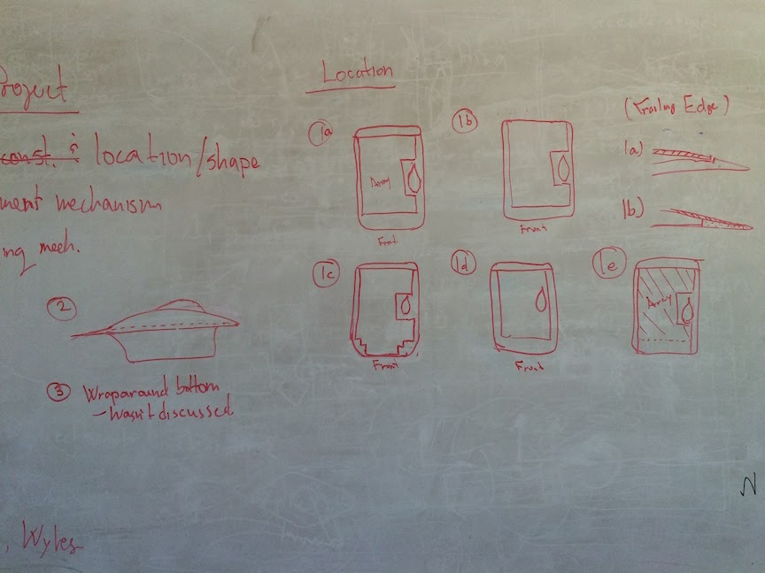
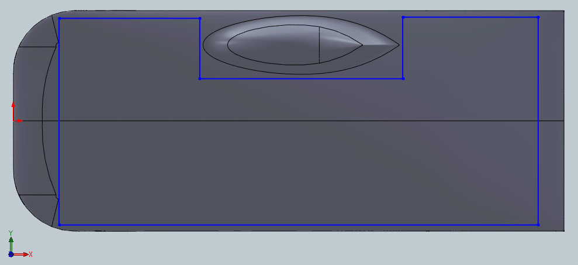
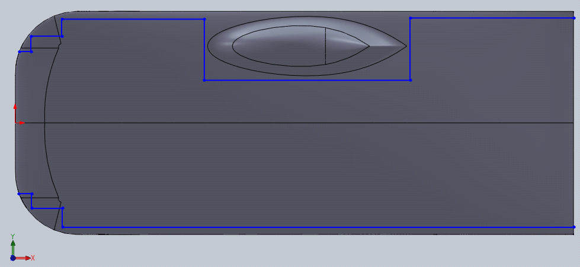
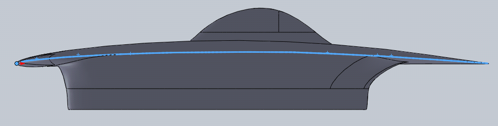
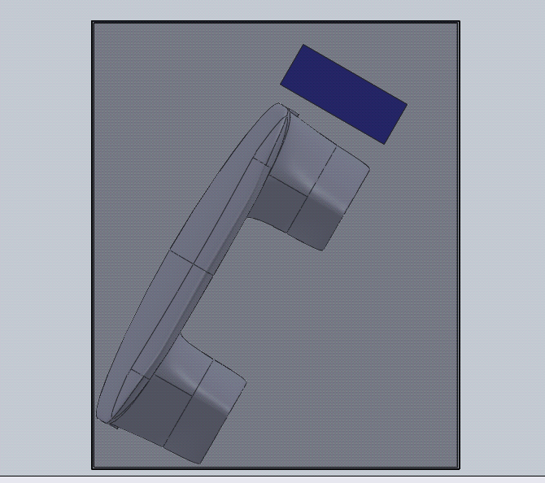
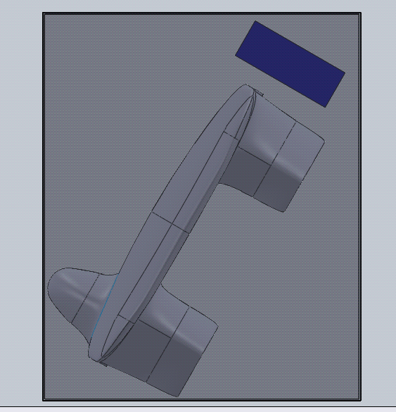
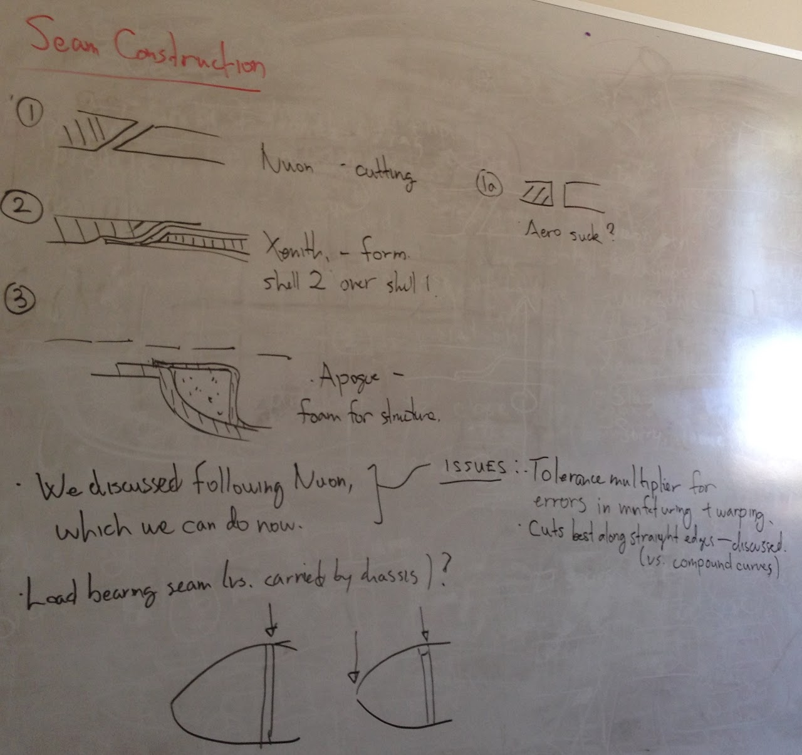
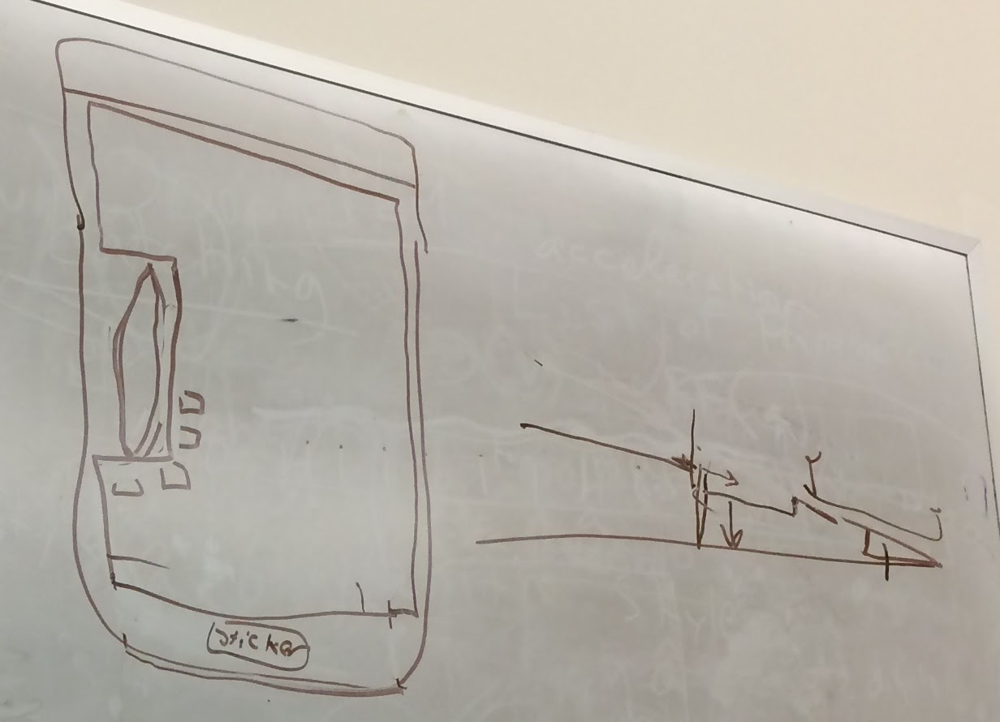

# SSCP - Top/Bottom Shell Interface

# Top/Bottom Shell Interface

Description

How do we manufacture the car such that the top and bottom shell meet at a strong, precise, and reliable interface?

* How to layup the car to maximize simplicity of construction without sacrificing reliability

* How to create the interface/seam between the top and bottom shells to be reliable over many cycles, resistant to warping, and minimally disruptive to aero.

* Process to manufacture such seam.

Notes

10-3-2014 (Charlie, Susan):

Contents of whiteboard from meeting:

Option 1a, Top view (front along array edge, rear offset from trailing edge). Cut along blue lines:

Option 1c, Top view (front at leading edge, rear at trailing edge):

Option 2 (front at leading edge, rear at trailing edge, sides e.g. where surface is tangent to vertical):

Does a monocoque and concentrators fit in the bounding box?

(Front view) With canopy taken off (presumably, placed in bottom right corner of box), using Sunwhale 021 and min. size of Large Arzon concentrators when deployed, at a possible location within the box. Array and concentrator at 30° from vertical to represent the greatest necessary angle during array standing (according to Max):

With canopy, for completenes:

Seam Construction:

9-29-2014 (notes from team meeting about topshell):

NHS Notes on interface methods:

    * Nuon method:

        - Layup the top and bottom halves

        - Glue them together permanently (as if making a monocoque)

        - Using an ultrasonic cutter, cut into the shell at an angle all the way around (why the angle, exactly?)

        - Strengthen the interface

        - Main issues: cutter is only good at making straight lines; it's like 30 feet of cutting; vulnerable to warping - an angled interface will compound the misalignment from warping

    * Minnesota method: Nuon method, but with a 5-axis waterjet

    * Xenith method:

        - Made bottom shell with beveled core 1/2 inch from edge. Diamond cut around to get the shape of the bottom shell. Then used FEP on top of the bevelled edge and carbon on top to try and conform to the shape. Problems: void in top shell carbon right where edge is; some texture in interface because of layup process, so warping will cause a large gap between bottom and top shell carbon (think about textured materials shifting so that the peaks coincide)

Results from team discussion on 9/29/14 (tentative design decisions):

    * Tentative YES to topshell ("array inset")

        - Cut along outline of array

            = Avoids complex curves - can just cut mostly straight along a relatively flat top surface

        - Front seam: either along leading edge or (mostly) flush with front edge of array

        - Rear interface:

            = Option 1: reinforce trailing edge with e.g. aluminum, have interface along trailing edge

            = Option 2: offset rear interface forward several inches, along top of car (i.e. rear of car wraps around to top). String lights and possibly several solar cells to the part of the top surface that remains part of the bottom shell.

    * Use a variant of Nuon method

        - Make a monocoque, then cut out the array inset

        - By cutting along array, can maintain straight edges

            = How to optimize seam position for maximum simplicity without sacrificing performance?

    * Why not use a monocoque?

        - Monocoque would not fit within the regulation bounding box during night/morning array standing

        - Hard to access inside of the car (battery, concentrators) especially since the body will be thin.

