# topshell-latching-and-alignment

## SSCP - Topshell Latching and Alignment

## Topshell Latching and Alignment

escription

How to latch the top shell to the bottom shell and the canopy/door to the rest of the body.

Point people: Charlie & Susan

Notes

10-4-2014 (Charlie, Susan meeting):

Alignment:&#x20;

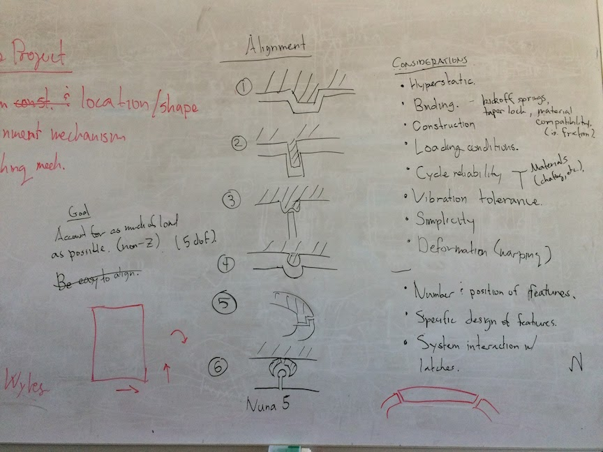

Latching + next steps:

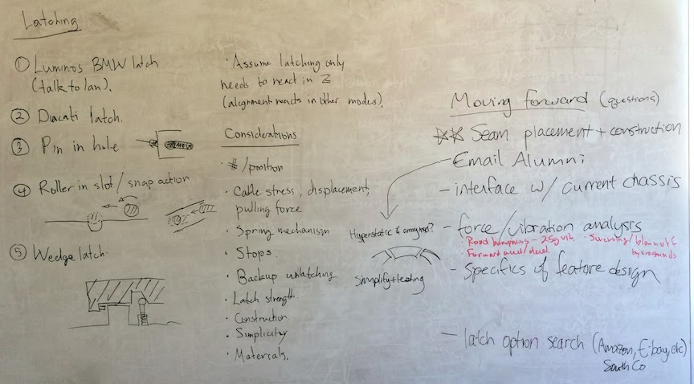

9-26-2014:

NHS visited the shop to talk to us about latches. Here's what he said:

* > 1 month to make/debug. Why?
* Not rigid enough
* Hyperstatic (too rigid or overconstrained)

e.g. making multiple holes to bolt a plate: better to make one precision for location, the others slots oriented with respect to the locator

* Complicated
* Backup way of manually undoing the latch in case of failure of primary mechanism (e.g. Apogee had access under fairing in case cable broke)
* Bad at vibration - NHS says design to 25Gs up/down vibration (aka 25x weight of topshell). Higher requirement than WSC rule. 25Gs is a GM rule.
* Difficult to close (for solar cars): so far, most people rely on weight of whatever is being latched to keep a good seal, but doesn’t always work.
* Need to handle many use cycles
* Latch philosophy: Have to be able to pull and keep closed, but able to release
* WE WANT:
* Rigid
* Also have to overcome the warping of carbon
* Not hyperstatic: account for every single degree of freedom
* Simple as possible
* Backup strategy
* Simulate for road shock/vibration
* Closure mechanism
* Cycle test: compatible materials; no wear from vibration; off the shelf parts normally have been tested
* Xenith
* top shell had titanium reinforcement molded into body where pins would be inserted
* Used spring pins? Plunger pins?
* AVOID:
* Taping seam on outside - bad for aero, possibly illegal

TASK 1: Alignment

&#x20;\- According to NASA: Best way to align two pieces held together orthogonal to surface is with cup-and-cone supports

* Top/bottom shell interface:

\= Where to put seam: top, bottom, middle

* Nuon/xenith (bottom): need positive draft mold, so need to layup half, then layup lip, then glue together to get top shell (3 layups)
* Apogee/luminos (middle): only 2 layups
* Aurora (top): their array was the topshell - no layup required, just a frame of carbon to make the shape. Light but super fragile. So not practical - just do same as nuon but inverted (3 layups)

\= The lip

* Nuon: makes a monocoque, then cuts the car at an angle, then makes a good interface - only 2 layups, fine ultrasonic cutting. Problem: these tools cut mostly straight lines, so tricky to cut the compound shapes of solar cars. Also vulnerable to warping: angles that warp just a little bit will make the seam really bad, so the effect of warping is compounded.
* Minnesota: five axis waterjet to cut the car - can make it perfect. But still the problem of the angled seam.
* Xenith: made bottom shell with beveled core 1/2 inch from edge. Diamond cut around to get the shape of the bottom shell. Then used FEP on top of the bevelled edge and carbon on top to try and conform to the shape. Problems: void in top shell carbon right where edge is; some texture in interface because of layup process, so warping will cause a large gap between bottom and top shell carbon (think about textured materials shifting so that the peaks coincide)
* Apogee: don’t even.
* IF the seam is not load bearing, you could theoretically cut a straight edge and use pins, etc. for alignment
* NHS says: He would choose Nuon strategy with a number of Aluminum cones for alignment.

TASK 2: LATCHING

* Cable driven, most definitely
* Types:

\= Luminos considered

* BMW Latch

&#x20;-Ducati Latch: http://www.ebay.com/itm/D2-Ducati-1098-2008-Rear-Seat-Latch-and-Cable-/380997601785?pt=Motorcycles\_Parts\_Accessories\&hash=item58b53a09f9\&vxp=mtr

* BMW is nice because they only lock in one dimension

\= Southco rotary latches: fork and pin - http://www.southco.com/en-us/r4-r?hid=7318\&q=latch

* Has a load rating - good for documentation
* Very strong, cheap, but heavy; require machining a bracket

\= Google "Southco cable driven latch” - do NOT do it. Too much friction.

* Why to do a monocoque:
* Alignment and latching is sooo complicated
* Warping
* Simplicity + speed of manufacturing

NEXT STEPS:

* Figure out where top/bottom shell interface is
* Door seam location to scribe into mold

\= These happen before molds ship

* How to bolt alignment/latching into chassis

Pics of BMW Latch:

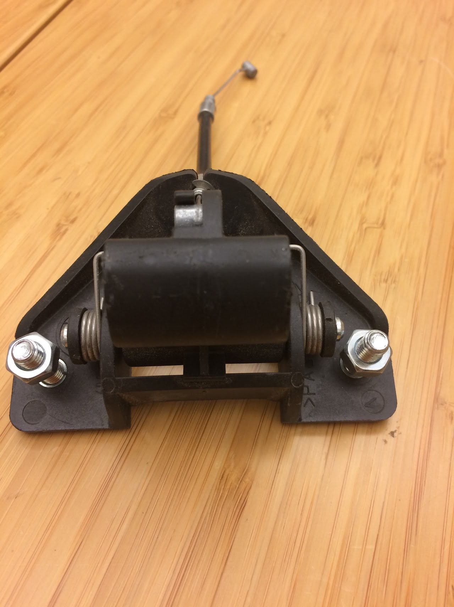

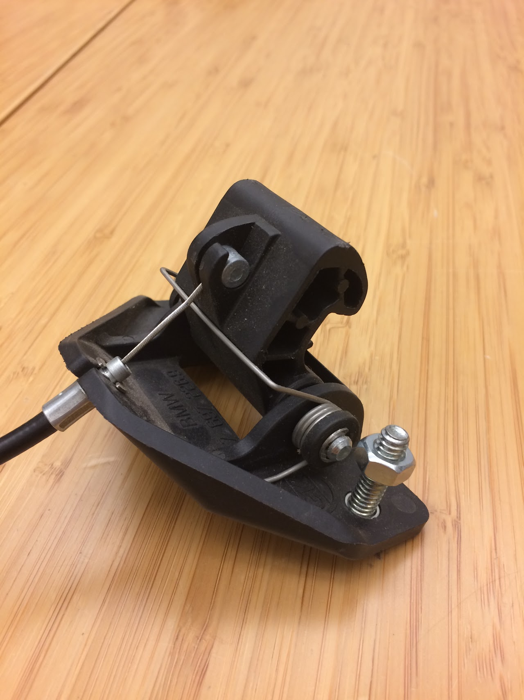

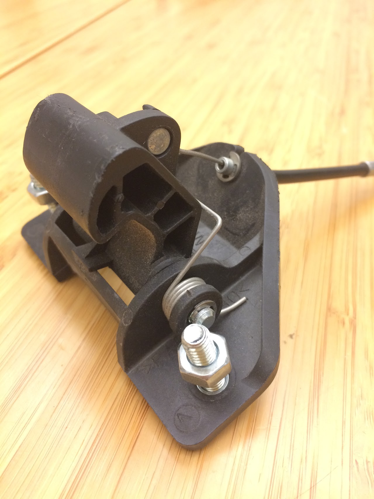

9-24-2014:

Current consensus on where to put top shell seam:

&#x20;   \- Front: separate along leading edge

&#x20;   \- Rear: can have top shell overhang a la Xenith

&#x20;   \- Sides: as close to array as possible but leave room for tape along seam

Plans for door:

&#x20;   \- Removable canopy / mini-door for egress while top shell is taped

&#x20;   \- Seam is wherever is best for cutting / most convenient (for now)

To do:

&#x20;   \- Look up latches from

&#x20;       \= Other teams' cars (Charlie: start from A in FTP Media folder; Susan: start from Z, upload pics from ASC 2014; post relevant pics to this page)

&#x20;       \= On the market

Pics of other cars (or see attachments below)

Twente 2013

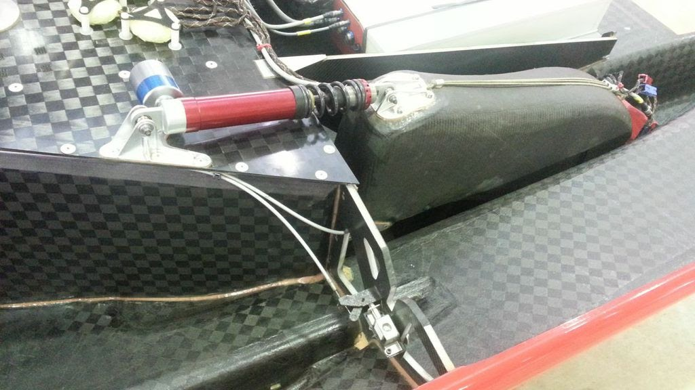

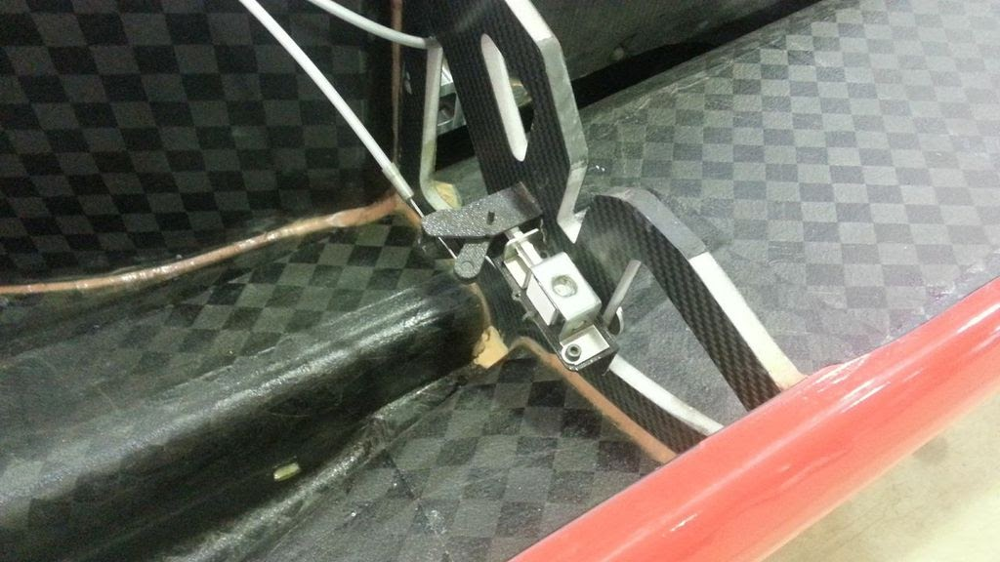

Nuon 2013

See nubs in middle

See near canopy

Tokai

Quarter turns in front, lips on bottom shell to accommodate.&#x20;

(More pics of other cars attached)

Potential parts/designs

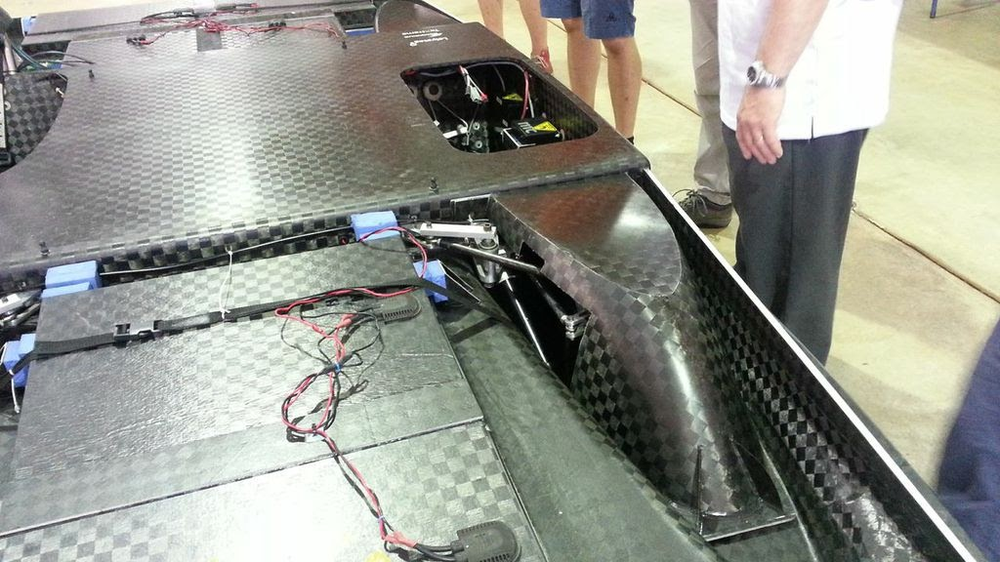

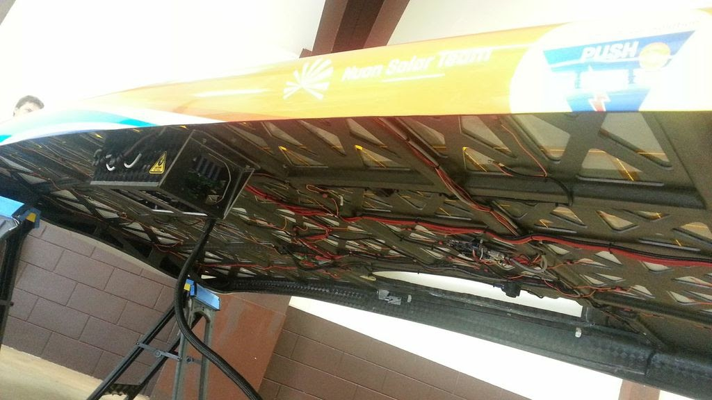

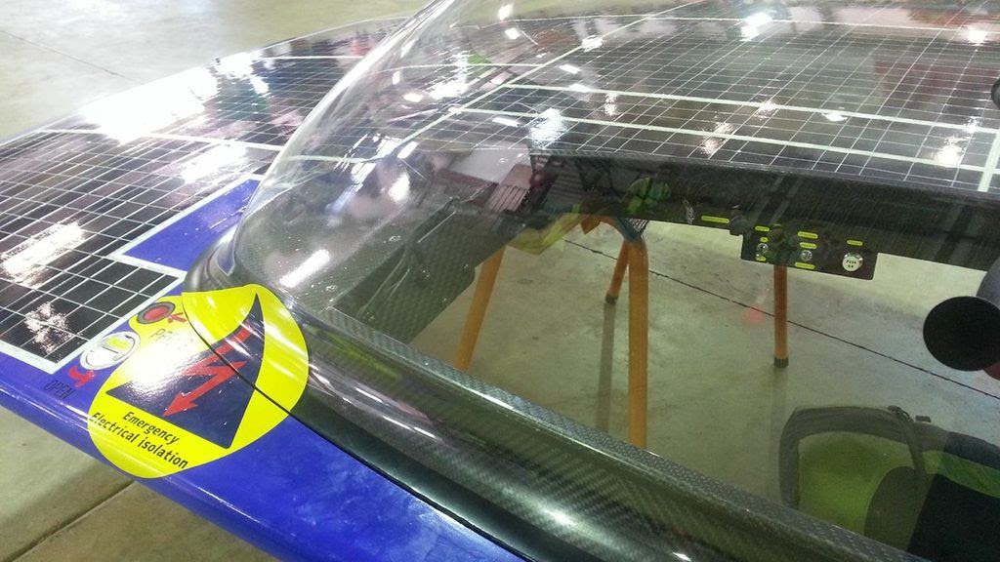

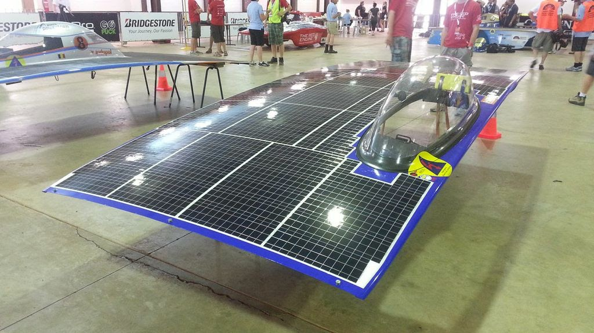

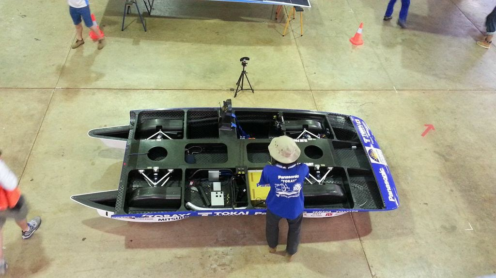

#### Embedded Google Drive File

Google Drive File: [Embedded Content](https://drive.google.com/embeddedfolderview?id=1r7HLn8CAkcqNMXpjFpn6HtOPayI2zu_x#list)
