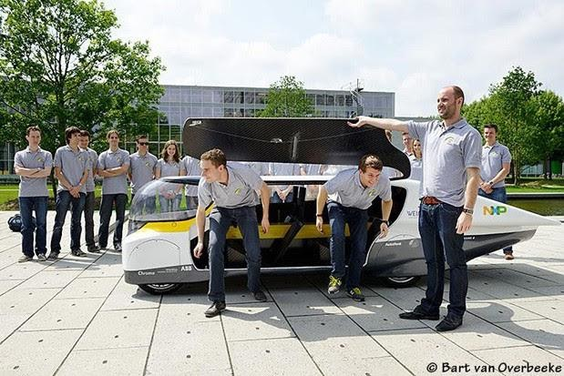

# SSCP - Outreach 2014-2015

# Outreach 2014-2015

General Outreach Presentations

https://www.dropbox.com/s/8v54r67dhyc3l1e/SSCP%20General%20Presentation%202014.pptx

[https://www.dropbox.com/s/8v54r67dhyc3l1e/SSCP%20General%20Presentation%202014.pptx](https://www.dropbox.com/s/8v54r67dhyc3l1e/SSCP%20General%20Presentation%202014.pptx)

https://www.youtube.com/user/susolarcar

Various Outreach Events on Campus

* Sustainability Week sponsored by Stanford (Good event)SAL Activity Fairs (Great event for team)ASURPS and SURI presentations (Non-negotiable, can and must do)Special Fees campaigning (Good event, can get nerve-racking because we're asking for votes and money)
* Sustainability Week sponsored by Stanford (Good event)
* SAL Activity Fairs (Great event for team)
* ASURPS and SURI presentations (Non-negotiable, can and must do)
* Special Fees campaigning (Good event, can get nerve-racking because we're asking for votes and money)

* Sustainability Week sponsored by Stanford (Good event)
* SAL Activity Fairs (Great event for team)
* ASURPS and SURI presentations (Non-negotiable, can and must do)
* Special Fees campaigning (Good event, can get nerve-racking because we're asking for votes and money)

Sustainability Week sponsored by Stanford (Good event)

SAL Activity Fairs (Great event for team)

ASURPS and SURI presentations (Non-negotiable, can and must do)

Special Fees campaigning (Good event, can get nerve-racking because we're asking for votes and money)

For displaying the car on campus, we need permission from the Grounds Dept to make sure there's no issues with parking the car somewhere. Also contact the Arrillaga Dining Hall manager if you're displaying the car there. 

ALWAYS borrow SAL's bollard clicker to disable the mobile bollards around campus. This makes everything easier. 

Aug 21st Visit with President Toledo of Peru and Dick Swanson, SunPower founder

Present: Gui, Anna, Max, Susan, Matt, Richard, Jamie, Eric

Could not Make it: Harry, Max, Darren

Summary:

Sure thing. Let me just give you an overview. 

Dick Swanson of SunPower arrived early in his red Model S, and the Presidential convoy arrived in three vehicles, with President Toledo and his wife, plus Peruvian Stanford students and technical experts close to the President. Everyone was very charismatic. 

We gave a good, brief presentation in the lobby and gave a tour. President Toledo drove Luminos and we posed for way too many photos. 

The craziest part of the event was the radio interview. We gathered around the large conference table and proceeded to hear Labiba ask the two Presidents a few questions. Dick Swanson carefully explained what he sees as the future of solar and gave his vision of solar-made fuels. 

A few people in the room, including the founder of the Mexican UNAM solar car team from the 90s--a peer of Dick Swanson during the old WSC days, offered their own comments on solar technology and explained what they were working on. Mr. Swenson (not Swanson), the UNAM team founder, is working with San Jose state on a suspended mass-transit vehicle powered by 2x50 m of solar cells. Luis Yañez, one of President Toledo's technical advisors, explained to us that he's working on 24/7 solar without batteries or solar cells. We assume he's working on solar biofuels. He offered to recruit us for this company headquartered in Redwood City. 

President Toledo's speech in response to his vision of solar and his vision for Peru was long and heartfelt. He really is a unique president. As the eight oldest of a family of sixteen in which seven children died before the age of one due to malnutrition, President Toledo made it clear to us that his rise to the presidency was a very rare thing. I remember him saying that in Peru, 85% of the people look just like him--native from the Andes. I could tell he was a man of the people. 

He admitted that he wasn't "too hot" about our race-built solar car, but expressed a lot of excitement and hope that in the process of developing it we might find inspiration for other technologies and other solutions. There was some confusion about why the team does what it does, but this was expected given the setting of the event and did not detract from what we had to learn from each other. Above all what President Toledo took from our team was that students can do incredible things. He wants to build scientific cities in Peru--bastions of STEM and innovation, and he thinks students like us are key to their success. He's got a huge opportunity ahead of him if he wins reelection because Peru's developing and growing fast, and he'll have a blank check to push for long-term plans if the people support him well again.  

We offered food and refreshments, photo opportunities, a drive in Luminos, and business cards. We were offered jobs and Peruvian passports--this wasn't a joke.

I was overall very surprised by the mixed motives for behind people's presence. Labiba wanted a kickass radio show, Dick Swanson may have wanted to make SunPower known or give his technical opinion known, President Toledo wanted to see how we might fit into his plan for Peru and what he could learn from Stanford students doing STEM. I just wanted to see what would come of all of this, and I also wanted to avoid pissing off our radio talk show host Labiba, who so aggressively pursued the opportunity to make the event happen. Labiba's also a very strange lady, perhaps in a good way.  

Matt's good at telling stories/jokes, so he can add on to this. 

--Gui

Thanks to those who attended yesterday's event. As you may have noticed, we witnessed a pretty unique meeting between a bizarre collection of people who would normally not be in the same building together--so surreal. It was one of the strangest events I've ever been to. 

I hope everyone got something of value out of the meeting.  

--Gui

Sep 17 Team Eindhoven Visit

Hey team, 

I wanted to invite everyone to an informal event the team will be hosting at VAIL on Wednesday, September 17th at 6PM.  

We will have as our guest Team Eindhoven, a solar car team from Technische Universiteit Eindhoven in the Netherlands whose solar car entry for the 2013 World Solar Challenge Cruiser Class was a "family car" 4-seater. This team won the Cruiser Class, separate from the class we compete in. 

As part of their US tour of solar car Stella, Team Eindhoven wants to meet our team and advisers. Since our team doesn't have the bandwidth this summer to do another Open Garage talk-like event, we have opted to make this an informal and fun meet-and-greet with good drinks and food--including Dutch food. We'll see their car and show off ours, as well as chat with team members and their two professors. 

We are working around Team Eindhoven's limited schedule, as they have a US tour to finish. RSVP form located here, so I know how much food to get and how many people to expect.

[here](https://docs.google.com/forms/d/1rDNrd5KX7REGsYF7r3Bjp5BYYRVuKrYwsxVta3tQ2CY/viewform?usp=send_form)

Professors Present

-Maarten Steinbuch (Dept. of Mechanical Engineering, Control Systems Technology Group)

-Ton Backx (Dean Electrical Engineering)

Their car, pictured below, will also be present. 

### Embedded Google Drive File

Google Drive File: [Embedded Content](https://drive.google.com/embeddedfolderview?id=1JHc-IgEFUAKaykTSuAkSCD3T2NXUabQ-#list)

<iframe width="100%" height="400" src="https://drive.google.com/embeddedfolderview?id=1JHc-IgEFUAKaykTSuAkSCD3T2NXUabQ-#list" frameborder="0"></iframe>

