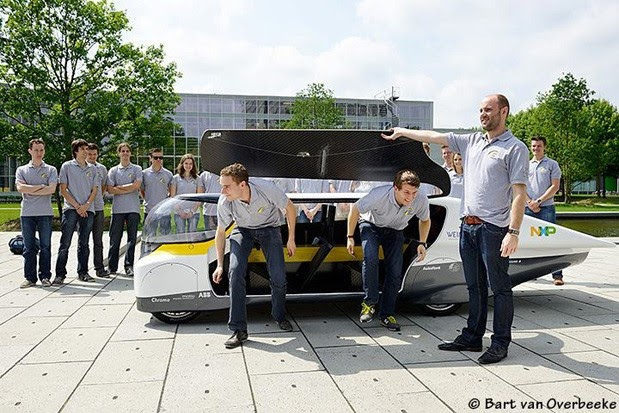

# SSCP - Team Eindhoven Visit

# Team Eindhoven Visit

Hey team, 

I wanted to invite everyone to an informal event the team will be hosting at VAIL on Wednesday, September 17th at 6PM. 

We will have as our guest Team Eindhoven, a solar car team from Technische Universiteit Eindhoven in the Netherlands whose solar car entry for the 2013 World Solar Challenge Cruiser Class was a "family car" 4-seater. This team won the Cruiser Class, separate from the class we compete in. 

As part of their US tour of solar car Stella, Team Eindhoven wants to meet our team and advisers. Since our team doesn't have the bandwidth this summer to do another Open Garage talk-like event, we have opted to make this an informal and fun meet-and-greet with good drinks and food--including Dutch food. 

Two professors (one a Dean) will be present with Team Eindhoven. They are excited to meet the team and the people who work at VAIL to talk about automotive happenings at Stanford, especially autonomous driving and vehicle controls. 

Professors Present

-Maarten Steinbuch (Dept. of Mechanical Engineering, Control Systems Technology Group)

-Ton Backx (Dean Electrical Engineering)

Their car, pictured below, will also be present. 

-- 

Sincerely, 

Guillermo Gomez

Mechanical Engineering B.S.

Minor in Political Science

Stanford University

### Embedded Content

Embedded content: [Embedded Content]()

<iframe width="100%" height="400" src="" frameborder="0"></iframe>

