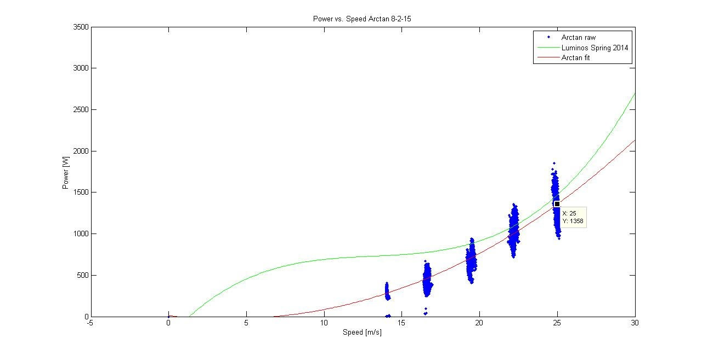
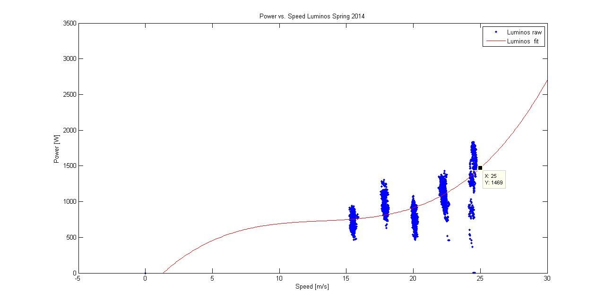
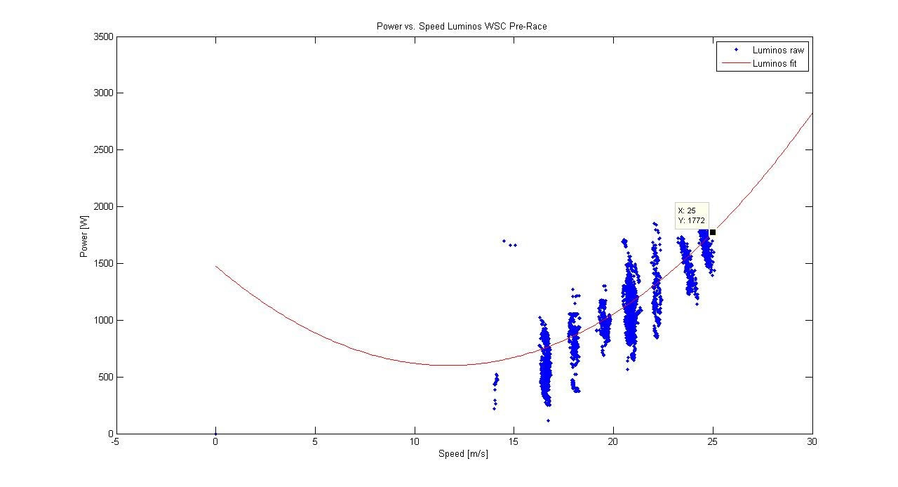

# strategy-2014-2015

## SSCP - Strategy 2014-2015

## Strategy 2014-2015

&#x20;                                   The pursuit of minimum time between Darwin and Adelaide.

Power-to-Drive

"Hello,

Sara and I have compiled the results of our power to drive test drive this weekend to compare to Luminos test drives. Here are the plots.&#x20;

* The first graph shows Arctan power to drive at Manning Ave on 8-2-15 controlled speed runs versus best fit of Luminos Manning Ave controlled speed runs done after the race (Spring 2014). The second graph is the detailed view of Luminos Manning Ave controlled speed runsThe third graph is Luminos Pre-Race Australian controlled speed run test data.
* The first graph shows Arctan power to drive at Manning Ave on 8-2-15 controlled speed runs versus best fit of Luminos Manning Ave controlled speed runs done after the race (Spring 2014).&#x20;
* The second graph is the detailed view of Luminos Manning Ave controlled speed runs
* The third graph is Luminos Pre-Race Australian controlled speed run test data.
* The first graph shows Arctan power to drive at Manning Ave on 8-2-15 controlled speed runs versus best fit of Luminos Manning Ave controlled speed runs done after the race (Spring 2014).&#x20;
* The second graph is the detailed view of Luminos Manning Ave controlled speed runs
* The third graph is Luminos Pre-Race Australian controlled speed run test data.

The first graph shows Arctan power to drive at Manning Ave on 8-2-15 controlled speed runs versus best fit of Luminos Manning Ave controlled speed runs done after the race (Spring 2014).&#x20;

The second graph is the detailed view of Luminos Manning Ave controlled speed runs

The third graph is Luminos Pre-Race Australian controlled speed run test data.

From the first two plots it looks like Arctan consumes less power than Luminos. The plots at 25m/s (90kph) show a difference of 111 Watts (7.5% delta) in favor of Arctan. At 22.2m/s (80kph), closer to the mean speed of Luminos in WSC, the power is 1004 vs 1092W in favor of Arctan, a 8.3% delta.&#x20;

However, we noticed that the fit of power to Luminos Pre-Race Australian controlled speed run test data suggests significantly more power was consumed. The fit at 25m/s on these trials matched to a power of 1772W.&#x20;

The design of our controlled speed runs involves going in both directions to minimize wind speed influence so it is kind of tricky to explain the mass increase in Australian power to drive (road difference?). We also noticed that on Luminos pre-race Central Valley controlled speed runs (with caution that wheel covers were not installed, array not perfectly gap filled etc) the power to drive was also much higher at around 1990W for 25m/s cruise."

-Darren Chen

Uploaded by Guillermo from Solarcore email records.&#x20;

#### Embedded Google Drive File

Google Drive File: [Embedded Content](https://drive.google.com/embeddedfolderview?id=1p1Qy6dBpzRUIg06Y5VV8uWKhplwUfETU#list)
