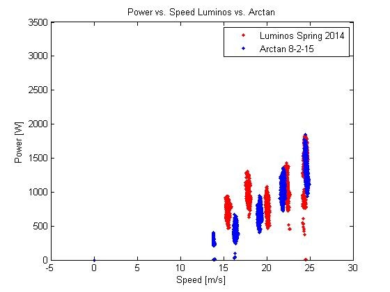

# arctan-test-driving-data-and-analysis

## SSCP - Arctan: Test Driving Data and Analysis

## Arctan: Test Driving Data and Analysis

#### Central Valley Test Drive #1 (7/18/15)

Our first Central Valley test drive was unfortunately cut short to only one day of driving due to lightning storms and an issue with our battery pack. While driving we noticed a constant, steady-state difference in lowest and highest cell voltages. The graphs below reveal that the batteries tracked each other throughout the day, indicating that there was a missing weld before driving, which was later confirmed after a physical inspection of the pack.

#### Central Valley Test Drive #2 (8/1 - 8/3/15)

We performed two sets of controlled speed runs over the course of the weekend. The speeds are compensated to account for new Michelin tires which have an 8 mm smaller diameter than what was programmed into the Tritiums.&#x20;

Our controlled speed runs are driven across Manning Ave with speeds ranging from 50-90 kph at 10 kph increments. We drive at each speed in both directions and in random order to minimize the influence of wind speed and direction.&#x20;

The next graph shows Arctan's power-to-drive model compared to Luminos in the spring of 2014 after WSC. Both speed runs were performed on Manning Ave in the Central Valley.&#x20;

We also performed a battery pack test to verify bottom-of-pack behavior. During this test we were also able to verify the accuracy of our SOC measurements to when the car actually shut off.

#### Central Valley Test Drive #3 (8/15 -8/16/15)

We dedicated all of 8/16 to characterize our array. We noticed that a few of the MPPT's occasionally latched onto local maxima with lower voltages. The code on the trackers have been since modified to run full curvetraces so we won't have this problem during future test drives. We should also see an increase in array power in the future.

We also managed to get through another set of controlled speed runs, which agrees with our previous models taken during our 2nd Central Valley test drive.&#x20;

#### &#x20;Central Valley Test Drive #4 (8/27-8/30/15)

Over the course of our 4th Central Valley test drive, we performed two mock races, each lasting about 1.5 days. These mock races were primarily to test the accuracy of our strategy model and have the team practice race crew roles. The goal of these races was to be able to successfully predict our battery pack's state-of-charge. The mock race was located primarily on Manning Ave. and had two control stops. Our Mock Race 'Route Notes' are attached below.

#### Embedded Google Drive File

Google Drive File: [Embedded Content](https://drive.google.com/embeddedfolderview?id=1Au6yPqvsvPrUMuwOAzor8rSfa48hUpxA#list)
