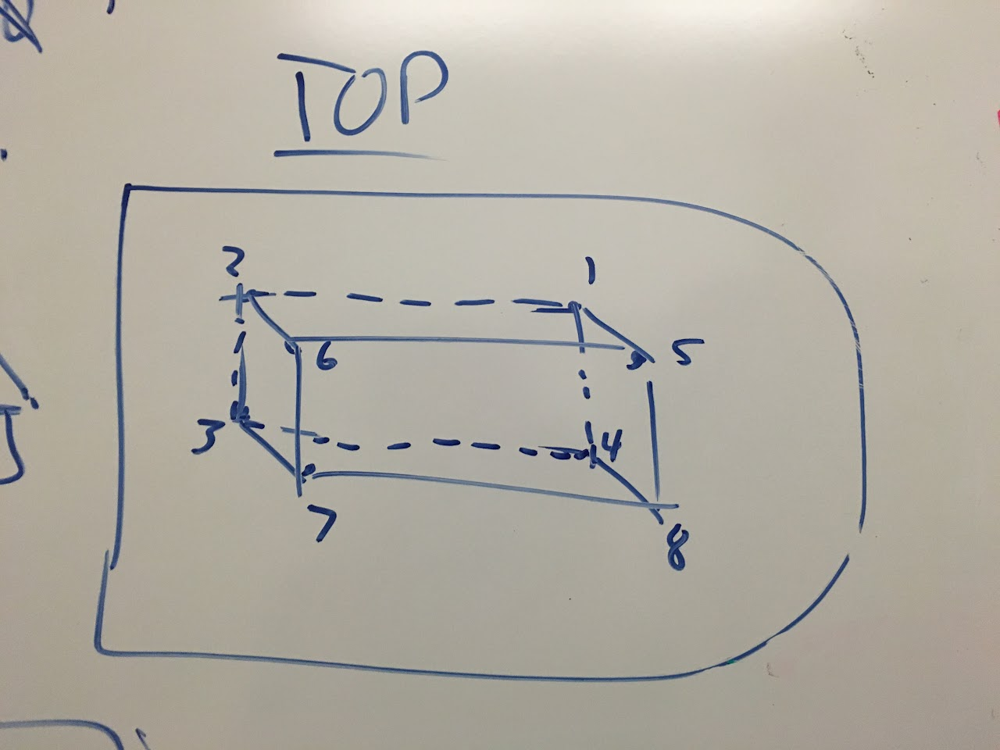
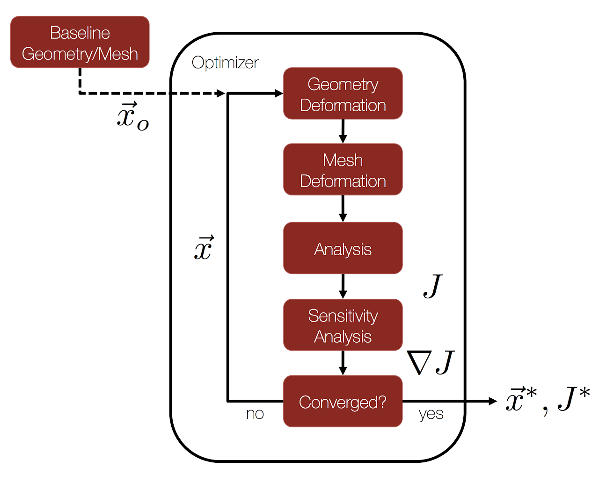

# automatic-shape-optimization-in-su2

## SSCP - Automatic Shape Optimization in SU2

## Automatic Shape Optimization in SU2

#### Tom Economon walked us through automatic shape deformation.

Currently on Sabalcore, config files and a test run are in \~/sundae/adjoint\_testing/

Also see /Aero/mesh\_deformation/ for relevant files.

All steps needed are in this tutorial https://github.com/su2code/SU2/wiki/Constrained-Optimal-Shape-Design-of-a-Fixed-Wing .

[https://github.com/su2code/SU2/wiki/Constrained-Optimal-Shape-Design-of-a-Fixed-Wing](https://github.com/su2code/SU2/wiki/Constrained-Optimal-Shape-Design-of-a-Fixed-Wing)

Attached is a config file that we used for our Sundae adjoint solutions.

High-level idea:

MAKE THE BOX

1. We need to define a box manually in the config file, determining corners of box in Pointwise. Add these to FFD\_DEFINITION in the order specified in the image below

2. After setting up the box, run 'mpirun -n SU2\_DEF \<config\_file\_name.cfg>' and then download the Tecplot mesh surface\_grid.dat and box ffd\_boxes.dat (names defined in config file) to your local machine.  Load those in Tecplot and make sure to "append" them if given the option.  Make sure the box surrounds the surface that you want to deform and modify the box if necessary.  You'll need to put all of the mesh surfaces that the box encompasses in the list corresponding with the DV\_MARKER.
3. mesh\_out.su2 was created in the previous step, this is the su2 mesh+box.  Rename this file and make sure that the MESH\_FILENAME variable in the config file contains this name.&#x20;

TEST ADJOINT SOLVER

4. use 'mpirun -n SU2\_CFD\_AD' and make sure it does not diverge.  Make sure to RESTART\_SOL = YES in the config file and point to the correct solution flow output file if you are running the adjoint solver from a completed CFD run (this will usually be the case).
5. Run python script.

Note, you can request interactive nodes using this command:

qsub -I -V -l nodes=4:ppn=16:cobalt

#### Sabalcore Tutorial PDF

#### What is Automatic Shape Optimization?

Allows SU2 to modify mesh automatically to reduce drag.

Links

Helpful introductory powerpoint.

[introductory powerpoint](https://github.com/su2code/Documentation/blob/master/Presentations/3rd%20Workshop/Aerodynamic_Design.pptx?raw=true)

Basic 3D wing optimization tutorial,  (all SU2 tutorials)

[3D wing optimization tutorial](https://github.com/su2code/SU2/wiki/Constrained-Optimal-Shape-Design-of-a-Fixed-Wing)

[SU2 tutorials](http://su2.stanford.edu/training.html)

SU2 at Github.

[Github](https://github.com/su2code)

#### TODO: How to do Automatic Shape Optimization in SU2 tutorial

* Create a base mesh
* Define area to optimize
* Define constraints for optimization
* Give mesh to SU2 to optimize

#### TODO: How to convert an Optimized Mesh back in to a surface tutorial

Import STL into Solidworks and perform auto-recognition of features?

Import slices into Solidworks and draw surfaces between them?

Import into a NURBS-surface software like Rhinoceros?

[Rhinoceros](https://www.rhino3d.com/)

#### Embedded Google Drive File

Google Drive File: [Embedded Content](https://drive.google.com/embeddedfolderview?id=1kwDBywJgt7Vb7awd52A3f7M383K3_g4F#list)
