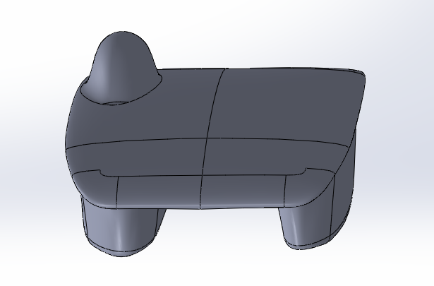
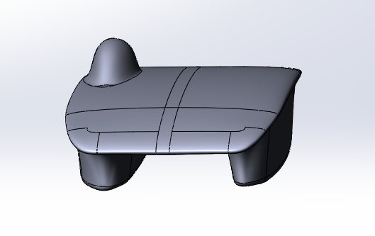
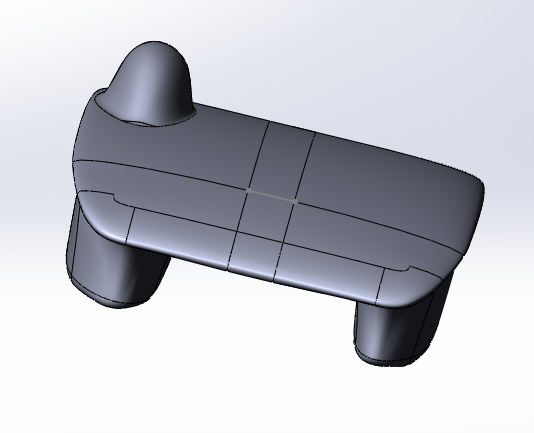

# fairing-distance-study

## SSCP - Fairing Distance Study

## Fairing Distance Study

What happens to drag/lift you split the aerobody in half, move the two halves some distance apart, then join the halves with a surface?

This was a quick test performed during the aero cycle to answer this question while discussing ways to reduce Sundae's downforce (negative lift).  The downforce was caused by accelerated airflow in the narrow channel between the fairings of this small car.  In the end we put a dent in the bottom of the car to solve this problem.  However, this test shows how simply increasing fairing distance on a generic catamaran aerobody affects lift and drag.

Short answer: Increasing fairing distance decreased downforce and increased drag.  Surprise! &#x20;

Drag increased by \~1N/5cm apart.

Lift increased (i.e. Downforce decreased) by \~15N/5cm apart.

Control (TDP-025)

Drag: 29.5949601399N

Lift: -58.9100768598N

Move car halves 10cm apart

Drag: 30.7338517504N

Lift: -46.8496995047N

Move car halves 20cm apart

Drag: 31.9241492195N

Lift: -30.8217379913N

All cars were rerun for this experiment for consistent meshing.  Thus, TDP-025 numbers may differ from those on the master spreadsheet.

SU2 runs can be found in FTP under Sundae-TDP-025-XXcmOffset/ where XX is the distance between the halves.  A directory called fairing\_distance\_study in the FTP Sundae aero directory contains other relevant files.
