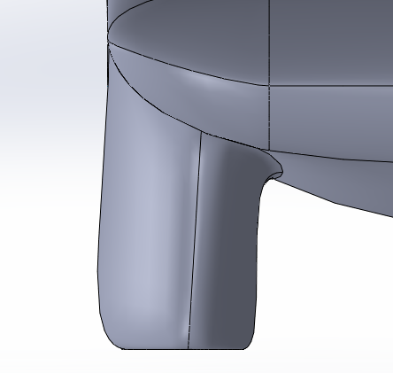
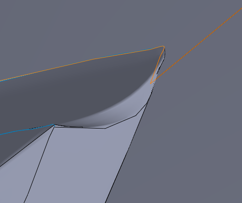
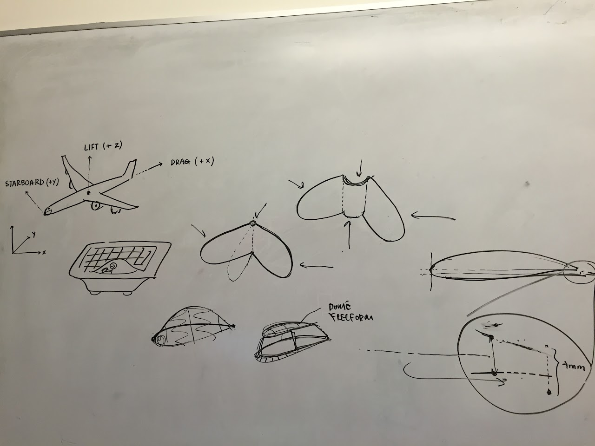

# SSCP - Meeting Notes

# Meeting Notes

## Recap on Hayden's and Rachel's visit to the San Diego Wind Tunnel

Our scheduled date at SD is Tuesday, June 27. For reference, our tentative unveiling date is Saturday, July 1.

Some key things about the tunnel:

* It is located on the second story of a building, so we will have to crane lift the solar car and drop it down into the tunnel. This is pretty much the craziest part of using this place. Since they usually do scale model airplanes and bicycles/sleds, this usually isn't a huge deal for them. Their crane is fully capable of lifting our car's mass, but we will have to work with them to make a gurney system to lift the car.The mounting system in the wind tunnel will have to be modified from their normal setup. They have two struts lengthwise, which need to be mounted to the solar car somehow (similar to Aerodyn). Because our only mounting locations are in the wheel wells, this would require building something that goes from strut to wheel well. This will tack on a little extra cost if we want them to do it for us (not sure how much, would need to correspond with Dave more to get a good estimate), but I really like the option of having them make all the parts and leaving us more time to build the car.We can do all the tests that we have done at Aerodyn. These tests have primarily been a) yaw sweeps, b) angle of attack sweeps, c) ride height sweeps, and d) smoke wand for media shots. They are more capable for yaw sweeps than Aerodyn was (they can rotate the car way more than the +/- 3 degrees that Aerodyn was limited by), but angle of attack will require adding spacers to the front/rear since their setup does not naturally do this. I'm okay with this, since we would really only be tuning angle of attack by a very small amount (+/- 1 degrees).There is no rolling road, simulated or otherwise. We already knew this, but just elaborating a little more on what that means. David said that you can define your ride height based on a distance from the boundary layer, which the people at the tunnel would know the thickness of. Steven at the tunnel said that that would be fine, and that they actually do a similar thing for some other tests they do. Smoke wand usage costs money. It's something negligible like $400/hr (I don't think we'll be running around with a smoke wand for longer than an hour), but I thought I'd mention it. I think it's worth it for the cool marketing shots, but it's really up to business team.They have some high quality video cameras dotted all around the tunnel. They've assured us that we can get some awesome marketing shots from this, so that's cool.Since they are for-profit and are giving us the lowest possible rate (thus not making money), they've asked to be included in any unveiling news we put out. I said I'd confirm with business team, but since we have historically had a picture from the windtunnel feature on our unveiling flyer, I thought that this could be a good opportunity to throw their name on there.Dave has assured me that our new scheduled date will not be moved. We were pushed a week back because of some military thing (but still within the old Aerodyn time frame), but Dave assured us that he would hold this date, especially since we are just using the tunnel for a day. 
* It is located on the second story of a building, so we will have to crane lift the solar car and drop it down into the tunnel. This is pretty much the craziest part of using this place. Since they usually do scale model airplanes and bicycles/sleds, this usually isn't a huge deal for them. Their crane is fully capable of lifting our car's mass, but we will have to work with them to make a gurney system to lift the car.
* The mounting system in the wind tunnel will have to be modified from their normal setup. They have two struts lengthwise, which need to be mounted to the solar car somehow (similar to Aerodyn). Because our only mounting locations are in the wheel wells, this would require building something that goes from strut to wheel well. This will tack on a little extra cost if we want them to do it for us (not sure how much, would need to correspond with Dave more to get a good estimate), but I really like the option of having them make all the parts and leaving us more time to build the car.
* We can do all the tests that we have done at Aerodyn. These tests have primarily been a) yaw sweeps, b) angle of attack sweeps, c) ride height sweeps, and d) smoke wand for media shots. They are more capable for yaw sweeps than Aerodyn was (they can rotate the car way more than the +/- 3 degrees that Aerodyn was limited by), but angle of attack will require adding spacers to the front/rear since their setup does not naturally do this. I'm okay with this, since we would really only be tuning angle of attack by a very small amount (+/- 1 degrees).
* There is no rolling road, simulated or otherwise. We already knew this, but just elaborating a little more on what that means. David said that you can define your ride height based on a distance from the boundary layer, which the people at the tunnel would know the thickness of. Steven at the tunnel said that that would be fine, and that they actually do a similar thing for some other tests they do. 
* Smoke wand usage costs money. It's something negligible like $400/hr (I don't think we'll be running around with a smoke wand for longer than an hour), but I thought I'd mention it. I think it's worth it for the cool marketing shots, but it's really up to business team.
* They have some high quality video cameras dotted all around the tunnel. They've assured us that we can get some awesome marketing shots from this, so that's cool.
* Since they are for-profit and are giving us the lowest possible rate (thus not making money), they've asked to be included in any unveiling news we put out. I said I'd confirm with business team, but since we have historically had a picture from the windtunnel feature on our unveiling flyer, I thought that this could be a good opportunity to throw their name on there.
* Dave has assured me that our new scheduled date will not be moved. We were pushed a week back because of some military thing (but still within the old Aerodyn time frame), but Dave assured us that he would hold this date, especially since we are just using the tunnel for a day. 

* It is located on the second story of a building, so we will have to crane lift the solar car and drop it down into the tunnel. This is pretty much the craziest part of using this place. Since they usually do scale model airplanes and bicycles/sleds, this usually isn't a huge deal for them. Their crane is fully capable of lifting our car's mass, but we will have to work with them to make a gurney system to lift the car.
* The mounting system in the wind tunnel will have to be modified from their normal setup. They have two struts lengthwise, which need to be mounted to the solar car somehow (similar to Aerodyn). Because our only mounting locations are in the wheel wells, this would require building something that goes from strut to wheel well. This will tack on a little extra cost if we want them to do it for us (not sure how much, would need to correspond with Dave more to get a good estimate), but I really like the option of having them make all the parts and leaving us more time to build the car.
* We can do all the tests that we have done at Aerodyn. These tests have primarily been a) yaw sweeps, b) angle of attack sweeps, c) ride height sweeps, and d) smoke wand for media shots. They are more capable for yaw sweeps than Aerodyn was (they can rotate the car way more than the +/- 3 degrees that Aerodyn was limited by), but angle of attack will require adding spacers to the front/rear since their setup does not naturally do this. I'm okay with this, since we would really only be tuning angle of attack by a very small amount (+/- 1 degrees).
* There is no rolling road, simulated or otherwise. We already knew this, but just elaborating a little more on what that means. David said that you can define your ride height based on a distance from the boundary layer, which the people at the tunnel would know the thickness of. Steven at the tunnel said that that would be fine, and that they actually do a similar thing for some other tests they do. 
* Smoke wand usage costs money. It's something negligible like $400/hr (I don't think we'll be running around with a smoke wand for longer than an hour), but I thought I'd mention it. I think it's worth it for the cool marketing shots, but it's really up to business team.
* They have some high quality video cameras dotted all around the tunnel. They've assured us that we can get some awesome marketing shots from this, so that's cool.
* Since they are for-profit and are giving us the lowest possible rate (thus not making money), they've asked to be included in any unveiling news we put out. I said I'd confirm with business team, but since we have historically had a picture from the windtunnel feature on our unveiling flyer, I thought that this could be a good opportunity to throw their name on there.
* Dave has assured me that our new scheduled date will not be moved. We were pushed a week back because of some military thing (but still within the old Aerodyn time frame), but Dave assured us that he would hold this date, especially since we are just using the tunnel for a day. 

It is located on the second story of a building, so we will have to crane lift the solar car and drop it down into the tunnel. This is pretty much the craziest part of using this place. Since they usually do scale model airplanes and bicycles/sleds, this usually isn't a huge deal for them. Their crane is fully capable of lifting our car's mass, but we will have to work with them to make a gurney system to lift the car.

The mounting system in the wind tunnel will have to be modified from their normal setup. They have two struts lengthwise, which need to be mounted to the solar car somehow (similar to Aerodyn). Because our only mounting locations are in the wheel wells, this would require building something that goes from strut to wheel well. This will tack on a little extra cost if we want them to do it for us (not sure how much, would need to correspond with Dave more to get a good estimate), but I really like the option of having them make all the parts and leaving us more time to build the car.

We can do all the tests that we have done at Aerodyn. These tests have primarily been a) yaw sweeps, b) angle of attack sweeps, c) ride height sweeps, and d) smoke wand for media shots. They are more capable for yaw sweeps than Aerodyn was (they can rotate the car way more than the +/- 3 degrees that Aerodyn was limited by), but angle of attack will require adding spacers to the front/rear since their setup does not naturally do this. I'm okay with this, since we would really only be tuning angle of attack by a very small amount (+/- 1 degrees).

There is no rolling road, simulated or otherwise. We already knew this, but just elaborating a little more on what that means. David said that you can define your ride height based on a distance from the boundary layer, which the people at the tunnel would know the thickness of. Steven at the tunnel said that that would be fine, and that they actually do a similar thing for some other tests they do. 

Smoke wand usage costs money. It's something negligible like $400/hr (I don't think we'll be running around with a smoke wand for longer than an hour), but I thought I'd mention it. I think it's worth it for the cool marketing shots, but it's really up to business team.

They have some high quality video cameras dotted all around the tunnel. They've assured us that we can get some awesome marketing shots from this, so that's cool.

Since they are for-profit and are giving us the lowest possible rate (thus not making money), they've asked to be included in any unveiling news we put out. I said I'd confirm with business team, but since we have historically had a picture from the windtunnel feature on our unveiling flyer, I thought that this could be a good opportunity to throw their name on there.

Dave has assured me that our new scheduled date will not be moved. We were pushed a week back because of some military thing (but still within the old Aerodyn time frame), but Dave assured us that he would hold this date, especially since we are just using the tunnel for a day. 

Considering that San Diego is a day's trailer ride there and back, this entire excursion would be a total of three days. Since our test time this summer is a couple weeks shorter than it has been in the past, every day that we have to work on the car at VAIL counts, and looking over all the details listed above, I'm strongly in favor of going with San Diego. 

## Aero Recap 2k16:

A wrap up of the aero design phase:

### Embedded Content

Embedded content: [Embedded Content]()

<iframe width="100%" height="400" src="" frameborder="0"></iframe>

## 9/29/16 SU2 Adjoint with Tom

* Boat design is theoretically goodDon't worry too much about the downforce if you have time to do automatic shape deformationSU2 Gamma-Re-Theta Transition Model is 95% codedTom's office: just past Durand 026Tecploty+ for mesh resolutionCfx, Cfy, Cfz to draw skin friction on surfacesubtract 1 from Tecplot indexing because SU2 does 0 indexing and Tecplot does 1
* Boat design is theoretically good
* Don't worry too much about the downforce if you have time to do automatic shape deformation
* SU2 Gamma-Re-Theta Transition Model is 95% coded
* Tom's office: just past Durand 026
* Tecploty+ for mesh resolutionCfx, Cfy, Cfz to draw skin friction on surfacesubtract 1 from Tecplot indexing because SU2 does 0 indexing and Tecplot does 1
* y+ for mesh resolution
* Cfx, Cfy, Cfz to draw skin friction on surface
* subtract 1 from Tecplot indexing because SU2 does 0 indexing and Tecplot does 1

* Boat design is theoretically good
* Don't worry too much about the downforce if you have time to do automatic shape deformation
* SU2 Gamma-Re-Theta Transition Model is 95% coded
* Tom's office: just past Durand 026
* Tecploty+ for mesh resolutionCfx, Cfy, Cfz to draw skin friction on surfacesubtract 1 from Tecplot indexing because SU2 does 0 indexing and Tecplot does 1
* y+ for mesh resolution
* Cfx, Cfy, Cfz to draw skin friction on surface
* subtract 1 from Tecplot indexing because SU2 does 0 indexing and Tecplot does 1

Boat design is theoretically good

Don't worry too much about the downforce if you have time to do automatic shape deformation

SU2 Gamma-Re-Theta Transition Model is 95% coded

Tom's office: just past Durand 026

Tecplot

* y+ for mesh resolution
* Cfx, Cfy, Cfz to draw skin friction on surface
* subtract 1 from Tecplot indexing because SU2 does 0 indexing and Tecplot does 1

y+ for mesh resolution

Cfx, Cfy, Cfz to draw skin friction on surface

subtract 1 from Tecplot indexing because SU2 does 0 indexing and Tecplot does 1

## 9/26/16 Aero Meeting Notes

* Tasks and roles this quarterRachel: suspension revision by Sunday, variable vehicle configurationsHayden: chassis first pass by SundayYuji: look at mold file making, will hold off on surfacing until suspension revisionAshe: meshing once cars are surfaced, surfacing bubbles for cars we are happy withBen: begin steering design
* Tasks and roles this quarterRachel: suspension revision by Sunday, variable vehicle configurationsHayden: chassis first pass by SundayYuji: look at mold file making, will hold off on surfacing until suspension revisionAshe: meshing once cars are surfaced, surfacing bubbles for cars we are happy withBen: begin steering design
* Rachel: suspension revision by Sunday, variable vehicle configurations
* Hayden: chassis first pass by Sunday
* Yuji: look at mold file making, will hold off on surfacing until suspension revision
* Ashe: meshing once cars are surfaced, surfacing bubbles for cars we are happy with
* Ben: begin steering design

* Tasks and roles this quarterRachel: suspension revision by Sunday, variable vehicle configurationsHayden: chassis first pass by SundayYuji: look at mold file making, will hold off on surfacing until suspension revisionAshe: meshing once cars are surfaced, surfacing bubbles for cars we are happy withBen: begin steering design
* Rachel: suspension revision by Sunday, variable vehicle configurations
* Hayden: chassis first pass by Sunday
* Yuji: look at mold file making, will hold off on surfacing until suspension revision
* Ashe: meshing once cars are surfaced, surfacing bubbles for cars we are happy with
* Ben: begin steering design

Tasks and roles this quarter

* Rachel: suspension revision by Sunday, variable vehicle configurations
* Hayden: chassis first pass by Sunday
* Yuji: look at mold file making, will hold off on surfacing until suspension revision
* Ashe: meshing once cars are surfaced, surfacing bubbles for cars we are happy with
* Ben: begin steering design

Rachel: suspension revision by Sunday, variable vehicle configurations

Hayden: chassis first pass by Sunday

Yuji: look at mold file making, will hold off on surfacing until suspension revision

Ashe: meshing once cars are surfaced, surfacing bubbles for cars we are happy with

Ben: begin steering design

* Looking into mesh deformation
* Pizza

Looking into mesh deformation

Pizza

## 9/19-20/16 Williams Trip

* See notes here.

See notes here.

[ here](/stanford.edu/testduplicationsscp/home/sscp-2016-2017/business-logistics-2016-2017/williams-trip/notes)

## 9/7/16 San Diego Wind Tunnel Call

* Dave Massey <dmassey@lswt.com> - handles logistics, not an engineerMounting: attach to struts that come from the floorAoA and ride height parameter variation is possible just as it is at AerodynWe can also yaw the car. What is the maximum yaw?Talk more to the engineersSD wind tunnel doesn't often do cars, but they have -- we will double check on the setupLogistics: due to aerospace taking priority, our testing could get pushed back a week, but we would know a couple months in advance - don't worry too much about that, they'll try not to move our appointmentCan visit on a Saturday ahead of timePrice: $875/hr, no energy charge below 100mph
* Mounting: attach to struts that come from the floorAoA and ride height parameter variation is possible just as it is at AerodynWe can also yaw the car. What is the maximum yaw?Talk more to the engineers
* AoA and ride height parameter variation is possible just as it is at Aerodyn
* We can also yaw the car. What is the maximum yaw?
* Talk more to the engineers
* SD wind tunnel doesn't often do cars, but they have -- we will double check on the setup
* Logistics: due to aerospace taking priority, our testing could get pushed back a week, but we would know a couple months in advance - don't worry too much about that, they'll try not to move our appointment
* Can visit on a Saturday ahead of time
* Price: $875/hr, no energy charge below 100mph

Dave Massey <dmassey@lswt.com> - handles logistics, not an engineer

* Mounting: attach to struts that come from the floorAoA and ride height parameter variation is possible just as it is at AerodynWe can also yaw the car. What is the maximum yaw?Talk more to the engineers
* AoA and ride height parameter variation is possible just as it is at Aerodyn
* We can also yaw the car. What is the maximum yaw?
* Talk more to the engineers
* SD wind tunnel doesn't often do cars, but they have -- we will double check on the setup
* Logistics: due to aerospace taking priority, our testing could get pushed back a week, but we would know a couple months in advance - don't worry too much about that, they'll try not to move our appointment
* Can visit on a Saturday ahead of time
* Price: $875/hr, no energy charge below 100mph

Mounting: attach to struts that come from the floor

* AoA and ride height parameter variation is possible just as it is at Aerodyn
* We can also yaw the car. What is the maximum yaw?
* Talk more to the engineers

AoA and ride height parameter variation is possible just as it is at Aerodyn

We can also yaw the car. What is the maximum yaw?

Talk more to the engineers

SD wind tunnel doesn't often do cars, but they have -- we will double check on the setup

Logistics: due to aerospace taking priority, our testing could get pushed back a week, but we would know a couple months in advance - don't worry too much about that, they'll try not to move our appointment

Can visit on a Saturday ahead of time

Price: $875/hr, no energy charge below 100mph

## 8/30/16 Aero Meeting Notes 

* Yuji making steady improvements to the carFocusing on getting our car up to ship qualityThis is the last aero meeting of the summer
* Yuji making steady improvements to the car
* Focusing on getting our car up to ship quality
* This is the last aero meeting of the summer

* Yuji making steady improvements to the car
* Focusing on getting our car up to ship quality
* This is the last aero meeting of the summer

Yuji making steady improvements to the car

Focusing on getting our car up to ship quality

This is the last aero meeting of the summer

## 8/28/16 Fat Body vs. Asymmetric 

* Based on the success of HRH-006 at ~30 N, we are going with asymmetric.BEN-013 achieved similar results, however the bubble was very large and will shade the array more, especially for a center-seated car. Fat body car also tends to be more difficult in terms of mitigating downforce due to narrower channel from convex belly.Max D did ShellPower analysis between the two cars, which shows the aforementioned effects to the array.Upcoming for aero team:Yuji full-time this week, working on improving HRH-006 and replicate our 30 N dragAshe will be meshing Yuji's carsMost of aero team will be gone starting next week
* Based on the success of HRH-006 at ~30 N, we are going with asymmetric.
* BEN-013 achieved similar results, however the bubble was very large and will shade the array more, especially for a center-seated car. Fat body car also tends to be more difficult in terms of mitigating downforce due to narrower channel from convex belly.
* Max D did ShellPower analysis between the two cars, which shows the aforementioned effects to the array.
* Upcoming for aero team:Yuji full-time this week, working on improving HRH-006 and replicate our 30 N dragAshe will be meshing Yuji's carsMost of aero team will be gone starting next week
* Yuji full-time this week, working on improving HRH-006 and replicate our 30 N drag
* Ashe will be meshing Yuji's cars
* Most of aero team will be gone starting next week

* Based on the success of HRH-006 at ~30 N, we are going with asymmetric.
* BEN-013 achieved similar results, however the bubble was very large and will shade the array more, especially for a center-seated car. Fat body car also tends to be more difficult in terms of mitigating downforce due to narrower channel from convex belly.
* Max D did ShellPower analysis between the two cars, which shows the aforementioned effects to the array.
* Upcoming for aero team:Yuji full-time this week, working on improving HRH-006 and replicate our 30 N dragAshe will be meshing Yuji's carsMost of aero team will be gone starting next week
* Yuji full-time this week, working on improving HRH-006 and replicate our 30 N drag
* Ashe will be meshing Yuji's cars
* Most of aero team will be gone starting next week

Based on the success of HRH-006 at ~30 N, we are going with asymmetric.

BEN-013 achieved similar results, however the bubble was very large and will shade the array more, especially for a center-seated car. Fat body car also tends to be more difficult in terms of mitigating downforce due to narrower channel from convex belly.

Max D did ShellPower analysis between the two cars, which shows the aforementioned effects to the array.

[ ShellPower analysis between the two cars](/stanford.edu/testduplicationsscp/home/sscp-2016-2017/aero-2016-2017/symmetric-vs-asymmetric-array-analysis)

Upcoming for aero team:

* Yuji full-time this week, working on improving HRH-006 and replicate our 30 N drag
* Ashe will be meshing Yuji's cars
* Most of aero team will be gone starting next week

Yuji full-time this week, working on improving HRH-006 and replicate our 30 N drag

Ashe will be meshing Yuji's cars

Most of aero team will be gone starting next week

## 8/23/16 Goro Tamai Call Notes

* Present for call: Kelsey, RachelRearward-seated driver helps achieve laminar flowAoA: nose down with downforcemore stable for crosswindsPg. 132/134: area vs yaw angle, pitching moment, crosswind effectsYaw sweeps (+/- 10-15 deg yaw) to see if lift front > lift rearCFD: how destabilizing is long fairing vs split?Honda 96 in Leading EdgeMore stable with driver on the left side with split fairing? (Goro speculates)Having a long nose of the fairing hole and a long tail flare is good, blending into the belly panFairingsDon't make side of fairing flush with side of carDesign fairings using crosswinds, not dragEmpty volume in fairing is badFor Arctan, could keep the fairing hole the same, get fairing bottom tighter to wheels, end up with more gradual blendPg. 153/155: junction workCAD sponsorship to do lots of studies and tuning? Tuning such as...How do you design your Venturi?Lift profile as a funciton of yawCar should handle the same across all betaPg. 63: Stanford tail yarn tuftsTaguchi method, L-18 method: DOEGoro Tamai email address: goro.tamai@gm.com
* Present for call: Kelsey, Rachel
* Rearward-seated driver helps achieve laminar flow
* AoA: nose down with downforcemore stable for crosswindsPg. 132/134: area vs yaw angle, pitching moment, crosswind effects
* more stable for crosswinds
* Pg. 132/134: area vs yaw angle, pitching moment, crosswind effects
* Yaw sweeps (+/- 10-15 deg yaw) to see if lift front > lift rear
* CFD: how destabilizing is long fairing vs split?Honda 96 in Leading EdgeMore stable with driver on the left side with split fairing? (Goro speculates)
* Honda 96 in Leading Edge
* More stable with driver on the left side with split fairing? (Goro speculates)
* Having a long nose of the fairing hole and a long tail flare is good, blending into the belly pan
* FairingsDon't make side of fairing flush with side of carDesign fairings using crosswinds, not dragEmpty volume in fairing is badFor Arctan, could keep the fairing hole the same, get fairing bottom tighter to wheels, end up with more gradual blendPg. 153/155: junction work
* Don't make side of fairing flush with side of car
* Design fairings using crosswinds, not drag
* Empty volume in fairing is bad
* For Arctan, could keep the fairing hole the same, get fairing bottom tighter to wheels, end up with more gradual blend
* Pg. 153/155: junction work
* CAD sponsorship to do lots of studies and tuning? Tuning such as...How do you design your Venturi?Lift profile as a funciton of yawCar should handle the same across all betaPg. 63: Stanford tail yarn tuftsTaguchi method, L-18 method: DOE
* How do you design your Venturi?
* Lift profile as a funciton of yaw
* Car should handle the same across all betaPg. 63: Stanford tail yarn tufts
* Pg. 63: Stanford tail yarn tufts
* Taguchi method, L-18 method: DOE
* Goro Tamai email address: goro.tamai@gm.com

* Present for call: Kelsey, Rachel
* Rearward-seated driver helps achieve laminar flow
* AoA: nose down with downforcemore stable for crosswindsPg. 132/134: area vs yaw angle, pitching moment, crosswind effects
* more stable for crosswinds
* Pg. 132/134: area vs yaw angle, pitching moment, crosswind effects
* Yaw sweeps (+/- 10-15 deg yaw) to see if lift front > lift rear
* CFD: how destabilizing is long fairing vs split?Honda 96 in Leading EdgeMore stable with driver on the left side with split fairing? (Goro speculates)
* Honda 96 in Leading Edge
* More stable with driver on the left side with split fairing? (Goro speculates)
* Having a long nose of the fairing hole and a long tail flare is good, blending into the belly pan
* FairingsDon't make side of fairing flush with side of carDesign fairings using crosswinds, not dragEmpty volume in fairing is badFor Arctan, could keep the fairing hole the same, get fairing bottom tighter to wheels, end up with more gradual blendPg. 153/155: junction work
* Don't make side of fairing flush with side of car
* Design fairings using crosswinds, not drag
* Empty volume in fairing is bad
* For Arctan, could keep the fairing hole the same, get fairing bottom tighter to wheels, end up with more gradual blend
* Pg. 153/155: junction work
* CAD sponsorship to do lots of studies and tuning? Tuning such as...How do you design your Venturi?Lift profile as a funciton of yawCar should handle the same across all betaPg. 63: Stanford tail yarn tuftsTaguchi method, L-18 method: DOE
* How do you design your Venturi?
* Lift profile as a funciton of yaw
* Car should handle the same across all betaPg. 63: Stanford tail yarn tufts
* Pg. 63: Stanford tail yarn tufts
* Taguchi method, L-18 method: DOE
* Goro Tamai email address: goro.tamai@gm.com

Present for call: Kelsey, Rachel

Rearward-seated driver helps achieve laminar flow

AoA: nose down with downforce

* more stable for crosswinds
* Pg. 132/134: area vs yaw angle, pitching moment, crosswind effects

more stable for crosswinds

Pg. 132/134: area vs yaw angle, pitching moment, crosswind effects

Yaw sweeps (+/- 10-15 deg yaw) to see if lift front > lift rear

CFD: how destabilizing is long fairing vs split?

* Honda 96 in Leading Edge
* More stable with driver on the left side with split fairing? (Goro speculates)

Honda 96 in Leading Edge

More stable with driver on the left side with split fairing? (Goro speculates)

Having a long nose of the fairing hole and a long tail flare is good, blending into the belly pan

Fairings

* Don't make side of fairing flush with side of car
* Design fairings using crosswinds, not drag
* Empty volume in fairing is bad
* For Arctan, could keep the fairing hole the same, get fairing bottom tighter to wheels, end up with more gradual blend
* Pg. 153/155: junction work

Don't make side of fairing flush with side of car

Design fairings using crosswinds, not drag

Empty volume in fairing is bad

For Arctan, could keep the fairing hole the same, get fairing bottom tighter to wheels, end up with more gradual blend

Pg. 153/155: junction work

CAD sponsorship to do lots of studies and tuning? Tuning such as...

* How do you design your Venturi?
* Lift profile as a funciton of yaw
* Car should handle the same across all betaPg. 63: Stanford tail yarn tufts
* Pg. 63: Stanford tail yarn tufts
* Taguchi method, L-18 method: DOE

How do you design your Venturi?

Lift profile as a funciton of yaw

Car should handle the same across all beta

* Pg. 63: Stanford tail yarn tufts

Pg. 63: Stanford tail yarn tufts

Taguchi method, L-18 method: DOE

Goro Tamai email address: goro.tamai@gm.com

## 8/17/16 Aero Meeting Notes

* Surfacer progress:Ashe and Ben working on improvements to HRH-005Hayden finishing up HRH-006 (asymmetric car for comparison to HRH-004)Yuji improving on TDP-021 (asymmetric car)Decide at Sunday meeting about asymmetric vs fat bodyYuji going to email Anna O and Darren about what they think of extruding airfoil cars to study track width variation (to mitigate downforce, find the happy middle place without surfacing a bunch of cars)
* Surfacer progress:Ashe and Ben working on improvements to HRH-005Hayden finishing up HRH-006 (asymmetric car for comparison to HRH-004)Yuji improving on TDP-021 (asymmetric car)
* Ashe and Ben working on improvements to HRH-005
* Hayden finishing up HRH-006 (asymmetric car for comparison to HRH-004)
* Yuji improving on TDP-021 (asymmetric car)
* Decide at Sunday meeting about asymmetric vs fat body
* Yuji going to email Anna O and Darren about what they think of extruding airfoil cars to study track width variation (to mitigate downforce, find the happy middle place without surfacing a bunch of cars)

* Surfacer progress:Ashe and Ben working on improvements to HRH-005Hayden finishing up HRH-006 (asymmetric car for comparison to HRH-004)Yuji improving on TDP-021 (asymmetric car)
* Ashe and Ben working on improvements to HRH-005
* Hayden finishing up HRH-006 (asymmetric car for comparison to HRH-004)
* Yuji improving on TDP-021 (asymmetric car)
* Decide at Sunday meeting about asymmetric vs fat body
* Yuji going to email Anna O and Darren about what they think of extruding airfoil cars to study track width variation (to mitigate downforce, find the happy middle place without surfacing a bunch of cars)

Surfacer progress:

* Ashe and Ben working on improvements to HRH-005
* Hayden finishing up HRH-006 (asymmetric car for comparison to HRH-004)
* Yuji improving on TDP-021 (asymmetric car)

Ashe and Ben working on improvements to HRH-005

Hayden finishing up HRH-006 (asymmetric car for comparison to HRH-004)

Yuji improving on TDP-021 (asymmetric car)

Decide at Sunday meeting about asymmetric vs fat body

Yuji going to email Anna O and Darren about what they think of extruding airfoil cars to study track width variation (to mitigate downforce, find the happy middle place without surfacing a bunch of cars)

## 8/17/16 Call with Wesley Ford about windtunnels 

* Present for call: Kelsey, Rachel
* Scale Model Testing:Tried to do with LuminosAround fall, wanted to do scale model testingCan do it to correlate model to reality or demonstrate correlationSurface imperfections matter a lot. As you scale down, you need to match the Reynolds number.Google doc on internal that lists viable scale model wind tunnels in the US. Wichitaw state and UW in Seattle. Might have contact details for Wichitaw and UW on Google site. Not sure what they do with ground effects. Have the ability to put in a ground plane, flat piece of metal. Don't have a way to sim a rolling road. May have a method of simulating vehicles.Solid concepts was offering a discount on two polished models. can't recall what their construction method was going to be. Do we know Danny - alum who worked at Lockheed for awhile. What kind of surface finish would we need? Wesley will send Danny's contact info.Danny's contact info: Danny: (818) 665-5481 Venator@gmail.com dkoelker@stanfordalumni.org venator@gmail.comSSCP Alumni What are your areas of expertise Mechanical; Composites; AeroWhat projects did you work on while you were on SSCP Aerodynamics; chassis design; and composites design and analysis What jobs have you had since then?Mechanical engineer and product design.What year did you graduate from Stanford?2009Which cars did you help build?XenithNo ability to set ride height based on a scale model. You do that as a consequence of imperfections between your simulations and reality. Scale model testing won't allow us to characterize the full vehicle. Only informative for the aero design that we do.Might need 200+mph.
* Tried to do with LuminosAround fall, wanted to do scale model testingCan do it to correlate model to reality or demonstrate correlationSurface imperfections matter a lot. As you scale down, you need to match the Reynolds number.Google doc on internal that lists viable scale model wind tunnels in the US. Wichitaw state and UW in Seattle. Might have contact details for Wichitaw and UW on Google site. Not sure what they do with ground effects. Have the ability to put in a ground plane, flat piece of metal. Don't have a way to sim a rolling road. May have a method of simulating vehicles.Solid concepts was offering a discount on two polished models. can't recall what their construction method was going to be. Do we know Danny - alum who worked at Lockheed for awhile. What kind of surface finish would we need? Wesley will send Danny's contact info.Danny's contact info: Danny: (818) 665-5481 Venator@gmail.com dkoelker@stanfordalumni.org venator@gmail.comSSCP Alumni What are your areas of expertise Mechanical; Composites; AeroWhat projects did you work on while you were on SSCP Aerodynamics; chassis design; and composites design and analysis What jobs have you had since then?Mechanical engineer and product design.What year did you graduate from Stanford?2009Which cars did you help build?XenithNo ability to set ride height based on a scale model. You do that as a consequence of imperfections between your simulations and reality. Scale model testing won't allow us to characterize the full vehicle. Only informative for the aero design that we do.Might need 200+mph.
* Around fall, wanted to do scale model testing
* Can do it to correlate model to reality or demonstrate correlation
* Surface imperfections matter a lot. As you scale down, you need to match the Reynolds number.
* Google doc on internal that lists viable scale model wind tunnels in the US. Wichitaw state and UW in Seattle. Might have contact details for Wichitaw and UW on Google site. Not sure what they do with ground effects. Have the ability to put in a ground plane, flat piece of metal. Don't have a way to sim a rolling road. May have a method of simulating vehicles.Solid concepts was offering a discount on two polished models. can't recall what their construction method was going to be. Do we know Danny - alum who worked at Lockheed for awhile. What kind of surface finish would we need? Wesley will send Danny's contact info.Danny's contact info: Danny: (818) 665-5481 Venator@gmail.com dkoelker@stanfordalumni.org venator@gmail.comSSCP Alumni What are your areas of expertise Mechanical; Composites; AeroWhat projects did you work on while you were on SSCP Aerodynamics; chassis design; and composites design and analysis What jobs have you had since then?Mechanical engineer and product design.What year did you graduate from Stanford?2009Which cars did you help build?XenithNo ability to set ride height based on a scale model. You do that as a consequence of imperfections between your simulations and reality. Scale model testing won't allow us to characterize the full vehicle. Only informative for the aero design that we do.
* Solid concepts was offering a discount on two polished models. can't recall what their construction method was going to be. Do we know Danny - alum who worked at Lockheed for awhile. What kind of surface finish would we need? Wesley will send Danny's contact info.
* Danny's contact info: Danny: (818) 665-5481 Venator@gmail.com dkoelker@stanfordalumni.org venator@gmail.com
* SSCP Alumni What are your areas of expertise Mechanical; Composites; AeroWhat projects did you work on while you were on SSCP Aerodynamics; chassis design; and composites design and analysis What jobs have you had since then?Mechanical engineer and product design.What year did you graduate from Stanford?2009Which cars did you help build?Xenith
* No ability to set ride height based on a scale model. You do that as a consequence of imperfections between your simulations and reality. Scale model testing won't allow us to characterize the full vehicle. Only informative for the aero design that we do.
* Might need 200+mph.
* Full Scale Wind Tunnels:Audi had windtunnels that they were going to offer us in Germany, back when VW was a sponsorKelsey: Ford has created a mobile windtunnel and our contact wasn't sure where it'd be when we needed it.Wesley: Ask the relevant aerodynamicists rather than waiting for the middleman. They likely have scale model testing. Xenith and Luminos got maybe a few percentage improvement from angle of attack and ride heightWesley can't recall whether changed spring rates or not, but ideally wouldn't need to change (ride height, preload, and spring rates should all be separate -- the last two should be in response to expected road conditions, etc) -- change length, not rate of the shocks (not what we have ever done, but the elegant way to do it)Xenith had air springs in the suspension which was really badWind tunnel is a much more controlled environment, so performance will be a little bit different -- don't be put off by Luminos having better performance on the real worldWe got the car shipped back by a sponsor for Xenith by basically getting stuck at Aerodyn and telling them we couldn't be at their conference unless they shipped the car backIdeal case: build a crate to use for shipping the car across the country, to Australia, and to use as a trailerDBSchenker -- shipping -- discounted for Luminos, but for Apogee they really pissed off Sasha
* Audi had windtunnels that they were going to offer us in Germany, back when VW was a sponsor
* Kelsey: Ford has created a mobile windtunnel and our contact wasn't sure where it'd be when we needed it.Wesley: Ask the relevant aerodynamicists rather than waiting for the middleman. They likely have scale model testing. 
* Wesley: Ask the relevant aerodynamicists rather than waiting for the middleman. They likely have scale model testing. 
* Xenith and Luminos got maybe a few percentage improvement from angle of attack and ride height
* Wesley can't recall whether changed spring rates or not, but ideally wouldn't need to change (ride height, preload, and spring rates should all be separate -- the last two should be in response to expected road conditions, etc) -- change length, not rate of the shocks (not what we have ever done, but the elegant way to do it)
* Xenith had air springs in the suspension which was really bad
* Wind tunnel is a much more controlled environment, so performance will be a little bit different -- don't be put off by Luminos having better performance on the real world
* We got the car shipped back by a sponsor for Xenith by basically getting stuck at Aerodyn and telling them we couldn't be at their conference unless they shipped the car back
* Ideal case: build a crate to use for shipping the car across the country, to Australia, and to use as a trailer
* DBSchenker -- shipping -- discounted for Luminos, but for Apogee they really pissed off Sasha

Present for call: Kelsey, Rachel

Scale Model Testing:

* Tried to do with LuminosAround fall, wanted to do scale model testingCan do it to correlate model to reality or demonstrate correlationSurface imperfections matter a lot. As you scale down, you need to match the Reynolds number.Google doc on internal that lists viable scale model wind tunnels in the US. Wichitaw state and UW in Seattle. Might have contact details for Wichitaw and UW on Google site. Not sure what they do with ground effects. Have the ability to put in a ground plane, flat piece of metal. Don't have a way to sim a rolling road. May have a method of simulating vehicles.Solid concepts was offering a discount on two polished models. can't recall what their construction method was going to be. Do we know Danny - alum who worked at Lockheed for awhile. What kind of surface finish would we need? Wesley will send Danny's contact info.Danny's contact info: Danny: (818) 665-5481 Venator@gmail.com dkoelker@stanfordalumni.org venator@gmail.comSSCP Alumni What are your areas of expertise Mechanical; Composites; AeroWhat projects did you work on while you were on SSCP Aerodynamics; chassis design; and composites design and analysis What jobs have you had since then?Mechanical engineer and product design.What year did you graduate from Stanford?2009Which cars did you help build?XenithNo ability to set ride height based on a scale model. You do that as a consequence of imperfections between your simulations and reality. Scale model testing won't allow us to characterize the full vehicle. Only informative for the aero design that we do.Might need 200+mph.
* Around fall, wanted to do scale model testing
* Can do it to correlate model to reality or demonstrate correlation
* Surface imperfections matter a lot. As you scale down, you need to match the Reynolds number.
* Google doc on internal that lists viable scale model wind tunnels in the US. Wichitaw state and UW in Seattle. Might have contact details for Wichitaw and UW on Google site. Not sure what they do with ground effects. Have the ability to put in a ground plane, flat piece of metal. Don't have a way to sim a rolling road. May have a method of simulating vehicles.Solid concepts was offering a discount on two polished models. can't recall what their construction method was going to be. Do we know Danny - alum who worked at Lockheed for awhile. What kind of surface finish would we need? Wesley will send Danny's contact info.Danny's contact info: Danny: (818) 665-5481 Venator@gmail.com dkoelker@stanfordalumni.org venator@gmail.comSSCP Alumni What are your areas of expertise Mechanical; Composites; AeroWhat projects did you work on while you were on SSCP Aerodynamics; chassis design; and composites design and analysis What jobs have you had since then?Mechanical engineer and product design.What year did you graduate from Stanford?2009Which cars did you help build?XenithNo ability to set ride height based on a scale model. You do that as a consequence of imperfections between your simulations and reality. Scale model testing won't allow us to characterize the full vehicle. Only informative for the aero design that we do.
* Solid concepts was offering a discount on two polished models. can't recall what their construction method was going to be. Do we know Danny - alum who worked at Lockheed for awhile. What kind of surface finish would we need? Wesley will send Danny's contact info.
* Danny's contact info: Danny: (818) 665-5481 Venator@gmail.com dkoelker@stanfordalumni.org venator@gmail.com
* SSCP Alumni What are your areas of expertise Mechanical; Composites; AeroWhat projects did you work on while you were on SSCP Aerodynamics; chassis design; and composites design and analysis What jobs have you had since then?Mechanical engineer and product design.What year did you graduate from Stanford?2009Which cars did you help build?Xenith
* No ability to set ride height based on a scale model. You do that as a consequence of imperfections between your simulations and reality. Scale model testing won't allow us to characterize the full vehicle. Only informative for the aero design that we do.
* Might need 200+mph.

Tried to do with Luminos

* Around fall, wanted to do scale model testing
* Can do it to correlate model to reality or demonstrate correlation
* Surface imperfections matter a lot. As you scale down, you need to match the Reynolds number.
* Google doc on internal that lists viable scale model wind tunnels in the US. Wichitaw state and UW in Seattle. Might have contact details for Wichitaw and UW on Google site. Not sure what they do with ground effects. Have the ability to put in a ground plane, flat piece of metal. Don't have a way to sim a rolling road. May have a method of simulating vehicles.Solid concepts was offering a discount on two polished models. can't recall what their construction method was going to be. Do we know Danny - alum who worked at Lockheed for awhile. What kind of surface finish would we need? Wesley will send Danny's contact info.Danny's contact info: Danny: (818) 665-5481 Venator@gmail.com dkoelker@stanfordalumni.org venator@gmail.comSSCP Alumni What are your areas of expertise Mechanical; Composites; AeroWhat projects did you work on while you were on SSCP Aerodynamics; chassis design; and composites design and analysis What jobs have you had since then?Mechanical engineer and product design.What year did you graduate from Stanford?2009Which cars did you help build?XenithNo ability to set ride height based on a scale model. You do that as a consequence of imperfections between your simulations and reality. Scale model testing won't allow us to characterize the full vehicle. Only informative for the aero design that we do.
* Solid concepts was offering a discount on two polished models. can't recall what their construction method was going to be. Do we know Danny - alum who worked at Lockheed for awhile. What kind of surface finish would we need? Wesley will send Danny's contact info.
* Danny's contact info: Danny: (818) 665-5481 Venator@gmail.com dkoelker@stanfordalumni.org venator@gmail.com
* SSCP Alumni What are your areas of expertise Mechanical; Composites; AeroWhat projects did you work on while you were on SSCP Aerodynamics; chassis design; and composites design and analysis What jobs have you had since then?Mechanical engineer and product design.What year did you graduate from Stanford?2009Which cars did you help build?Xenith
* No ability to set ride height based on a scale model. You do that as a consequence of imperfections between your simulations and reality. Scale model testing won't allow us to characterize the full vehicle. Only informative for the aero design that we do.
* Might need 200+mph.

Around fall, wanted to do scale model testing

Can do it to correlate model to reality or demonstrate correlation

Surface imperfections matter a lot. As you scale down, you need to match the Reynolds number.

Google doc on internal that lists viable scale model wind tunnels in the US. Wichitaw state and UW in Seattle. Might have contact details for Wichitaw and UW on Google site. Not sure what they do with ground effects. Have the ability to put in a ground plane, flat piece of metal. Don't have a way to sim a rolling road. May have a method of simulating vehicles.

* Solid concepts was offering a discount on two polished models. can't recall what their construction method was going to be. Do we know Danny - alum who worked at Lockheed for awhile. What kind of surface finish would we need? Wesley will send Danny's contact info.
* Danny's contact info: Danny: (818) 665-5481 Venator@gmail.com dkoelker@stanfordalumni.org venator@gmail.com
* SSCP Alumni What are your areas of expertise Mechanical; Composites; AeroWhat projects did you work on while you were on SSCP Aerodynamics; chassis design; and composites design and analysis What jobs have you had since then?Mechanical engineer and product design.What year did you graduate from Stanford?2009Which cars did you help build?Xenith
* No ability to set ride height based on a scale model. You do that as a consequence of imperfections between your simulations and reality. Scale model testing won't allow us to characterize the full vehicle. Only informative for the aero design that we do.

Solid concepts was offering a discount on two polished models. can't recall what their construction method was going to be. Do we know Danny - alum who worked at Lockheed for awhile. What kind of surface finish would we need? Wesley will send Danny's contact info.

Danny's contact info: Danny: (818) 665-5481 Venator@gmail.com dkoelker@stanfordalumni.org venator@gmail.com

[(818) 665-5481](tel:%28818%29%20665-5481)

[Venator@gmail.com](mailto:Venator@gmail.com)

[dkoelker@stanfordalumni.org](mailto:dkoelker@stanfordalumni.org)

[venator@gmail.com](mailto:venator@gmail.com)

SSCP Alumni What are your areas of expertise Mechanical; Composites; AeroWhat projects did you work on while you were on SSCP Aerodynamics; chassis design; and composites design and analysis What jobs have you had since then?Mechanical engineer and product design.What year did you graduate from Stanford?2009Which cars did you help build?Xenith

No ability to set ride height based on a scale model. You do that as a consequence of imperfections between your simulations and reality. Scale model testing won't allow us to characterize the full vehicle. Only informative for the aero design that we do.

Might need 200+mph.

Full Scale Wind Tunnels:

* Audi had windtunnels that they were going to offer us in Germany, back when VW was a sponsor
* Kelsey: Ford has created a mobile windtunnel and our contact wasn't sure where it'd be when we needed it.Wesley: Ask the relevant aerodynamicists rather than waiting for the middleman. They likely have scale model testing. 
* Wesley: Ask the relevant aerodynamicists rather than waiting for the middleman. They likely have scale model testing. 
* Xenith and Luminos got maybe a few percentage improvement from angle of attack and ride height
* Wesley can't recall whether changed spring rates or not, but ideally wouldn't need to change (ride height, preload, and spring rates should all be separate -- the last two should be in response to expected road conditions, etc) -- change length, not rate of the shocks (not what we have ever done, but the elegant way to do it)
* Xenith had air springs in the suspension which was really bad
* Wind tunnel is a much more controlled environment, so performance will be a little bit different -- don't be put off by Luminos having better performance on the real world
* We got the car shipped back by a sponsor for Xenith by basically getting stuck at Aerodyn and telling them we couldn't be at their conference unless they shipped the car back
* Ideal case: build a crate to use for shipping the car across the country, to Australia, and to use as a trailer
* DBSchenker -- shipping -- discounted for Luminos, but for Apogee they really pissed off Sasha

Audi had windtunnels that they were going to offer us in Germany, back when VW was a sponsor

Kelsey: Ford has created a mobile windtunnel and our contact wasn't sure where it'd be when we needed it.

* Wesley: Ask the relevant aerodynamicists rather than waiting for the middleman. They likely have scale model testing. 

Wesley: Ask the relevant aerodynamicists rather than waiting for the middleman. They likely have scale model testing. 

Xenith and Luminos got maybe a few percentage improvement from angle of attack and ride height

Wesley can't recall whether changed spring rates or not, but ideally wouldn't need to change (ride height, preload, and spring rates should all be separate -- the last two should be in response to expected road conditions, etc) -- change length, not rate of the shocks (not what we have ever done, but the elegant way to do it)

Xenith had air springs in the suspension which was really bad

Wind tunnel is a much more controlled environment, so performance will be a little bit different -- don't be put off by Luminos having better performance on the real world

We got the car shipped back by a sponsor for Xenith by basically getting stuck at Aerodyn and telling them we couldn't be at their conference unless they shipped the car back

Ideal case: build a crate to use for shipping the car across the country, to Australia, and to use as a trailer

DBSchenker -- shipping -- discounted for Luminos, but for Apogee they really pissed off Sasha

## 8/17/16 Aero Meeting Notes

* Deadline to decide between fat body and asymmetric: Aug 28, the day before Yuji begins full time for 4 days.ANSYS Fluent coming for a training session in the next couple weeks in the late afternoon on a weekdayAction Items:Hayden: HRH-006 (asymmetric car for solid fat body vs asymmetric comparison), CG calculation for HRH-004 vs HRH-006Yuji: surfacing improvements to TDP-020 (asymmetric car)Ashe: mesh study on HRH-003 (symmetric car which we got asymmetric results for), improvements to HRH-004/-005 (fat bodies) fairingsBen: fat body with more camber in mainfoil, more camber in fairings (based on high downforce from HRH-004)Rachel: crosswind CFD run config fileWind tunnel discussionNASA Ames did not seem promising for multiple reasons. Taken from an email from Kelsey:"We had a call with someone there yesterday, and it sounds like a potential option. However, because they are a government facility, they have to prioritize Air Force, NASA, DOD, other gov agencies, and government contractors ahead of us, in that order. Timelines shift around and they could bump us at any time. We would also be paying full price, and while we would get a refund for funds not used, we would have to pay at a rate of $95/person/hour for their engineers and administrators to do the necessary stuff to make a giant wind tunnel optimized for planes work for a tiny solar car, which means we could easily pay a couple thousand dollars and then not get to use the tunnel. Still on the table, but obviously not optimal."Status quo: Aerodyn takes up a lot of our time from transit and puts the car in danger (could be solved by shipping the car via a reliable shipping service), we have less time in the summer for testing as well due to the shifted 2017 scheduleScale models: Likely do not have the bandwidth for scale model testing, but we do have access to Cal Poly SLO's rolling ground scale model wind tunnelCFD: Can we trust CFD enough to tune the car to +/-1 cm ride height, or +/-1 deg AoA?
* Deadline to decide between fat body and asymmetric: Aug 28, the day before Yuji begins full time for 4 days.
* ANSYS Fluent coming for a training session in the next couple weeks in the late afternoon on a weekday
* Action Items:Hayden: HRH-006 (asymmetric car for solid fat body vs asymmetric comparison), CG calculation for HRH-004 vs HRH-006Yuji: surfacing improvements to TDP-020 (asymmetric car)Ashe: mesh study on HRH-003 (symmetric car which we got asymmetric results for), improvements to HRH-004/-005 (fat bodies) fairingsBen: fat body with more camber in mainfoil, more camber in fairings (based on high downforce from HRH-004)Rachel: crosswind CFD run config file
* Hayden: HRH-006 (asymmetric car for solid fat body vs asymmetric comparison), CG calculation for HRH-004 vs HRH-006
* Yuji: surfacing improvements to TDP-020 (asymmetric car)
* Ashe: mesh study on HRH-003 (symmetric car which we got asymmetric results for), improvements to HRH-004/-005 (fat bodies) fairings
* Ben: fat body with more camber in mainfoil, more camber in fairings (based on high downforce from HRH-004)
* Rachel: crosswind CFD run config file
* Wind tunnel discussionNASA Ames did not seem promising for multiple reasons. Taken from an email from Kelsey:"We had a call with someone there yesterday, and it sounds like a potential option. However, because they are a government facility, they have to prioritize Air Force, NASA, DOD, other gov agencies, and government contractors ahead of us, in that order. Timelines shift around and they could bump us at any time. We would also be paying full price, and while we would get a refund for funds not used, we would have to pay at a rate of $95/person/hour for their engineers and administrators to do the necessary stuff to make a giant wind tunnel optimized for planes work for a tiny solar car, which means we could easily pay a couple thousand dollars and then not get to use the tunnel. Still on the table, but obviously not optimal."
* NASA Ames did not seem promising for multiple reasons. Taken from an email from Kelsey:
* "We had a call with someone there yesterday, and it sounds like a potential option. However, because they are a government facility, they have to prioritize Air Force, NASA, DOD, other gov agencies, and government contractors ahead of us, in that order. Timelines shift around and they could bump us at any time. We would also be paying full price, and while we would get a refund for funds not used, we would have to pay at a rate of $95/person/hour for their engineers and administrators to do the necessary stuff to make a giant wind tunnel optimized for planes work for a tiny solar car, which means we could easily pay a couple thousand dollars and then not get to use the tunnel. Still on the table, but obviously not optimal."
* Status quo: Aerodyn takes up a lot of our time from transit and puts the car in danger (could be solved by shipping the car via a reliable shipping service), we have less time in the summer for testing as well due to the shifted 2017 schedule
* Scale models: Likely do not have the bandwidth for scale model testing, but we do have access to Cal Poly SLO's rolling ground scale model wind tunnel
* CFD: Can we trust CFD enough to tune the car to +/-1 cm ride height, or +/-1 deg AoA?

* Deadline to decide between fat body and asymmetric: Aug 28, the day before Yuji begins full time for 4 days.
* ANSYS Fluent coming for a training session in the next couple weeks in the late afternoon on a weekday
* Action Items:Hayden: HRH-006 (asymmetric car for solid fat body vs asymmetric comparison), CG calculation for HRH-004 vs HRH-006Yuji: surfacing improvements to TDP-020 (asymmetric car)Ashe: mesh study on HRH-003 (symmetric car which we got asymmetric results for), improvements to HRH-004/-005 (fat bodies) fairingsBen: fat body with more camber in mainfoil, more camber in fairings (based on high downforce from HRH-004)Rachel: crosswind CFD run config file
* Hayden: HRH-006 (asymmetric car for solid fat body vs asymmetric comparison), CG calculation for HRH-004 vs HRH-006
* Yuji: surfacing improvements to TDP-020 (asymmetric car)
* Ashe: mesh study on HRH-003 (symmetric car which we got asymmetric results for), improvements to HRH-004/-005 (fat bodies) fairings
* Ben: fat body with more camber in mainfoil, more camber in fairings (based on high downforce from HRH-004)
* Rachel: crosswind CFD run config file
* Wind tunnel discussionNASA Ames did not seem promising for multiple reasons. Taken from an email from Kelsey:"We had a call with someone there yesterday, and it sounds like a potential option. However, because they are a government facility, they have to prioritize Air Force, NASA, DOD, other gov agencies, and government contractors ahead of us, in that order. Timelines shift around and they could bump us at any time. We would also be paying full price, and while we would get a refund for funds not used, we would have to pay at a rate of $95/person/hour for their engineers and administrators to do the necessary stuff to make a giant wind tunnel optimized for planes work for a tiny solar car, which means we could easily pay a couple thousand dollars and then not get to use the tunnel. Still on the table, but obviously not optimal."
* NASA Ames did not seem promising for multiple reasons. Taken from an email from Kelsey:
* "We had a call with someone there yesterday, and it sounds like a potential option. However, because they are a government facility, they have to prioritize Air Force, NASA, DOD, other gov agencies, and government contractors ahead of us, in that order. Timelines shift around and they could bump us at any time. We would also be paying full price, and while we would get a refund for funds not used, we would have to pay at a rate of $95/person/hour for their engineers and administrators to do the necessary stuff to make a giant wind tunnel optimized for planes work for a tiny solar car, which means we could easily pay a couple thousand dollars and then not get to use the tunnel. Still on the table, but obviously not optimal."
* Status quo: Aerodyn takes up a lot of our time from transit and puts the car in danger (could be solved by shipping the car via a reliable shipping service), we have less time in the summer for testing as well due to the shifted 2017 schedule
* Scale models: Likely do not have the bandwidth for scale model testing, but we do have access to Cal Poly SLO's rolling ground scale model wind tunnel
* CFD: Can we trust CFD enough to tune the car to +/-1 cm ride height, or +/-1 deg AoA?

Deadline to decide between fat body and asymmetric: Aug 28, the day before Yuji begins full time for 4 days.

ANSYS Fluent coming for a training session in the next couple weeks in the late afternoon on a weekday

Action Items:

* Hayden: HRH-006 (asymmetric car for solid fat body vs asymmetric comparison), CG calculation for HRH-004 vs HRH-006
* Yuji: surfacing improvements to TDP-020 (asymmetric car)
* Ashe: mesh study on HRH-003 (symmetric car which we got asymmetric results for), improvements to HRH-004/-005 (fat bodies) fairings
* Ben: fat body with more camber in mainfoil, more camber in fairings (based on high downforce from HRH-004)
* Rachel: crosswind CFD run config file

Hayden: HRH-006 (asymmetric car for solid fat body vs asymmetric comparison), CG calculation for HRH-004 vs HRH-006

Yuji: surfacing improvements to TDP-020 (asymmetric car)

Ashe: mesh study on HRH-003 (symmetric car which we got asymmetric results for), improvements to HRH-004/-005 (fat bodies) fairings

Ben: fat body with more camber in mainfoil, more camber in fairings (based on high downforce from HRH-004)

Rachel: crosswind CFD run config file

Wind tunnel discussion

* NASA Ames did not seem promising for multiple reasons. Taken from an email from Kelsey:
* "We had a call with someone there yesterday, and it sounds like a potential option. However, because they are a government facility, they have to prioritize Air Force, NASA, DOD, other gov agencies, and government contractors ahead of us, in that order. Timelines shift around and they could bump us at any time. We would also be paying full price, and while we would get a refund for funds not used, we would have to pay at a rate of $95/person/hour for their engineers and administrators to do the necessary stuff to make a giant wind tunnel optimized for planes work for a tiny solar car, which means we could easily pay a couple thousand dollars and then not get to use the tunnel. Still on the table, but obviously not optimal."

NASA Ames did not seem promising for multiple reasons. Taken from an email from Kelsey:

"We had a call with someone there yesterday, and it sounds like a potential option. However, because they are a government facility, they have to prioritize Air Force, NASA, DOD, other gov agencies, and government contractors ahead of us, in that order. Timelines shift around and they could bump us at any time. We would also be paying full price, and while we would get a refund for funds not used, we would have to pay at a rate of $95/person/hour for their engineers and administrators to do the necessary stuff to make a giant wind tunnel optimized for planes work for a tiny solar car, which means we could easily pay a couple thousand dollars and then not get to use the tunnel. Still on the table, but obviously not optimal."

Status quo: Aerodyn takes up a lot of our time from transit and puts the car in danger (could be solved by shipping the car via a reliable shipping service), we have less time in the summer for testing as well due to the shifted 2017 schedule

Scale models: Likely do not have the bandwidth for scale model testing, but we do have access to Cal Poly SLO's rolling ground scale model wind tunnel

CFD: Can we trust CFD enough to tune the car to +/-1 cm ride height, or +/-1 deg AoA?

## 8/9/16 Aero Meeting Notes

* Tom Economon presentBeginning learning about SU2 optimizationYuji continuing on fat body (editing Hayden's fairings to mitigate downforce), Ashe continuing on asymmetric, Hayden doing an asymmetric car to have a more 1:1 comparison between fat body and asymmetric.
* Tom Economon present
* Beginning learning about SU2 optimization
* Yuji continuing on fat body (editing Hayden's fairings to mitigate downforce), Ashe continuing on asymmetric, Hayden doing an asymmetric car to have a more 1:1 comparison between fat body and asymmetric.

* Tom Economon present
* Beginning learning about SU2 optimization
* Yuji continuing on fat body (editing Hayden's fairings to mitigate downforce), Ashe continuing on asymmetric, Hayden doing an asymmetric car to have a more 1:1 comparison between fat body and asymmetric.

Tom Economon present

Beginning learning about SU2 optimization

Yuji continuing on fat body (editing Hayden's fairings to mitigate downforce), Ashe continuing on asymmetric, Hayden doing an asymmetric car to have a more 1:1 comparison between fat body and asymmetric.

## 8/2/16 Aero Meeting Notes

* Continued work based on feedback from alumni design review.Ashe and Ben iterating asymmetric, Hayden iterating fat body, Yuji away for ASC.
* Continued work based on feedback from alumni design review.
* Ashe and Ben iterating asymmetric, Hayden iterating fat body, Yuji away for ASC.

* Continued work based on feedback from alumni design review.
* Ashe and Ben iterating asymmetric, Hayden iterating fat body, Yuji away for ASC.

Continued work based on feedback from alumni design review.

Ashe and Ben iterating asymmetric, Hayden iterating fat body, Yuji away for ASC.

## 7/27/16 GM Aero WebEx with Ben Blake

* Mainfoil tail: We should get rid of the high pressure zone on the underside of the mainfoil tail. Decreasing the camber on the mainfoil should help.Mainfoil nose: The low pressure zone just below the mainfoil nose stagnation point is a result of accelerated flow to get around the big bulge of the nose corner. The nose corner can probably bulge out a lot less.Mainfoil nose to fairing leading edge: the high to low to high pressure transition through these areas very likely results in separation. There isn't much we can do about this except perhaps move the nose farther from the fairing (nose overhang).Bubble: At the leading edge of the bubble, you're going to have a high pressure zone no matter what, which will keep the flow attached onward as the pressure decreases. So maybe an abrupt transition at the start of the bubble is okay. We don't want the high pressure we are getting at the bubble trailing edge but it might be inevitable.Fairing crown: As a rule of thumb, the straight inner section of the fairing is not good for keeping flow attached. Not just camber, but a bit of crown, will help maintain attachment. Perhaps it's not great that we use two foils connected by a more or less straight line?Cp plots: Transitions through 0 total Cp indicates separation.Next steps: Hear from Ben about Tecplot Cp plots. Continue to correspond via email. Check back in in about a month's time to show him what new stuff we have.
* Mainfoil tail: We should get rid of the high pressure zone on the underside of the mainfoil tail. Decreasing the camber on the mainfoil should help.
* Mainfoil nose: The low pressure zone just below the mainfoil nose stagnation point is a result of accelerated flow to get around the big bulge of the nose corner. The nose corner can probably bulge out a lot less.
* Mainfoil nose to fairing leading edge: the high to low to high pressure transition through these areas very likely results in separation. There isn't much we can do about this except perhaps move the nose farther from the fairing (nose overhang).
* Bubble: At the leading edge of the bubble, you're going to have a high pressure zone no matter what, which will keep the flow attached onward as the pressure decreases. So maybe an abrupt transition at the start of the bubble is okay. We don't want the high pressure we are getting at the bubble trailing edge but it might be inevitable.
* Fairing crown: As a rule of thumb, the straight inner section of the fairing is not good for keeping flow attached. Not just camber, but a bit of crown, will help maintain attachment. Perhaps it's not great that we use two foils connected by a more or less straight line?
* Cp plots: Transitions through 0 total Cp indicates separation.
* Next steps: Hear from Ben about Tecplot Cp plots. Continue to correspond via email. Check back in in about a month's time to show him what new stuff we have.

* Mainfoil tail: We should get rid of the high pressure zone on the underside of the mainfoil tail. Decreasing the camber on the mainfoil should help.
* Mainfoil nose: The low pressure zone just below the mainfoil nose stagnation point is a result of accelerated flow to get around the big bulge of the nose corner. The nose corner can probably bulge out a lot less.
* Mainfoil nose to fairing leading edge: the high to low to high pressure transition through these areas very likely results in separation. There isn't much we can do about this except perhaps move the nose farther from the fairing (nose overhang).
* Bubble: At the leading edge of the bubble, you're going to have a high pressure zone no matter what, which will keep the flow attached onward as the pressure decreases. So maybe an abrupt transition at the start of the bubble is okay. We don't want the high pressure we are getting at the bubble trailing edge but it might be inevitable.
* Fairing crown: As a rule of thumb, the straight inner section of the fairing is not good for keeping flow attached. Not just camber, but a bit of crown, will help maintain attachment. Perhaps it's not great that we use two foils connected by a more or less straight line?
* Cp plots: Transitions through 0 total Cp indicates separation.
* Next steps: Hear from Ben about Tecplot Cp plots. Continue to correspond via email. Check back in in about a month's time to show him what new stuff we have.

Mainfoil tail: We should get rid of the high pressure zone on the underside of the mainfoil tail. Decreasing the camber on the mainfoil should help.

Mainfoil nose: The low pressure zone just below the mainfoil nose stagnation point is a result of accelerated flow to get around the big bulge of the nose corner. The nose corner can probably bulge out a lot less.

Mainfoil nose to fairing leading edge: the high to low to high pressure transition through these areas very likely results in separation. There isn't much we can do about this except perhaps move the nose farther from the fairing (nose overhang).

Bubble: At the leading edge of the bubble, you're going to have a high pressure zone no matter what, which will keep the flow attached onward as the pressure decreases. So maybe an abrupt transition at the start of the bubble is okay. We don't want the high pressure we are getting at the bubble trailing edge but it might be inevitable.

Fairing crown: As a rule of thumb, the straight inner section of the fairing is not good for keeping flow attached. Not just camber, but a bit of crown, will help maintain attachment. Perhaps it's not great that we use two foils connected by a more or less straight line?

Cp plots: Transitions through 0 total Cp indicates separation.

Next steps: Hear from Ben about Tecplot Cp plots. Continue to correspond via email. Check back in in about a month's time to show him what new stuff we have.

## 7/26/16 Aero Meeting Notes

* TDP-016 was 33.3 N with 1 N lift! Fat body with catamaran fairings doing well.Surfacers and meshers:TDP-016 had significant mainbody drag decrease from -015 and slightly worse fairing drag. The junctions between fairing and mainbody in -016 aren't as smooth as those in -015, and -016 accidentally has 4 cm wide fairing tails instead of 4 mm. Yuji will fix this for -017. He will implement a longer, bullet-type nose for -018. Then Yuji will be gone for 1.5 weeks for ASC (starting next week).After Ben finishes his current fatter body 5 fairing, he will move on to edit the TDP-017 fairings to have better surfacing methods to get the bottom of the fairing less sharp. with better filleting.Ashe is continuing work on bubbles and meshing.Jason is continuing work on his We learned how to draw streamlines in Tecplot. Max made a how-to video.
* TDP-016 was 33.3 N with 1 N lift! Fat body with catamaran fairings doing well.
* Surfacers and meshers:TDP-016 had significant mainbody drag decrease from -015 and slightly worse fairing drag. The junctions between fairing and mainbody in -016 aren't as smooth as those in -015, and -016 accidentally has 4 cm wide fairing tails instead of 4 mm. Yuji will fix this for -017. He will implement a longer, bullet-type nose for -018. Then Yuji will be gone for 1.5 weeks for ASC (starting next week).After Ben finishes his current fatter body 5 fairing, he will move on to edit the TDP-017 fairings to have better surfacing methods to get the bottom of the fairing less sharp. with better filleting.Ashe is continuing work on bubbles and meshing.Jason is continuing work on his 
* TDP-016 had significant mainbody drag decrease from -015 and slightly worse fairing drag. The junctions between fairing and mainbody in -016 aren't as smooth as those in -015, and -016 accidentally has 4 cm wide fairing tails instead of 4 mm. Yuji will fix this for -017. He will implement a longer, bullet-type nose for -018. Then Yuji will be gone for 1.5 weeks for ASC (starting next week).
* After Ben finishes his current fatter body 5 fairing, he will move on to edit the TDP-017 fairings to have better surfacing methods to get the bottom of the fairing less sharp. with better filleting.
* Ashe is continuing work on bubbles and meshing.
* Jason is continuing work on his 
* We learned how to draw streamlines in Tecplot. Max made a how-to video.

* TDP-016 was 33.3 N with 1 N lift! Fat body with catamaran fairings doing well.
* Surfacers and meshers:TDP-016 had significant mainbody drag decrease from -015 and slightly worse fairing drag. The junctions between fairing and mainbody in -016 aren't as smooth as those in -015, and -016 accidentally has 4 cm wide fairing tails instead of 4 mm. Yuji will fix this for -017. He will implement a longer, bullet-type nose for -018. Then Yuji will be gone for 1.5 weeks for ASC (starting next week).After Ben finishes his current fatter body 5 fairing, he will move on to edit the TDP-017 fairings to have better surfacing methods to get the bottom of the fairing less sharp. with better filleting.Ashe is continuing work on bubbles and meshing.Jason is continuing work on his 
* TDP-016 had significant mainbody drag decrease from -015 and slightly worse fairing drag. The junctions between fairing and mainbody in -016 aren't as smooth as those in -015, and -016 accidentally has 4 cm wide fairing tails instead of 4 mm. Yuji will fix this for -017. He will implement a longer, bullet-type nose for -018. Then Yuji will be gone for 1.5 weeks for ASC (starting next week).
* After Ben finishes his current fatter body 5 fairing, he will move on to edit the TDP-017 fairings to have better surfacing methods to get the bottom of the fairing less sharp. with better filleting.
* Ashe is continuing work on bubbles and meshing.
* Jason is continuing work on his 
* We learned how to draw streamlines in Tecplot. Max made a how-to video.

TDP-016 was 33.3 N with 1 N lift! Fat body with catamaran fairings doing well.

Surfacers and meshers:

* TDP-016 had significant mainbody drag decrease from -015 and slightly worse fairing drag. The junctions between fairing and mainbody in -016 aren't as smooth as those in -015, and -016 accidentally has 4 cm wide fairing tails instead of 4 mm. Yuji will fix this for -017. He will implement a longer, bullet-type nose for -018. Then Yuji will be gone for 1.5 weeks for ASC (starting next week).
* After Ben finishes his current fatter body 5 fairing, he will move on to edit the TDP-017 fairings to have better surfacing methods to get the bottom of the fairing less sharp. with better filleting.
* Ashe is continuing work on bubbles and meshing.
* Jason is continuing work on his 

TDP-016 had significant mainbody drag decrease from -015 and slightly worse fairing drag. The junctions between fairing and mainbody in -016 aren't as smooth as those in -015, and -016 accidentally has 4 cm wide fairing tails instead of 4 mm. Yuji will fix this for -017. He will implement a longer, bullet-type nose for -018. Then Yuji will be gone for 1.5 weeks for ASC (starting next week).

After Ben finishes his current fatter body 5 fairing, he will move on to edit the TDP-017 fairings to have better surfacing methods to get the bottom of the fairing less sharp. with better filleting.

Ashe is continuing work on bubbles and meshing.

Jason is continuing work on his 

We learned how to draw streamlines in Tecplot. Max made a how-to video.

## 7/19/16 Aero Meeting Notes

* Nathan Golshan and Adem Rudin present
* Junctions:Best to minimize; this is where Nuon optimizes viscous flow
* Best to minimize; this is where Nuon optimizes viscous flow
* Best to minimize; this is where Nuon optimizes viscous flow

Nathan Golshan and Adem Rudin present

Junctions:

* Best to minimize; this is where Nuon optimizes viscous flow
* Best to minimize; this is where Nuon optimizes viscous flow

* Best to minimize; this is where Nuon optimizes viscous flow

Best to minimize; this is where Nuon optimizes viscous flow

* Trailing edge of fairings (Luminos mistake):maintain large radius on inner junction between fairing and mainfoil. Looked at cross sections of Luminos to see how that radius decreases as the trailing edge tapers... this leads to separation.Three types of drag: pressure, induced, and viscous.Pressure gradientsA pressure gradient too steep on the front will cause the flow to transition from laminar to turbulent. Laminar flow is achieved by fine-tuning the pressure gradient on the front 60% on the foil (if using a naca 60 series.too high of a recovery slope will cause transition from turbulent to separation will never get laminar flow near a junction.LaminarAs a general rule of thumb, laminar provides a factor of 10 less viscous drag than turbulent.Nose overhang is good for laminar flow.Conclusions:Bullet hasn't shown any aerodynamic benefit so far, and array team is concerned about the hit to the array, so we are dropping it. Any car with a driver fairing is going to suffer due to the new energy absorbent padding rule, so once surfacers finish what they are working on (Ben finishing up his five fairing and Ashe finishing up her catamaran), we are going to spend some time investing in fat body. As of now, we have only done 1 iteration of fat body, and we only have like 1.75 weeks until the alum design review.To minimize junctions, all cars from now on will have 1 fairing per 2 wheels (long fairing).Up next for surfacers/meshers:Yuji working on traditional fat bodyAshe finishing catamaran iteration and then doing bubble iterations and continuing to meshJason working on fatter body with smaller bubbleBen finishing five fairing iterations and then working on fatter body with driver pan (similar to HRH-001)
* Trailing edge of fairings (Luminos mistake):maintain large radius on inner junction between fairing and mainfoil. Looked at cross sections of Luminos to see how that radius decreases as the trailing edge tapers... this leads to separation.
* maintain large radius on inner junction between fairing and mainfoil. Looked at cross sections of Luminos to see how that radius decreases as the trailing edge tapers... this leads to separation.
* Three types of drag: pressure, induced, and viscous.
* Pressure gradientsA pressure gradient too steep on the front will cause the flow to transition from laminar to turbulent. Laminar flow is achieved by fine-tuning the pressure gradient on the front 60% on the foil (if using a naca 60 series.too high of a recovery slope will cause transition from turbulent to separation will never get laminar flow near a junction.
* A pressure gradient too steep on the front will cause the flow to transition from laminar to turbulent. Laminar flow is achieved by fine-tuning the pressure gradient on the front 60% on the foil (if using a naca 60 series.
* too high of a recovery slope will cause transition from turbulent to separation 
* will never get laminar flow near a junction.
* LaminarAs a general rule of thumb, laminar provides a factor of 10 less viscous drag than turbulent.Nose overhang is good for laminar flow.
* As a general rule of thumb, laminar provides a factor of 10 less viscous drag than turbulent.
* Nose overhang is good for laminar flow.
* Conclusions:Bullet hasn't shown any aerodynamic benefit so far, and array team is concerned about the hit to the array, so we are dropping it. Any car with a driver fairing is going to suffer due to the new energy absorbent padding rule, so once surfacers finish what they are working on (Ben finishing up his five fairing and Ashe finishing up her catamaran), we are going to spend some time investing in fat body. As of now, we have only done 1 iteration of fat body, and we only have like 1.75 weeks until the alum design review.To minimize junctions, all cars from now on will have 1 fairing per 2 wheels (long fairing).Up next for surfacers/meshers:Yuji working on traditional fat bodyAshe finishing catamaran iteration and then doing bubble iterations and continuing to meshJason working on fatter body with smaller bubbleBen finishing five fairing iterations and then working on fatter body with driver pan (similar to HRH-001)
* Bullet hasn't shown any aerodynamic benefit so far, and array team is concerned about the hit to the array, so we are dropping it. 
* Any car with a driver fairing is going to suffer due to the new energy absorbent padding rule, so once surfacers finish what they are working on (Ben finishing up his five fairing and Ashe finishing up her catamaran), we are going to spend some time investing in fat body. As of now, we have only done 1 iteration of fat body, and we only have like 1.75 weeks until the alum design review.
* To minimize junctions, all cars from now on will have 1 fairing per 2 wheels (long fairing).
* Up next for surfacers/meshers:Yuji working on traditional fat bodyAshe finishing catamaran iteration and then doing bubble iterations and continuing to meshJason working on fatter body with smaller bubbleBen finishing five fairing iterations and then working on fatter body with driver pan (similar to HRH-001)
* Yuji working on traditional fat body
* Ashe finishing catamaran iteration and then doing bubble iterations and continuing to mesh
* Jason working on fatter body with smaller bubble
* Ben finishing five fairing iterations and then working on fatter body with driver pan (similar to HRH-001)

* Trailing edge of fairings (Luminos mistake):maintain large radius on inner junction between fairing and mainfoil. Looked at cross sections of Luminos to see how that radius decreases as the trailing edge tapers... this leads to separation.
* maintain large radius on inner junction between fairing and mainfoil. Looked at cross sections of Luminos to see how that radius decreases as the trailing edge tapers... this leads to separation.
* Three types of drag: pressure, induced, and viscous.
* Pressure gradientsA pressure gradient too steep on the front will cause the flow to transition from laminar to turbulent. Laminar flow is achieved by fine-tuning the pressure gradient on the front 60% on the foil (if using a naca 60 series.too high of a recovery slope will cause transition from turbulent to separation will never get laminar flow near a junction.
* A pressure gradient too steep on the front will cause the flow to transition from laminar to turbulent. Laminar flow is achieved by fine-tuning the pressure gradient on the front 60% on the foil (if using a naca 60 series.
* too high of a recovery slope will cause transition from turbulent to separation 
* will never get laminar flow near a junction.
* LaminarAs a general rule of thumb, laminar provides a factor of 10 less viscous drag than turbulent.Nose overhang is good for laminar flow.
* As a general rule of thumb, laminar provides a factor of 10 less viscous drag than turbulent.
* Nose overhang is good for laminar flow.
* Conclusions:Bullet hasn't shown any aerodynamic benefit so far, and array team is concerned about the hit to the array, so we are dropping it. Any car with a driver fairing is going to suffer due to the new energy absorbent padding rule, so once surfacers finish what they are working on (Ben finishing up his five fairing and Ashe finishing up her catamaran), we are going to spend some time investing in fat body. As of now, we have only done 1 iteration of fat body, and we only have like 1.75 weeks until the alum design review.To minimize junctions, all cars from now on will have 1 fairing per 2 wheels (long fairing).Up next for surfacers/meshers:Yuji working on traditional fat bodyAshe finishing catamaran iteration and then doing bubble iterations and continuing to meshJason working on fatter body with smaller bubbleBen finishing five fairing iterations and then working on fatter body with driver pan (similar to HRH-001)
* Bullet hasn't shown any aerodynamic benefit so far, and array team is concerned about the hit to the array, so we are dropping it. 
* Any car with a driver fairing is going to suffer due to the new energy absorbent padding rule, so once surfacers finish what they are working on (Ben finishing up his five fairing and Ashe finishing up her catamaran), we are going to spend some time investing in fat body. As of now, we have only done 1 iteration of fat body, and we only have like 1.75 weeks until the alum design review.
* To minimize junctions, all cars from now on will have 1 fairing per 2 wheels (long fairing).
* Up next for surfacers/meshers:Yuji working on traditional fat bodyAshe finishing catamaran iteration and then doing bubble iterations and continuing to meshJason working on fatter body with smaller bubbleBen finishing five fairing iterations and then working on fatter body with driver pan (similar to HRH-001)
* Yuji working on traditional fat body
* Ashe finishing catamaran iteration and then doing bubble iterations and continuing to mesh
* Jason working on fatter body with smaller bubble
* Ben finishing five fairing iterations and then working on fatter body with driver pan (similar to HRH-001)

Trailing edge of fairings (Luminos mistake):

* maintain large radius on inner junction between fairing and mainfoil. Looked at cross sections of Luminos to see how that radius decreases as the trailing edge tapers... this leads to separation.

maintain large radius on inner junction between fairing and mainfoil. Looked at cross sections of Luminos to see how that radius decreases as the trailing edge tapers... this leads to separation.

Three types of drag: pressure, induced, and viscous.

Pressure gradients

* A pressure gradient too steep on the front will cause the flow to transition from laminar to turbulent. Laminar flow is achieved by fine-tuning the pressure gradient on the front 60% on the foil (if using a naca 60 series.
* too high of a recovery slope will cause transition from turbulent to separation 
* will never get laminar flow near a junction.

A pressure gradient too steep on the front will cause the flow to transition from laminar to turbulent. Laminar flow is achieved by fine-tuning the pressure gradient on the front 60% on the foil (if using a naca 60 series.

too high of a recovery slope will cause transition from turbulent to separation 

will never get laminar flow near a junction.

Laminar

* As a general rule of thumb, laminar provides a factor of 10 less viscous drag than turbulent.
* Nose overhang is good for laminar flow.

As a general rule of thumb, laminar provides a factor of 10 less viscous drag than turbulent.

Nose overhang is good for laminar flow.

Conclusions:

* Bullet hasn't shown any aerodynamic benefit so far, and array team is concerned about the hit to the array, so we are dropping it. 
* Any car with a driver fairing is going to suffer due to the new energy absorbent padding rule, so once surfacers finish what they are working on (Ben finishing up his five fairing and Ashe finishing up her catamaran), we are going to spend some time investing in fat body. As of now, we have only done 1 iteration of fat body, and we only have like 1.75 weeks until the alum design review.
* To minimize junctions, all cars from now on will have 1 fairing per 2 wheels (long fairing).
* Up next for surfacers/meshers:Yuji working on traditional fat bodyAshe finishing catamaran iteration and then doing bubble iterations and continuing to meshJason working on fatter body with smaller bubbleBen finishing five fairing iterations and then working on fatter body with driver pan (similar to HRH-001)
* Yuji working on traditional fat body
* Ashe finishing catamaran iteration and then doing bubble iterations and continuing to mesh
* Jason working on fatter body with smaller bubble
* Ben finishing five fairing iterations and then working on fatter body with driver pan (similar to HRH-001)

Bullet hasn't shown any aerodynamic benefit so far, and array team is concerned about the hit to the array, so we are dropping it. 

Any car with a driver fairing is going to suffer due to the new energy absorbent padding rule, so once surfacers finish what they are working on (Ben finishing up his five fairing and Ashe finishing up her catamaran), we are going to spend some time investing in fat body. As of now, we have only done 1 iteration of fat body, and we only have like 1.75 weeks until the alum design review.

To minimize junctions, all cars from now on will have 1 fairing per 2 wheels (long fairing).

Up next for surfacers/meshers:

* Yuji working on traditional fat body
* Ashe finishing catamaran iteration and then doing bubble iterations and continuing to mesh
* Jason working on fatter body with smaller bubble
* Ben finishing five fairing iterations and then working on fatter body with driver pan (similar to HRH-001)

Yuji working on traditional fat body

Ashe finishing catamaran iteration and then doing bubble iterations and continuing to mesh

Jason working on fatter body with smaller bubble

Ben finishing five fairing iterations and then working on fatter body with driver pan (similar to HRH-001)

## 7/12/16 Aero Meeting Notes

* Surfacer progress:Bubbles: Don't chop off the tail of your bubble! It creates vortices in the back. Continuous airfoil shape is good.Rear fairings creating thrust? Seems like more symmetric fairings are doing this, but why?
* Bubbles: Don't chop off the tail of your bubble! It creates vortices in the back. Continuous airfoil shape is good.
* Rear fairings creating thrust? Seems like more symmetric fairings are doing this, but why?
* Next steps:TDP009: fix bubble, a big source of unnecessary drag on 007010: smaller 5th fairing, as the one on 007 is too big011: less lift on mainfoil, as 007 had 70 N lift012: try overlapping split fairingsfuture: revisit bullet cars, as TDP-002 had lower drag than TDP-007 and BEN-004BEN005: replace bulge with fifth fairing, since bulge doesn't seem to be doing us any favors006: add bubble fix (make driver's head fit and shorten length) to 005ASS004: address general surface quality, make a smaller 5th fairingASH003: asymmetric car with improved surface qualityMesh TDP-008Future (whoever gets to it next)long fairings (3 fairing instead of 5)bigger mainbody with the intention of making the driver fairing thinner
* TDP009: fix bubble, a big source of unnecessary drag on 007010: smaller 5th fairing, as the one on 007 is too big011: less lift on mainfoil, as 007 had 70 N lift012: try overlapping split fairingsfuture: revisit bullet cars, as TDP-002 had lower drag than TDP-007 and BEN-004
* 009: fix bubble, a big source of unnecessary drag on 007
* 010: smaller 5th fairing, as the one on 007 is too big
* 011: less lift on mainfoil, as 007 had 70 N lift
* 012: try overlapping split fairings
* future: revisit bullet cars, as TDP-002 had lower drag than TDP-007 and BEN-004
* BEN005: replace bulge with fifth fairing, since bulge doesn't seem to be doing us any favors006: add bubble fix (make driver's head fit and shorten length) to 005
* 005: replace bulge with fifth fairing, since bulge doesn't seem to be doing us any favors
* 006: add bubble fix (make driver's head fit and shorten length) to 005
* ASS004: address general surface quality, make a smaller 5th fairing
* 004: address general surface quality, make a smaller 5th fairing
* ASH003: asymmetric car with improved surface qualityMesh TDP-008
* 003: asymmetric car with improved surface quality
* Mesh TDP-008
* Future (whoever gets to it next)long fairings (3 fairing instead of 5)bigger mainbody with the intention of making the driver fairing thinner
* long fairings (3 fairing instead of 5)
* bigger mainbody with the intention of making the driver fairing thinner
* Timeline:Yuji and Ben are both gone for nearly the entirety of September, so we need to get a solid, tuned, feasible design before then.Alumni design review projected to be early AugustChoose a concept soon after that and iterate until end of August
* Yuji and Ben are both gone for nearly the entirety of September, so we need to get a solid, tuned, feasible design before then.
* Alumni design review projected to be early August
* Choose a concept soon after that and iterate until end of August

Surfacer progress:

* Bubbles: Don't chop off the tail of your bubble! It creates vortices in the back. Continuous airfoil shape is good.
* Rear fairings creating thrust? Seems like more symmetric fairings are doing this, but why?

Bubbles: Don't chop off the tail of your bubble! It creates vortices in the back. Continuous airfoil shape is good.

Rear fairings creating thrust? Seems like more symmetric fairings are doing this, but why?

Next steps:

* TDP009: fix bubble, a big source of unnecessary drag on 007010: smaller 5th fairing, as the one on 007 is too big011: less lift on mainfoil, as 007 had 70 N lift012: try overlapping split fairingsfuture: revisit bullet cars, as TDP-002 had lower drag than TDP-007 and BEN-004
* 009: fix bubble, a big source of unnecessary drag on 007
* 010: smaller 5th fairing, as the one on 007 is too big
* 011: less lift on mainfoil, as 007 had 70 N lift
* 012: try overlapping split fairings
* future: revisit bullet cars, as TDP-002 had lower drag than TDP-007 and BEN-004
* BEN005: replace bulge with fifth fairing, since bulge doesn't seem to be doing us any favors006: add bubble fix (make driver's head fit and shorten length) to 005
* 005: replace bulge with fifth fairing, since bulge doesn't seem to be doing us any favors
* 006: add bubble fix (make driver's head fit and shorten length) to 005
* ASS004: address general surface quality, make a smaller 5th fairing
* 004: address general surface quality, make a smaller 5th fairing
* ASH003: asymmetric car with improved surface qualityMesh TDP-008
* 003: asymmetric car with improved surface quality
* Mesh TDP-008
* Future (whoever gets to it next)long fairings (3 fairing instead of 5)bigger mainbody with the intention of making the driver fairing thinner
* long fairings (3 fairing instead of 5)
* bigger mainbody with the intention of making the driver fairing thinner

TDP

* 009: fix bubble, a big source of unnecessary drag on 007
* 010: smaller 5th fairing, as the one on 007 is too big
* 011: less lift on mainfoil, as 007 had 70 N lift
* 012: try overlapping split fairings
* future: revisit bullet cars, as TDP-002 had lower drag than TDP-007 and BEN-004

009: fix bubble, a big source of unnecessary drag on 007

010: smaller 5th fairing, as the one on 007 is too big

011: less lift on mainfoil, as 007 had 70 N lift

012: try overlapping split fairings

future: revisit bullet cars, as TDP-002 had lower drag than TDP-007 and BEN-004

BEN

* 005: replace bulge with fifth fairing, since bulge doesn't seem to be doing us any favors
* 006: add bubble fix (make driver's head fit and shorten length) to 005

005: replace bulge with fifth fairing, since bulge doesn't seem to be doing us any favors

006: add bubble fix (make driver's head fit and shorten length) to 005

ASS

* 004: address general surface quality, make a smaller 5th fairing

004: address general surface quality, make a smaller 5th fairing

ASH

* 003: asymmetric car with improved surface quality
* Mesh TDP-008

003: asymmetric car with improved surface quality

Mesh TDP-008

Future (whoever gets to it next)

* long fairings (3 fairing instead of 5)
* bigger mainbody with the intention of making the driver fairing thinner

long fairings (3 fairing instead of 5)

bigger mainbody with the intention of making the driver fairing thinner

Timeline:

* Yuji and Ben are both gone for nearly the entirety of September, so we need to get a solid, tuned, feasible design before then.
* Alumni design review projected to be early August
* Choose a concept soon after that and iterate until end of August

Yuji and Ben are both gone for nearly the entirety of September, so we need to get a solid, tuned, feasible design before then.

Alumni design review projected to be early August

Choose a concept soon after that and iterate until end of August

## 7/5/16 Aero Meeting Notes

* Surfacer progress: Yuji will be working on five fairing with the new assembly. Ben will be working on bulge fifth fairing with the new assembly. Ashe will be working on a catamaran concept with the new regulations.
* Mesher progress: Motas learning how to mesh, working on Yuji's latest iteration. Ashe going to start learning very soon.
* New car assemblySurfacers have helped us realize that double a arm front on a narrow track width car is pretty bulky. We are moving to a leading-trailing arm suspension design with a narrower track and shorter wheelbase to allow more nose overhang. Positive outlook for this assembly.The asymmetric car will be double A arm for now in order to have more room for the driver (and have a shorter wheelbase), since leading-trailing arm impinges on driver space.Advice moving forward for surfacersFor the short wheelbase, don't worry about the fairings being close together -- see Twente's Red Engine.
* Surfacers have helped us realize that double a arm front on a narrow track width car is pretty bulky. We are moving to a leading-trailing arm suspension design with a narrower track and shorter wheelbase to allow more nose overhang. Positive outlook for this assembly.
* The asymmetric car will be double A arm for now in order to have more room for the driver (and have a shorter wheelbase), since leading-trailing arm impinges on driver space.
* Advice moving forward for surfacersFor the short wheelbase, don't worry about the fairings being close together -- see Twente's Red Engine.
* For the short wheelbase, don't worry about the fairings being close together -- see Twente's Red Engine.

Surfacer progress: Yuji will be working on five fairing with the new assembly. Ben will be working on bulge fifth fairing with the new assembly. Ashe will be working on a catamaran concept with the new regulations.

Mesher progress: Motas learning how to mesh, working on Yuji's latest iteration. Ashe going to start learning very soon.

New car assembly

* Surfacers have helped us realize that double a arm front on a narrow track width car is pretty bulky. We are moving to a leading-trailing arm suspension design with a narrower track and shorter wheelbase to allow more nose overhang. Positive outlook for this assembly.
* The asymmetric car will be double A arm for now in order to have more room for the driver (and have a shorter wheelbase), since leading-trailing arm impinges on driver space.
* Advice moving forward for surfacersFor the short wheelbase, don't worry about the fairings being close together -- see Twente's Red Engine.
* For the short wheelbase, don't worry about the fairings being close together -- see Twente's Red Engine.

Surfacers have helped us realize that double a arm front on a narrow track width car is pretty bulky. We are moving to a leading-trailing arm suspension design with a narrower track and shorter wheelbase to allow more nose overhang. Positive outlook for this assembly.

The asymmetric car will be double A arm for now in order to have more room for the driver (and have a shorter wheelbase), since leading-trailing arm impinges on driver space.

Advice moving forward for surfacers

* For the short wheelbase, don't worry about the fairings being close together -- see Twente's Red Engine.

For the short wheelbase, don't worry about the fairings being close together -- see Twente's Red Engine.

## 7/2/16 Email about surfacing quality and meshing

I talked about this at meeting, but I wanted to stress the importance of surface (and mesh) quality going forward. It really sucks to spend X number of hours on a car, only to find out that the surface quality is such that it cannot be meshed. With that in mind, know that an extra couple hours into your car to do it right could end up being the only way to actually get a number out of it. While having a surface that is not exactly the shape you intended it to be is OK for early iterations, having a surface that is self-intersecting, warped at high angles, or infinitesimally thin will end up making the mesher's job very difficult if not altogether impossible.

Here are a few key problems that I have been seeing, and keep these in the front of your mind while you make your cars:

1. Do not forget to make the trailing edge of your mainfoil and fairings (and even your bubble in some cases) 4 mm in thickness. This usually means chopping off the tail of your imported foil and setting the thickness equal to 4 mm. Though this can be an annoying step, it's the most common mistake people have been making that has made the car either impossible to run through CFD or impossible to mesh.

2. Looking from the bottom up, the bottom foil of your fairing should be contained within the fairing hole. This not only speaks to manufacturing capabilities (we cannot pull the car from the mold if it bulges out), but also to surface quality and meshability. Cambered fairings are more difficult to surface than symmetric fairings, as the tails of these fairings end up being a lot sharper and the curvature can become accidentally self-intersecting. While in the CAD you might see something weird and think "good enough", if you do see warping in your surface, especially at your trailing edges, that can cause huge problems in the mesh and CFD.

3. Even if you have followed the above steps, surfacing sharp edges is not easy, so double check your work. As I mentioned above, if you see something sharp or weird and think "hey that doesn't really seem physical", then it probably isn't and Pointwise and thus the CFD will end up taking issue with that.

4. Make sure your surfaces knit together. If they are not knitting together, then that means something is wrong. While it has been possible to correct this in the mesh in the past, this is not always true.

Overall, doing it right the first time will save you a headache or a disappointment later.

Just to give you an example -- So here's something that we couldn't really manufacture in real life because the fairing bulges out, but is OK in terms of meshing and CFD and thus acceptable for an early iteration:

Here's the trailing edge of a fairing that curves under itself (if you look closely) and will end up creating self-intersecting geometry in the mesh, and is thus not possible to run through CFD:

If I screenshotted your car, rest assured, you are not the only one with surfacing defects. So far, every surfacer has had at least 1 car that cannot be meshed and has had to fix it or start over. This does not mean that you guys are doing a bad job. These cars, by nature of having 4-5 fairings instead of just the 2 on the Arctan catamaran and also by nature of their fairings being heavily cambered, are more difficult to surface properly. However, don't be discouraged by this. We are only on our first few iterations, and still working out the kinks. Be vigilant and disciplined in your work, and I'm confident that we can eliminate these sorts of problems altogether.

## 6/29/16 Aero Meeting Notes

* Surfacer progress: Yuji nearly finished with 3 iterations of banana bullet. Ben projected to be done with submarine bullet (which really just looks like Luminos) this weekend. Ashe and Jason making progress on five fairing and fat body, respectively.
* Make sure your fairings do not end in sharp 0 thickness points, as we cannot run such a thing through CFD. (Yuji's first iteration had to be scrapped.)
* Hayden's five fairing car did well, Yuji's second iteration of banana bullet did not do well. Since these cars have less wetted area than Arctan, their drag numbers seem to be driven about 50% by frontal area (which was much lower for Arctan) and 50% by wetted area. We are dropping bullet for now.
* Upcoming suspension: front double A arm, rear trailing arm.
* Mech team: Hayden working on CG calculator to fine tune feasible weight distributions for aerobodies. Aero team needs core thicknesses to accurately package mechanical components.

Surfacer progress: Yuji nearly finished with 3 iterations of banana bullet. Ben projected to be done with submarine bullet (which really just looks like Luminos) this weekend. Ashe and Jason making progress on five fairing and fat body, respectively.

Make sure your fairings do not end in sharp 0 thickness points, as we cannot run such a thing through CFD. (Yuji's first iteration had to be scrapped.)

Hayden's five fairing car did well, Yuji's second iteration of banana bullet did not do well. Since these cars have less wetted area than Arctan, their drag numbers seem to be driven about 50% by frontal area (which was much lower for Arctan) and 50% by wetted area. We are dropping bullet for now.

Upcoming suspension: front double A arm, rear trailing arm.

Mech team: Hayden working on CG calculator to fine tune feasible weight distributions for aerobodies. Aero team needs core thicknesses to accurately package mechanical components.

## 6/8/16 Aero Concept Discussion

* 16 weeks to fall quarter
* 25 weeks until ship deadline
* For reference: last cycle30 iterations, no optimization with one concept that was familiar to the team30 iterations over 20 weeks = 1.5 cars per week PER CONCEPT (possibly more)Therefore: choose two concepts instead of three, and tag teamTwo people per conceptCould have split versus solid faringsCould diverge a lot between the two over timeHow do we choose two?The rulesInitial runsIdea: bullet carCreate 4-wheel version of flattened Solar World 1Bullet idea one had 130 N drag (horrible!)Idea: fall back planHow do we have an asymmetrical car while still meeting the new requirements?May not be possibleStart with Luminos design?Five fairingBuild a driver model -- need to know exactly how much space we needPlan:Driver model (space)Driver visibility coneSuspension will be affected by aeroHow does array affect this?4m silicon --> we have this2.5m multijunction3.56m GaAs --> sponsoredDecision should happen sometime this summerTopshell/bottomshell:Need to keep how to charge in mindShould decide earlier than we did in Arctan cycleIn addition to considering static charging, we need to think about strength of the array componentActions:Rachel to tell people which concept they'll work on within the weekIn the next week Hayden and Rachel to tweak the driver model, etcJUNE 27
* 30 iterations, no optimization with one concept that was familiar to the team
* 30 iterations over 20 weeks = 1.5 cars per week PER CONCEPT (possibly more)Therefore: choose two concepts instead of three, and tag teamTwo people per conceptCould have split versus solid faringsCould diverge a lot between the two over time
* Therefore: choose two concepts instead of three, and tag teamTwo people per conceptCould have split versus solid faringsCould diverge a lot between the two over time
* Two people per concept
* Could have split versus solid farings
* Could diverge a lot between the two over time
* How do we choose two?The rulesInitial runs
* The rules
* Initial runs
* Idea: bullet carCreate 4-wheel version of flattened Solar World 1Bullet idea one had 130 N drag (horrible!)
* Create 4-wheel version of flattened Solar World 1
* Bullet idea one had 130 N drag (horrible!)
* Idea: fall back planHow do we have an asymmetrical car while still meeting the new requirements?May not be possibleStart with Luminos design?Five fairing
* How do we have an asymmetrical car while still meeting the new requirements?May not be possible
* May not be possible
* Start with Luminos design?Five fairing
* Five fairing
* Build a driver model -- need to know exactly how much space we need
* Plan:Driver model (space)Driver visibility coneSuspension will be affected by aero
* Driver model (space)
* Driver visibility cone
* Suspension will be affected by aero
* How does array affect this?4m silicon --> we have this2.5m multijunction3.56m GaAs --> sponsoredDecision should happen sometime this summer
* 4m silicon --> we have this
* 2.5m multijunction
* 3.56m GaAs --> sponsored
* Decision should happen sometime this summer
* Topshell/bottomshell:Need to keep how to charge in mindShould decide earlier than we did in Arctan cycleIn addition to considering static charging, we need to think about strength of the array component
* Need to keep how to charge in mind
* Should decide earlier than we did in Arctan cycle
* In addition to considering static charging, we need to think about strength of the array component
* Actions:Rachel to tell people which concept they'll work on within the weekIn the next week Hayden and Rachel to tweak the driver model, etcJUNE 27
* Rachel to tell people which concept they'll work on within the week
* In the next week Hayden and Rachel to tweak the driver model, etc
* JUNE 27

16 weeks to fall quarter

25 weeks until ship deadline

For reference: last cycle

* 30 iterations, no optimization with one concept that was familiar to the team
* 30 iterations over 20 weeks = 1.5 cars per week PER CONCEPT (possibly more)Therefore: choose two concepts instead of three, and tag teamTwo people per conceptCould have split versus solid faringsCould diverge a lot between the two over time
* Therefore: choose two concepts instead of three, and tag teamTwo people per conceptCould have split versus solid faringsCould diverge a lot between the two over time
* Two people per concept
* Could have split versus solid farings
* Could diverge a lot between the two over time
* How do we choose two?The rulesInitial runs
* The rules
* Initial runs
* Idea: bullet carCreate 4-wheel version of flattened Solar World 1Bullet idea one had 130 N drag (horrible!)
* Create 4-wheel version of flattened Solar World 1
* Bullet idea one had 130 N drag (horrible!)
* Idea: fall back planHow do we have an asymmetrical car while still meeting the new requirements?May not be possibleStart with Luminos design?Five fairing
* How do we have an asymmetrical car while still meeting the new requirements?May not be possible
* May not be possible
* Start with Luminos design?Five fairing
* Five fairing
* Build a driver model -- need to know exactly how much space we need
* Plan:Driver model (space)Driver visibility coneSuspension will be affected by aero
* Driver model (space)
* Driver visibility cone
* Suspension will be affected by aero
* How does array affect this?4m silicon --> we have this2.5m multijunction3.56m GaAs --> sponsoredDecision should happen sometime this summer
* 4m silicon --> we have this
* 2.5m multijunction
* 3.56m GaAs --> sponsored
* Decision should happen sometime this summer
* Topshell/bottomshell:Need to keep how to charge in mindShould decide earlier than we did in Arctan cycleIn addition to considering static charging, we need to think about strength of the array component
* Need to keep how to charge in mind
* Should decide earlier than we did in Arctan cycle
* In addition to considering static charging, we need to think about strength of the array component
* Actions:Rachel to tell people which concept they'll work on within the weekIn the next week Hayden and Rachel to tweak the driver model, etcJUNE 27
* Rachel to tell people which concept they'll work on within the week
* In the next week Hayden and Rachel to tweak the driver model, etc
* JUNE 27

30 iterations, no optimization with one concept that was familiar to the team

30 iterations over 20 weeks = 1.5 cars per week PER CONCEPT (possibly more)

* Therefore: choose two concepts instead of three, and tag teamTwo people per conceptCould have split versus solid faringsCould diverge a lot between the two over time
* Two people per concept
* Could have split versus solid farings
* Could diverge a lot between the two over time

Therefore: choose two concepts instead of three, and tag team

* Two people per concept
* Could have split versus solid farings
* Could diverge a lot between the two over time

Two people per concept

Could have split versus solid farings

Could diverge a lot between the two over time

How do we choose two?

* The rules
* Initial runs

The rules

Initial runs

Idea: bullet car

* Create 4-wheel version of flattened Solar World 1
* Bullet idea one had 130 N drag (horrible!)

Create 4-wheel version of flattened Solar World 1

Bullet idea one had 130 N drag (horrible!)

Idea: fall back plan

* How do we have an asymmetrical car while still meeting the new requirements?May not be possible
* May not be possible
* Start with Luminos design?Five fairing
* Five fairing

How do we have an asymmetrical car while still meeting the new requirements?

* May not be possible

May not be possible

Start with Luminos design?

* Five fairing

Five fairing

Build a driver model -- need to know exactly how much space we need

Plan:

* Driver model (space)
* Driver visibility cone
* Suspension will be affected by aero

Driver model (space)

Driver visibility cone

Suspension will be affected by aero

How does array affect this?

* 4m silicon --> we have this
* 2.5m multijunction
* 3.56m GaAs --> sponsored
* Decision should happen sometime this summer

4m silicon --> we have this

2.5m multijunction

3.56m GaAs --> sponsored

Decision should happen sometime this summer

Topshell/bottomshell:

* Need to keep how to charge in mind
* Should decide earlier than we did in Arctan cycle
* In addition to considering static charging, we need to think about strength of the array component

Need to keep how to charge in mind

Should decide earlier than we did in Arctan cycle

In addition to considering static charging, we need to think about strength of the array component

Actions:

* Rachel to tell people which concept they'll work on within the week
* In the next week Hayden and Rachel to tweak the driver model, etc
* JUNE 27

Rachel to tell people which concept they'll work on within the week

In the next week Hayden and Rachel to tweak the driver model, etc

JUNE 27

## 5/28/16 - Pre-Summer Meeting

* What everyone's doing this summer (internships etc.) and what individuals expect their involvement to beSummer plan for aeroteamStart with 3-4 concepts (to be decided after the rules are released), with someone "owning" each concept. Move forward with those concepts, figuring out mechanical packaging etc, until it becomes clear around the end of the summer which concept has risen above the rest.Fall plan for aeroteamSensitivity analysis for the chosen concept, including using SU2 optimization features (to be discussed with Tom and David nearing the end of the summer).Documentation and file sharing -- document your work! (and make sure you do this!Internal site: there are instructional pages (for surfacing and meshing, with videos), meeting notes, and concept car documentation pages. It's important to keep these up to date.PDM: this is for version control in SolidWorks. Every car you surface should be committed to PDM.File naming: we'll name our files something like sundae-ABC-001, with ABC referring to your concept's name and 001 referring to the iteration # of that concept. Pls no files named sundae-rachel-furrealz-actually-nothisone.FTP/Filezilla: this is our file storage program. IGS files for import into Pointwise, Pointwise files for running in SU2, and SU2 results all congregate here.We made a GroupMe!Aero team shirts -- Tony says he can get back-alley sketchy low cost shirts for us.Action Item: Get a non-Stanford Gmail if you don't already have one, so that we can search back through any conversations we have about design choices etc. My Google Hangouts email is midoriabril@gmail.com. Use that to ask me questions from now on (and to communicate with each other)! You'll thank yourself later when a couple years from now you want to find a buried conversation about something important.Summer team meetings: We'll have a weekly evening meeting during the summer that should be treated as Bible Study (thus the GroupMe name), i.e. you should be there always. The day of the week is TBD, look out for a Google form once we get closer to summer.Meetings before the summer:Rule-reading meeting: This is for the entire team, and will happen after the rules are released (we think that will be June 4). We'll read through the rules and talk as a team about what that means For All Of Us.Aero concept decision meeting: Soon after the rule-reading meeting, we'll have an aero meeting where we'll decide what concept cars we are going to pursue and who will be surfacing which. If you won't be around during that time, we'll figure out a way to do screenshare or something.
* What everyone's doing this summer (internships etc.) and what individuals expect their involvement to be
* Summer plan for aeroteamStart with 3-4 concepts (to be decided after the rules are released), with someone "owning" each concept. Move forward with those concepts, figuring out mechanical packaging etc, until it becomes clear around the end of the summer which concept has risen above the rest.
* Start with 3-4 concepts (to be decided after the rules are released), with someone "owning" each concept. Move forward with those concepts, figuring out mechanical packaging etc, until it becomes clear around the end of the summer which concept has risen above the rest.
* Fall plan for aeroteamSensitivity analysis for the chosen concept, including using SU2 optimization features (to be discussed with Tom and David nearing the end of the summer).
* Sensitivity analysis for the chosen concept, including using SU2 optimization features (to be discussed with Tom and David nearing the end of the summer).
* Documentation and file sharing -- document your work! (and make sure you do this!Internal site: there are instructional pages (for surfacing and meshing, with videos), meeting notes, and concept car documentation pages. It's important to keep these up to date.PDM: this is for version control in SolidWorks. Every car you surface should be committed to PDM.File naming: we'll name our files something like sundae-ABC-001, with ABC referring to your concept's name and 001 referring to the iteration # of that concept. Pls no files named sundae-rachel-furrealz-actually-nothisone.FTP/Filezilla: this is our file storage program. IGS files for import into Pointwise, Pointwise files for running in SU2, and SU2 results all congregate here.
* Internal site: there are instructional pages (for surfacing and meshing, with videos), meeting notes, and concept car documentation pages. It's important to keep these up to date.
* PDM: this is for version control in SolidWorks. Every car you surface should be committed to PDM.
* File naming: we'll name our files something like sundae-ABC-001, with ABC referring to your concept's name and 001 referring to the iteration # of that concept. Pls no files named sundae-rachel-furrealz-actually-nothisone.
* FTP/Filezilla: this is our file storage program. IGS files for import into Pointwise, Pointwise files for running in SU2, and SU2 results all congregate here.
* We made a GroupMe!
* Aero team shirts -- Tony says he can get back-alley sketchy low cost shirts for us.
* Action Item: Get a non-Stanford Gmail if you don't already have one, so that we can search back through any conversations we have about design choices etc. My Google Hangouts email is midoriabril@gmail.com. Use that to ask me questions from now on (and to communicate with each other)! You'll thank yourself later when a couple years from now you want to find a buried conversation about something important.
* Summer team meetings: We'll have a weekly evening meeting during the summer that should be treated as Bible Study (thus the GroupMe name), i.e. you should be there always. The day of the week is TBD, look out for a Google form once we get closer to summer.
* Meetings before the summer:Rule-reading meeting: This is for the entire team, and will happen after the rules are released (we think that will be June 4). We'll read through the rules and talk as a team about what that means For All Of Us.Aero concept decision meeting: Soon after the rule-reading meeting, we'll have an aero meeting where we'll decide what concept cars we are going to pursue and who will be surfacing which. If you won't be around during that time, we'll figure out a way to do screenshare or something.
* Rule-reading meeting: This is for the entire team, and will happen after the rules are released (we think that will be June 4). We'll read through the rules and talk as a team about what that means For All Of Us.
* Aero concept decision meeting: Soon after the rule-reading meeting, we'll have an aero meeting where we'll decide what concept cars we are going to pursue and who will be surfacing which. If you won't be around during that time, we'll figure out a way to do screenshare or something.

* What everyone's doing this summer (internships etc.) and what individuals expect their involvement to be
* Summer plan for aeroteamStart with 3-4 concepts (to be decided after the rules are released), with someone "owning" each concept. Move forward with those concepts, figuring out mechanical packaging etc, until it becomes clear around the end of the summer which concept has risen above the rest.
* Start with 3-4 concepts (to be decided after the rules are released), with someone "owning" each concept. Move forward with those concepts, figuring out mechanical packaging etc, until it becomes clear around the end of the summer which concept has risen above the rest.
* Fall plan for aeroteamSensitivity analysis for the chosen concept, including using SU2 optimization features (to be discussed with Tom and David nearing the end of the summer).
* Sensitivity analysis for the chosen concept, including using SU2 optimization features (to be discussed with Tom and David nearing the end of the summer).
* Documentation and file sharing -- document your work! (and make sure you do this!Internal site: there are instructional pages (for surfacing and meshing, with videos), meeting notes, and concept car documentation pages. It's important to keep these up to date.PDM: this is for version control in SolidWorks. Every car you surface should be committed to PDM.File naming: we'll name our files something like sundae-ABC-001, with ABC referring to your concept's name and 001 referring to the iteration # of that concept. Pls no files named sundae-rachel-furrealz-actually-nothisone.FTP/Filezilla: this is our file storage program. IGS files for import into Pointwise, Pointwise files for running in SU2, and SU2 results all congregate here.
* Internal site: there are instructional pages (for surfacing and meshing, with videos), meeting notes, and concept car documentation pages. It's important to keep these up to date.
* PDM: this is for version control in SolidWorks. Every car you surface should be committed to PDM.
* File naming: we'll name our files something like sundae-ABC-001, with ABC referring to your concept's name and 001 referring to the iteration # of that concept. Pls no files named sundae-rachel-furrealz-actually-nothisone.
* FTP/Filezilla: this is our file storage program. IGS files for import into Pointwise, Pointwise files for running in SU2, and SU2 results all congregate here.
* We made a GroupMe!
* Aero team shirts -- Tony says he can get back-alley sketchy low cost shirts for us.
* Action Item: Get a non-Stanford Gmail if you don't already have one, so that we can search back through any conversations we have about design choices etc. My Google Hangouts email is midoriabril@gmail.com. Use that to ask me questions from now on (and to communicate with each other)! You'll thank yourself later when a couple years from now you want to find a buried conversation about something important.
* Summer team meetings: We'll have a weekly evening meeting during the summer that should be treated as Bible Study (thus the GroupMe name), i.e. you should be there always. The day of the week is TBD, look out for a Google form once we get closer to summer.
* Meetings before the summer:Rule-reading meeting: This is for the entire team, and will happen after the rules are released (we think that will be June 4). We'll read through the rules and talk as a team about what that means For All Of Us.Aero concept decision meeting: Soon after the rule-reading meeting, we'll have an aero meeting where we'll decide what concept cars we are going to pursue and who will be surfacing which. If you won't be around during that time, we'll figure out a way to do screenshare or something.
* Rule-reading meeting: This is for the entire team, and will happen after the rules are released (we think that will be June 4). We'll read through the rules and talk as a team about what that means For All Of Us.
* Aero concept decision meeting: Soon after the rule-reading meeting, we'll have an aero meeting where we'll decide what concept cars we are going to pursue and who will be surfacing which. If you won't be around during that time, we'll figure out a way to do screenshare or something.

What everyone's doing this summer (internships etc.) and what individuals expect their involvement to be

Summer plan for aeroteam

* Start with 3-4 concepts (to be decided after the rules are released), with someone "owning" each concept. Move forward with those concepts, figuring out mechanical packaging etc, until it becomes clear around the end of the summer which concept has risen above the rest.

Start with 3-4 concepts (to be decided after the rules are released), with someone "owning" each concept. Move forward with those concepts, figuring out mechanical packaging etc, until it becomes clear around the end of the summer which concept has risen above the rest.

Fall plan for aeroteam

* Sensitivity analysis for the chosen concept, including using SU2 optimization features (to be discussed with Tom and David nearing the end of the summer).

Sensitivity analysis for the chosen concept, including using SU2 optimization features (to be discussed with Tom and David nearing the end of the summer).

Documentation and file sharing -- document your work! (and make sure you do this!

* Internal site: there are instructional pages (for surfacing and meshing, with videos), meeting notes, and concept car documentation pages. It's important to keep these up to date.
* PDM: this is for version control in SolidWorks. Every car you surface should be committed to PDM.
* File naming: we'll name our files something like sundae-ABC-001, with ABC referring to your concept's name and 001 referring to the iteration # of that concept. Pls no files named sundae-rachel-furrealz-actually-nothisone.
* FTP/Filezilla: this is our file storage program. IGS files for import into Pointwise, Pointwise files for running in SU2, and SU2 results all congregate here.

Internal site: there are instructional pages (for surfacing and meshing, with videos), meeting notes, and concept car documentation pages. It's important to keep these up to date.

PDM: this is for version control in SolidWorks. Every car you surface should be committed to PDM.

File naming: we'll name our files something like sundae-ABC-001, with ABC referring to your concept's name and 001 referring to the iteration # of that concept. Pls no files named sundae-rachel-furrealz-actually-nothisone.

FTP/Filezilla: this is our file storage program. IGS files for import into Pointwise, Pointwise files for running in SU2, and SU2 results all congregate here.

We made a GroupMe!

Aero team shirts -- Tony says he can get back-alley sketchy low cost shirts for us.

Action Item: Get a non-Stanford Gmail if you don't already have one, so that we can search back through any conversations we have about design choices etc. My Google Hangouts email is midoriabril@gmail.com. Use that to ask me questions from now on (and to communicate with each other)! You'll thank yourself later when a couple years from now you want to find a buried conversation about something important.

[midoriabril@gmail.com](mailto:midoriabril@gmail.com)

Summer team meetings: We'll have a weekly evening meeting during the summer that should be treated as Bible Study (thus the GroupMe name), i.e. you should be there always. The day of the week is TBD, look out for a Google form once we get closer to summer.

Meetings before the summer:

* Rule-reading meeting: This is for the entire team, and will happen after the rules are released (we think that will be June 4). We'll read through the rules and talk as a team about what that means For All Of Us.
* Aero concept decision meeting: Soon after the rule-reading meeting, we'll have an aero meeting where we'll decide what concept cars we are going to pursue and who will be surfacing which. If you won't be around during that time, we'll figure out a way to do screenshare or something.

Rule-reading meeting: This is for the entire team, and will happen after the rules are released (we think that will be June 4). We'll read through the rules and talk as a team about what that means For All Of Us.

Aero concept decision meeting: Soon after the rule-reading meeting, we'll have an aero meeting where we'll decide what concept cars we are going to pursue and who will be surfacing which. If you won't be around during that time, we'll figure out a way to do screenshare or something.

## 4/29/16 - Pointwise Automatic Meshing Web Meeting

Find the recorded video of the meeting here.

[ here](/stanford.edu/testduplicationsscp/home/sscp-2016-2017/aero-2016-2017/tutorials/pointwise-new-techniques)

* Main takeaways:Improving how we export to Pointwise from Solidworks could make our lives easier.  Specifically, figuring out how to label meshing quilt groups in Solidworks before importing into Pointwise could allow for more automation.Pointwise is scriptable, and Travis has written some starter programs to help us learn how to script.  It should be possible to write a script that allows the computer to do everything beyond surfacing, by itself.  Late summer/early fall, we hope to make use of Pointwise's scriptable meshing and SU2's mesh deformation capabilities to allow the computer to optimize on late-stage aero designs automatically.  For cars that change significantly (there's no black and white between a 'significant change' and an 'insignificant change', so this is a somewhat vague description), which probably includes all of the manual changes we will make during the summer, it seems likely that we will continue to manually mesh. Like was said in the above point, once we begin to make small-scale iterations for a more or less set design, we can use scripting to do lots of quick changes and quick meshes.Glyph scripting: Travis put these scripts together to start us on automatically meshing cars of varying geometry: https://pointwiseenterprise.sharefile.com/d-sc8d6cf52dcd45cbb
* Improving how we export to Pointwise from Solidworks could make our lives easier.  Specifically, figuring out how to label meshing quilt groups in Solidworks before importing into Pointwise could allow for more automation.
* Pointwise is scriptable, and Travis has written some starter programs to help us learn how to script.  It should be possible to write a script that allows the computer to do everything beyond surfacing, by itself.  Late summer/early fall, we hope to make use of Pointwise's scriptable meshing and SU2's mesh deformation capabilities to allow the computer to optimize on late-stage aero designs automatically.  
* For cars that change significantly (there's no black and white between a 'significant change' and an 'insignificant change', so this is a somewhat vague description), which probably includes all of the manual changes we will make during the summer, it seems likely that we will continue to manually mesh. Like was said in the above point, once we begin to make small-scale iterations for a more or less set design, we can use scripting to do lots of quick changes and quick meshes.
* Glyph scripting: Travis put these scripts together to start us on automatically meshing cars of varying geometry: https://pointwiseenterprise.sharefile.com/d-sc8d6cf52dcd45cbb

Main takeaways:

* Improving how we export to Pointwise from Solidworks could make our lives easier.  Specifically, figuring out how to label meshing quilt groups in Solidworks before importing into Pointwise could allow for more automation.
* Pointwise is scriptable, and Travis has written some starter programs to help us learn how to script.  It should be possible to write a script that allows the computer to do everything beyond surfacing, by itself.  Late summer/early fall, we hope to make use of Pointwise's scriptable meshing and SU2's mesh deformation capabilities to allow the computer to optimize on late-stage aero designs automatically.  
* For cars that change significantly (there's no black and white between a 'significant change' and an 'insignificant change', so this is a somewhat vague description), which probably includes all of the manual changes we will make during the summer, it seems likely that we will continue to manually mesh. Like was said in the above point, once we begin to make small-scale iterations for a more or less set design, we can use scripting to do lots of quick changes and quick meshes.
* Glyph scripting: Travis put these scripts together to start us on automatically meshing cars of varying geometry: https://pointwiseenterprise.sharefile.com/d-sc8d6cf52dcd45cbb

Improving how we export to Pointwise from Solidworks could make our lives easier.  Specifically, figuring out how to label meshing quilt groups in Solidworks before importing into Pointwise could allow for more automation.

Pointwise is scriptable, and Travis has written some starter programs to help us learn how to script.  It should be possible to write a script that allows the computer to do everything beyond surfacing, by itself.  Late summer/early fall, we hope to make use of Pointwise's scriptable meshing and SU2's mesh deformation capabilities to allow the computer to optimize on late-stage aero designs automatically.  

For cars that change significantly (there's no black and white between a 'significant change' and an 'insignificant change', so this is a somewhat vague description), which probably includes all of the manual changes we will make during the summer, it seems likely that we will continue to manually mesh. Like was said in the above point, once we begin to make small-scale iterations for a more or less set design, we can use scripting to do lots of quick changes and quick meshes.

Glyph scripting: Travis put these scripts together to start us on automatically meshing cars of varying geometry: https://pointwiseenterprise.sharefile.com/d-sc8d6cf52dcd45cbb

[https://pointwiseenterprise.sharefile.com/d-sc8d6cf52dcd45cbb](https://pointwiseenterprise.sharefile.com/d-sc8d6cf52dcd45cbb)

## 3/30/16 - Final SolidWorks Surfacing Tutorial

Find the recorded surfacing tutorial here. Please do not share this outside of our team. Unfortunately, the first part covering basic surfacing techniques (as they pertain to solar cars) was not recorded due to technical difficulties, but Max D did record that with his iPhone as a backup. The second part, covering the steps to surfacing an entire car (from mainfoil to fairings to bubble) is in the linked YouTube video.

[ here](https://youtu.be/HdpjFxuWt0Q)

Here are the drawings from the whiteboard, showing the Aero coordinate system (x is flow direction, y is starboard, z is lift) that you should orient your cars in. There's also a diagram on 3 vs. 4-sided surfaces, the 4mm trailing edge height, and sketches on bubble surfacing approach. 

## 3/30/16 - Spring Quarter Plans

Learning to Surface

Anna and I will be holding one last surfacing tutorial sometime in the next week. Fill out this Doodle poll with your availability!

[this](http://doodle.com/poll/9p3mutpq3cfzsagp)

This tutorial will be very helpful to get a running start on surfacing and ask questions if you have them. From then on, most of our in-meeting work will be design discussion and work. For those of you who have not yet surfaced your first derp-car, aim to do that by mid-quarter if you want to be involved in concept car exploration and be prepped to help out with summer for realz (!!!) iterations following the 2017 regulations release.

Have questions? I'm easily reachable by email, but for a quick response, ping me over Google Hangouts (midoriabril@gmail.com) or if you don't have that, FB messenger works fine too (Rachel Midori). Anna can be reached over gchat (ayolson@gmail.com) or facebook as well (Anna Olson). 

[midoriabril@gmail.com](mailto:midoriabril@gmail.com)

Concept Cars

Concept car exploration will be the main focus of this quarter. We have heard rumor of array size change (from Arctan's 6 sq m to 4 sq m). Number of fairings on the car, though not dictated by the rules, affect not just aero but also mechanical packaging of the car, which is no small feat. Also, to a lesser extent, we've heard musings that perhaps the rules will return to 3-wheeled designs (Xenith, Apogee, and so on). We're hoping to work our way through ALL of these design configurations this quarter, spending about 2-3 iterations per config until we have a whole fleet of concept cars with average values.

* 4 sq m: bullet, 4 wheel, 3 wheel
* 6 sq m: 3 wheel, 4 wheel (asymmetric non-driver fairing), 4 wheel (split non-driver fairing)
* Alternate aspect ratios

4 sq m: bullet, 4 wheel, 3 wheel

6 sq m: 3 wheel, 4 wheel (asymmetric non-driver fairing), 4 wheel (split non-driver fairing)

Alternate aspect ratios

Anna is going to start working on the bullet (4 sq m) concept and Yuji on the 4 wheel (4 sq m) concept. In the next few days, I'll send you guys track width/wheelbase dimensions allowable based on 2015 turning radius regulations, plus suspension geometry that would go along with that. Yuji, I'll also give you instructions on how to use the driver model.

Aero Team Meetings

Once we begin running concept cars through CFD, we will start having aero meetings (outside of general meeting times). These meetings will be discussion-style, looking at the results of our latest simulations and how we can do better on the next iteration. We'll schedule these in the next few weeks once we have concept cars to talk about.

What else is going on with aero?

Rear Steer

Some of you know that we've been looking into the possibility of rear steer, meaning we would have the rear wheels AND front wheels steer to meet turning radius requirments and theoretically have thinner fairings and better aero. We have done 6 or so iterations, viewable on the internal site notes, but so far I can see the rear steer results going either way -- more CFD is needed before we drop this concept altogether. Yuji and I have been working on these iterations, and hopefully in a few more iterations, we can come to a preliminary conclusion.

Simulating Rolling Wheels

Wheels are super complicated, and have aerodynamic effects that we have not modeled in the past. Whether these aerodynamic effects will change our design decisions, thus making such simulation worth our time, is another question. As a first step, we'd like to do simple rolling wheels with no wheel wells, and progress into greater complexity as needed to determine how much this would change our aero results and design decisions. Changing the boundary condition in Pointwise should be simple, but we also need to know how to change it in SU2.

Aerodyn

Aerodyn is an expensive and risky trip (taking the solar car cross-country could result in it getting damaged, and almost did last cycle). The main benefit of Aerodyn is tuning ride height and angle of attack, but there is always the question of whether this money could go somewhere else to Make The Car Go Faster. This comes down to looking at the data we got from Aerodyn last cycle.

The Aerodyn results for both Luminos and Arctan had something like ~4N lower drag than our simulations. In order to see if the windtunnel wall boundaries had anything to do with that large difference, we could always change the mesh and CFD boundary conditions to match. We had planned to do this last cycle but never did.

Another consideration for rolling wheel simulations is that we would not be able to validate rolling wheels at Aerodyn. We are assuming that the simulation would correspond better with the real world, but this isn't for sure since wheels are complicated. It's probable that the sim would be more accurate.

Summer Field Trip

In the interest of fun and learning and friends, we may look into taking a weekend trip to Cal Poly SLO's scale model wind tunnel over the summer. We have friends on their solar car team who visited us last quarter.

Software

Though NX is a far more capable program than SolidWorks, it is more difficult to use and we can currently get a lot of valuable iterations quickly out of SolidWorks. In the meantime, we will hope to use NX as a post-processing tool and Anna will try to learn it.

We have not yet figured out the problem we were having with StarCCM. Max will be contacting our friend Daniel from Cal Poly SLO for help sorting out bugs.

Drag vs Race Minutes

CFD plops out a drag number that we ooh and aah at whenever it gets lower. How fast are we actually making the car by getting lower drag? Nuon has a board at their shop that estimates that 0.001 cdA = 5 minutes (or ~0.5 N = 5 minutes, or ~6 N = 1 hour). We have found similar estimates from our race strategy data. For reference, Arctan finished about 3 hours after the first place team.

The Death of Manual Meshing

I spoke with Travis from Pointwise on Wednesday morning, and he gave me more specific instructions on how we can automate meshing. This can involve just some easy operations in Pointwise (which he helped me sort out) or, going even further and depending on if we actually need it, writing Glyph scripts for Pointwise to execute.

## 3/13/16 - SU2 Bootcamp

SU2: 

* Tom and David present
* Max wrote a Python script that allows us to upload our .su2 files to FTP and then SSH into the Azure/Sabalcore cluster and start the CFD run
* How many cores? 5,000 points per core

Tom and David present

Max wrote a Python script that allows us to upload our .su2 files to FTP and then SSH into the Azure/Sabalcore cluster and start the CFD run

[ start the CFD run](/stanford.edu/testduplicationsscp/home/sscp-2016-2017/aero-2016-2017/tutorials/how-to-run-a-mesh-through-su2)

How many cores? 5,000 points per core

Tom and David helped us get SU2 set up on the cluster.  This powerpoint presentation is helpful for learning how to run things on SU2.  SU2 is a cluster of networked computers that all get a piece of the CFD workload, which allows the simulation to complete quickly, in parallel.

Last cycle, we began to explore some of the design features like automatic mesh deformation.  This cycle, given that we have our pipeline set up early, we hope to take full advantage of the many features SU2 has to offer.

Here are some instructions for running CFD on Sabalcore.  

[instructions](/stanford.edu/testduplicationsscp/home/sscp-2016-2017/aero-2016-2017/tutorials/how-to-run-a-mesh-through-su2)

ToDo: Set new parameters in the config file to stop the CFD when it converges, rather than always just waiting for 10000 iterations to complete.

Rear Steer Study Iterations:

* Yuji has surfaced and meshed asym-v1 and Rachel has surfaced and meshed thin-v3. No conclusions about rear steer yet.

Yuji has surfaced and meshed asym-v1 and Rachel has surfaced and meshed thin-v3. No conclusions about rear steer yet.

## 3/3/16 - Tecplot Visit

Tecplot: 

* Tecplot came to show us how to use Tecplot 360 and Tecplot Chorus and also talk about the upcoming Pointwise-Tecplot Webinar.
* We used Tecplot 360 last cycle to view SU2 results, but no current team members had ever used it before.
* Tecplot Chorus can be used to view multiple iteration results side by side, perhaps more useful this cycle when we are running more iterations and fine-tuning.

Tecplot came to show us how to use Tecplot 360 and Tecplot Chorus and also talk about the upcoming Pointwise-Tecplot Webinar.

[ how to use Tecplot 360 and Tecplot Chorus](/stanford.edu/testduplicationsscp/home/sscp-2016-2017/aero-2016-2017/tutorials/tecplot-introduction)

We used Tecplot 360 last cycle to view SU2 results, but no current team members had ever used it before.

Tecplot Chorus can be used to view multiple iteration results side by side, perhaps more useful this cycle when we are running more iterations and fine-tuning.

Rear Steer Study Iterations: 

* Rachel has surfaced and meshed 2 rear steer study iterations as of tonight.

Rachel has surfaced and meshed 2 rear steer study iterations as of tonight.

[ rear steer study iterations](/stanford.edu/testduplicationsscp/home/sscp-2016-2017/aero-2016-2017/sunwhale-rear-steer-study-iterations)

## 2/19/16 - Email Update

Surfacing: 

New members continuing to improve their surfacing skills using Solidworks.

Anna Olson has spent some time experimenting with NX.

We are continuing to move forward with Solidworks as our surfacing tool for now.

Meshing: 

Rachel ran an "overview of meshing" tutorial last meeting.

  

CFD: 

SU2 is set up on the white workstation in the small conference room.  It is currently churning away on the sunwhale40 aero-body (the the aerobody that became Arctan).  When it finishes, we'll confirm that SU2 is set up correctly and can begin to run other meshes.  We are going to meet with Tom and David (grad students at Stanford who developed SU2) later this quarter.

I will run the sunwhale40 mesh through StarCCM tomorrow to get a feel for this potential CFD software alternative.  Thanks Rachel for exporting this mesh to StarCCM format last night!  I will do this ~1:15pm at VAIL, if anyone else wants to join and learn about StarCCM!  

Fun fact -- today at the SpaceX lunch, the jet propulsion guys said that StarCCM is one (among many) CFD softwares that they use, so this is indeed a tool used in industry!

We may run a mesh through Fluent on Sunday, depending on SU2 StarCCM results.

High-performance Computing Clusters:

Business team is asking Microsoft Azure to give us high-performance computing cluster hours.  Kelsey emailed Sabalcore to renew (and increase) our 100,000 core-hour sponsorship from last cycle.

Pipeline Establishment:

Due to software licensing delays and difficulties setting up SU2, we set a new deadline for running a car through our entire surfacing->meshing->CFD pipeline.  We plan to surface, mesh, and CFD an entire car by the end of the quarter

## 2/14/16 - General Meeting

Pointwise:

* Rachel had a Pointwise meeting with our contact, Travis Carrigan (tcarriga@pointwise.com), and learned Pointwise's best meshing practices along with Pointwise's automatic meshing functionality.

Rachel had a Pointwise meeting with our contact, Travis Carrigan (tcarriga@pointwise.com), and learned Pointwise's best meshing practices along with Pointwise's automatic meshing functionality.

Tecplot:

* Tecplot (contact: Scott Fowler s.fowler@tecplot.com) is coming to visit and get us up to speed on Tecplot 360 along with Tecplot Chorus, likely on the evening of Friday, March 4. More details to come, waiting on finalization of date.

Tecplot (contact: Scott Fowler s.fowler@tecplot.com) is coming to visit and get us up to speed on Tecplot 360 along with Tecplot Chorus, likely on the evening of Friday, March 4. More details to come, waiting on finalization of date.

NX/SolidWorks:

* Jim Liu just acquired 25 NX licenses for one year.
* Anna hopes to become proficient with NX by the end of summer, at which time we can use NX for post-processing of SW derps and mold making etc. Currently, difficult to figure out where all the buttons are, so will not introduce it to new members at this point. We will continue training with SolidWorks.

Jim Liu just acquired 25 NX licenses for one year.

Anna hopes to become proficient with NX by the end of summer, at which time we can use NX for post-processing of SW derps and mold making etc. Currently, difficult to figure out where all the buttons are, so will not introduce it to new members at this point. We will continue training with SolidWorks.

SU2/StarCCM:

* We met with David, one of the grad students at Stanford who has worked on SU2.  We have installed SU2 on corn/barley and the white workstation. 
* Daniel, the aero team lead from Cal Poly made these StarCCM tutorials for us. In case he takes that drive page down, the files have been uploaded to FTP (see this page).
* We are currently moving forward with SU2 as our CFD software, but StarCCM is still an option (look into importing Pointwise mesh to STAR).  We have StarCCM licenses.

We met with David, one of the grad students at Stanford who has worked on SU2.  We have installed SU2 on corn/barley and the white workstation. 

Daniel, the aero team lead from Cal Poly made these StarCCM tutorials for us. In case he takes that drive page down, the files have been uploaded to FTP (see this page).

[ these](https://drive.google.com/open?id=0Byz6-6Zr_SnKa0g5Z0U4b2U2Uk0)

[ this page](/stanford.edu/testduplicationsscp/home/sscp-2016-2017/aero-2016-2017/star-ccm-resources)

We are currently moving forward with SU2 as our CFD software, but StarCCM is still an option (look into importing Pointwise mesh to STAR).  We have StarCCM licenses.

## 1/17/16 - SolidWorks Surfacing Tutorial

Dropbox Folder with Related Files & Other References:

* Download within 1 week: https://goo.gl/knjVBp

Download within 1 week: https://goo.gl/knjVBp

Action items:

* Rachel: set up NX tutorial mtg with NHS
* Anna: ask Wyles for mysterious NX handbook

Rachel: set up NX tutorial mtg with NHS

Anna: ask Wyles for mysterious NX handbook

## 1/10/16 - Meeting

Tool chain and licenses:

* CAD: SolidWorks 2015 (on FTP), look into NX as a superior alternative to SolidWorks?Meshing: Pointwise --> need to renew sponsorship this cycleLast cycle we had 4 floating licensesCFD: SU2, look into STAR-CCM for automating meshing+CFDTecplot: There is a free trial license online in the meantime. Stanford doesn't offer Tecplot for everyone (I think only the aero/astro dept has licenses for their cluster computers), so we may need to get some for the team -- will ask Tom and David about this.
* CAD: SolidWorks 2015 (on FTP), look into NX as a superior alternative to SolidWorks?
* Meshing: Pointwise --> need to renew sponsorship this cycleLast cycle we had 4 floating licenses
* Last cycle we had 4 floating licenses
* CFD: SU2, look into STAR-CCM for automating meshing+CFD
* Tecplot: There is a free trial license online in the meantime. Stanford doesn't offer Tecplot for everyone (I think only the aero/astro dept has licenses for their cluster computers), so we may need to get some for the team -- will ask Tom and David about this.

* CAD: SolidWorks 2015 (on FTP), look into NX as a superior alternative to SolidWorks?
* Meshing: Pointwise --> need to renew sponsorship this cycleLast cycle we had 4 floating licenses
* Last cycle we had 4 floating licenses
* CFD: SU2, look into STAR-CCM for automating meshing+CFD
* Tecplot: There is a free trial license online in the meantime. Stanford doesn't offer Tecplot for everyone (I think only the aero/astro dept has licenses for their cluster computers), so we may need to get some for the team -- will ask Tom and David about this.

CAD: SolidWorks 2015 (on FTP), look into NX as a superior alternative to SolidWorks?

Meshing: Pointwise --> need to renew sponsorship this cycle

* Last cycle we had 4 floating licenses

Last cycle we had 4 floating licenses

CFD: SU2, look into STAR-CCM for automating meshing+CFD

Tecplot: There is a free trial license online in the meantime. Stanford doesn't offer Tecplot for everyone (I think only the aero/astro dept has licenses for their cluster computers), so we may need to get some for the team -- will ask Tom and David about this.

[free trial license](http://www.tecplot.com/downloads/)

Action items and deadlines:

* Business Team:Most important: acquire Pointwise licenses (4 floating licenses)STAR-CCM and NX licensesSabalcore core-hoursMax: demand the whereabouts of our Leading Edge copiesAnna: Ask business team about Pointwise, NX, StarCCM, and Sabalcoretutorial on intro to surfacing -- probably held at the next aero meeting (time&date TBD tomorrow at general meeting)Rachel:email Tom & David about setting up SU2 & meeting sometime during Week 3find Pointwise files that we can run before meeting with themWEEK 6:Max, Anna, and Rachel can CAD, mesh, CFD, and Tecplot an entire dummy carpossibly try to make other teams' cars just to seeSTAR-CCM and NX licenses available to use
* Business Team:Most important: acquire Pointwise licenses (4 floating licenses)STAR-CCM and NX licensesSabalcore core-hours
* Most important: acquire Pointwise licenses (4 floating licenses)
* STAR-CCM and NX licenses
* Sabalcore core-hours
* Max: demand the whereabouts of our Leading Edge copies
* Anna: Ask business team about Pointwise, NX, StarCCM, and Sabalcoretutorial on intro to surfacing -- probably held at the next aero meeting (time&date TBD tomorrow at general meeting)
* Ask business team about Pointwise, NX, StarCCM, and Sabalcore
* tutorial on intro to surfacing -- probably held at the next aero meeting (time&date TBD tomorrow at general meeting)
* Rachel:email Tom & David about setting up SU2 & meeting sometime during Week 3find Pointwise files that we can run before meeting with them
* email Tom & David about setting up SU2 & meeting sometime during Week 3
* find Pointwise files that we can run before meeting with them
* WEEK 6:Max, Anna, and Rachel can CAD, mesh, CFD, and Tecplot an entire dummy carpossibly try to make other teams' cars just to seeSTAR-CCM and NX licenses available to use
* Max, Anna, and Rachel can CAD, mesh, CFD, and Tecplot an entire dummy carpossibly try to make other teams' cars just to see
* possibly try to make other teams' cars just to see
* STAR-CCM and NX licenses available to use

* Business Team:Most important: acquire Pointwise licenses (4 floating licenses)STAR-CCM and NX licensesSabalcore core-hours
* Most important: acquire Pointwise licenses (4 floating licenses)
* STAR-CCM and NX licenses
* Sabalcore core-hours
* Max: demand the whereabouts of our Leading Edge copies
* Anna: Ask business team about Pointwise, NX, StarCCM, and Sabalcoretutorial on intro to surfacing -- probably held at the next aero meeting (time&date TBD tomorrow at general meeting)
* Ask business team about Pointwise, NX, StarCCM, and Sabalcore
* tutorial on intro to surfacing -- probably held at the next aero meeting (time&date TBD tomorrow at general meeting)
* Rachel:email Tom & David about setting up SU2 & meeting sometime during Week 3find Pointwise files that we can run before meeting with them
* email Tom & David about setting up SU2 & meeting sometime during Week 3
* find Pointwise files that we can run before meeting with them
* WEEK 6:Max, Anna, and Rachel can CAD, mesh, CFD, and Tecplot an entire dummy carpossibly try to make other teams' cars just to seeSTAR-CCM and NX licenses available to use
* Max, Anna, and Rachel can CAD, mesh, CFD, and Tecplot an entire dummy carpossibly try to make other teams' cars just to see
* possibly try to make other teams' cars just to see
* STAR-CCM and NX licenses available to use

Business Team:

* Most important: acquire Pointwise licenses (4 floating licenses)
* STAR-CCM and NX licenses
* Sabalcore core-hours

Most important: acquire Pointwise licenses (4 floating licenses)

STAR-CCM and NX licenses

Sabalcore core-hours

Max: demand the whereabouts of our Leading Edge copies

Anna: 

* Ask business team about Pointwise, NX, StarCCM, and Sabalcore
* tutorial on intro to surfacing -- probably held at the next aero meeting (time&date TBD tomorrow at general meeting)

Ask business team about Pointwise, NX, StarCCM, and Sabalcore

tutorial on intro to surfacing -- probably held at the next aero meeting (time&date TBD tomorrow at general meeting)

Rachel:

* email Tom & David about setting up SU2 & meeting sometime during Week 3
* find Pointwise files that we can run before meeting with them

email Tom & David about setting up SU2 & meeting sometime during Week 3

find Pointwise files that we can run before meeting with them

WEEK 6:

* Max, Anna, and Rachel can CAD, mesh, CFD, and Tecplot an entire dummy carpossibly try to make other teams' cars just to see
* possibly try to make other teams' cars just to see
* STAR-CCM and NX licenses available to use

Max, Anna, and Rachel can CAD, mesh, CFD, and Tecplot an entire dummy car

* possibly try to make other teams' cars just to see

possibly try to make other teams' cars just to see

STAR-CCM and NX licenses available to use

