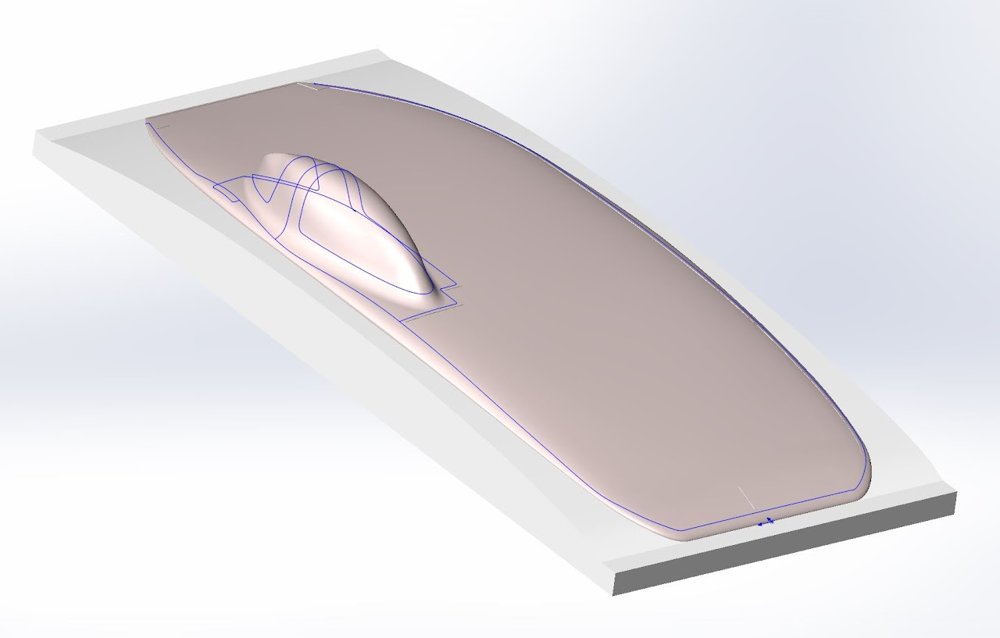
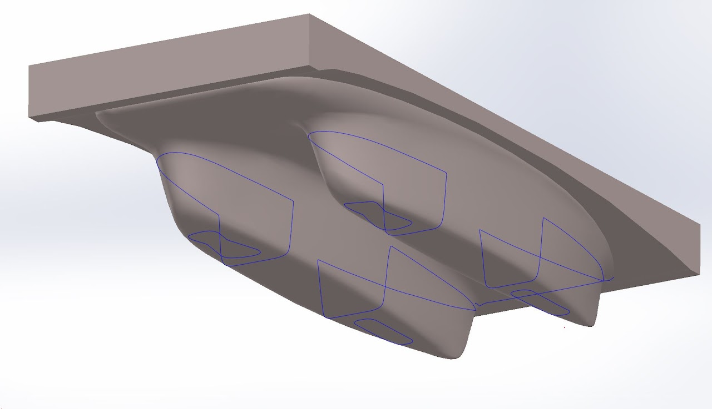

# SSCP - Mold Files

# Mold Files

** Key Tip for Future Cycles **

The junction between the aerobody and the extruded mold flange cannot be a true right angle. A great way to avoid this problem is to add some vertical material around the perimeter of the topshell and bottomshell, and add a scribe line where the piece actually should be trimmed for a perfect fit. We weren't aware of this, otherwise we would have made the sundae mold files this way. Bayview Composites made these fillets 1/8" radius - the same that was done on Zenith in 2010.

** Dropbox Link to Sundae Files ** 

[ Dropbox Link to Sundae Files](https://www.dropbox.com/sh/0cvob9e1rh8z116/AAAIpdmbbs74Y6-pWN-8lbNza?dl=0)

We made the molds files on Solidworks, but we exported the final files with NX because that's what Bayview was using, and there were good customization options to export curves. These export options might exist on Solidworks, but I didn't find them. NX does have a big menu of features for mold creation. Not sure how good that is, but future teams could explore.

