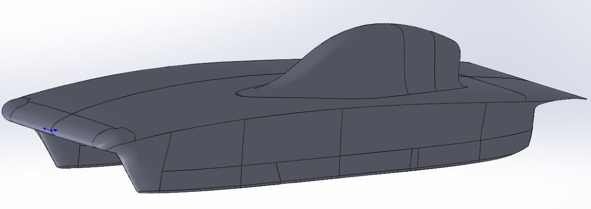

# SSCP - Sundae Concept Cars

# Sundae Concept Cars

7. sundae-concept-bullet-001

The only iteration of the 4 square meter, 3-wheeled car styled after Solar World No. 1.

CAD and Mesh: Yuji, Mesh and CFD: Rachel (Azure)

This concept was meant to be another shot at a bullet-style car, but with 3 wheels, as we did not yet know whether the rules would dictate 3 or 4 wheels. While the concept is good, our implementation needs smoothing out. The numbers came out COMICALLY bad, and this needs to be examined in Tecplot before continuing with any variant of this concept.

CLA: 0.164914

Lift: 61.0774 N

CDA: 0.348522

Drag: 129.0783 N

>> CONCEPT-CRUISER CONCLUSIONS: 

This concept is taller than a typical challenger car, which does inherently increase chance of rollover but is not game over for this concept. Like the 4m4w concept, almost the entire side of the car is the fairing, with even more area for crosswind force. Driver visibility is somewhat problematic and high maintenance in this concept, because the entire front nose of the car must be bubble. These numbers are at least comparable with the previous concept, though drastic changes are likely needed to make it anywhere near shippable.

6. sundae-concept-cruiser-003

The third iteration of the 4 square meter, Kogakuin cruiser style car.

CAD: Yuji, Mesh and CFD: Rachel (Sabalcore)

Changes to this iteration (from the first iteration) include decreasing windscreen area by raising the nose of the mainfoil, thus making the car at least smaller than Arctan. Underbelly camber also decreased.

Results: Not terrible considering this is basically our first reasonable iteration. Not great either.

CLA: 0.0304862

Lift: 11.2908 N

CDA: 0.0929864

Drag: 34.4384 N

5. sundae-concept-cruiser-002

The second iteration of the 4 square meter, Kogakuin cruiser style car.

CAD: Yuji

This car did not fit a driver and had a big surface imperfection at the tail, so was not finished or run through CFD. It is here for documentation purposes.

4. sundae-concept-cruiser-001

The first iteration of the 4 square meter, Kogakuin cruiser style car.

CAD: Yuji

This car is about the same size as Arctan (which was not our original intention) due to packaging issues. The windscreen area takes up a significant portion of the car due to the low airfoil nose, thus making the array area enlarge the car to Arctan size. This car was likely to have downforce problems at the nose (as well as an unnecessarily high frontal area) and lift problems in the belly, so we did not run this car through CFD.

>> CONCEPT-4m4w CONCLUSIONS: 

This concept turned out very fat primarily due to the unchanged wheel envelope but downsized car size. Drag was not decreased significantly (~3 N realistically) from Arctan, indicating that perhaps there is a better design for a 4 square meter car. The entire side of the car is the fairing, unfortunately, which not only looks silly but makes the entire car a sail. Other designs to be explored...

3. sundae-concept-4m4w-003

The third iteration of the 4 square meter, 4 wheeled concept car.

CAD and Mesh: Yuji, CFD: Rachel (Azure)

CLA = 0.110931

Lift = 41.084 N

CDA = 0.0881599

Drag = 32.6 N

Made the fairing hole bigger in order to have greater continuity on the inner fairing edges. Slight decrease in drag from previous iteration, increase in lift. Aero likes smoothness, turns out. This is the final iteration in this round of concepts and gives us a decent idea of what this concept would be like.

2. sundae-concept-4m4w-002

The second iteration of the 4 square meter, 4 wheeled concept car.

CAD: Yuji, Mesh and CFD: Rachel (Azure)

Total CLA: 0.0772

Lift = 28.5762 N

Total CDA: 0.0896

Drag: 33.1898 N

This iteration fits the rear suspension this time, and attempts to use a flatter mainfoil to combat the severe downforce of the previous iteration. Not a huge surprise that fitting the suspension increased the drag significantly. On the bright side, we have lessened downforce (to the point of having some lift). A question for the CFD arises from this iteration: is it better to expand the fairing hole wider all around, rather than just at the rear, to maintain better curvature continuity? (See image of fairings from ground up.) Yuji will alter -002 to make the fairing hole bigger.

1. sundae-concept-4m4w-001

The first iteration of the 4 square meter, 4 wheeled concept car.

CAD: Yuji, Mesh and CFD: Rachel (Azure)

Frontal Area: ~0.71 sq m (assume for all of these concepts, AF is same)

The second run of this car was done with an estimated reference area (0.725 m^2):

Total CL: -0.509426

Lift = -136.7862 N

Total CD: 0.112041

Drag: 30.0842 N

The first run of this car was done with the incorrect (Arctan's) reference area of 1 m^2:

Total CLA: -0.369334

Lift = -136.7862 N

Total CDA: 0.0812295

Drag = 30.0841 N

Our first concept car has been run through CFD -- these numbers don't mean a whole lot right now without regulations, but they give us a roundabout number for what a 4 square meter, 4 wheeled car would look like aerodynamically.

This car has more than 4 sq meters of array space in order to fit a wheelbase -- for his next iteration, Yuji will be decreasing the track width since there's not as much we can do about the wheelbase. Also, this car does not fit a rear suspension, and the bubble is comically large (the fairings will get taller to fix this).

Overall, the drag is lower than Arctan as expected, since it is a smaller car. There is a comically high downforce, indicating that we need more camber in the underbelly of the mainfoil.

Note that this car was originally run in CFD with a reference area of 1 m^2. However, this car has a reference (frontal) area of more like 0.71 m^2. The reference area is used to solve for the CD and CL iteratively in CFD. Then, using the CD and CL, we can calculate the respective drag and lift forces using the same equation Force = 0.5*(density of air)*(speed)^2*(coefficient)*(reference area). 

So there was reason to believe that using the wrong reference area would produce incorrect forces. However, we've just learned something about the reference area with this latest CFD run using the corrected reference area. It appears that the use of the reference area is circular like it seems (see above description). While the CL/CD are calculated by CFD using a given reference area, we also calculate the forces using the CL/CD and the original given reference area.

The forces are exactly the same (within 0.0001)!

