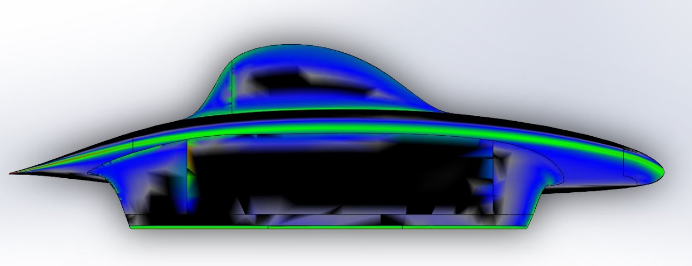

# sundae-iterations

## SSCP - Sundae Iterations

## Sundae Iterations

#### Embedded Content

Embedded content: [Embedded Content](./)

The internal site has been struggling to properly store pictures for documentation (it turns out that it overwrites pictures that are uploaded with the same name), so we will use a Google Slideshow from now on to ensure that no more information is lost:

#### Embedded Content

Embedded content: [Embedded Content](./)

\*\* See Google Slides Presentation for More Recent Iterations \*\*

Sundae-TDP-016

CAD: Yuji; Mesh: Ashe

Mech Assembly: sundae-005-assy

Thinner mainfoil. Best fat body car so far. Height up bubble is 0.37m, which is probably too tall for array shading (Luminos bubble height: 0.31m & Arctan bubble height: 0.34m). Surface mistakes on fairings. Ben might re-do the fairings on this car. Mainfoil has a lot of lift, which created large high pressure region on nose. However, this car has a nearly perfect induced drag, so we might have to tune in more lift while decreasing the curvature of the mainfoil. The high curvature in the mainfoil helped Yuji fit the tall leading and trailing arms. Alternatively, we could just raise the height of the mainfoil, but we need to take into account the height of the CG with this narrow track width (1m).

Sundae-TDP-015

CAD: Yuji; Mesh: Rachel

Mech Assembly: sundae-003-assy

Made fairing fillets bigger

Sundae-TDP-014

CAD: Yuji; Mesh: Rachel

Mech Assembly: sundae-003-assy

luminos-concept-golshan

CAD: Nathan G; Mesh: Rachel

Golshan's re-do of Luminos with long nose overhang with 6 m^2&#x20;

Drag: \~42N

Sundae-TDP-013

CAD: Yuji; Mesh: Rachel

Mech Assembly: sundae-005-assy

Return to the bullet design: Nose was too blunt, however drag is decreasing from earlier bullet concepts. Future iterations will make the nose longer to encourage laminar flow. Inside joint between fairings and main body can be smoothed out.

After this iteration, we suspended work on bullet design because the curvature would likely hurt the array significantly, and the drag numbers are nowhere near alternative designs.

Sundae-ASS-005

CAD: Jason; Mesh: Ashe & Rachel

Mech Assembly:

ASS-004 with 3 fairings rather than 5

Conclusions:

Sundae-BEN-005

CAD: Ben; Mesh: Ashe

Mech Assembly:&#x20;

Improvements from BEN-004, such as a driver fairing instead of bulge and a less weird bubble.

Sundae-ASH-003

CAD: Ashe; Mesh: Ashe

Mech Assembly:

Does not fit driver or wheels/tires, needs more array area.

Sundae-TDP-012

CAD: Yuji; Mesh: Ashe

Mech Assembly:

TDP-011 with overlapping split fairing (did not work well)

Sundae-TDP-011

CAD: Yuji; Mesh: Ashe

Mech Assembly:

TDP-010 with a thinner mainfoil

Sundae-TDP-010

CAD: Yuji; Mesh: Ashe

Mech Assembly:

TDP-009 with a smaller driver fairing

Sundae-TDP-009

CAD: Yuji; Mesh: Ashe

Mech Assembly:

TDP-008 with a fixed bubble

Sundae-ASS-004

CAD: Jason; Did not run

Mech Assembly:

The mainfoil is too small to fit a battery pack, and there are some surface defects on the bottom of fairings and and the tail of the mainfoil.

Sundae-ASH-002

CAD: Ashe; Scrapped, started over with ASH-003

Mech Assembly:

Sundae-TDP-008

CAD: Yuji; Mesh: Ashe

Mech Assembly:

TDP-007 with larger fillet between driver fairing between and mainfoil decreased drag 1.3 N. This iteration proved that fine-tuning the driver fairing can return valuable returns.

Sundae-TDP-007

CAD: Yuji; Mesh:&#x20;

Mech Assembly:

Bubble mistake creating additional drag; rear fairings creating more drag than HRH-001 or BEN-004; driver fairing could be smaller

Sundae-TDP-006

CAD: Yuji; Mesh:&#x20;

Mech Assembly: sundae-002-assy (front A Arm, rear trailing arm)

Mostly the same as 005, but the front of the mainfoil is fattened and the front fairing hole is enlarged. This ensures that the front A-arms will fit.&#x20;

Sundae-TDP-005

CAD: Yuji; Ashe: ;

Mech Assembly: sundae-002-assy (front A Arm, rear trailing arm)

Same concept as 004, but raised nose and brought forward. Does not actually fit the front A arms.&#x20;

Sundae-BEN-004

CAD: Ben

Sundae-TDP-004&#x20;

CAD: Yuji

Mech Assembly: sundae-002-assy (front A Arm, rear trailing arm)

Failed iteration. This car utilized a 5 fairing design, but instead of creating a new fairing a bump was also created in the main foil in order to fit the driver. A bump was also created in the front in order to fit the front A arms.&#x20;

Main foil looked too bumpy. 005 will attempt to fix this by bringing up the nose of the car in order to envelop the suspensions better.&#x20;

sundae-ASH-001 (five fairing)

CAD: Ashe

Mech assembly: sundae-001-assy (front and rear A arm suspension)

First iteration of Ashe's five fairing.

sundae-BEN-002 ("Is that Luminos?")

CAD: Ben, Mesh and CFD: Rachel

Mech assembly: sundae-001-assy (front and rear A arm suspension)

Fixed mainfoil tail of -001. (Same car otherwise.) Having issues with running through CFD, possibly due to units being changed MMGS.

sundae-BEN-001 ("Is that Luminos?")

CAD: Ben, Mesh: Rachel

Mech assembly: sundae-001-assy (front and rear A arm suspension)

Future iterations of this car will have a thinner main foil, but will use a bulge to house the driver instead of a fairing (sundae-HRH uses a fairing). The main foil can be slimmed down using the same trick elaborated on in the sundae-HRH description. &#x20;

Unable to mesh due to mainfoil tail having 0 thickness at its edges.

sundae-TDP-003 (banana car)

CAD: Yuji, Mesh: Motas, CFD: Rachel

Mech assembly: sundae-001-assy (front and rear A arm suspension)

Same body as -002. Fairing holes made larger, fairing fillets also larger. Significantly higher drag than -002 indicates that sharper fairing fillets (and thus smaller fairing holes) could be better for drag.

sundae-TDP-002 (banana car)

CAD: Yuji, Mesh and CFD: Rachel

Mech assembly: sundae-001-assy (front and rear A arm suspension)

Same body as -001. Fairing tails chopped off to 4mm. Fairing quality improved, fillets smoothed out.

sundae\_HRH-001 (5-fairing)

CAD: Hayden and Rachel, Mesh and CFD: Rachel

Mech assembly: sundae-001-assy (front and rear A arm suspension)

This car experimented with using bulges in the main foil to fit the front suspension (the same can be applied to the rear later if necessary). The underbody of Nuon's 2015 car was the inspiration for this. Our thinking was that we could use a thinner airfoil in the main body while still fitting suspension arms. In retrospect, we could have used a thinner main airfoil for this iteration, and the bottom on the airfoil on the nose should be thinner/sharper. Everything related to fitting the driver (fifth fairing and bubble) is pretty ugly/archaic. This will be improved in later iterations either by using a bulge on the underbody or a more complicated fairing design to fit the driver. We moved the driver as high as possible in an effort to decrease the presence of the driver's wide hip constraints. However, this resulted in an awkwardly tall bubble.&#x20;

In Tecplot, we can see that the flow was not directed exactly right into the inside of the second fairing, since there's a low pressure zone on the inside of the second fairing and the high pressure zone is not on the leading edge of the second fairing but on the outside of it. The bulges create some low pressure zones. The fifth fairing did not contribute much to drag at all, though keep in mind that it was quite small with the bubble being quite large.

sundae-TDP-001 (banana car)

CAD: Yuji, Mesh and CFD: Rachel

Mech assembly: sundae-001-assy (front and rear A arm suspension)

Unable to run through CFD (the mesh diverged) due to the sharp tail of the cambered fairings and resulting self-intersecting geometry in the mesh.
