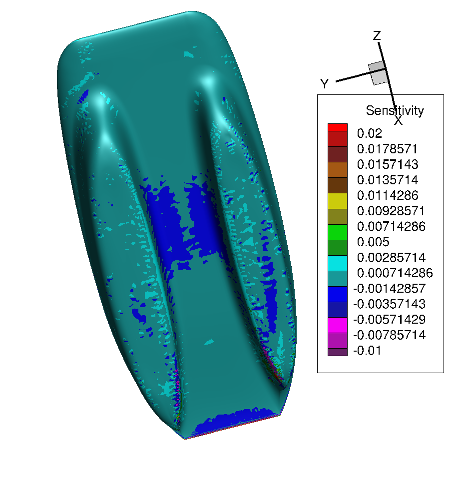
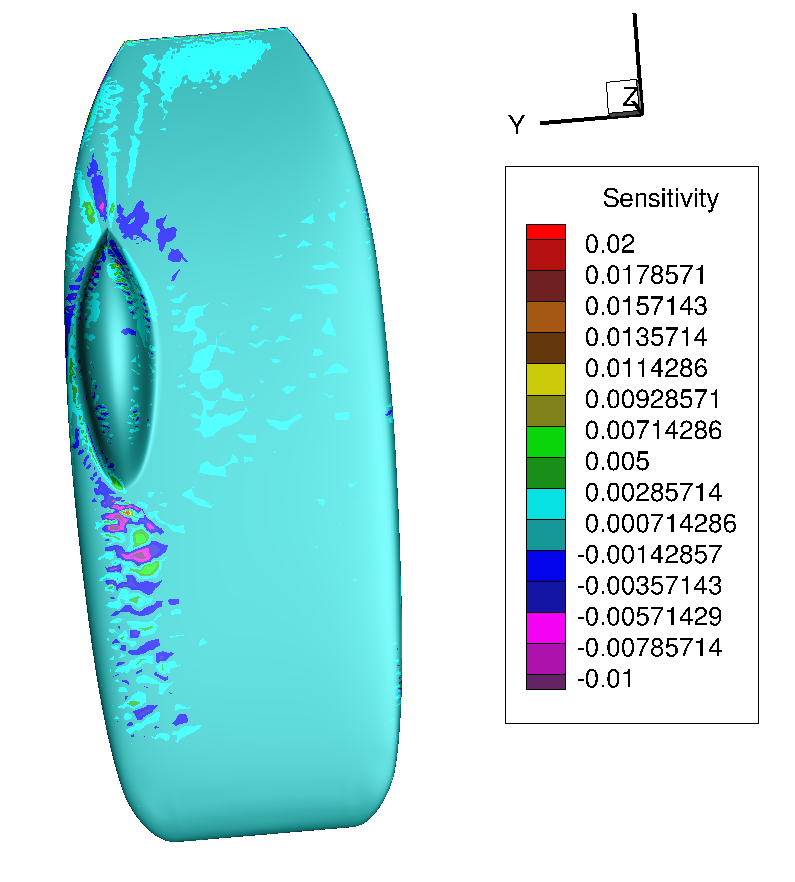
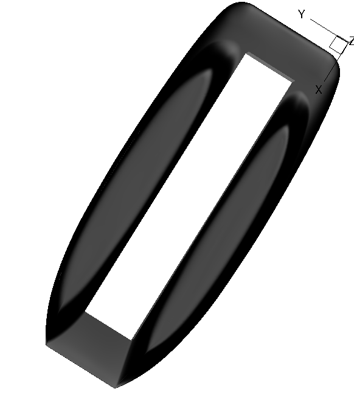
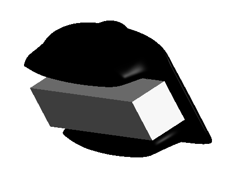
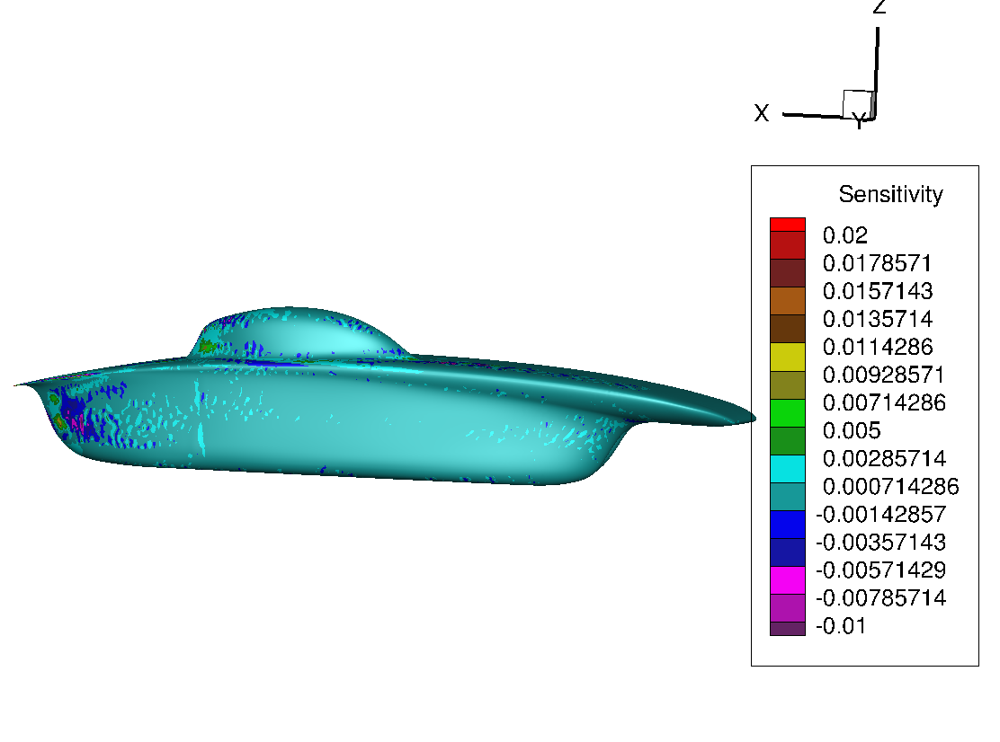
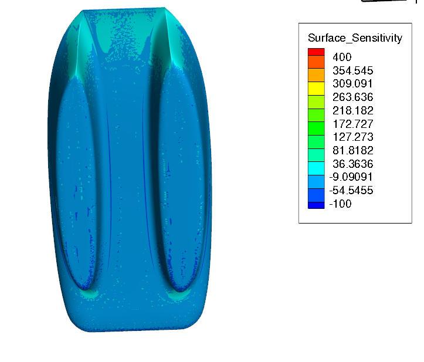

# adjoint-optimization-mesh-deformation

## SSCP - Adjoint Optimization / Mesh Deformation

## Adjoint Optimization / Mesh Deformation

Here we document outputs from our adjoint solver and mesh deformation runs.

The adjoint solver can be run to optimize either lift or drag.

The adjoint solver calculates sensitivities, showing where we need to "push in" or "pull out" to optimize the aerobody.

### sundae-TDP-033

#### lift reduction

Push in the dark blue / purple areas to increase lift (reduce downforce).

Pull out the light blue to reduce lift.

&#x20;&#x20;

### sundae-TDP-031

#### drag reduction

Deformations

Here is the belly deformation box set to run on sabalcore.

Run has not been completed.

Sensitivities

Teal/Green means "pull out" to reduce drag.

Dark blue means "push in" to reduce drag.

These plots suggest that to reduce drag:

1. "pull out" the back of the fairings and bubble as much as possible.  Of course, we can't eliminate all separation from these regions, but the effect is significant and we must do what we can.
2. Soften the bubble-mainfoil and fairing-mainfoil transitions, just near the junction.
3. Widen the fairing channel, focusing at the junction between the fairings and the mainfoil.

