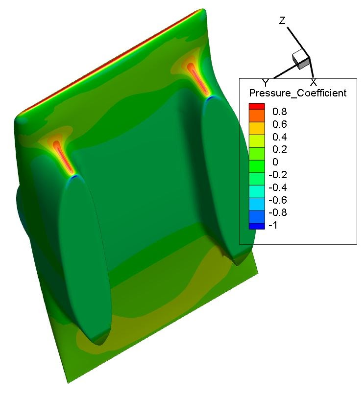
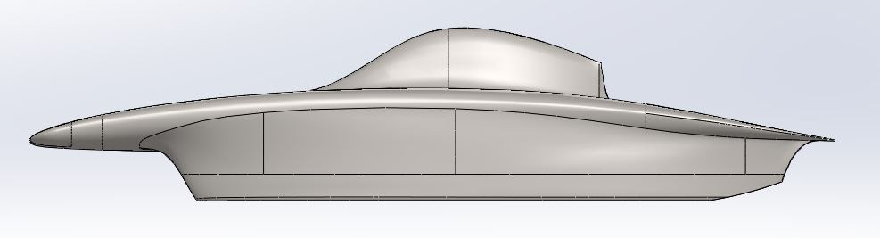

# sunwhale-rear-steer-study-iterations

## SSCP - Sunwhale Rear Steer Study Iterations

## Sunwhale Rear Steer Study Iterations

Modifications of Arctan

Arctan numbers for reference: CD = 0.0973, Drag Force = 36.1 N, CL = -0.0012, Lift Force = 0.44 N

6. Sunwhale-040-asym-v2

CAD and mesh: Yuji, SU2: Max D (Azure)

* asymmetric thin non-driver fairing foil version of thin-v4
* Arctan mainfoil and bubble

Results: drag lower than Arctan, some lift. Promising results, need to double check that this will fit the steering envelope. This does indicate that thinner fairings WILL lower drag, but the fairing has been drastically thinned here with only about 0.5 N of drag reduction.

> CD = 0.09628

> Drag Force = 35.66 N&#x20;

> CL = 0.02163

> &#x20; Lift Force = 8.01 N

5. Sunwhale-040-thin-v4

CAD and mesh: Rachel, SU2: Rachel (Sabalcore)

* fairings same shape and size (not thinner) but shifted back 350 mm (to have a smoother fairing blend and still fit suspension and steer envelope)
* Arctan mainfoil and bubble

Results: drag VERY similar to Arctan, some downforce (not too bad)

> CD = 0.0981511

> Drag Force = 36.35 N&#x20;

> CL = -0.0153593

> &#x20; Lift Force = -5.69 N

Next: Yuji will be making an asymmetric version of this and Rachel will be further fine-tuning this version.

Tecplot: Sunwhale-040-thin-v3 vs Sunwhale-040-thin-v2: what went wrong?

The biggest contributing factor to the increased drag in thin-v3 was likely the sharp fairing leading edge dropoff that was created to better fit the steering envelope into the car. This resulted in a lot more pressure on the fairing leading edge. The dropoff didn't necessarily have to be this way, though it did make the fairing a little shorter than it would have been with Arctan's more gradual dropoff (as v2 has). The next step is to edit v3 to have the same Arctan dropoff. After that, hopefully we will see better drag performance.

4. Sunwhale-040-asym-v1

CAD and mesh: Yuji, SU2: Max D (Azure)

* non-driver fairing made smaller
* Arctan mainfoil and bubble

Results: Lift OK (the first car so far to have gotten actual lift), drag significantly increased.

> CD = 0.102615

> Drag Force = 38.0 N

> CL = 0.00664763

> &#x20; Lift Force = 2.46 N

Next: Look in Tecplot to see what is going on.

3. Sunwhale-040-thin-v3

CAD and mesh: Rachel, SU2: Rachel (Azure)

* fairings shorter (the crossover between v2 and Arctan's fairings) and shifted back 450 mm
* Arctan mainfoil and bubble

Results: Lift OK, drag increased

> CD = 0.9977

> Drag Force = 36.95 N

> CL = -0.0039

> Lift Force = -1.44 N

Next: Look in Tecplot to see what is going on.

2. Sunwhale-040-thin-v2

CAD and mesh: Rachel, SU2: Max D (Azure)

* fairings same shape and size (not thinner) but shifted back 450 mm
* Arctan mainfoil and bubble

Results: Drag slightly decreased from Arctan values. Lots of downforce. Altered location of fairings seems to have changed the downforce but not the drag.

> CD = 0.0968

> Drag Force = 35.85 N

> CL = -0.12

> Lift Force = -44.4 N

Next: make the fairings thinner but maintain the shape

1. Sunwhale-040-thin

CAD and mesh: Rachel, SU2: Max D (Azure)

* thinner fairings in rear steer study
* Arctan mainfoil and bubble

Results: Drag increased from Arctan values, possibly caused by downforce(?). The fairing shape was warped in the process of fitting the new front and rear steering envelopes, so it is likely that the altered shape (which was tuned for Arctan to have low drag and 0 lift) has caused the drag increase.

> Coefficient of drag: 0.101794

> > Drag Force: 37.70 N

> Coefficient of lift: -0.043361

> > Lift Force: -16.1 N

Next: moving Arctan's fairings back (so that the leading edges of the fairing encompass the thinner steering envelope) and maintaining the shape, possibly making them thinner but not redrawing the fairing.
