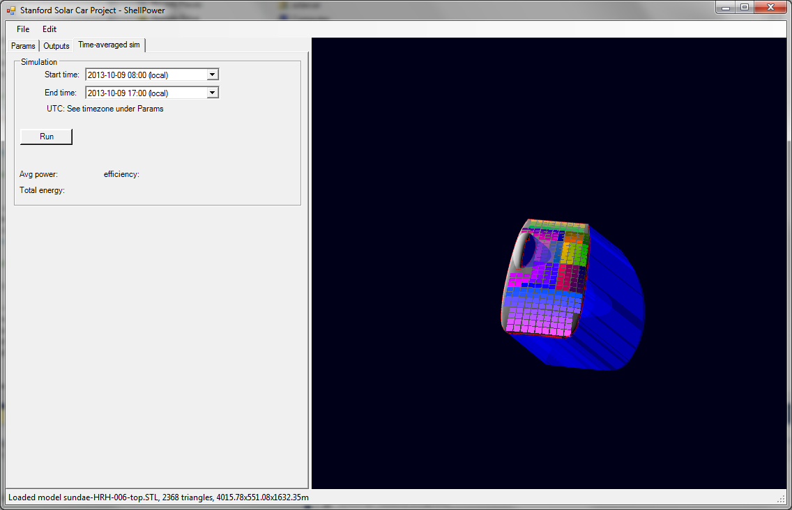
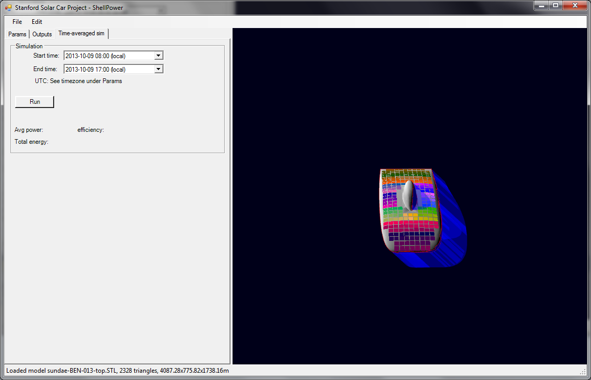

# symmetric-vs-asymmetric-array-analysis

## SSCP - Symmetric vs Asymmetric Array Analysis

## Symmetric vs Asymmetric Array Analysis

This page shows the difference in array power generation between two similar aero-bodies: an asymmetric (HRH-006) and a symmetric (BEN-013).  The array was 4m^2 array, non-diced.  Simulation took place just outside of Cooper Pedy (lat: -29.01111, long: 134.75555) from 8am-5pm.

Attached is a folder with all files necessary for re-running the simulation in Shellpower.

Graph of power generated over course of day

During the first half of the day, asymmetric has 50-100W improvement.  This is a ballpark estimate; Shellpower slightly underestimates power generation.

As expected, power generation is similar over the second half of the day.&#x20;

Also contains a day of Arctan Race data for comparison.  Click to view in new tab.

#### Embedded Content

Embedded content: [Embedded Content](symmetric-vs-asymmetric-array-analysis.md)

HRH-006

BEN-013

#### Embedded Google Drive File

Google Drive File: [Embedded Content](https://drive.google.com/embeddedfolderview?id=1ESNVVDdGRYbOP6-b7S8NWedcsNGbJg4v#list)
