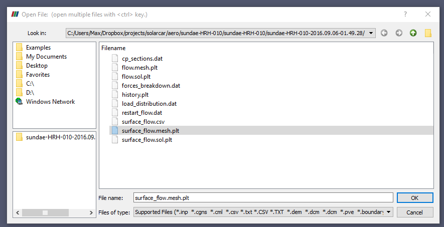
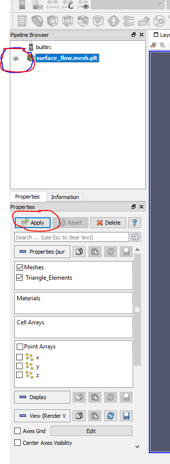
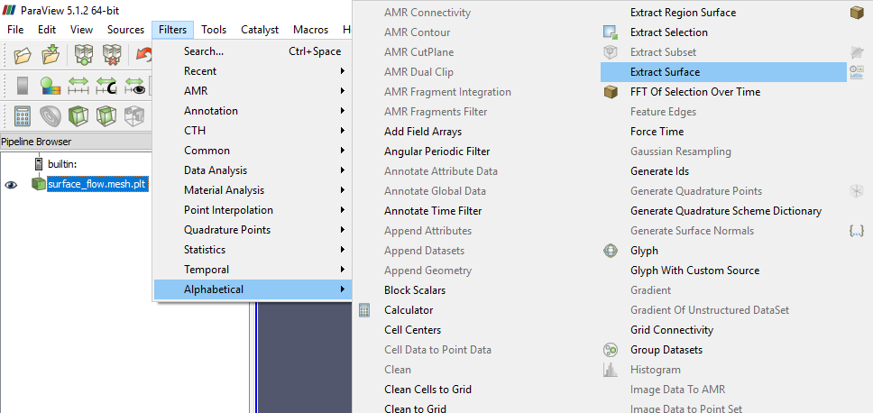
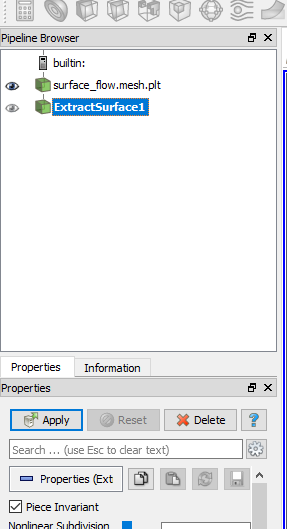
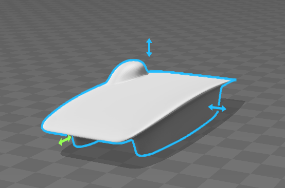

# create-stl-from-tecplot-output

## SSCP - Create .stl from Tecplot Output

## Create .stl from Tecplot Output

SU2 exports tecplot files which can be converted to .stl.  This is useful for recreating the output of an adjoint optimizer run in CAD.

Steps:

1 Download Paraview

[Paraview](http://www.paraview.org/download/)

2 Open Tecplot surface mesh output in Paraview

3 Click the eye in the left sidebar and also click Apply below.

4 Filters > Alphabetical > Extract Surface

5 Click apply in left sidebar.

6 With your new ExtractSurface selected, File > Save Data.  Choose file type to be stl.  Use ASCII for better cross-compatability.

Note that this exported STL is not a surface, merely the mesh (many small polygons) in a new file format.
