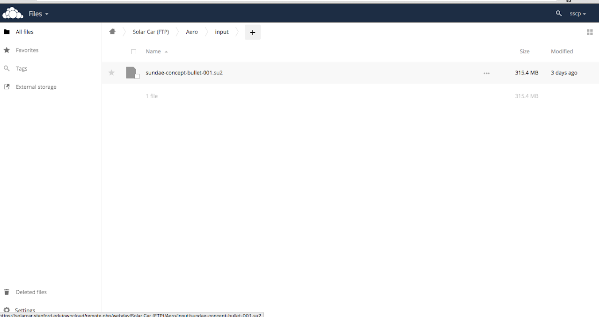
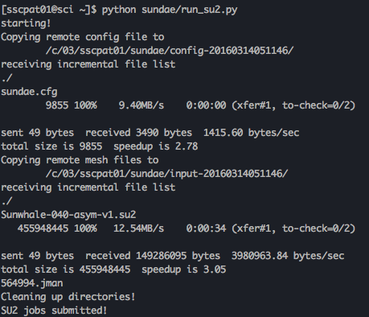

# SSCP - How to Run a Mesh Through SU2

# How to Run a Mesh Through SU2

Hello there.  Welcome to this amazing guide on how to run your mesh through SU2 using our awesome custom python script. What are you waiting for?  Let's get started!!

(If you're looking for instructions on how to run a mesh "by hand", please see "Running a mesh through SU2 'by hand'" on the Team Drive.)

SABALCORE

### Step 1: Copy your meshes to our SFTP server

Navigate to /Solarcar/Aero/2018/su2_queue on our fileserver using OwnCloud or SFTP. [owncloud link]  

[ OwnCloud]()

[SFTP](/stanford.edu/testduplicationsscp/home/new-member-orientation/sftp-access)

[owncloud link](https://solarcar.stanford.edu/owncloud/apps/files/?dir=%2FSolar%20Car%20%28FTP%29%2FAero%2Finput)

Copy your mesh into that directory.

Please do NOT modify the config file located in su2_configs/v4, the script will automatically update the default config file with your mesh's name.

(You can find a default config file for version 4 in /Solarcar/Aero/config_template/)

### Step 2: SSH into Sabalcore

If you have mac or linux, just open the command line and type ssh sscpat03@scicluster.com.  If windows and you do not have ssh, the easiest thing to do is install an ssh client for google chrome. You can also install a Linux emulator such as Ubuntu for Windows from the Microsoft store.

[ ssh client for google chrome](https://chrome.google.com/webstore/detail/secure-shell/pnhechapfaindjhompbnflcldabbghjo?hl=en)

Using SU2 4.3.0 (recommended)

username: sscpat03

password: Solarpower2017

(hostname: scicluster.com)

Using SU2 6.1.0

username: sscpat01

password: Solarpower2019

(hostname: scicluster.com)

### Step 3: Run the python script

Type python /sunrise/run_su2.py at the command line, now that you have established your ssh connection. 

Select the folder with your mesh and config file when prompted. 

Make sure an error does not occur. If you are asked for a password, input "solarpower" (this required input will be removed soon.)

For each .su2 mesh you put in /2018/su2_queue, you'll be asked for a total number of cores you want to use and a cluster you want to run on.

Wait until "SU2 jobs submitted!" shows up and then close out of your session.

### Step 4: Checking up on your job

If you want to check on the progress of a job, you can type qstat in while ssh'd into the Sabalcore cluster. Your job will have a name, and then some other information including a single letter indicating its status and a time that shows how many core hours the job has run thus far. Q stands for in queue, E stands for error, R stands for running, and C stands for complete. Here are the steps to view the output from SU2 (to check for convergence, for example):

1. Navigate to SU2.out by typing cd ~/sunrise/inprogress/name_of_your_job
2. Open the SU2.out file using vim by entering vi SU2.out
3. Scroll through the file to see SU2's output
4. Exit SU2.out by using the command :q! (you can just type it and hit enter) so that you exit without saving!

Navigate to SU2.out by typing cd ~/sunrise/inprogress/name_of_your_job

Open the SU2.out file using vim by entering vi SU2.out

Scroll through the file to see SU2's output

Exit SU2.out by using the command :q! (you can just type it and hit enter) so that you exit without saving!

See the bash and vim mini-tutorials on "Running a mesh through SU2 (by hand)" if you'd like to learn more about navigating directories and using vim!

### Step 5: Wait 5ish hours and your job will be complete!

The results appear in Aero/output/ on the SFTP server automatically when SU2 is complete.

