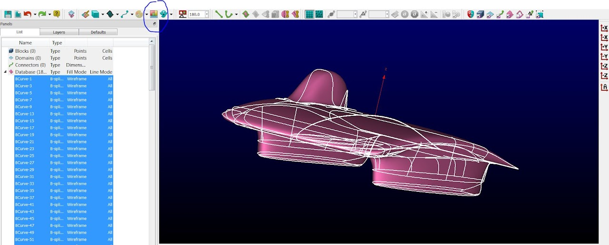
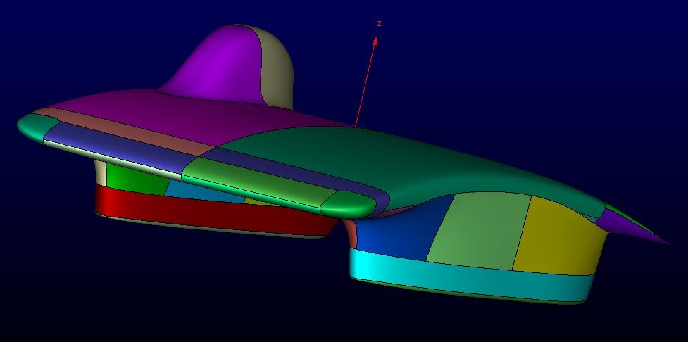
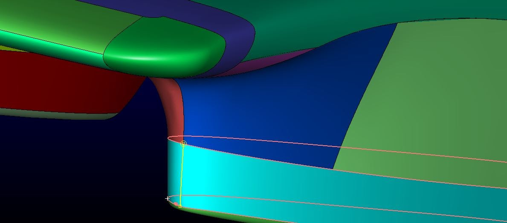

# SSCP - Pointwise: New Techniques

# Pointwise: New Techniques

Videos:

* MESHING TUTORIAL VIDEOPointwise Automatic Meshing Meeting Video. You can find a higher quality version for download here.
* Pointwise Automatic Meshing Meeting Video. You can find a higher quality version for download here.

MESHING TUTORIAL VIDEO

[MESHING TUTORIAL VIDEO](https://youtu.be/jyRz937yKSI)

* Pointwise Automatic Meshing Meeting Video. You can find a higher quality version for download here.

Pointwise Automatic Meshing Meeting Video. You can find a higher quality version for download here.

[Pointwise Automatic Meshing Meeting Video](https://youtu.be/RfM7zmVt5aY)

[ here](https://pointwiseenterprise.sharefile.com/share?cmd=d&id=s2c6bf198296406b9#/view/s2c6bf198296406b9?_k=pa8zjp)

Brief intro to meshing here.

[ here](/stanford.edu/testduplicationsscp/home/sscp-2014-2015/aero-2014-2015/pointwise-meshing-and-simulation)

Perhaps also of interest:

* The webinar we did with Pointwise and Tecplot about Arctan cycle aero.And the case study based on that webinar.
* The webinar we did with Pointwise and Tecplot about Arctan cycle aero.
* And the case study based on that webinar.

* The webinar we did with Pointwise and Tecplot about Arctan cycle aero.
* And the case study based on that webinar.

The webinar we did with Pointwise and Tecplot about Arctan cycle aero.

[ webinar](https://www.youtube.com/watch?v=DpJbuGszrgE)

And the case study based on that webinar.

[ case study](http://www.tecplot.com/blog/2016/06/07/stanford-solar-car-projects-race-aerodynamic-efficiency-2/)

This cycle, we are going to see if we can do a couple things differently:

* Automatic MeshingIn Pointwise, "automatic meshing" means taking a mesh from a previous car and importing onto a new database (new car). To do this, the number of quilts (surfaces) and general location of the surfaces needs to be the same. Many of the Sunwhale iterations had completely different numbers of surfaces. If this is true again this cycle, the databases can be edited (split and combined) so that the quilts are the same across multiple cars.More Efficient MeshesLast cycle, we just used the databases as they were imported into Pointwise. However, by splitting and combining databases (as mentioned above), we can place points where we need more points (leading and trailing edges and sharp corners) and not specify points where they are unnecessary.Surface T-Rexs (basically a fake boundary layer for a surface mesh) can also minimize mesh size and increase quality.
* In Pointwise, "automatic meshing" means taking a mesh from a previous car and importing onto a new database (new car). To do this, the number of quilts (surfaces) and general location of the surfaces needs to be the same. Many of the Sunwhale iterations had completely different numbers of surfaces. If this is true again this cycle, the databases can be edited (split and combined) so that the quilts are the same across multiple cars.
* More Efficient MeshesLast cycle, we just used the databases as they were imported into Pointwise. However, by splitting and combining databases (as mentioned above), we can place points where we need more points (leading and trailing edges and sharp corners) and not specify points where they are unnecessary.Surface T-Rexs (basically a fake boundary layer for a surface mesh) can also minimize mesh size and increase quality.
* Last cycle, we just used the databases as they were imported into Pointwise. However, by splitting and combining databases (as mentioned above), we can place points where we need more points (leading and trailing edges and sharp corners) and not specify points where they are unnecessary.
* Surface T-Rexs (basically a fake boundary layer for a surface mesh) can also minimize mesh size and increase quality.

Automatic Meshing

* In Pointwise, "automatic meshing" means taking a mesh from a previous car and importing onto a new database (new car). To do this, the number of quilts (surfaces) and general location of the surfaces needs to be the same. Many of the Sunwhale iterations had completely different numbers of surfaces. If this is true again this cycle, the databases can be edited (split and combined) so that the quilts are the same across multiple cars.
* More Efficient MeshesLast cycle, we just used the databases as they were imported into Pointwise. However, by splitting and combining databases (as mentioned above), we can place points where we need more points (leading and trailing edges and sharp corners) and not specify points where they are unnecessary.Surface T-Rexs (basically a fake boundary layer for a surface mesh) can also minimize mesh size and increase quality.
* Last cycle, we just used the databases as they were imported into Pointwise. However, by splitting and combining databases (as mentioned above), we can place points where we need more points (leading and trailing edges and sharp corners) and not specify points where they are unnecessary.
* Surface T-Rexs (basically a fake boundary layer for a surface mesh) can also minimize mesh size and increase quality.

In Pointwise, "automatic meshing" means taking a mesh from a previous car and importing onto a new database (new car). To do this, the number of quilts (surfaces) and general location of the surfaces needs to be the same. Many of the Sunwhale iterations had completely different numbers of surfaces. If this is true again this cycle, the databases can be edited (split and combined) so that the quilts are the same across multiple cars.

More Efficient Meshes

* Last cycle, we just used the databases as they were imported into Pointwise. However, by splitting and combining databases (as mentioned above), we can place points where we need more points (leading and trailing edges and sharp corners) and not specify points where they are unnecessary.
* Surface T-Rexs (basically a fake boundary layer for a surface mesh) can also minimize mesh size and increase quality.

Last cycle, we just used the databases as they were imported into Pointwise. However, by splitting and combining databases (as mentioned above), we can place points where we need more points (leading and trailing edges and sharp corners) and not specify points where they are unnecessary.

Surface T-Rexs (basically a fake boundary layer for a surface mesh) can also minimize mesh size and increase quality.

Color your quilts

To identify your quilts, select all databases after importing and click the color palette (indicated below). Also, delete any database curves or lines - anything that is not a quilt or a model.

Now your quilts are indicated by color.

Split and Combine Quilts

To combine: Before you do anything else to your mesh, select all quilts and models and use Create > Assemble > Models to have everything in one model. You can go to Select > Mask > and deselect Models under Databases, so that when you attempt to select databases, you will not select the whole model but separate quilts. Use Create > Assemble > Quilts and select all the quilts you wish to assemble and then say Assemble. If the assembler has an issue with the tolerances (for both assembling models or quilts), lower the tolerance from 0.001 to 0.0001 and you should be OK.

In general, when combining quilts, you want to split and combine so that you end up with quilts for the two sides of either fairing, the bottom of each fairing, the two sides of the bubble, the top of the nose, the bottom of the nose, the top mid-section of the body, the bottom mid-section of the body, the top end section of the body, the bottom end section of the body, and the tail of the body.

To split: use Create > Draw Curves > Curve on Database...

Make sure you are drawing a Database curve (as your Entity Type) when you do this.

Hit the spacebar to toggle between databases. You cannot draw a curve across multiple databases at a time.

Hit Apply, then exit Draw Curves and select the quilt that you wish to split. Use Edit > Trim by Curves and Imprint the curve that you've drawn. Then your quilt will be split.

Surface T-Rex

Surface T-Rexs are good for leading and trailing edges and sharp edges as well (side of car or close to the tail). After you have initialized a given domain, you can right click the domain and > Domains > unstructured domains. There you see the details about your domain. Go to the Boundary Conditions tab, create a new boundary condition, and select the connector from which you wish to grow the Surface T-Rex. Make this boundary condition a Wall and give it a Wall Delta equal to the connector spacings that are bounding either side of your Wall connector. Under T-Rex, the number of layers will vary depending on where you are T-Rexing, but between 5-10 (and somewhere below that for Max Layers) is a good ballpark. I would change Growth Rate to 1 or 1.1 (whatever makes your mesh look better). Then go to Solve tab and hit Initialize. If your surface mesh explodes and disappears, perhaps it is better if you just undo those changes and pretend it never happened.

Rolling Wheels in the Mesh

From Travis Carrigan at Pointwise:

There are two primary ways of handling wheels when performing CFD:

1. When running a steady-state calculation (and unsteady for that matter), a rolling wheel is simply a boundary condition. Put all the wheel domains in a BC and apply a rotating wall condition on the solver side. Typically you’ll specify things such as the origin of the wheel, the axis of rotation, and the rotational velocity. This will depend on the solver and I encourage you to contact either David or Tom to see how the type of boundary condition is specified in SU2. So really in this case nothing changes on the meshing side.

2. For an unsteady simulation you can actually rotate the wheel grid by using a sliding interface. This is typically done when your wheel geometry is highly complex and you would gain a better understanding of the flow by resolving it in a time-accurate manner. You would build a block around the wheel that would have a rotational motion applied within the solver. Basically, you want a stationary volume mesh and rotating volume meshes for the wheels that share a common interface. Again, this can only be done if the solver supports it so you may want to check with the SU2 devs.

For your work I would imagine that simply setting up a rotating wall boundary condition for the wheel domains would be sufficient. Moving forward, you may want to perform full transient simulations and at that point may consider rotating the mesh itself.

