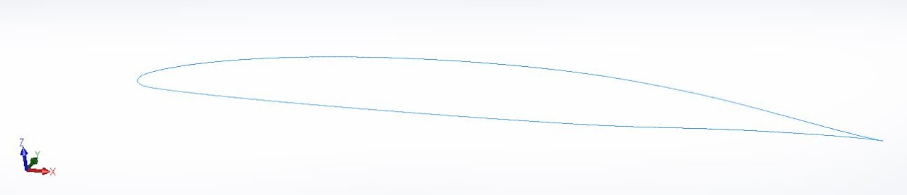

# surfacing-a-challenger-car

## SSCP - Surfacing a Challenger Car

## Surfacing a Challenger Car

THE FOLLOWING VIDEOS ARE NOT FOR DISTRIBUTION AMONG NON-SSCP MEMBERS:

GENERAL SURFACING VIDEO TUTORIAL

[GENERAL SURFACING VIDEO TUTORIAL](https://www.youtube.com/watch?v=HdpjFxuWt0Q)

CAD FILE FOR MAINFOIL, FAIRING AND BUBBLE VIDEOS

[CAD FILE FOR MAINFOIL, FAIRING AND BUBBLE VIDEOS](https://drive.google.com/a/stanford.edu/file/d/0B5DOOxTyn3aua2RHMGgxR2R5SVU/view?usp=sharing)

MAINFOIL STEP-BY-STEP SURFACING VIDEO TUTORIAL&#x20;

[MAINFOIL STEP-BY-STEP SURFACING VIDEO TUTORIAL](https://youtu.be/w5MiLGjJ7wk)

FAIRING STEP-BY-STEP SURFACING VIDEO TUTORIAL

[FAIRING STEP-BY-STEP SURFACING VIDEO TUTORIAL](https://youtu.be/a6TOyiEUvCg)

BUBBLE STEP-BY-STEP SURFACING VIDEO TUTORIAL

[BUBBLE STEP-BY-STEP SURFACING VIDEO TUTORIAL](https://youtu.be/76E9iF-_fEw)

This list will give a laundry list of all the tedious steps to surfacing a Challenger car example (in this case, Arctan). It's a work in progress at the moment -- Rachel and Yuji will be adding steps slowly but surely.

Main Body

* Import main body foil
* Import main body foil

1. Import main body foil

Import main body foil

* Insert > Curve > Curve through XYZ points... You can download the XY coordinates for a main foil online, but you need to add a Z column of 0's to your text file.
* Insert > Curve > Curve through XYZ points...&#x20;
* You can download the XY coordinates for a main foil online, but you need to add a Z column of 0's to your text file.
* Insert > Curve > Curve through XYZ points...&#x20;
* You can download the XY coordinates for a main foil online, but you need to add a Z column of 0's to your text file.

Insert > Curve > Curve through XYZ points...&#x20;

You can download the XY coordinates for a main foil online, but you need to add a Z column of 0's to your text file.

* Convert main foil sketchCreate a new sketch. Select the curve. Convert Entities.Select your new sketch. It has a constraint (little green cube) that is forcing it to be friends with your curve. You do not want them to be friends. Delete the little green cube.Now you can alter the airfoil proportions.Put the main foil on the correct planeRight click the sketch in the feature tree > Edit Sketch PlaneChoose the correct plane so that your sketch becomes oriented as such (this is the standard aero coordinate frame):
* Convert main foil sketchCreate a new sketch. Select the curve. Convert Entities.Select your new sketch. It has a constraint (little green cube) that is forcing it to be friends with your curve. You do not want them to be friends. Delete the little green cube.Now you can alter the airfoil proportions.
* Create a new sketch. Select the curve. Convert Entities.
* Select your new sketch. It has a constraint (little green cube) that is forcing it to be friends with your curve. You do not want them to be friends. Delete the little green cube.
* Now you can alter the airfoil proportions.
* Put the main foil on the correct planeRight click the sketch in the feature tree > Edit Sketch PlaneChoose the correct plane so that your sketch becomes oriented as such (this is the standard aero coordinate frame):
* Right click the sketch in the feature tree > Edit Sketch Plane
* Choose the correct plane so that your sketch becomes oriented as such (this is the standard aero coordinate frame):

1. Convert main foil sketchCreate a new sketch. Select the curve. Convert Entities.Select your new sketch. It has a constraint (little green cube) that is forcing it to be friends with your curve. You do not want them to be friends. Delete the little green cube.Now you can alter the airfoil proportions.
2. Create a new sketch. Select the curve. Convert Entities.
3. Select your new sketch. It has a constraint (little green cube) that is forcing it to be friends with your curve. You do not want them to be friends. Delete the little green cube.
4. Now you can alter the airfoil proportions.
5. Put the main foil on the correct planeRight click the sketch in the feature tree > Edit Sketch PlaneChoose the correct plane so that your sketch becomes oriented as such (this is the standard aero coordinate frame):
6. Right click the sketch in the feature tree > Edit Sketch Plane
7. Choose the correct plane so that your sketch becomes oriented as such (this is the standard aero coordinate frame):

Convert main foil sketch

* Create a new sketch. Select the curve. Convert Entities.
* Select your new sketch. It has a constraint (little green cube) that is forcing it to be friends with your curve. You do not want them to be friends. Delete the little green cube.
* Now you can alter the airfoil proportions.

Create a new sketch. Select the curve. Convert Entities.

Select your new sketch. It has a constraint (little green cube) that is forcing it to be friends with your curve. You do not want them to be friends. Delete the little green cube.

Now you can alter the airfoil proportions.

Put the main foil on the correct plane

* Right click the sketch in the feature tree > Edit Sketch Plane
* Choose the correct plane so that your sketch becomes oriented as such (this is the standard aero coordinate frame):

Right click the sketch in the feature tree > Edit Sketch Plane

Choose the correct plane so that your sketch becomes oriented as such (this is the standard aero coordinate frame):

* Dimension the main foilLocate the leading edge point on the foil and make it coincident with the origin.Dimension the length of the main foil (\~4.5 meters for Arctan).
* Dimension the main foilLocate the leading edge point on the foil and make it coincident with the origin.Dimension the length of the main foil (\~4.5 meters for Arctan).
* Locate the leading edge point on the foil and make it coincident with the origin.
* Dimension the length of the main foil (\~4.5 meters for Arctan).

1. Dimension the main foilLocate the leading edge point on the foil and make it coincident with the origin.Dimension the length of the main foil (\~4.5 meters for Arctan).
2. Locate the leading edge point on the foil and make it coincident with the origin.
3. Dimension the length of the main foil (\~4.5 meters for Arctan).

Dimension the main foil

* Locate the leading edge point on the foil and make it coincident with the origin.
* Dimension the length of the main foil (\~4.5 meters for Arctan).

Locate the leading edge point on the foil and make it coincident with the origin.

Dimension the length of the main foil (\~4.5 meters for Arctan).

Fairings

* Import a foil similarly to the main foil to use for your overall fairing shapePut the fairing curve in the correct plane (look at step 3 on main body)
* Import a foil similarly to the main foil to use for your overall fairing shape
* Put the fairing curve in the correct plane (look at step 3 on main body)

1. Import a foil similarly to the main foil to use for your overall fairing shape
2. Put the fairing curve in the correct plane (look at step 3 on main body)

Import a foil similarly to the main foil to use for your overall fairing shape

Put the fairing curve in the correct plane (look at step 3 on main body)
