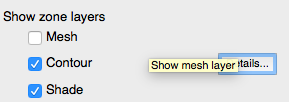
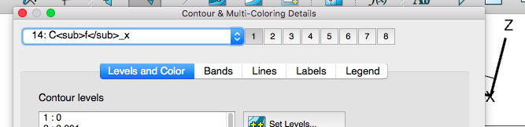
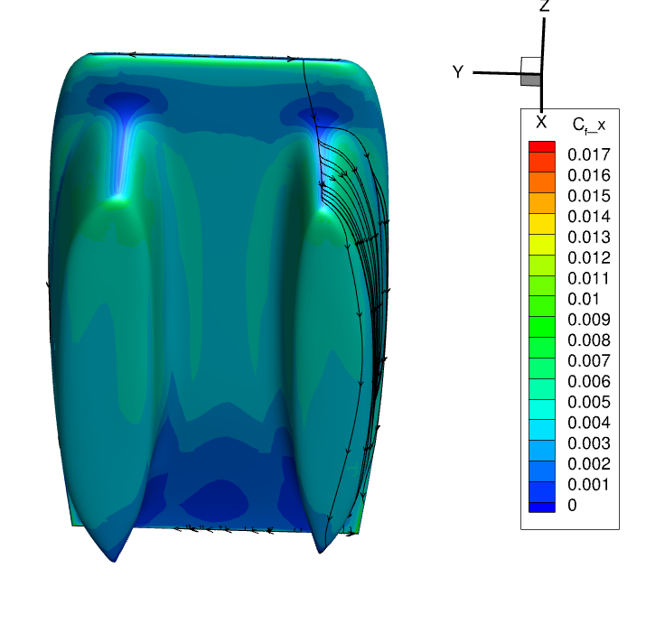
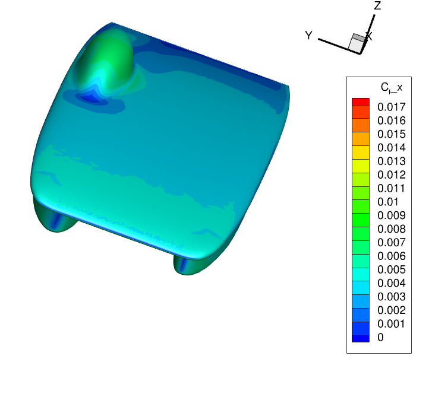
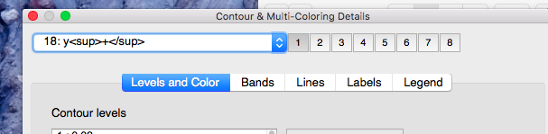
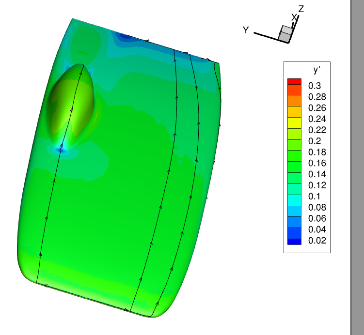

# tecplot-introduction

## SSCP - Tecplot Introduction

## Tecplot Introduction

Introductory video!!

https://www.youtube.com/watch?v=Fskz9ZhF\_NA\&feature=youtu.be

[https://www.youtube.com/watch?v=Fskz9ZhF\_NA\&feature=youtu.be](https://www.youtube.com/watch?v=Fskz9ZhF_NA\&feature=youtu.be)

Tecplot visited us on March 03, 2016 and gave us instructions on how to use both Tecplot 360 (what we used for Arctan) and Tecplot Chorus (used for viewing multiple iterations side by side).

Contacts: Scott Fowler - s.fowler@tecplot.com, Devon Simpson - d.simpson@tecplot.com

Tecplot 360 Tips and Tricks:

* Interface:To turn off the bounding box view: Options > turn offCTRL-F to automatically zoom back into the carO to pick rotation point when rotatingRight click to translateMiddle mouse to zoomHit Y to slice in the Y direction (putting a surface slice)When SU2 exports zones (the volume mesh and the surface mesh), it does not label them appropriately. To identify, volume will be labeled as NONE and surface will be labeled as N/A.Contours are separated into groups such as C1, C2, C3, etc.Plotting streamlines:Velocity variables from SU2 are Conservative 2, 3, and 4.Plot vectorSlice toolString trace toolTecplot doesn't do well with ASCII - use preplot.exe to convert to binary or compile/config SU2 to export to TECPLOT-BINARY formatCreate stream trace (stream trace details) with volume ribbon format - can see a twist with ribbonsDevon wrote a macro to make a cp plot from slices (ask Tecplot to send this as well as other macros to us)Coefficient of pressure vs x/c
* Interface:To turn off the bounding box view: Options > turn offCTRL-F to automatically zoom back into the carO to pick rotation point when rotatingRight click to translateMiddle mouse to zoomHit Y to slice in the Y direction (putting a surface slice)When SU2 exports zones (the volume mesh and the surface mesh), it does not label them appropriately. To identify, volume will be labeled as NONE and surface will be labeled as N/A.Contours are separated into groups such as C1, C2, C3, etc.
* To turn off the bounding box view: Options > turn off
* CTRL-F to automatically zoom back into the car
* O to pick rotation point when rotating
* Right click to translate
* Middle mouse to zoom
* Hit Y to slice in the Y direction (putting a surface slice)
* When SU2 exports zones (the volume mesh and the surface mesh), it does not label them appropriately. To identify, volume will be labeled as NONE and surface will be labeled as N/A.
* Contours are separated into groups such as C1, C2, C3, etc.
* Plotting streamlines:Velocity variables from SU2 are Conservative 2, 3, and 4.Plot vectorSlice toolString trace tool
* Velocity variables from SU2 are Conservative 2, 3, and 4.
* Plot vector
* Slice tool
* String trace tool
* Tecplot doesn't do well with ASCII - use preplot.exe to convert to binary or compile/config SU2 to export to TECPLOT-BINARY format
* Create stream trace (stream trace details) with volume ribbon format - can see a twist with ribbons
* Devon wrote a macro to make a cp plot from slices (ask Tecplot to send this as well as other macros to us)Coefficient of pressure vs x/c
* Coefficient of pressure vs x/c
* Interface:To turn off the bounding box view: Options > turn offCTRL-F to automatically zoom back into the carO to pick rotation point when rotatingRight click to translateMiddle mouse to zoomHit Y to slice in the Y direction (putting a surface slice)When SU2 exports zones (the volume mesh and the surface mesh), it does not label them appropriately. To identify, volume will be labeled as NONE and surface will be labeled as N/A.Contours are separated into groups such as C1, C2, C3, etc.
* To turn off the bounding box view: Options > turn off
* CTRL-F to automatically zoom back into the car
* O to pick rotation point when rotating
* Right click to translate
* Middle mouse to zoom
* Hit Y to slice in the Y direction (putting a surface slice)
* When SU2 exports zones (the volume mesh and the surface mesh), it does not label them appropriately. To identify, volume will be labeled as NONE and surface will be labeled as N/A.
* Contours are separated into groups such as C1, C2, C3, etc.
* Plotting streamlines:Velocity variables from SU2 are Conservative 2, 3, and 4.Plot vectorSlice toolString trace tool
* Velocity variables from SU2 are Conservative 2, 3, and 4.
* Plot vector
* Slice tool
* String trace tool
* Tecplot doesn't do well with ASCII - use preplot.exe to convert to binary or compile/config SU2 to export to TECPLOT-BINARY format
* Create stream trace (stream trace details) with volume ribbon format - can see a twist with ribbons
* Devon wrote a macro to make a cp plot from slices (ask Tecplot to send this as well as other macros to us)Coefficient of pressure vs x/c
* Coefficient of pressure vs x/c

Interface:

* To turn off the bounding box view: Options > turn off
* CTRL-F to automatically zoom back into the car
* O to pick rotation point when rotating
* Right click to translate
* Middle mouse to zoom
* Hit Y to slice in the Y direction (putting a surface slice)
* When SU2 exports zones (the volume mesh and the surface mesh), it does not label them appropriately. To identify, volume will be labeled as NONE and surface will be labeled as N/A.
* Contours are separated into groups such as C1, C2, C3, etc.

To turn off the bounding box view: Options > turn off

CTRL-F to automatically zoom back into the car

O to pick rotation point when rotating

Right click to translate

Middle mouse to zoom

Hit Y to slice in the Y direction (putting a surface slice)

When SU2 exports zones (the volume mesh and the surface mesh), it does not label them appropriately. To identify, volume will be labeled as NONE and surface will be labeled as N/A.

Contours are separated into groups such as C1, C2, C3, etc.

Plotting streamlines:

* Velocity variables from SU2 are Conservative 2, 3, and 4.
* Plot vector
* Slice tool
* String trace tool

Velocity variables from SU2 are Conservative 2, 3, and 4.

Plot vector

Slice tool

String trace tool

Tecplot doesn't do well with ASCII - use preplot.exe to convert to binary or compile/config SU2 to export to TECPLOT-BINARY format

Create stream trace (stream trace details) with volume ribbon format - can see a twist with ribbons

Devon wrote a macro to make a cp plot from slices (ask Tecplot to send this as well as other macros to us)

* Coefficient of pressure vs x/c

Coefficient of pressure vs x/c

A software that accompanies TecPlot called Chorus allows us to analyze multiple runs side-by-side

* Tables to compare drag numbers, run time, etc. across runsCan view pressure plots and streamlines of multiple cars in one windowCan compare surface changes by superimposing two surfaces, on on the otherCan generate scatter plots for bulk analysisFor example: for 5 different Aerobodies, how does drag increase crosswinds vary from 10-60kph?
* Tables to compare drag numbers, run time, etc. across runs
* Can view pressure plots and streamlines of multiple cars in one window
* Can compare surface changes by superimposing two surfaces, on on the other
* Can generate scatter plots for bulk analysisFor example: for 5 different Aerobodies, how does drag increase crosswinds vary from 10-60kph?
* For example: for 5 different Aerobodies, how does drag increase crosswinds vary from 10-60kph?
* Tables to compare drag numbers, run time, etc. across runs
* Can view pressure plots and streamlines of multiple cars in one window
* Can compare surface changes by superimposing two surfaces, on on the other
* Can generate scatter plots for bulk analysisFor example: for 5 different Aerobodies, how does drag increase crosswinds vary from 10-60kph?
* For example: for 5 different Aerobodies, how does drag increase crosswinds vary from 10-60kph?

Tables to compare drag numbers, run time, etc. across runs

Can view pressure plots and streamlines of multiple cars in one window

Can compare surface changes by superimposing two surfaces, on on the other

Can generate scatter plots for bulk analysis

* For example: for 5 different Aerobodies, how does drag increase crosswinds vary from 10-60kph?

For example: for 5 different Aerobodies, how does drag increase crosswinds vary from 10-60kph?

For questions about using Tecplot, email Tecplot's support center.

Find the Tecplot license file (courtesy of the School of Engineering's licenses) attached.

Advanced Options

Skin Friction -- see which regions of car surface are producing the most drag.

On the left sidebar, next to "Contour" Click "Details". &#x20;

From the dropdown at the top select "Cf<\sub>\_x"

You'll get a plot that shows the regions of the car that are contributing more strongly to the drag.

In the sample above, you'll see that regions toward the front of the car junctions beneath the car contribute most to the drag.

Mesh Integrity

On the left sidebar, next to "Contour" Click "Details" as above.  Select "y+"

You'll see a plot that shows how well CFD liked the mesh. Values should all be less than 1. &#x20;

In the example below, all values are less than or equal to 0.3, which means that it is a good mesh.

#### Embedded Google Drive File

Google Drive File: [Embedded Content](https://drive.google.com/embeddedfolderview?id=1XDAXJfbT50ypCwi8sMggWQ22_36cdWay#list)
