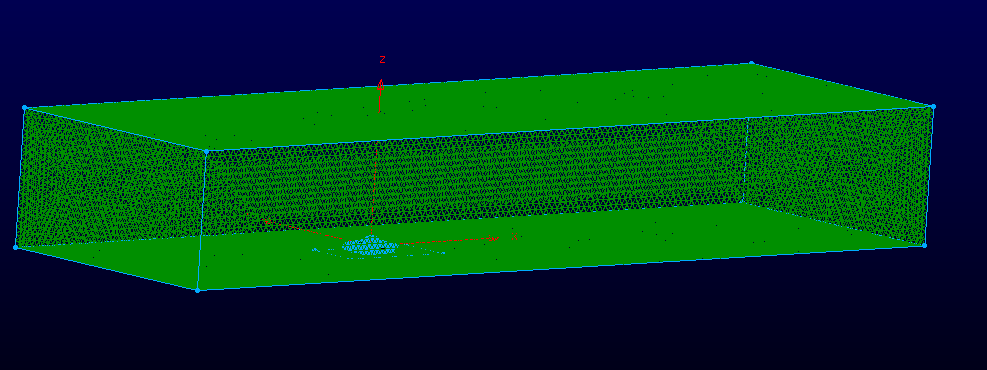
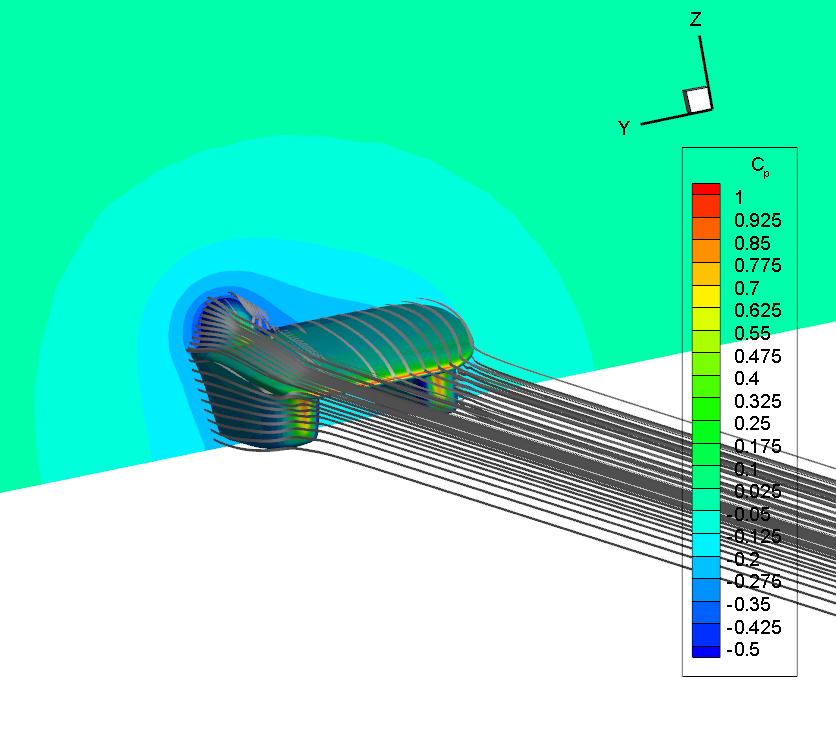
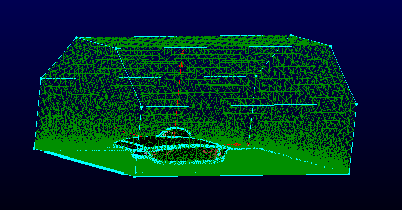
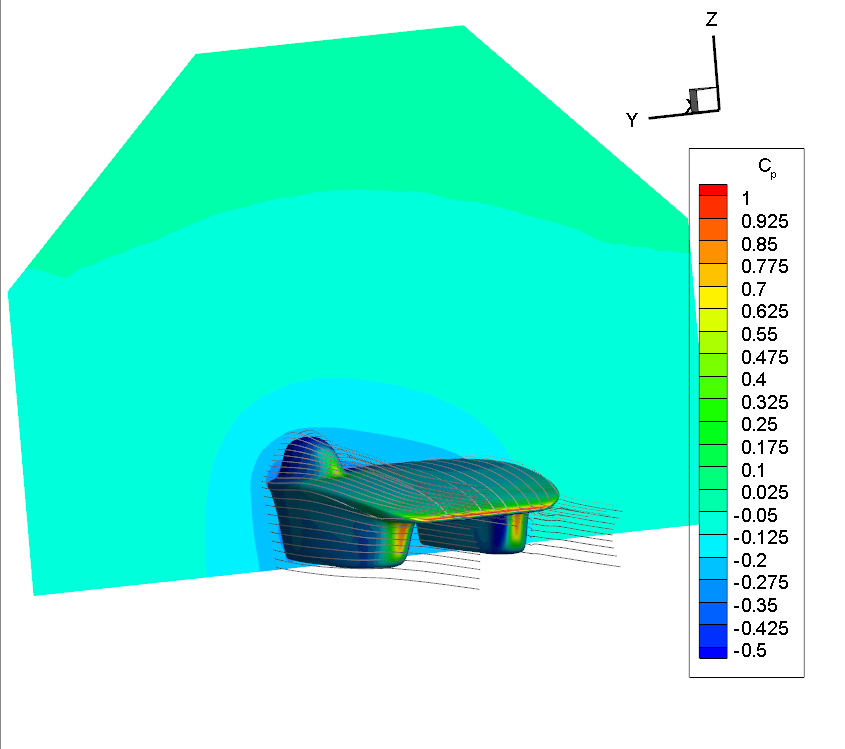
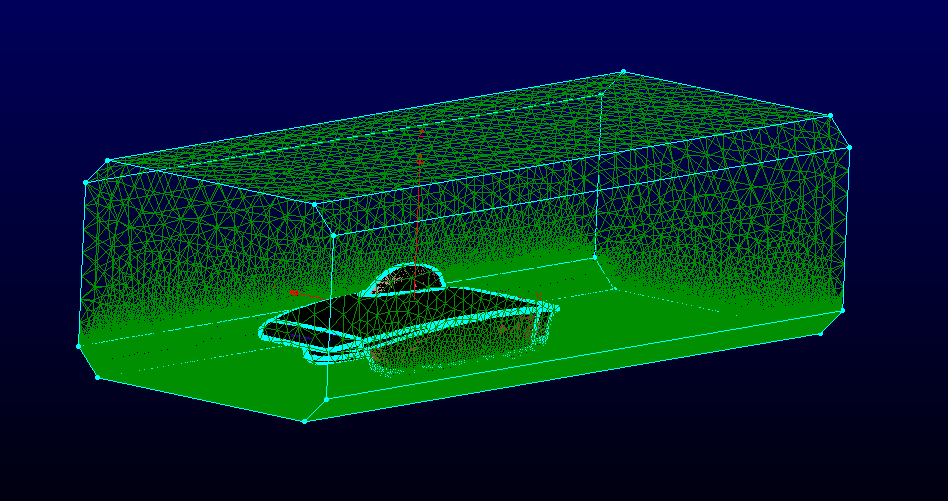
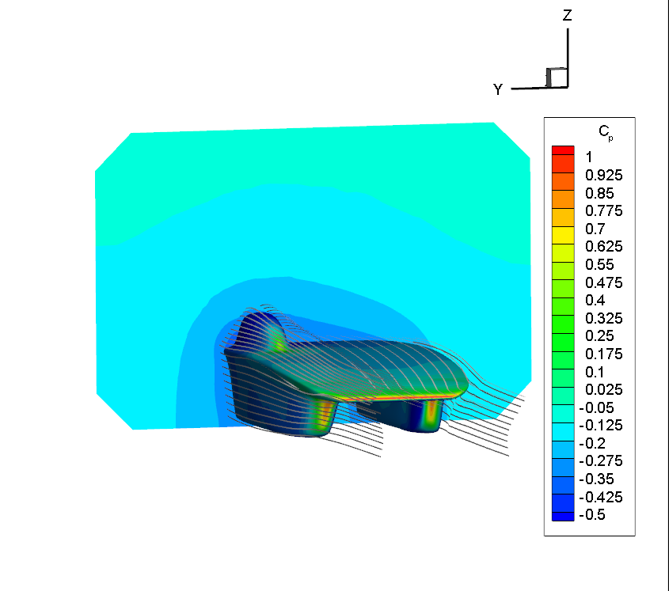
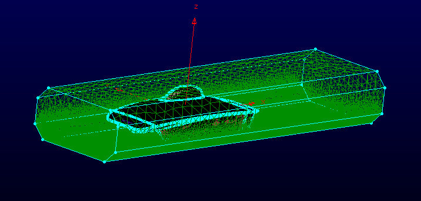
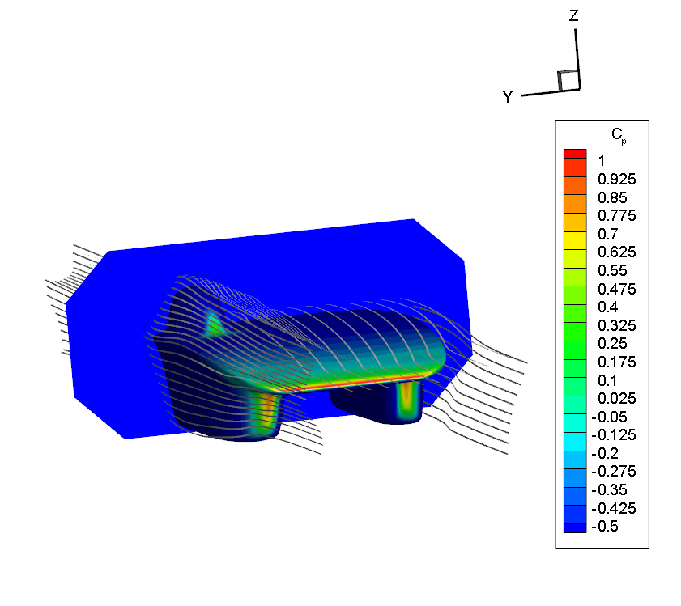

# SSCP - Wind Tunnel CFD Comparisons

# Wind Tunnel CFD Comparisons

We are considering using the Sand Diego Wind Tunnel this cycle, which is logistically very good, but a bit smaller than Aerodyn.

[ Sand Diego Wind Tunnel](http://www.sandiegowindtunnel.com/)

[ Aerodyn](http://www.aerodynwindtunnel.com/tunnel-info)

These are CFD simulations are of Sundae-082 (our final aerobody) in differently-sized chambers.  Two of the chambers are modeled after the San Diego and Aerodyn tunnels.  All runs were performed with our usual speed (24.59m/s) and other typical settings.  Files are located in the Sundae Aero folder on FTP under wind_tunnel_sims/.

Results from Aerodyn and San Diego are relatively close to numbers from our typical "no-walls" CFD chamber.

## Run 1: Usual Tunnel

The standard tunnel used in our CFD simulations.  It's length and width are so big that the walls should have no effect.

drag: 27.99993N

lift: 1.345145N

## Run 2: "Aerodyn"

Tunnel modeled after the Aerodyn wind tunnel, has a cross-sectional area of 185ft^2.  This and all following tunnels had length 27.89ft.

drag: 30.46249N

lift: 0.6144074N

## Run 3: "San Diego"

Tunnel modeled after San Diego tunnel, has cross-sectional area of 95ft^2.  Tunnel length: 27.89ft.

drag: 31.76527N

lift: 2.017476N

## Run 4: "Really Small Tunnel"

Tunnel made to simulate really small wind tunnel, cross-sectional area of 19ft^2.  tunnel length: 27.89ft.

drag: 47.92374N

lift: 54.24022N (not converged)

