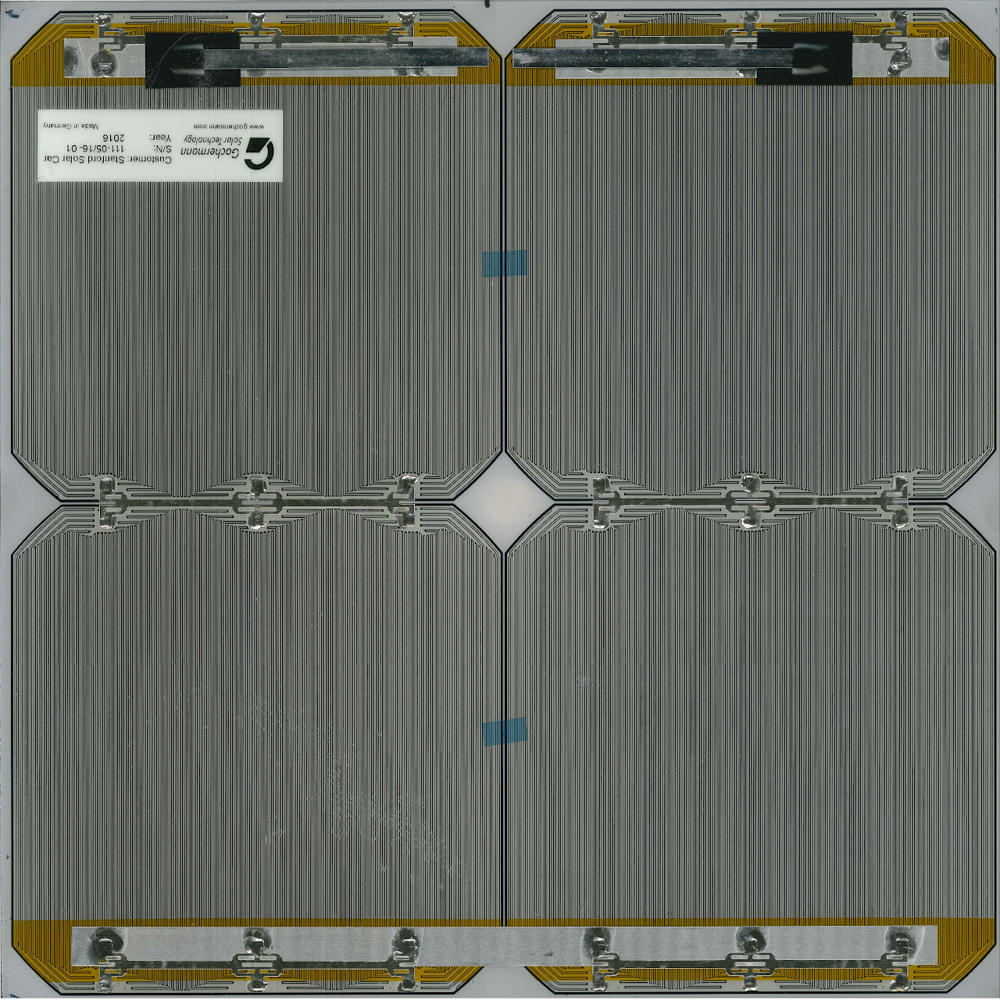
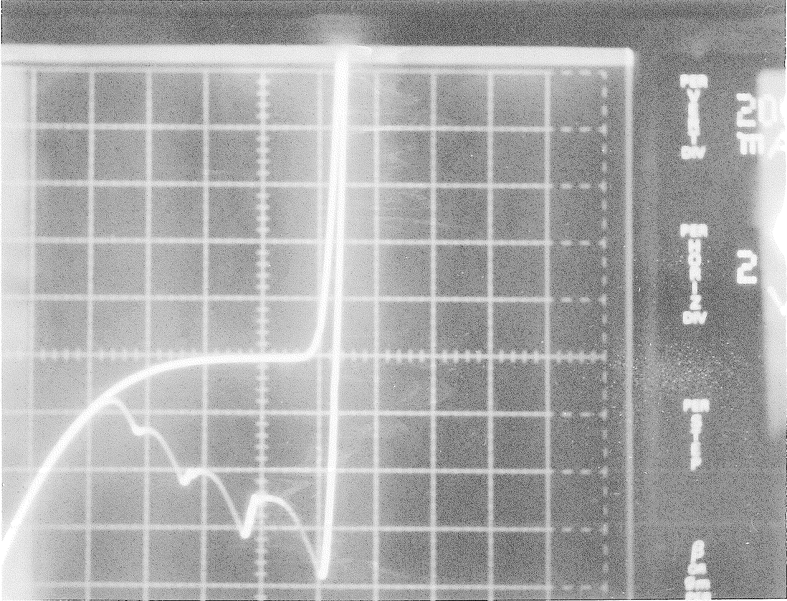
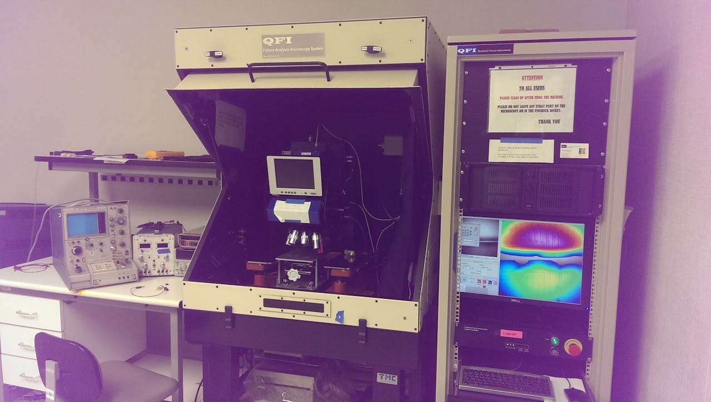

# gochermann-sample-testing

## SSCP - Gochermann Sample Testing

## Gochermann Sample Testing

This page discusses non-destructive tests of properties OTHER than efficiency for Gochermann samples.

X-ray (2D) was performed of the cell contacts.&#x20;

I don't think there is much exciting here. Of note is the presence of solder voids in the detail view of the small contact. A high percentage of void is bad; this is fine. It would be interesting to inspect the joints of a large number of SSCP manufactured modules.

Visual Inspection of panel was performed. The backsheet is conveniently transparent.&#x20;

The soldering quality appears qualitatively similar to SSCP manufactured modules. No metal tabs bypass the solar cells. There is no visible bypass diode. Logan Herrera (lpherr@stanford.edu) has a 16x resolution version of this image.

I-V Curves were measured for the 2x2 module labeled as containing bypass diodes.

The vertical axis is 200mA/div. The horizontal axis is 2V/div. The sweep rate is 60Hz for the complete loop.

This I-V curve does not seem to show bypass diodes. The reverse breakdown is gradual and exceeds 1V per cell. Bypass diodes would have a more abrupt characteristic at a lower voltage level. For a solar cell, however, this is a rather low breakdown voltage. This low breakdown voltage suggests the junction is heavily doped. The four wavy bits at the bottom of the curve correspond to the reverse recovery times of the four cells - the massive, heavily doped cell junctions store a significant amount of charge, and it takes a significant amount of time for this charge to be swept out when the voltage applied reverses. The I-V curve is traced out clockwise, hence a positive voltage and negative current while each cell reverse recovers.

Photon Emission testing, sometimes called EL testing, was performed on the 2x2 module labeled as containing bypass diodes. Current flowing in a p-n junction emits infrared light. An infrared sensitive camera images the light emitted from the solar cells. The maximum imaged area is substantially smaller than the C60 cell size.

The test equipment

When the camera is positioned over then center of a single cell and the single cell's diode is forward biased, the cells illuminates uniformly. The radial intensity dropoff is due to the camera lens perspective. When the camera is positioned over two cells simultaneously, only one illuminates. This suggests the cell at the bottom of the image is cracked. A full-area EL test would confirm this.

When the diodes are reverse biased, hotspots of light emission occur, but these hotspots are much, much weaker than the emissions when forward biased. Further, these occur only in the cell which illuminates under forward bias conditions. This unambiguously shows that the solar cells are conducting reverse current.&#x20;

I hypothesize that:

The junction is heavily doped, so Zener breakdown (quantum tunneling) dominates conduction under reverse bias conditions. This form of breakdown does not emit light. It also has a negative temperature coefficient - higher temperature reduces forward voltage. Thus as current starts to flow at a point, heat is generated and the temperature at that point rises, encouraging more current to flow there. This would encourage hotspot formation.

Conclusion:

Between the I-V curve and photon emission tests, it is clear this module does not contain additional, discrete bypass diodes. EL testing of all Gochermann samples should be performed before further handling.

#### Embedded Google Drive File

Google Drive File: [Embedded Content](https://drive.google.com/embeddedfolderview?id=1UkfOxDsF3koyKx2sWzZbO7d_1FbZ1D4z#list)
