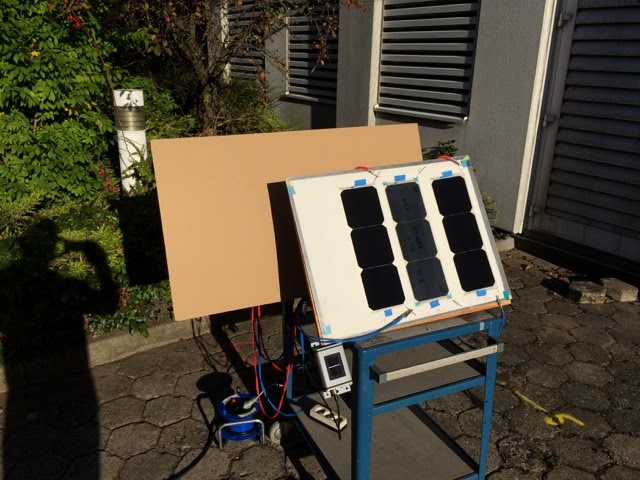

# gochermanns-testing-setup-feedback

## SSCP - Gochermann's Testing Setup Feedback

## Gochermann's Testing Setup Feedback

In September 2016, we discussed Oliver Gochermann's newest array encapsulation compound, which he claims is even better than his ZLE encapsulation used by top teams in WSC 2015.  In this thread, Oliver also gives module testing advice.

Hi Max & team,

the advantages over ZLE are full rigidity (in ZLE we traded in a bit of rigidity in favor of efficiency), and we measure a cell to module gain with the new compound, instead of a cell to module loss, compared to the bare module, ie the same cells before encapsulation.

We’ll manufacture your new module tomorrow. Please let me know if you’re able to test as described in the outside sun.

We know thin film GaAs is a lot more expensive, without giving you a tangible advantage. We have triple junction GaAs cells with 35% efficiency and even 36% efficiency. Here you get at least the same absolute power rating as with Si, but the price will be a 6 digit $ or € figure. But you’d be able to conceive a car design much smaller, more lightweight and with better aerodynamics, due to the significantly smaller solar array.

Best regards,

Oliver

***

Hello Oliver,

We would be interested in sampling your new encapsulation compound if it fits within our budget.  We do have the hardware to perform an IV-trace of a module.  Would you be able to send us the cost and any other relevant details about this product?

Thanks,

Max

***

Hi Max,

you’d have to be able to take IV traces in the outside sun, together with module temperature and irradiation level. At least our flasher was not able to find the better efficiency we recorded in the sun. We don’t know if others will do. What’s the make of your IV tracer?

I know the new ingredients we need for the new compound will be expensive! hope to be able not to exceed 1000 €/m². Last week we made a test with a 2 channel electronic load. In constant voltage mode. We saw >5% higher power yield over the conventional module with the same cells, assuming equal module temperature after 15 mins in the sun. We were thrilled =:-o

BTW, we shipped the new module with diodes last week.

Best regards,

Oliver

***

Hi Oliver,

Just stepping in to talk about the IV tracer; we're using a Sinton FMT-350 that's been optimized so that it can be more accurate at smaller loads. For outdoor testing, we'd be using a Keithley 2300 with a pyranometer (probably a CMP3 from Kipp & Zonen). Also, on outdoor testing: would you mind telling us a bit about how you deal with changing insolation values and temperature? We've only ever done side-by-side testing outdoors in order to minimize those effects, but if you have a better method we'd love to hear about it so that we can get better accuracy.&#x20;

Thanks,

John

***

Hi John,

thanks for telling me a bit about your testing equipment. Assuming the new module with the bypass diodes is delivered by now, please check if you notice any efficiency differences between the 3 2x2 modules you have now. I was not able find a statement on the Sinton wether it has a temperature sensor you can attach to the module, or if it assumes the same temperature for all module to compare/measure.

The CMP3 is only measuring 180° global irradiation. It might work if you have both the test panel and the CMP3 horizontal, instead of perpendicular to the sun to be STC conformant. Our test setup is a bit different: we have a reference Si cell which tells us the level of irradiance which is seen by the pv module. This setup does not need to be horizontal, only the reference cell (lower left corner) and test module have to face the same direction, see picture. We can point the module towards the sun which is STC conformant. With an IV tracer you can only do sequential testing. Even when recording module temperature and irradiation level at the time of measurement we found pretty high differences in the calculated STC values when measuring the same module 3 minutes later. This might be due to changing spectrum caused by an always dynamic atmosphere. Thus we planned for parallel measurements of 2 modules. For relative comparison we would not need to take irradiance and temperature, we’d just compare Pmpp of 2 modules with equal cells at the same moment, after having them in the sun for 15-30 mins to ensure they have the same temperature. We have not found a proper device to do that yet. The Chroma electronic loads with MPP tracking will not work below 25 V.

We tested with a 2 channel Chroma electronic load in constant voltage mode, which gave us a good indication of how much better the new encapsulation compound can be. This measurement confirmed what we measured with sequential testing with our IV tracer (custom Mencke & Tegtmeyer http://www.imt-solar.com)

[http://www.imt-solar.com](http://www.imt-solar.com/)

All in all we find it difficult to get qualified measurements, and trying to measure accurate absolute values is almost impossible. We only do relative measurements, e.g. module B has 3% higher Pmpp than module A. We compare both same module before to after encapsulation, and module A to B before and after encapsulation. But please measure whatever you can, and please share the results of the 3 2x2 modules with us. It’s important to obtain a set of measurement records per test, and to calculate median and standard deviation to know how good your values are.

best regards,

Oliver

