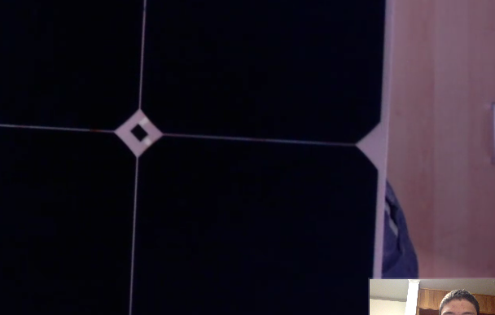

# skype-call-with-oliver-gochermann

## SSCP - Skype Call With Oliver Gochermann

## Skype Call With Oliver Gochermann

I just finished a Skype call with Oliver Gochermann who is taking over the business from his father, Hans Gochermann.&#x20;

[the business](http://www.gochermann.com)

tldr: He is willing to sell us samples.  We will buy a few and compare to our self-encapsulated cells as we test over the coming months.

Encapsulations

Gochermann sells three kinds of encapsulations:

1. Strong and smooth: (worst stuff) Encapsulated with a liquid compound that is hardens after coating the front and back of the cell.  Only one material makes up the whole encapsulation so optical transitions are reduced.  0.7mm thick.
2. Strong and bumpy:  (okay stuff) Same material as above (1) but imprinted with 60° micro-pyramids.  Micro-pyramids allow cell to capture more sunlight, particularly when it is not directly overhead.
3. Delicate and bumpy: ("0% loss" - best stuff) Different material, could not confirm what -- liquid or conventional laminated material.  Coated in micro-pyramids as above (2).

See attached quote for pricing.  $26,000 for 6m^2 array.

Gochermann will also integrate bypass diodes into his modules. One WSC 2015 team apparently had an array with 100 bypass diodes attached to cells around the bubble.

Gochermann will also dice cells, like he did on Michigan's 2015 array, allowing the same cell area to cover a smaller space.

GaAs:

He encapsulates GaAs cells produced by a partner manufacturer that claims 35% bare cell efficiency.  If we procured GaAs cells of our own, Gochermann would be willing to encapsulate them after some initial tests to confirm that their encapsulation method works on the new product.

Potential Future Improvement:

He is attempting to develop a system that will allow "modules to have higher efficiencies than the average of the individual cells".  He will let us know by the end of the year if they are successful.

Logistics:

We could purchase our array as late as February and get an array by June.  We can send him our cells to encapsulate or he can use those that he has himself.  Shipping is not an issue, he says -- he ships to Turkey, China, US without problems.

(Fun fact: Two teams in WSC 2015 ordered their arrays from Gochermann in June and they arrived in Darwin in time for the race.)

Misc:

20 teams used a Gochermann array in 2015 including 4th place Michigan.  Gochermann has heard the rumors about reduced array size (5m^2 he's heard), but nothing definitive at all.

Going forward:

Gochermann is willing to sell us samples -- anything from single cells to entire modules.  One single cell with his best, "0%-loss" encapsulation would be $65.54, the same per-cell price as in the attachment.  He is willing to encapsulate cells that we send him.

I explained that we are encapsulating our own cells but will consider buying his array if his test cells out-perform ours -- he's cool with that.

Overall, a friendly guy.  9/10 would Skype again.&#x20;

Max D

#### Embedded Google Drive File

Google Drive File: [Embedded Content](https://drive.google.com/embeddedfolderview?id=1FHHmV46r9z4a8lSWjCLyhLR8MsZuIDUA#list)
