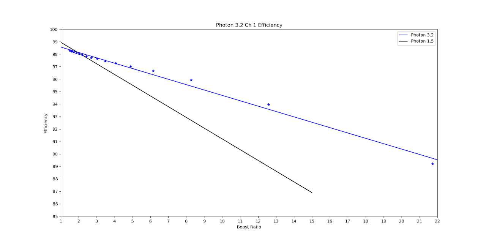
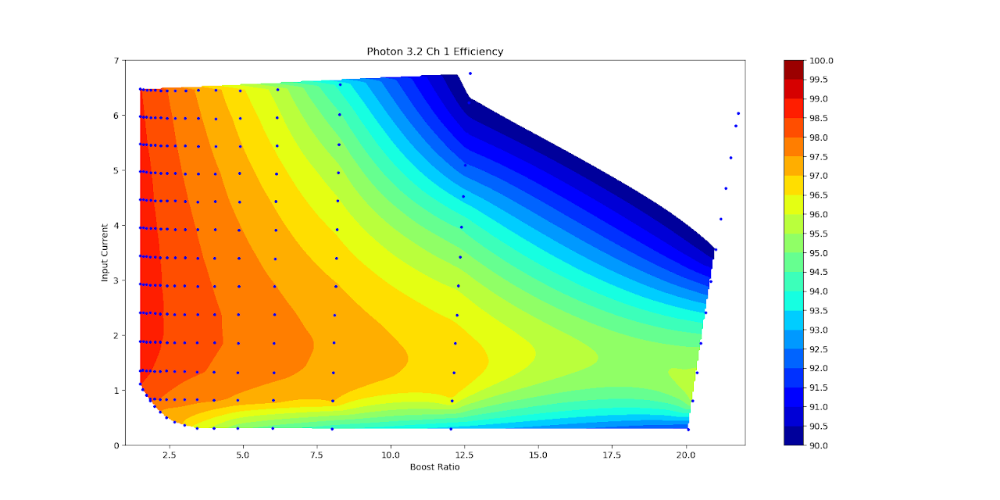
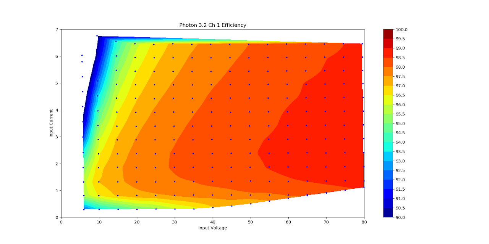

# SSCP - MPPTs

# MPPTs

Link to see current solar conditions: https://www.wunderground.com/personal-weather-station/dashboard?ID=KCAMOUNT75#history

[https://www.wunderground.com/personal-weather-station/dashboard?ID=KCAMOUNT75#history](https://www.wunderground.com/personal-weather-station/dashboard?ID=KCAMOUNT75#history)

From Sam 4/21:

I got the new MPPT rev working on the bench, efficiency plots attached. It'll take me ~4weeks after you place an order to deliver units, as I'll need to order new magnetics and machined parts to finish them out.

Price will be $2199 each.

From Sam 2/24:

I recently placed an order for 20x of the newest rev of the boards, which adds a small FPGA for running the current control loop on the tracker. I noticed that for some cases of input voltage and current that there can be some phase lock-in between the two channels causing a slight drop in efficiency, which can't be worked around due to limitations in the DSP. Functionally, this is the difference between 98% and 98.5%, but it bugs me, so I'm fixing it.

I plan to have one built up and fully running around mid the late March, so maybe we should touch base then, and I should be able to provide full efficiency plots.

Additionally, last year I built new software for the tracker rev that you have the integrates CANbus bootloading, which makes it way way easier to upgrade firmware, in addition to a bunch of other firmware improvements that I made to the control loops. If you're interested, I can reflash the units you have with the upgraded firmware.

