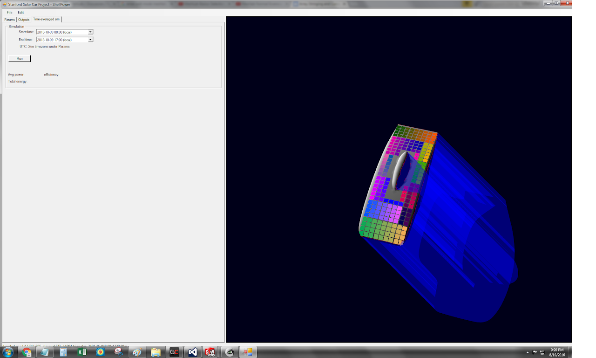
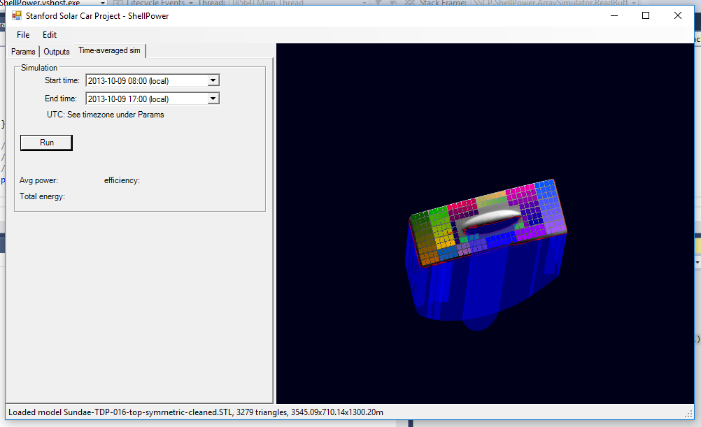
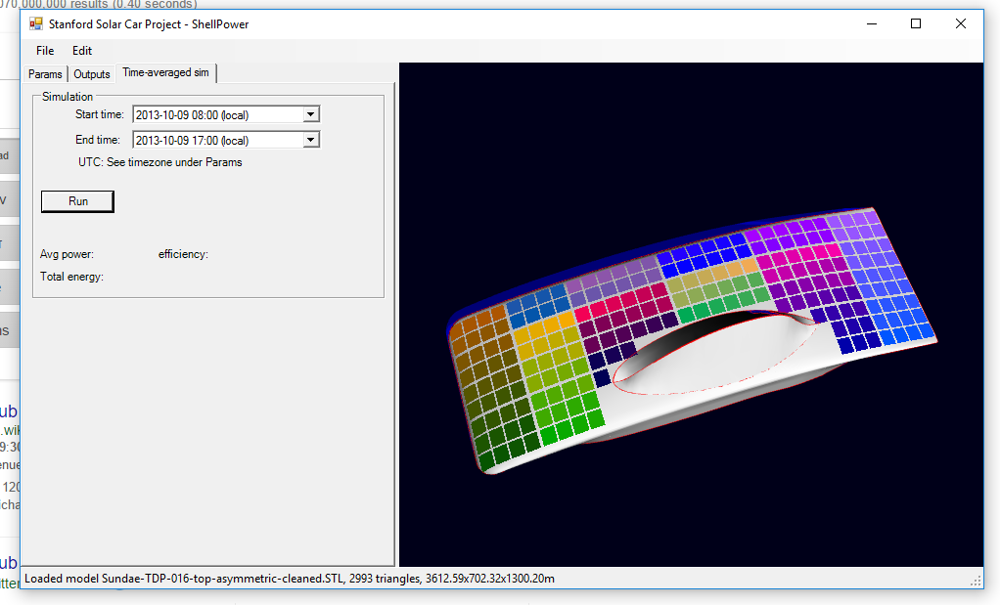

# shellpower

## SSCP - Shellpower

## Shellpower

&#x20;Array Stringing and Curvature Analysis

#### Embedded Content

Embedded content: [Embedded Content](./)

Also see Symmetric vs Asymmetric Array Analysis

[Symmetric vs Asymmetric Array Analysis](../../../../../../stanford.edu/testduplicationsscp/home/sscp-2016-2017/aero-2016-2017/symmetric-vs-asymmetric-array-analysis/)

HRH-004

TODO: see how much power a 4m^2 array would generate over the course of a day in Alice Springs (-23.699530, 133.877812).

HRH-005

Note that this is a scaled version of the Solidworks model - scaled to the size of the 'symmetric' and 'asymmetric' aerboies below (since Shellpower takes that into account).&#x20;

Array time-averaged simulation output

&#x20;  ... 3.39099 m^2 total cell area

&#x20;  ... 2.54494969279969 m^2 exposed to sunlight

&#x20;  ... 1645.31187098255 W insolation

&#x20;  ... 364.785324976549 W output (assuming mppt per cell)

&#x20;  ... 323.704012359346 W output

TDP-016

Simulation with TDP-016 to see power generation of asymmetric vs symmetric.  The bubble of TDP was shifted to make asymmetric car (mainfoil is the same).  Zip file with all simulation files attached to this page.

Symmetric

Array time-averaged simulation output

&#x20;  ... 3.39099 m^2 total cell area

&#x20;  ... 2.72487583083279 m^2 exposed to sunlight

&#x20;  ... 1760.05940808552 W insolation

&#x20;  ... 389.689304752006 W output (assuming mppt per cell)

&#x20;  ... 340.958650844603 W output

Asymmetric

Array time-averaged simulation output

&#x20;  ... 3.39099 m^2 total cell area

&#x20;  ... 2.84065476939042 m^2 exposed to sunlight

&#x20;  ... 1802.96294433307 W insolation

&#x20;  ... 399.03219636795 W output (assuming mppt per cell)

&#x20;  ... 364.188843566019 W output

#### Embedded Google Drive File

Google Drive File: [Embedded Content](https://drive.google.com/embeddedfolderview?id=1MvrezxTkQt7kj_T3egP9yAg1tC0xM4N4#list)
