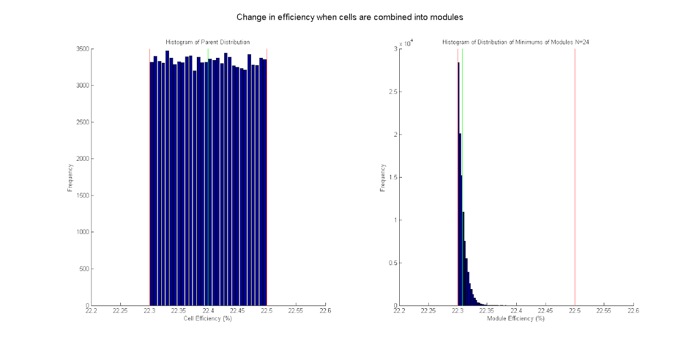
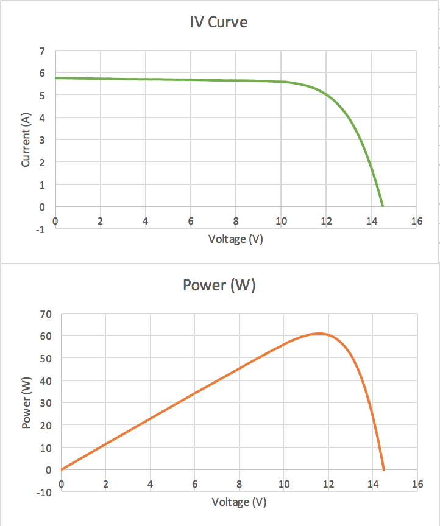

# SSCP - Binning Cells

# Binning Cells

This page answers the question "Does determining the efficiency of each individual cell and combining them into modules optimally make a significant improvement to array performance?"

At WSC 2015, a Michigan team member said (paraphrasing) "Gochermann says the bins got wider this year. He says optimally binning and combining cells into modules would improve performance by approximately 1 absolute percent."

Additionally, SunPower does not provide any performance guarantee whatsoever to solar car teams who buy bare cells. It only provides a bin letter and "typical" values.

The underlying physics problem is that every cell acts like a light controlled current source. The overall current is determined by the minimum of the currents in the array string.

Jamie Goldfield and Logan Herrera wrote a MATLAB script to perform some numerical experiments. It randomly generates numbers with a specified distribution, randomly selects N of them, takes the min of those N, and repeats the process. The output is the distribution of all of the mins of N.

The figure below shows this experiment for N=24 with bin J cells. If the number of cells used is large compared to the module size and similar to the number of cells available, then the average of optimally combined module performance will be very close to the mean cell performance. If the number of cells used is large compared to the module size and similar to the number of cells available, then the average performance of randomly combined cells will be very close to the performance lowest possible performing input cell.

Because bin J is so tightly specified (0.2% absolute spread), the difference is 0.1% absolute. This is approximately -0.4% relative change. The effect is minimal.

Conclusions:

If the bins SunPower sells to solar car teams are wide (>= 1% absolute), and Gochermann buys enough cells to make entire arrays from only the top cells in the bin, then his hearsay statement is consistent with simulation.

The magnitude binning loss is very close to equal to half the width of the bin. Wider bins make the loss worse. Smaller bins make the loss better.

More simulation is needed to check the assumption that the mean efficiency of optimally combined cells in the case where total cells available = 2x number of cells on car is in fact close to the mean of the underlying cells.

Figure: random combination of bin J cells into 24 cell modules

Note as of 4/30/16:

After the meeting with the DFly guys, I think we should add some more info to this. Another model for solar cells is as an IV curve; to add together IV curves (when cells are connected in series), you add the voltage at each current level to get an IV curve for the entire module. The below IV curve and power curve were taken from Module 2 on Arctan in August 2015 (Excel file attached). Basically, what the DFly people posited was that the area around the top of the power curve for each cell is flat enough that small variations in the voltage of the maximum power point don't actually produce very much variation in the power of the entire module. The point of this is that we can't just model this based off of efficiency alone -- my suggestion would be to take IV curves for a few 1-cell modules (we have 15 conveniently sitting in the shop right now), and then see what the losses would be if we put them all into a module together -- John

### Embedded Google Drive File

Google Drive File: [Embedded Content](https://drive.google.com/embeddedfolderview?id=139WxeZI_Nb8jz3qMcoVRIhMKBSdt7hmy#list)

<iframe width="100%" height="400" src="https://drive.google.com/embeddedfolderview?id=139WxeZI_Nb8jz3qMcoVRIhMKBSdt7hmy#list" frameborder="0"></iframe>

