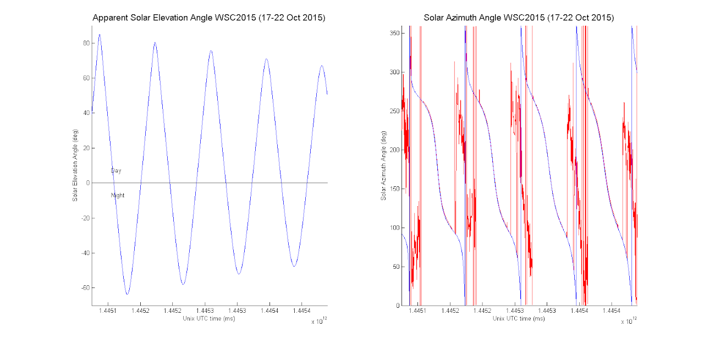
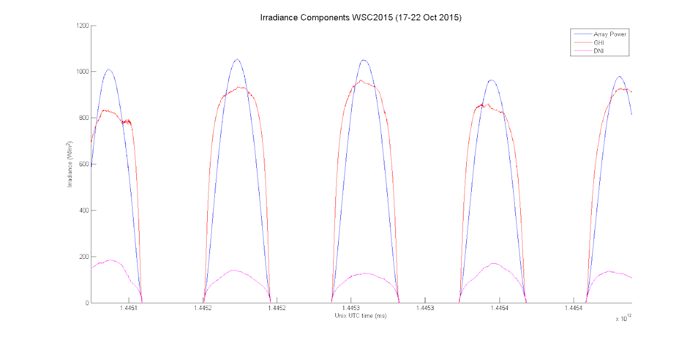
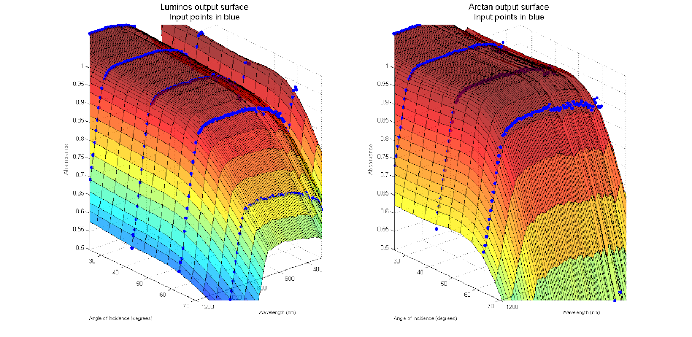

# SSCP - Sandia PV Simulation

# Sandia PV Simulation

Had first success with Sandia PV simulation routines tonight thanks to a kick start from Gawan. (https://pvpmc.sandia.gov/) Produced this plot of apparent sun elevation angle and sun azimuth when curves in the road are taken into account.

[https://pvpmc.sandia.gov/](https://pvpmc.sandia.gov/)

And simulate each irradiance component.

Global Horizontal Irradiance (GHI) is the amount of terrestrial irradiance falling on a surface horizontal to the surface of the earth.

Direct Normal Irradiance (DNI) is the terrestrial irradiance received by a surface normal to the sun exclusive diffuse irradiance

Diffuse Horizontal Irradiance (DHI) is the terrestrial irradiance received by a horizontal surface which has been scattered or diffused by the atmosphere.

Now we can do things like combine this data with the McGeehee absorption data:

To come up with which array absorbed more light and make decisions about to make sundae even better.

Logan Herrera

