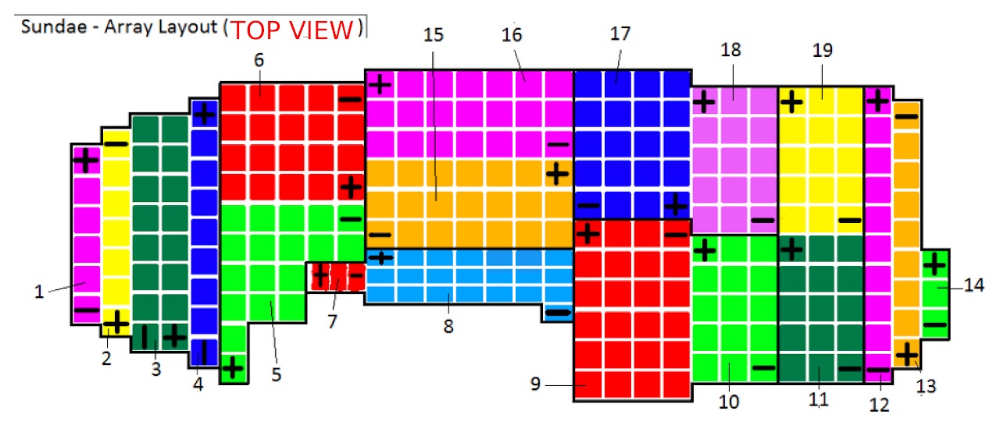
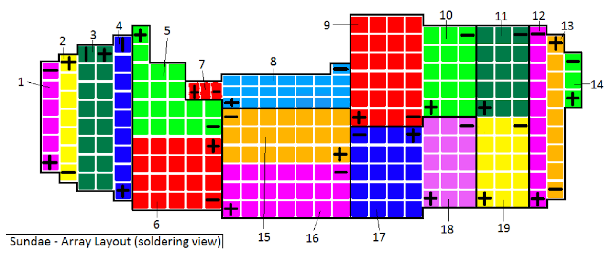

# sundae-array-layout

## SSCP - Sundae Array Layout

## Sundae Array Layout

10/16/2016: Car only has space for 250 cells with 1.5mm spacing between cells and 5mm between the cells of each module (so \~2mm of silicone between modules).&#x20;

Layout with Module Numbers is attached as Sundae\_soldering\_diagram.pdf (see below)

Final Layout by String

Final Layout by Module (Top view)

Layout by Module (Soldering view)

#### Embedded Google Drive File

Google Drive File: [Embedded Content](https://drive.google.com/embeddedfolderview?id=1NdjNnepWcfwL98BwrxLZHDsqnsv_iYXI#list)
