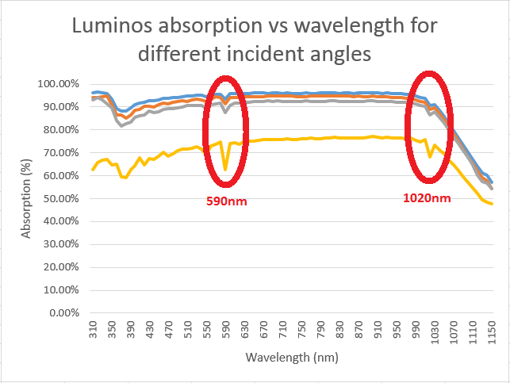

# SSCP - Absorption Testing McGehee Lab

# Absorption Testing McGehee Lab

Results:

Overall, Apogee, Luminos, and Arctan were all very similar up until 60 degrees from normal; after that, Luminos was the best, closely followed by Apogee, with Arctan coming in around 30% behind Apogee. Pdf of graphs is attached at bottom of the page (note that the first three sets are cut off at 50% absorption as the lower limit while the last set go all the way to 0%). 

A few caveats on that: first, this is an absorption measurement, so higher absorption doesn't always mean better performance, since some of the absorption is due to the encapsulant instead of the solar cell. This is also why the graphs all start dropping around 1000 nm; that matches the absorption data for normal silicon wafers. Second, the angles are all based on an initial measurement that was eyeballed (see methods), so it's possible that the Arctan sample was just measured at an angle that was closer to parallel. This could be rectified by doing more tests. 

Third, the array will almost never see 80 light incident from normal during the race unless the light is reflecting off something else. So, the really important numbers are probably between 20 and 60 degrees from normal, which are more similar to what the array will see during most of the race. This is just conventional wisdom, though, so to verify it we would have to talk to Gawan (strategy lead). 

Methods:

The tests were done in the McGehee lab, where George Burkhard (george.burkhard@gmail.com) was our contact. We used an integrating sphere to take the measurement (see paper for explanation). The way the experiment was set up, we could measure relative angles, but not absolute; so, "normal" is eyeballing when the light beam was ~perpendicular to the sample. Then, every angle measured from that is closer to being parallel to the sample, such that 80 degrees from normal is almost entirely parallel to the sample. 

There's a paper at https://www-osapublishing-org.ezproxy.stanford.edu/josa/abstract.cfm?uri=josa-51-11-1279 on how integrating sphere measurements work, but papers can be a bit confusing so if you have any questions email me at jstayner@stanford.edu (or whichever email I'm using after I graduate). The data is slightly confusing; see "close to normal.xlsx" for a decent explanation of what it's doing -- essentially, there's a calibration file for each sample (09, 13, and 15 correspond to Apogee, Luminos, and Arctan respectively), and in the calibration, you divide the current coming from the reference photodiode by the current coming out of the measurement photodiode. Then, you copy that data (in excel on mac this only works if you cut + paste it) into the excel file for the actual measurement, and the data you want is (current from measurement photodiode / current from reference photodiode) / (calibration data), where calibration data is measurement photodiode / ref photodiode for the calibration test. In all the ones I have done already, the rightmost column is absorption and the one immediately to the left of that is reflection. 

Unfortunately, the names for the photodiodes got switched up at some point, so sometimes the column labelled reference is actually the measurement photodiode, and the column labelled "device measurement" is actually the reference (I think this only happens on the non-calibration runs). An easy way to remember it is that the device/measurement photodiode is always the column on the right, and the reference is always on the left; another way is to remember that the device/measurement photodiode should always be less than the reference because some light is being absorbed by the device. Also, 30deg is what we called normal, so the angle from normal is (angle - 30); 130deg was used for the calibration runs, when the light source isn't supposed to hit the sample at all. 

Update:

All data has been put into a single spreadsheet. The spectrum was truncated to the range 310nm to 1150nm. There seemed to be a systematic error at 590nm and 1120nm, so those data points were also removed.

The circled regions seem to contain aberrations exactly one data point wide for all samples. 

The offending points were removed from the compiled dataset.

### Embedded Google Drive File

Google Drive File: [Embedded Content](https://drive.google.com/embeddedfolderview?id=1OkZP2I94D1Mf9LcPkZER4FGBJU3CFsws#list)

<iframe width="100%" height="400" src="https://drive.google.com/embeddedfolderview?id=1OkZP2I94D1Mf9LcPkZER4FGBJU3CFsws#list" frameborder="0"></iframe>

