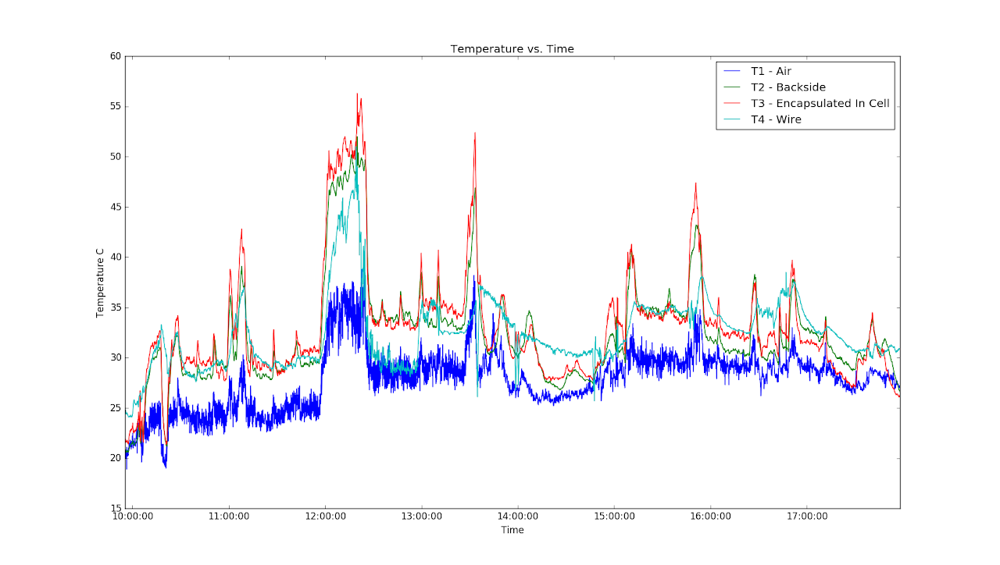
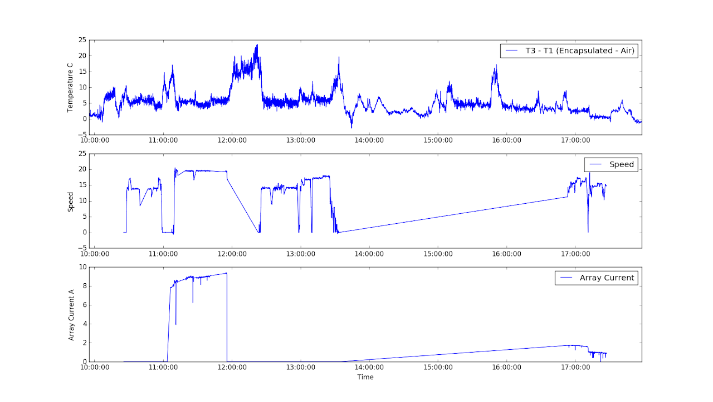
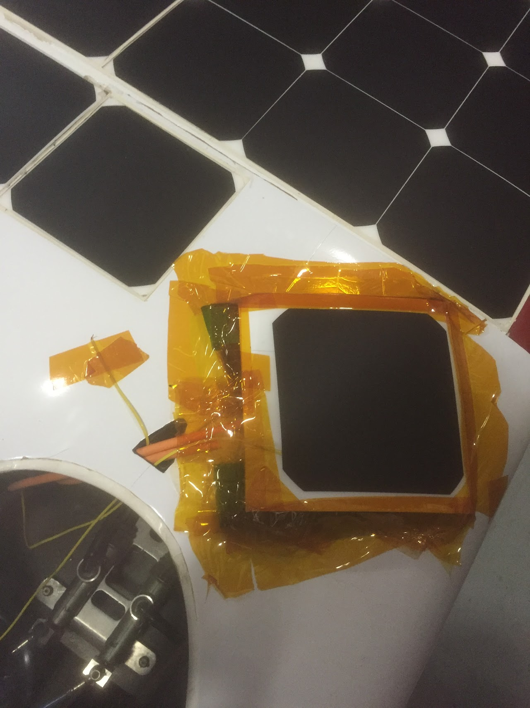
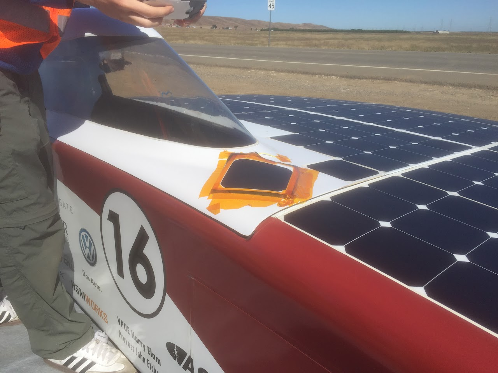
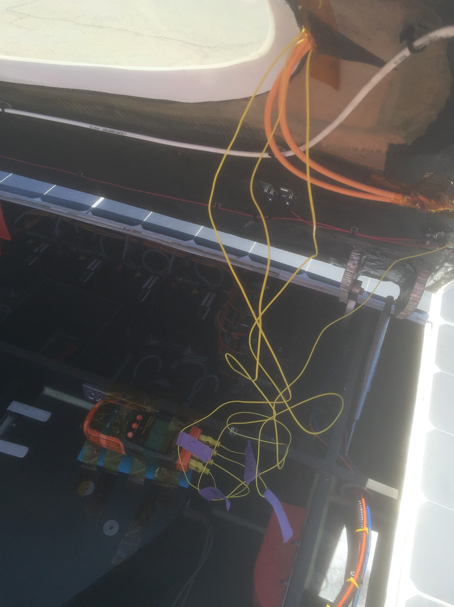
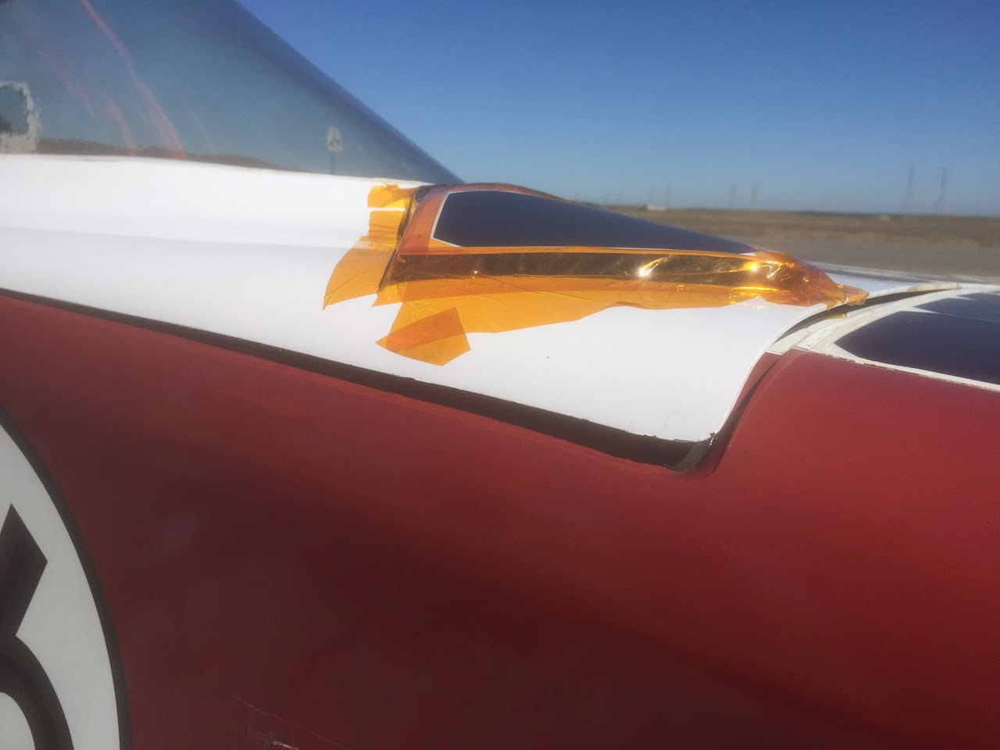

# arctan-array-temperature

## SSCP - Arctan Array Temperature

## Arctan Array Temperature

Here are some graphs that show the Arctan's array temperature during our Spring 2016 Central Valley Test Drive.&#x20;

All Temperatures

This graph shows temperature between different locations. Ambient is coolest, encapsulated is warmest, as expected.

Encapsulated vs. Air

Shows difference in temperature between encapsulated and ambient probes, along with car speed and array current.

While driving (in the second graph, speed >0) the the difference between encapsulated and ambient was \~10°C.  While the car was stopped, this quickly increased to 20°C, but quickly declined when the car started moving again.

The large temperature spike from 12-12:30pm corresponds to when we were stopped at 9th street, switching roles and going to the bathroom.  The second peak, around 1:30pm probably corresponds to pulling into the parking lot during lunch, before parking the car under the shaded tree.

Periods in the speed/current data with long straight lines correspond to times when (1) the car was off (2) MPPTS were unplugged or (3) telemetry was not being collected.

Test Setup:

T1 -- Air: Taped to the door of the car, bent so that it sticks up into the wind. Not shaded. Meant to capture ambient air temperature. It's the wire that is off on its own in this picture.

T2 -- Backside: Taped to backside of the cell that was taped to the car.

T3 -- Cell: Thermocouple was taped to the back of the bare cell and then encapsulated along with the cell; this is the most accurate temperature measurement of the cell. However, we forgot to bring the flat array wire on the trip, and since we used fairly thick wire, we had to lift the cell off of the surface of the door a bit by using Kate's yoga mat. This could contribute to this cell running cooler than the rest of the array, since the rest of the array is attached directly to carbon fiber, whereas this cell was only partially attached to the yoga mat. We assume that this effect does not produce large variations in temperature, but further testing would be needed. At the very least, the order of magnitude of temperature difference between ambient and cell temperature here is correct. The cell was connected to a 110 mΩ resistor (2-220mΩ resistors in parallel) by the thick orange wire so that it would have a load.&#x20;

T4 -- Wire: Thermocouple was taped to the part of a wire that sticks out through the bypass diode board we use. The wire we taped it to was the wire connected to the 1-cell module on the door. (See pictures)

In addition, the thermocouples may not have been fully calibrated to each other; in a later test, we taped all the thermocouples together and put them in the oven and measured their temperature; there were variances on the order of 1 degree celsius between the hottest and coldest thermocouples.&#x20;

First picture: Setup on the car  2nd: Inside of car; notice 3 wires going through NACA duct, last one is taped to a bypass diode on the right (that's T4)        3rd: The cell was bent in order to fit on the car; this resulted in one long crack at the point where it was bent the most.

Important side note: Whenever you have wires that could touch carbon fiber, insulate them with Kapton tape; cars have caught fire before because of non-insulated wires from the array (turns out carbon fiber produces a lot of heat when you push current through it). In this case, we insulated the bottom of the cell that was taped to the top of the car and wrapped the resistor it was connected to in Kapton tape.

To enlarge pictures, see the attached photos. \[Having trouble attaching; if you want to make them larger, try inserting them again, they should already be uploaded (edit the page, click insert, and then click image]
